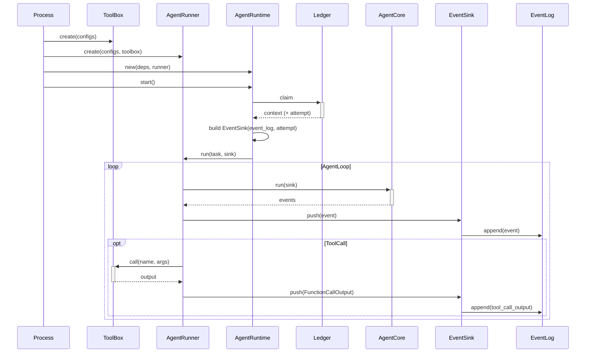
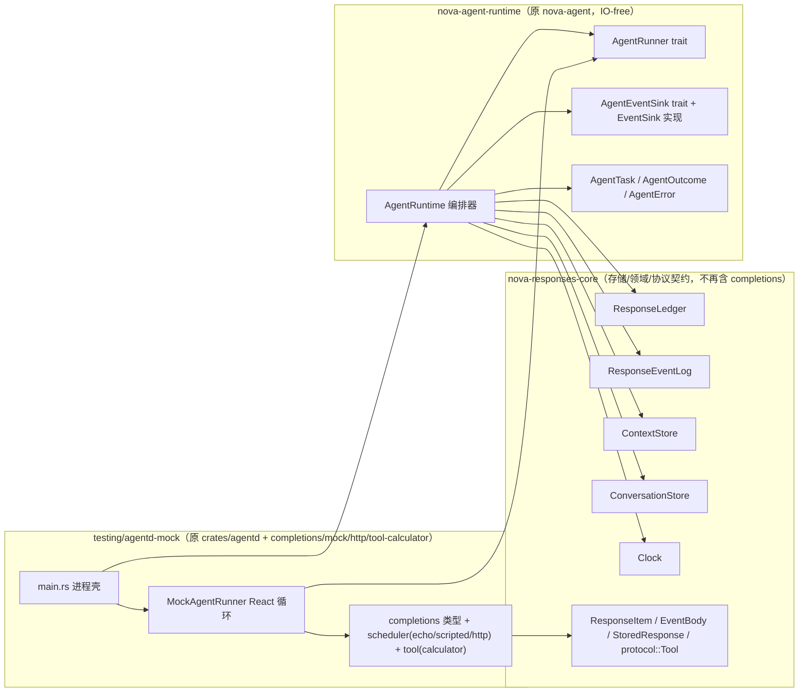

# Agent 结构重构：AgentRuntime 编排器 + AgentRunner trait + 模拟验证进程

## 用户需求

对项目中的 Agent 结构做一次职责拆分，把「进程壳」「任务编排」「Agent 执行（React 循环）」三者解耦：

- **Agentd 进程壳**：只负责拉起进程、按配置实例化与 ledger/context store 通信的 trait 实现，以及实例化具体的 AgentRunner 实现。不负责编排——何时 claim、何时 append 均由编排器决定。
- **编排器（AgentRuntime）**：由现在的 `Agent` 改名而来，crate 由 `nova-agent` 改为 `nova-agent-runtime`。它不再内含 React 循环，只负责：从 ledger claim 任务 → 组装任务上下文 → 交给新增的 `AgentRunner` trait 执行 → 接收执行产出的事件与最终产物 → 转交给存储（EventLog/ContextStore/Ledger）。
- **AgentRunner trait**：新增核心抽象，定义在 `nova-agent-runtime` 内；React 循环落在它的具体实现里。
- **模拟验证进程**：现在的 agentd 定位为「模拟验证进程」，改名 `nova-agentd-mock`，落盘到 `testing/` 下；它连接 mem-server，并用 completions-mock/completions-http 提供简单 agent 能力（React 循环的 bin 自带实现 `MockAgentRunner`）。
- **生产 agentd**：未来另行建设，集成真实 agent SDK 并直连 redis/mq；本期只预留 `AgentRunner` 抽象，不实现。

## 装配时序（用户确认）

依赖方向是 ToolBox ← AgentRunner ← AgentRuntime，装配必须按此顺序：

```
1. Process: 创建存储客户端（Ledger / EventLog / ContextStore / ConversationStore / Clock）
2. Process: 创建 ToolBox（工具执行器）
3. Process: 创建 AgentRunner，注入 toolbox（+ 其内部 scheduler/provider）
4. Process: AgentRuntime::new(deps)  —— 注入存储端口 + runner，仅装配、不启动
5. Process: AgentRuntime::start()    —— new 之后显式调用，才启动编排循环
```

`new` 与 `start` 分离：`new` 只装配（注入依赖），`start` 在 new 之后由进程壳显式调用，从而支持「一次 new、按需 start/stop 多个 worker」的缩扩容语义。

### 核心产物时序（用户给定，已修正装配顺序）



核心结构：`AgentRuntime`、`AgentRunner`、`Ledger`（=`ResponseLedger`）、`EventLog`（=`ResponseEventLog`）、`EventSink`。`ToolBox` 是 `AgentRunner` 实现的内部依赖。

## 事件回传机制（sink 回调）

**不用 channel/tx，不用嵌套 Stream，用 sink 回调**：`AgentRuntime` 在 `serve` 里实例化一个 `EventSink`（持有 `ResponseEventLog` + attempt + 流状态，实现 `AgentEventSink`），把 `&mut sink` 传给 `runner.run`；runner 内部（agent core）产生事件时直接调用 sink 的方法，sink 在内部把事件翻译成 `AppendEvent` 并 append 到 EventLog。事件在产生点即 append，零缓冲、不回流 runtime。

## fence 与取消：正确性 + 单一取消触发源（sink Stop）

**fence（`attempt` 栅栏）保证正确性；取消的及时性由 sink `Stop` 单一承担。heartbeat 保留，但仅承担保活，不承担取消通知通道。**

### fence（正确性）

- `attempt` 是 `claim` 时 runtime 从 ledger 拿到的（`ClaimedResponse.attempt`），**不是 sink 返回的**。
- 每次 `append`/`complete` 带 `attempt`，ledger 校验「attempt 最新 + status 为 InProgress」；`reap`（attempt+1）或 `cancel`（status→Cancelled）后校验失败返回 `StaleAttempt`。
- 作用：拒绝过期写入，保证存储正确性。

### 取消及时性（单一触发源：sink Stop）

- **单一触发源**：`EventSink` 在 append **检测到** `StaleAttempt` 时，置 `stopped = true` 并返回 `Stop`。
- **传导**：scheduler 每产生一个 token 就调一次 sink，收到 `Stop` 后**立即停止模型调用**（现有 `SinkVerdict::Stop` 契约）；runner 在 `schedule` 返回后检查 `sink.stopped` 兜底，返回 `AgentError::Superseded`。
- **不引入 `CancelToken` / `CancelGuard`，也不让 heartbeat 承担取消通知通道**：heartbeat 保留，但职责仅限保活（防止长生成被 reap 误杀）；取消通知单一由 sink `Stop` 承担。流式场景（tokens/sec 100~200）下每个 token 都 append，append 检测在几 ms 内传导取消；heartbeat 是往 ledger 的低频保活，无法高频，在高 token 速率下被 append 检测覆盖，用它做取消通知属冗余。
- **接受的 trade-off**：模型/tool 的「无输出等待期」（等待首个 token / 工具外部调用）期间无 append，取消无法立即中断；靠 `exec_deadline` 超时（scheduler `DeadlineExceeded`）+ 输出开始后的 `Stop` + reap 兜底。流式是主流路径，这是正确的复杂度取舍。

## 数据契约边界（DTO 稳定性与 runner 约束）

下沉必须守住一条红线：**只下沉「出站机制」，不下沉「数据形状」**。下游消费方（存储/渲染/订阅/协议）与 runner 的对外数据面必须始终依赖 core 的稳定类型。

### 留在 core 的稳定契约（DTO）

| 类型 | 角色 |
| --- | --- |
| `ResponseItem` + `ContentPart` + `Role` | 协议条目；链闭合性（INV-47）载体；`AgentTask.items` / `AgentOutcome.items` / sink 中 item 的类型，runner 只能产出其子集 |
| `ResponseEventKind` + `AppendEvent` + `EventBody` + `ResponseEvent` | 事件流契约，`ResponseEventLog` 的输入形状，锁死 runner 事件最终落成什么 |
| `protocol::Tool` + `ToolChoice`（inbound） | 工具声明，`StoredResponse` 存它、`AgentTask` 透传它 |
| `StoredResponse` / `Usage` / `ResponseStatus` / `ChainLimits` | 存储领域 |
| `RequestProvenance` | 溯源/栅栏（response_id / attempt / exec_deadline_ms），从 completions/request.rs 移回 core 领域层 |


### 下沉（runner 内部自由，非下游契约）

- `CompletionsRequest` / `CompletionsMessage` / `CompletionsContent` / `CompletionsOutcome` / `FinishReason` / `ToolCall` / `ToolSpec` / `CompletionsToolChoice` / `items_to_messages` / `assistant_text_message` —— completions provider 形状与翻译。
- `CompletionsRequestScheduler` / `CompletionsSink` / `ToolExecutor` —— 出站调度/工具 trait（不再作为 core 端口；是否保留 trait、还是用 enum 分派，由 `MockAgentRunner` 实现自决）。

### 约束 runner 的三道闸（都落在 core 的稳定类型上）

1. **类型闸**：`AgentRunner` 输入 `AgentTask`、输出 `AgentOutcome`、事件经 `AgentEventSink` 方法（参数用 core 的 `ResponseItem`/`String` 等）都是强类型。
2. **事件闸**：`AgentEventSink` 实现（`EventSink`）必须把事件翻译成 core 的 `AppendEvent`/`EventBody` 才能写入 `ResponseEventLog`。
3. **闭合闸**：runner 产出的最终 items 必须通过 core 的 `ResponseItem::is_acceptable_as_input()` + `validate()`；链闭合性判定本身留在 core。

## 运行场景全景

### 1. 正常执行（Completed / Incomplete / Failed）

claim → 组装 `AgentTask` → `runner.run(task, sink)` → `AgentOutcome` 走 `complete`/`fail` → `settle` + `close_stream`。由 `AgentRuntime` 负责。

### 2. 取消（cancel，FR-7）

gateway `POST /v1/responses/{id}/cancel` → service 层 `ledger.cancel`（`status→Cancelled`、不改 attempt、记 partial usage）。执行端下一次 append 遇 `StaleAttempt` → sink 返回 `Stop` → scheduler 停止模型调用、runner 返回 `AgentError::Superseded`。**编排器不新增主动取消感知**，`Superseded` 分支覆盖 cancel 与 reap；终态事件/关流/release marker 由 service 层 cancel 路径负责。

### 3. reap（心跳超时 / 执行端失联，FR-6）

sweep `ledger.reap`（attempt+1 + `status→Failed`）→ 执行端 heartbeat 停后被 reap → 后续 append 遇 `StaleAttempt` → `Stop` → `Superseded`。`AgentRuntime` 保留 `spawn_heartbeat`（仅保活，interval < heartbeat_ttl，防止长生成被误 reap）。

### 4. 读降级（read-only，INV-32）

claim 遇 `ReadOnly` → 不领新活（`Idle`）。已在执行任务的 append/complete 遇 ReadOnly 按失败处理并记日志。

### 5. 优雅停机 / 缩扩容（start/stop）

见「构造与生命周期」。进程壳监听 SIGTERM/ctrl_c 调 `stop`；运维端缩扩容复用 stop/start。

## 技术栈

- 沿用现有 workspace，依赖不变：`tokio` + `async-trait` + `thiserror` + `tracing` + `uuid`（agentd-mock 额外依赖 `reqwest` 用于 http scheduler），无新增第三方依赖。
- core 仅保留存储/领域/协议端口与类型；`ResponseLedger`/`ResponseEventLog`/`ContextStore`/`ConversationStore`/`Clock`/`ContentIntegrity`/`MetricsSink`、`StoredResponse`/`ResponseItem`/`Usage` 等。

## 架构设计

### 分层与组件关系



- `nova-agent-runtime` 只依赖 core，保持 IO-free（禁 reqwest/hyper/axum），不依赖任何 adapter。
- `testing/agentd-mock` 是验证设施进程：`main.rs` 只做装配；completions 类型与 scheduler/tool 实现、`MockAgentRunner` 全部并入此 crate（lib 供测试与 bin 共用）。
- `crates/adapters/completions-mock`、`completions-http`、`tool-calculator` 删除，内容并入 `testing/agentd-mock`。
- 未来生产 agentd 另行建设，实现 `AgentRunner`（对接 Moray SDK + 真实 redis/mq 存储客户端），本期不落地。

### 关键接口（nova-agent-runtime）

```rust
/// 一次 agent 执行任务，由编排器 claim 后组装好，交给 AgentRunner 执行。
pub struct AgentTask {
    pub model: String,
    pub instructions: Option<String>,
    pub tools: Vec<protocol::Tool>,
    pub tool_choice: Option<protocol::ToolChoice>,
    pub items: Vec<ResponseItem>,
    pub provenance: RequestProvenance,
    pub max_tool_rounds: usize,
}

/// AgentRunner 执行后的最终产物
pub struct AgentOutcome {
    pub items: Vec<ResponseItem>,
    pub usage: Usage,
    pub status: ResponseStatus,     // Completed 或 Incomplete
}

/// 事件回传 sink：runner 产生事件时调用，实现方（runtime 的 EventSink）append 到 EventLog。
/// `Stop` 表示 fence 已移动，调用方（scheduler / runner）必须立即停止。
#[async_trait]
pub trait AgentEventSink: Send {
    async fn text_delta(&mut self, text: &str) -> Result<SinkVerdict, SinkError>;
    async fn reasoning_text_delta(&mut self, text: &str) -> Result<SinkVerdict, SinkError>;
    async fn output_item_added(&mut self, item: &ResponseItem) -> Result<SinkVerdict, SinkError>;
    async fn output_item_done(&mut self, item: &ResponseItem) -> Result<SinkVerdict, SinkError>;
    async fn function_call_arguments_delta(&mut self, item_id: &str, delta: &str) -> Result<SinkVerdict, SinkError>;
    async fn function_call_arguments_done(&mut self, item_id: &str, arguments: &str) -> Result<SinkVerdict, SinkError>;
    async fn content_part_added(&mut self, item_id: &str, content_index: u32) -> Result<SinkVerdict, SinkError>;
    async fn output_text_done(&mut self, text: &str) -> Result<SinkVerdict, SinkError>;
    async fn content_part_done(&mut self, item_id: &str, content_index: u32, text: &str) -> Result<SinkVerdict, SinkError>;
}

pub enum SinkVerdict { Continue, Stop }
pub enum SinkError { Transport(String), Other(String) }

#[derive(Debug, thiserror::Error)]
pub enum AgentError {
    #[error("attempt superseded")]
    Superseded,
    #[error("{0}")]
    Failed(String),
}

#[async_trait]
pub trait AgentRunner: Send + Sync {
    fn name(&self) -> &str;
    /// 执行任务；React 循环在实现内部。增量事件经 `sink` 回传，
    /// sink 返回 `Stop` 时实现必须停止并返回 `AgentError::Superseded`。
    async fn run(&self, task: &AgentTask, sink: &mut dyn AgentEventSink)
        -> Result<AgentOutcome, AgentError>;
}
```

### 构造与生命周期（new / start / stop）

```rust
pub struct AgentRuntimeHandle {
    stop_tx: tokio::sync::watch::Sender<bool>,
    join: tokio::task::JoinHandle<()>,
}

impl AgentRuntime {
    /// 仅装配：注入存储端口 + runner。不启动任何循环、不 spawn 任何任务。
    pub fn new(deps: AgentRuntimeDeps, cfg: AgentRuntimeConfig) -> Self;

    /// new 之后由进程壳显式调用，启动编排循环。
    pub fn start(self: &Arc<Self>, max_concurrent: usize, poll_interval_ms: u64) -> AgentRuntimeHandle;

    pub async fn run_once(&self, now_ms: u64) -> Executed;
    pub async fn drain(&self, now_ms: u64, max: usize) -> Vec<Executed>;
}

impl AgentRuntimeHandle {
    /// 优雅停止：停止领取新任务 → 等待在途 drain（预算 drain_timeout_ms）→ 返回。
    pub async fn stop(self, drain_timeout_ms: u64) -> usize;
}
```

- `new` 与 `start` 分离：一次 `new` 后可多次 `start`（扩容）/ `stop`（缩容）。
- 实现用 `watch` 传 stop 信号、`JoinSet` 跟踪在途 spawn 的 `run_once` 以便 drain。

### 编排器职责（AgentRuntime）

- `AgentRuntimeDeps`：`ledger`/`event_log`/`context`/`runner`/`clock`/`conversations`。
- `AgentRuntimeConfig`：保留 `exec_ttl_ms`/`chain_limits`/`retain_after_terminal_ms`/`max_tool_rounds`/`heartbeat_interval_ms`。
- `serve` 编排流程：`claim`（拿 attempt）→ `spawn_heartbeat`（仅保活）→ append `InProgress` → 组装 `AgentTask` → 实例化 `EventSink`（持 event_log + attempt）→ `runner.run(&task, &mut sink)` → 依据 `AgentOutcome`/`AgentError` 走 `complete`/`fail`/`Superseded` → `settle` + `close_stream`。
- `Executed` 枚举保持 `Idle/Completed/Superseded/Failed`。
- reasoning 由 `EventSink` 累积，编排器在 `complete` 时随 `append_output` 写入 ContextStore。

### 实现要点

- **EventSink**（`sink.rs`）从现有 `LedgerSink` 原样迁移：实现 `AgentEventSink`，把事件翻译成 `AppendEvent` 并 append，维护流状态（`output_index`/`current_item_id`/`current_content_index`/reasoning）；append 遇 `StaleAttempt` → 置 stopped、返回 `Stop`。
- **MockAgentRunner**（agentd-mock）从现有 `engine.rs::serve` 迁移 React 循环：每轮组装 provider 请求 → 调 scheduler（把 `&mut dyn AgentEventSink` 一路传进去）→ 按 finish 分派 → tool 输出经 sink 发回；`schedule` 返回 `Superseded` 或 `sink.stopped` 时返回 `AgentError::Superseded`；最终产物用 `ResponseItem::is_acceptable_as_input()` 校验闭合性。
- **StoredResponse 形状改造**：`tools: Vec<protocol::Tool>`、`tool_choice: Option<protocol::ToolChoice>`（inbound）；service 层不再做 outbound 转换，provider 转换下沉到 MockAgentRunner 内部。
- **进程壳**（agentd-mock `main.rs`）：建存储客户端 → 建 toolbox → 建 MockAgentRunner → `AgentRuntime::new` → `runtime.start` → 监听 SIGTERM/ctrl_c → `handle.stop` → 退出。
- 性能与并发行为不变；安全面不变：所有存储写入继续走端口，租户与 attempt fence 校验由端口承担。

## 目录结构

```
crates/
├── agent-runtime/                    # [RENAME from crates/agent]
│   ├── Cargo.toml                    # [MODIFY] name = "nova-agent-runtime"
│   └── src/
│       ├── lib.rs                    # [MODIFY] 导出 AgentRuntime/AgentRunner/AgentEventSink/SinkVerdict/SinkError/AgentTask/AgentOutcome/AgentError/Executed/AgentRuntimeHandle
│       ├── runner.rs                 # [NEW] AgentRunner trait + AgentEventSink trait + AgentTask + AgentOutcome + AgentError + SinkVerdict + SinkError
│       ├── sink.rs                   # [NEW] EventSink（实现 AgentEventSink，append + StaleAttempt→Stop）
│       └── runtime.rs                # [NEW] AgentRuntime 编排器（new/start/stop/run_once/drain/serve/complete/fail/settle/close_stream/heartbeat）
│       # engine.rs 删除
├── core/
│   ├── src/
│   │   ├── lib.rs                    # [MODIFY] 移除 completions 导出；RequestProvenance 移入领域层
│   │   ├── context.rs                # [MODIFY] StoredResponse.tools/tool_choice 改 inbound 形状
│   │   ├── provenance.rs             # [NEW] RequestProvenance（从 completions/request.rs 移入）
│   │   ├── ports/mod.rs              # [MODIFY] 移除 completions/tool 端口导出
│   │   ├── ports/completions.rs      # [DELETE]
│   │   ├── ports/tool.rs             # [DELETE]
│   │   └── completions/              # [DELETE] 整个模块（request/outcome/translate/mod）
├── adapters/
│   ├── completions-mock/             # [DELETE] 并入 testing/agentd-mock
│   ├── completions-http/             # [DELETE] 并入 testing/agentd-mock
│   └── tool-calculator/              # [DELETE] 并入 testing/agentd-mock
├── nova-responses/
│   ├── Cargo.toml                    # [MODIFY] dev-deps: nova-agent → nova-agent-runtime + nova-agentd-mock
│   ├── src/service/responses.rs      # [MODIFY] 存 tools/tool_choice 不再转 outbound 形状
│   └── tests/http_contract.rs        # [MODIFY] engine_with 改用 AgentRuntime + MockAgentRunner

testing/
├── agentd-mock/                      # [NEW from crates/agentd + completions adapters]
│   ├── Cargo.toml                    # [MODIFY] name = "nova-agentd-mock"; lib + [[bin]]; 依赖 core/agent-runtime/mem-client/reqwest
│   ├── src/
│   │   ├── lib.rs                    # [NEW] 导出 MockAgentRunner
│   │   ├── mock_runner.rs            # [NEW] MockAgentRunner（React 循环）
│   │   ├── completions/              # [MOVED from core/completions] request/outcome/translate
│   │   ├── scheduler/                # [MOVED from completions-mock/http] echo/scripted/http
│   │   ├── tool.rs                   # [MOVED from tool-calculator] calculator
│   │   └── main.rs                   # [MOVED from crates/agentd] 进程壳：装配 + start + 信号监听 + stop
│   └── tests/agent_runtime_e2e.rs    # [MIGRATE from crates/agent/tests/engine_end_to_end.rs]

Cargo.toml                            # [MODIFY] members + workspace.dependencies 改名/移除
xtask/src/main.rs                     # [MODIFY] check-deps（core 零依赖、agent-runtime IO-free、删 completions-mock 检查）+ procs 的 nova-agentd-mock
verifier/run.sh                       # [MODIFY] --bin/$BIN nova-agentd → nova-agentd-mock
docs/architecture/decisions.md        # [MODIFY] D25 相关命名 + 新增 AgentRunner/AgentRuntime 结构决策 + completions 下沉决策
docs/architecture/README.md           # [MODIFY] 拓扑图与命名
docs/README.md                        # [MODIFY] 执行进程命名
docs/plans/current.md                 # [MODIFY] 新计划
docs/design/00-architecture-review.md # [MODIFY] 架构图/门禁描述命名
docs/design/01-responses-api.md       # [MODIFY] 执行进程命名
docs/design/02-verification.md        # [MODIFY] fixture 进程命名
crates/gateway/src/main.rs            # [MODIFY] 注释中 nova-agentd 命名
crates/nova-responses/src/routes/mod.rs # [MODIFY] 注释中 nova-agentd 命名
```