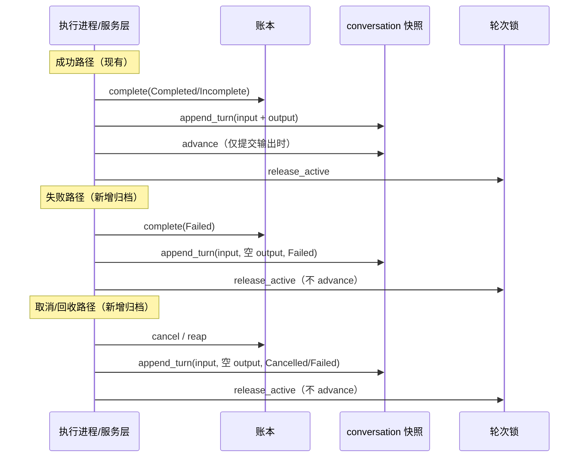

## 用户需求

当前 agent 仅在轮次正常完成（`complete`）时才将本轮内容写入 conversation store 的物化主快照；一旦轮次异常终止（模型失败、用户取消、执行端失联被回收、进程崩溃），该轮次内容完全不会落库，导致：

1. 用户实际感受到的对话上下文丢失（问过的问题“被遗忘”）；
2. 对话链完整性被破坏（快照中出现缺口，后续轮次无法继承）。

## 核心目标

设计并实现：即使轮次不完备/异常终止，也把「未完成部分」写入 conversation store，保证用户输入这一关键上下文不因失败而丢失。核心诉求是归档**用户输入**（用户的问题），不要求把半截的助手输出回放进快照。

## 功能范围

- 所有终态路径（成功、失败、取消、回收）都归档本轮 input 到会话快照；
- 失败/取消/回收轮次以「仅 input、空 output」的形式落库；
- 不改变链尾推进规则：仍只有提交了输出的轮次才推进 `last_response_id`；
- `store=false` 的轮次仍不落快照（保持既有语义）。

## 技术栈

- 语言/框架：Rust（现有 workspace），tokio async/await，trait 端口 + 分层架构；
- 涉及 crate：`nova-responses`（领域/端口/服务层）、`nova-agent-runtime`（编排层）、`verify/mock/server`（验证用内存后端）、`gateway`（装配层）。

## 实现思路

### 核心洞察

用户输入 `record.spec.input_items` 在 `ledger.create` 时就已经持久化在账本记录中，天然抗崩溃。当前丢失的唯一原因是：失败/取消/回收路径没有把它复制进会话快照。因此**无需提前写入**，只需把这些终态路径补上「归档 input」这一步，并以 `response_id` 做幂等，避免重复归档。

### 关键设计决策

1. **`append_turn` 按 `response_id` 幂等**：store 记录已追加的 `response_id -> turn_index`，重复调用返回原 turn index、不重复追加条目。这是多条终态路径可能竞态写入的安全前提。
2. **失败/取消/回收归档 input、空 output**：`output_items = []`、`reasoning = None`、`status = Failed/Cancelled/Failed`。input 来自 `record.spec.input_items`（不是事件流回放），满足 INV-48。
3. **`advance` 规则不变**：失败/取消/回收不推进链尾，满足 INV-55；下一轮仍读到完整快照（含未答复的 input）。
4. **sweep/reap 路径补齐 `ConversationSnapshots` facet**：`ResponsesDeps` 增加 `snapshots: Arc<dyn ConversationSnapshots>`（与既有 `turn_lock` facet 同模式），`cancel` 与 `sweep` 共用。
5. **`AbortedClaim` 扩展**：reap 在单条更新内就地读出 `input_items` 与 `store` 标志，避免事后回查（沿用现有「就地交出关联」哲学）。
6. **不额外给 `ContextEntry` 增加 status 标记**：最小方案下，input-only 轮次在结构上已可见（有问无答）；如需 transcript 显示失败标记，作为后续扩展。

### 终态写入时序



## 架构设计

保持现有分层不变，只做局部扩展：

- **端口层**：`ConversationSnapshots::append_turn` 明确幂等契约；`AbortedClaim` 承载归档所需数据。
- **能力层**：`ResponsesService` / sweeper 通过 `ConversationSnapshots` facet 直接归档 input。
- **编排层**：`AgentRuntime::fail` 复用现有 `append_turn` 助手方法补一次归档。
- **验证后端**：`MemConversationStore` 实现幂等；`MemResponseLedger` 在 reap 时填充新字段。

### 目录结构与修改点

```
nova-chat/
├── crates/
│   ├── responses/
│   │   ├── src/
│   │   │   ├── ports/
│   │   │   │   ├── conversation.rs        # [MODIFY] append_turn 幂等契约文档；空 output 合法
│   │   │   │   └── ledger.rs              # [MODIFY] AbortedClaim 增加 input_items/store
│   │   │   └── service/
│   │   │       ├── responses.rs           # [MODIFY] ResponsesDeps 增加 snapshots facet；cancel 归档 input
│   │   │       └── sweep.rs               # [MODIFY] sweep/tick 使用 snapshots；reap 归档 input
│   ├── agent-runtime/
│   │   └── src/
│   │       └── runtime.rs                 # [MODIFY] fail() 归档 input（空 output, Failed）
│   └── (生产 SQL adapter 若存在则同步幂等契约，当前仓库内仅 mock 后端)
├── gateway/
│   ├── src/
│   │   └── main.rs                        # [MODIFY] ResponsesDeps 装配 snapshots facet
│   └── tests/
│       └── http_contract.rs               # [MODIFY] 测试装配 snapshots facet + cancel 归档测试
├── verify/
│   └── mock/
│       ├── server/
│       │   ├── src/
│       │   │   ├── store.rs               # [MODIFY] Snapshot 增加 appended: BTreeMap<ResponseId, u64>
│       │   │   ├── conversation.rs        # [MODIFY] MemConversationStore::append_turn 幂等实现
│       │   │   └── ledger.rs              # [MODIFY] MemResponseLedger::reap 填充 input_items/store
│       │   └── tests/
│       │       └── adapter_behaviour.rs   # [MODIFY] 幂等/回收归档/取消归档行为测试
│       └── agentd/tests/
│           └── agent_runtime_e2e.rs       # [MODIFY] 失败路径 input 归档测试
└── docs/
    └── design/
        └── 07-conversations-and-sessions.md # [MODIFY] 记录「未完成轮次归档 input」设计
```

## 关键代码结构

`AbortedClaim` 扩展（`crates/responses/src/ports/ledger.rs`）：

```rust
pub struct AbortedClaim {
    pub response_id: ResponseId,
    pub previous_attempt: Attempt,
    pub tenant_id: TenantId,
    #[serde(default, skip_serializing_if = "Option::is_none")]
    pub conversation_id: Option<ConversationId>,
    /// 本轮用户输入，供 reap 路径归档进会话快照。
    #[serde(default, skip_serializing_if = "Vec::is_empty")]
    pub input_items: Vec<ResponseItem>,
    /// TurnSpec::store 标志；false 时不落快照。
    #[serde(default)]
    pub store: bool,
}
```

`Snapshot` 幂等状态（`verify/mock/server/src/store.rs`）：

```rust
pub(crate) struct Snapshot {
    pub entries: Vec<ContextEntry>,
    pub turn_count: usize,
    /// append_turn 幂等：response_id -> 已分配 turn index。
    pub appended: BTreeMap<ResponseId, u64>,
}
```

`MemConversationStore::append_turn` 幂等逻辑（伪代码）：

```rust
if let Some(index) = snap.appended.get(response_id) {
    return Ok(*index);
}
let turn_index = snap.turn_count as u64;
// 追加 input_items（空 output 合法）...
snap.turn_count += 1;
snap.appended.insert(response_id.clone(), turn_index);
Ok(turn_index)
```

## 实现注意事项

### 正确性与不变量

- **INV-48**：归档内容只来自 `record.spec.input_items`，output 一律为空，绝不回放事件流拼接半截输出。
- **INV-55**：失败/取消/回收路径不调用 `advance`，链尾仍指向最后一个完整回复。
- **INV-58**：`release_active` 仍由每条终态路径执行；新增 `append_turn` 放在 `release_active` 之前，失败不影响释放。
- **INV-34**：runtime 内 `fail()` 维持 `ledger.complete` 与 `append_turn` 紧邻配对；cancel/reap 沿用既有「就地终态」模式，append 失败仅告警、不改变轮次已终态的事实。
- **INV-46**：`append_turn` 失败时告警并继续（轮次本身已失败），不静默伪造成功；`store=false` 与无 conversation 锚点均跳过归档。

### 性能

- `append_turn` 幂等查找为 `BTreeMap` O(log n)，对 ~70/s 的低频快照写可忽略。
- `AbortedClaim` 携带 `input_items` 增大 reap 返回载荷，但 reap 低频且单次 UPDATE 已持有该行，避免二次读，总体更优。

### 防回归

- 保持 `append_turn` 对外签名不变，仅明确契约，避免影响现有 `complete()` 调用方与生产 SQL adapter。
- 复用 `AgentRuntime` 现有 `append_turn` 私有助手，避免在 `fail()` 重复构造 `TurnCommit`。