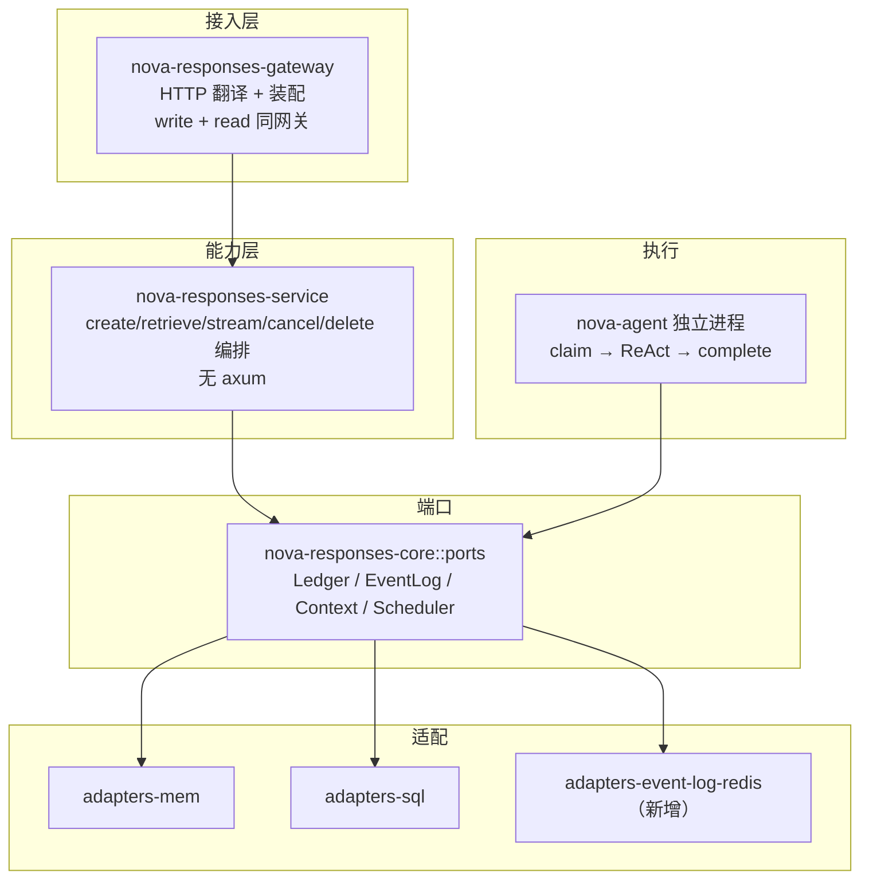

## 用户需求

落地已定决策 D25 的 X 期重构，将执行与接入解耦，实现三个目标：

1. **Agent 执行进程独立**：Agent 从 Gateway 进程拆出为独立二进制，经 `ResponseLedger` 端口直连共享账本领活，支持自由水平扩容、高可用，并实现「Gateway 崩溃不影响执行/生成」的故障隔离。
2. **在途缓冲共享化**：`ResponseEventLog` 从进程内内存升级为 Redis Streams 共享适配器，使增量事件不再绑定在单一进程堆内。
3. **能力层抽离**：新增无 axum 依赖的 `nova-responses-service` 层承载 responses 用例编排，将协议接入与 responses 能力解耦，便于定位问题与脱离 HTTP 的自动化测试。

## 核心改动

- claim 回退为全局作用域（废除 D23 的 node-scoped claim，保留 attempt 栅栏与回收）
- 读写网关不拆（Gateway 同时承载 write 与 read，调用方不直连 Redis）
- `nova-responses-core` 保持零依赖不合并
- 分四阶段执行：契约与抽象 → 缓冲共享化 → 执行独立 → 验证收口

## 技术栈

- 语言/运行时：Rust 2021 edition，tokio 异步运行时
- 现有：axum（HTTP）、sqlx（PostgreSQL）、serde/serde_json、tracing、parking_lot
- 新增：redis crate（Redis Streams，仅事件日志适配器使用）

## 实现方法

分四阶段，刻意排序：先共享缓冲再拆执行，否则会重演 D23 之前「领取方≠缓冲持有者」导致的增量落错进程缺陷。

**阶段一（X1+X2）：契约先行 + 能力层抽离，不破坏现有行为**

- X1：`docs/requirements/spec.md` 升 v4，改写 FR-4（执行端独立进程经端口领活，不再限定宿主节点）、FR-30（在途事件共享后任意节点直读，不按 node_tag 定向路由）、术语「宿主节点」、角色「执行端」、需求冲突 X5、范围 S4/S6。
- X2：在 `crates/gateway/src/` 内新增无 axum 依赖的 `service` 模块，抽离 `routes/responses.rs` 中 create / resolve_chain / 幂等 / 三种投递 / 订阅编排逻辑。边界：输入领域请求 + 端口集合，输出领域结果/事件流；不含 axum 类型、HeaderMap、HTTP 状态码映射。HTTP handler 退化为薄翻译层。

**阶段二（X3）：缓冲共享化**

- 新增 `crates/adapters/event-log-redis`，实现 `ResponseEventLog` 四个方法：`append`（XADD）、`read_after`（XRANGE + XREAD 长轮询）、`close`（记录终态与保留窗口）、`sweep_expired`（按保留窗口删除）。序列号保持 0 基连续，驱逐后映射为 `EventLogError::Expired`。端口形状不变，领域层与接入层零改动。

**阶段三（X4+X5）：执行进程独立 + 网关拆薄**

- X4：`ResponseLedger::claim` 去掉 `node` 参数改为全局认领（DB 原子 UPDATE + attempt 栅栏，维持 CR-1 不双领）；`nova-agent` 新增独立二进制入口，直连 sql adapter（复用 `Arc<dyn ResponseLedger>`）领活。
- X5：gateway 移除 `execution.rs` 的驱动循环与 `state.rs` 的 `work_ready`/`notify_work`，`routing.rs` 的 `route_inflight` 退化为共享直读；`main.rs` 不再 spawn 执行引擎。

**阶段四（X6+X7）：验证 + 文档收口**

- X6：废除 `claim-locality` L0 用例，新增全局 claim 并发抢领测试，redis 适配器复用 L0 契约，更新 `check-deps` 门禁（claim 不再要求 node 作用域）。
- X7：重绘 `00-architecture-review.md` §2/§3/§9，spec 版本升级收口，`plans/current.md` 状态更新为已完成。

## 架构设计



数据流：调用方 POST/GET 经 Gateway 进入 service 编排，service 经端口写账本/上下文/事件日志；Agent 独立进程经同一组端口从账本领活、写增量到共享 Redis 事件日志；Gateway 恢复后调用方用 `GET retrieve?stream=true&starting_after=N` 续订。

## 目录结构

```
nova-chat/
├── docs/
│   ├── requirements/spec.md              # [MODIFY] 升 v4：FR-4/5/30、宿主节点术语、执行端角色、X5、S4/S6
│   ├── design/00-architecture-review.md  # [MODIFY] §2/§3/§9 重绘（阶段四）
│   └── plans/current.md                  # [MODIFY] 状态更新（阶段四）
├── crates/
│   ├── core/src/ports/ledger.rs          # [MODIFY] claim 去 node 参数改全局（阶段三）
│   ├── adapters/
│   │   └── event-log-redis/              # [NEW] Redis Streams 事件日志适配器（阶段二）
│   │       ├── Cargo.toml
│   │       └── src/lib.rs                # 实现 append/read_after/close/sweep_expired
│   ├── agent/
│   │   ├── src/bin/agent.rs              # [NEW] Agent 独立二进制入口（阶段三）
│   │   └── src/engine.rs                 # [MODIFY] 适配全局 claim
│   └── gateway/
│       ├── src/service/                  # [NEW] 无 axum 能力层（阶段一）
│       │   ├── mod.rs
│       │   └── responses.rs              # create/retrieve/stream/cancel/delete 编排
│       ├── src/routes/responses.rs       # [MODIFY] 退化为 HTTP 翻译层
│       ├── src/main.rs                   # [MODIFY] 移除执行引擎 spawn（阶段三）
│       ├── src/execution.rs              # [MODIFY/REMOVE] 执行驱动移除
│       ├── src/state.rs                  # [MODIFY] 移除 work_ready/notify_work
│       └── src/routing.rs                # [MODIFY] route_inflight 退化
└── testing/
    └── conformance/src/lib.rs            # [MODIFY] claim-locality 废除、全局 claim 测试（阶段四）
```

## 关键代码结构

全局 claim 签名（阶段三，去掉 node 参数）：

```rust
async fn claim(
    &self,
    agent_id: AgentId,
    now_ms: u64,
    exec_ttl_ms: u64,
) -> Result<Option<ClaimedResponse>, LedgerError>;
```

能力层核心接口（阶段一，无 axum 类型）：

```rust
pub struct ResponsesService {
    ledger: Arc<dyn ResponseLedger>,
    event_log: Arc<dyn ResponseEventLog>,
    context: Arc<dyn ContextStore>,
    // ... 配置与时钟
}

impl ResponsesService {
    pub async fn create(&self, tenant: TenantId, req: CreateResponseRequest, /* ... */) -> CreateResult;
    pub async fn retrieve(&self, tenant: TenantId, id: ResponseId, /* ... */) -> RetrieveResult;
    pub async fn cancel(&self, tenant: TenantId, id: ResponseId) -> CancelResult;
    pub async fn delete(&self, tenant: TenantId, id: ResponseId) -> DeleteResult;
}
```

## 实施要点

- 阶段一不破坏现有行为：能力层抽离是纯代码移动 + 边界划分，HTTP 契约与 L0–L3 验证全绿后再进入下一阶段。
- claim 全局化保持 CR-1 不双领：SQL 后端用单条原子 UPDATE（`WHERE status='queued'` + `attempt=attempt+1` + ttl），并发抢领由 DB CAS 保证。
- Redis 适配器实现长轮询 `read_after(wait_ms)`，保持首字延迟不回退；驱逐语义严格映射 `Expired`（410 无恢复路径），不静默换位点。
- `check-deps` 门禁同步更新：core 仍零 workspace 依赖，service 只依赖 core 端口，gateway 依赖 service 与 core。