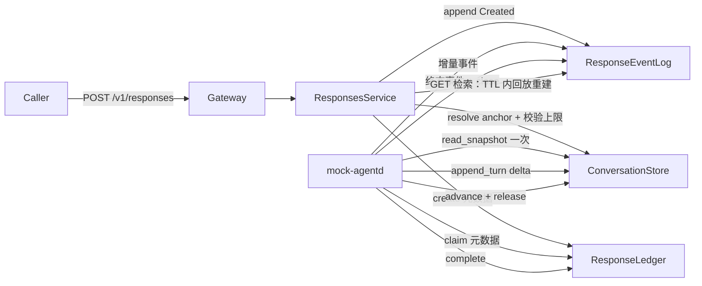

## 产品概述

重构 nova-chat 的领域层存储抽象，使数据职责与 OpenAI 官方对齐：responses 由带保留期（TTL）的事件流承载，conversation 成为长期对话内容（物化主快照）的权威来源。本轮**不落地任何具体存储后端选型**，只交付领域层 trait 接口、编排调整、mock 参考实现与接入方文档，由外部接入方自行实现 trait 注入。

## 核心功能

- **移除 ContextStore**，职责拆分：快照读写并入 ConversationStore，response 对象检索重建并入 ResponseEventLog（回放流）。
- **创建路径轻量化**：新轮只写元数据（快照锚点引用、本轮 input、工具、模型等），不再物化全量快照；创建前仍解析锚点并校验链上限（fail-fast 语义保留）。
- **执行路径**：agent claim 拿到元数据后，按 `(conversation_id, snapshot_index)` 从 ConversationStore 读一次主快照重建 LLM 上下文（每轮一次读）。
- **终态路径**：agent 将本轮 AgentOutcome.items 直接 append 进 conversation（delta），数据源禁止从事件流回放派生；原子性边界从「创建时 ledger+context」迁移到「终态时 ledger.complete + conversation append + advance/release」。
- **检索路径**：GET /v1/responses/{id} 在 TTL 内由事件流回放重建；TTL 后返回 404（对齐上游 30 天不可检索）。
- **文档交付**：新增 D30 决策、新增存储接入要求文档、更新 invariants 与架构复验图。

## 边界

- 不做 TDMQ/RedisStream/JetStream 等后端适配器与选型；mock（`verify/mock/{server,client}`）作为**参考实现**同步改造，L0–L2 验证层同步更新，workspace 每个阶段保持可编译。
- 对外协议表面（gateway routes）尽量不变。

## 技术栈

- Rust workspace（现有）：`crates/responses`（领域层 + 端口 + service）、`crates/agent-runtime`（编排）、`crates/sweep`（后台维护库）、`gateway`（接入层）、`verify/mock/{server,client,agentd,sweep}`（参考实现与进程）。
- 延续现有「端口在领域层、实现在适配器」架构，无新增依赖；改动集中在端口 trait、领域类型、service/runtime 编排与 mock。

## 实施方案

### 总体策略

以「事件溯源的 responses + 会话为 system of record」重构：把 D24 的「每轮物化全量快照（O(n²)）」替换为「会话单条主快照 + 每轮 delta（O(n)）」，把 D28 的「conversation 不存条目」推翻为「conversation 存持久主快照 + 快照索引」。领域层只暴露正交端口，接入方按文档要求实现并注入。

### 新端口契约设计

- `ResponseLedger`：保留 claim/complete/reap/cancel/record_partial_usage/in_flight/运行时控制；`ClaimedResponse` 从携带全量 `record.context` 改为携带**元数据**（`response_id`、`tenant_id`、`anchor: SnapshotRef`、`input_items`、`tools`、`model`、`instructions`、`store`、`attempt`、`exec_deadline_ms`）；`get` 返回精简 `ResponseRecord`（元数据，不含快照）。新增 `SnapshotRef { conversation_id: Option<ConversationId>, snapshot_index: Option<u64>, previous_response_id: Option<ResponseId> }` 概念。
- `ResponseEventLog`：保留 append/read_after/close/sweep_expired；`read_after(starting_after=None)` 语义上承担回放重建；文档明确其**短期 TTL 保留要求**（终态后 retain 至 response TTL，可被驱逐，无冷层兜底——INV-40 语义保留）。
- `ConversationStore`：吸收快照职责，新增：
- `read_snapshot(tenant, id, at_index) -> ResolvedContext`（agent 取主快照）；
- `append_turn(tenant, id, response_id, items, reasoning, usage, status, now_ms) -> SnapshotIndex`（终态 delta 追加，数据源是 agent 终态 items）；
- `resolve_anchor(tenant, snapshot_ref) -> ResolvedContext`（含裸 previous_response_id 链的解析，service 侧组合 ledger 反查）。
- 保留 create/get/update_metadata/delete/delete_by_tenant/advance/acquire_active/release_active/release_stale_active/append_event/read_after/list/set_max_events/health。
- 删除 `ContextStore` 端口与 `ports/context.rs`；`crates/responses/src/context.rs` 拆分为 `ResponseRecord`（账本元数据）与快照/ResolvedContext 类型。

### 数据流（新）



### 关键决策

- **原子性迁移（INV-34 改写）**：创建时不再有 ledger+context 双写，改为「终态时 `ledger.complete` 与 `conversation.append_turn` 必须同存储同事务」——沿用 D21 ① 的既有模式（共享存储 + 单事务），mock 在 `MemWorld` 内以锁保证；文档把这一要求写成接入方契约。
- **INV-48 RESTATE**：`conversation.append_turn` 的 items 参数由编排层从 `AgentOutcome.items` 直接传入，**禁止**实现内部回流读取事件流派生；L0 `output-provenance` 断言改为「销毁事件流后会话快照仍完整」。
- **fail-fast 保留**：创建时仍执行一次锚点解析与链上限校验（读主快照验证超限/跨租户/未存储），但不写快照——断裂检查仍在创建前失败，避免半创建记录。
- **跨会话 previous_response_id 续接**：ledger 记录 `SnapshotRef`，service 通过 ledger 反查得到 conversation 锚点后再读快照；无会话锚点的裸链在 `resolve_anchor` 中显式处理（沿 previous 反查，全部命中 conversation 锚点，超限/断裂返回与现协议一致的错误）。
- **TTL 语义**：response 检索 TTL 内回放重建、TTL 后 404；SSE 订阅过期仍 410（`Expired`，无恢复路径）；`background` 轮询窗口受流保留期约束，写入文档。
- **store=false / cancel / delete / sweep**：store=false 终态不 append（快照不写）；cancel 只记账与终态事件，不写快照；delete 为记录级（删流 + 账本记录，会话快照副本保留，广播 ResponseDeleted）；sweep 仅剩 `event_log.sweep_expired`（流 TTL）+ `ledger.reap`（失联 claim）+ 会话冷快照保留策略（配置项）。

## 实施要点

- 分阶段提交，每阶段 `cargo check` / `cargo test` 通过；使用 struct-update 语法与现有领域/渲染分层约定（展示元素只在渲染层）。
- 端口 doc 注释与接入方文档同步写「负责什么数据、语义要求、原子性边界、保留期」。
- 保持 gateway routes 与协议子集文档 `06-protocol-subset.md` 对齐，仅内部语义变化。

## 目录结构

```
crates/responses/src/
├── ports/
│   ├── mod.rs                      # [MODIFY] 端口清单：移除 ContextStore；更新约定注释
│   ├── ledger.rs                   # [MODIFY] ClaimedResponse 改元数据；get 返回 ResponseRecord；新增 SnapshotRef 关联
│   ├── event_log.rs                # [MODIFY] doc 明确回放重建职责与 TTL 要求
│   ├── conversation.rs             # [MODIFY] 新增 read_snapshot / append_turn / resolve_anchor
│   └── context.rs                  # [DELETE] ContextStore 端口移除
├── context.rs                      # [MODIFY] StoredResponse 拆分：ResponseRecord + SnapshotRef + ResolvedContext
├── conversation.rs                 # [MODIFY] 会话领域类型（必要时含 snapshot_index）
└── service/
    ├── responses.rs                # [MODIFY] create/retrieve/cancel/delete 重写为元数据 + 回放重建
    └── conversations.rs            # [MODIFY] transcript 改读会话主快照
crates/agent-runtime/src/
├── runtime.rs                      # [MODIFY] claim→read_snapshot→run→settle(complete+append_turn+advance/release)
└── runner.rs                       # [MODIFY] AgentTask 由编排层解析后的条目构建（接口基本不变）
verify/mock/
├── server/src/…                    # [MODIFY] MemWorld 增加会话主快照/delta 存储；/rpc 扩展新操作
└── client/src/{ledger,event_log,conversation}.rs  # [MODIFY] 实现新端口；删除 context 桩
verify/conformance/…                # [MODIFY] L0 契约适配新端口 + output-provenance 新断言
verify/harness/… verify/scenarios/… # [MODIFY] L1/L2 场景适配
verify/xtask/src/main.rs            # [MODIFY] check-deps 门禁与 coverage baseline 同步
docs/architecture/
├── decisions.md                    # [MODIFY] 新增 D30（SUPERSEDES D24 物化条款、D28 不存条目；RESTATES INV-48）
└── invariants.md                   # [MODIFY] INV-34 改写为终态原子性；INV-48 RESTATE
docs/design/
├── 07-storage-integration.md       # [NEW] 存储接入要求：各端口职责、TTL、原子性、非回放派生、参考实现指引
└── 00-architecture-review.md       # [MODIFY] §2/§5.2/§6/§7/§8/§9/§11 图与新端口对齐
```

## 关键代码结构（接口级）

```rust
// 账本元数据（替代 StoredResponse 作为 ledger 载体）
pub struct ResponseRecord {
    pub response_id: ResponseId,
    pub tenant_id: TenantId,
    pub anchor: SnapshotRef,          // conversation 锚点 或 previous_response_id
    pub input_items: Vec<ResponseItem>,
    pub tools: Vec<Tool>,
    pub tool_choice: Option<ToolChoice>,
    pub model: String,
    pub instructions: Option<String>,
    pub store: bool,
}

pub enum SnapshotRef {
    Conversation { conversation_id: ConversationId, snapshot_index: u64 },
    Previous { response_id: ResponseId },
    Root,
}

// ConversationStore 新增（签名级）
async fn read_snapshot(&self, tenant: &TenantId, id: &ConversationId, at_index: u64)
    -> Result<ResolvedContext, ConversationError>;
async fn append_turn(&self, tenant: &TenantId, id: &ConversationId,
    response_id: &ResponseId, items: Vec<ResponseItem>, reasoning: Option<String>,
    usage: Usage, status: ResponseStatus, now_ms: u64)
    -> Result<u64 /*snapshot_index*/, ConversationError>;
```

## 代理扩展

- **code-explorer**
- 用途：在各阶段改造前定位端口方法与 `StoredResponse` / `ContextStore` 的全部调用点，确认改动半径并验证无遗漏引用。
- 预期结果：输出受影响文件与符号清单，保证「移除 ContextStore、拆分 StoredResponse」不残留编译期悬空引用。