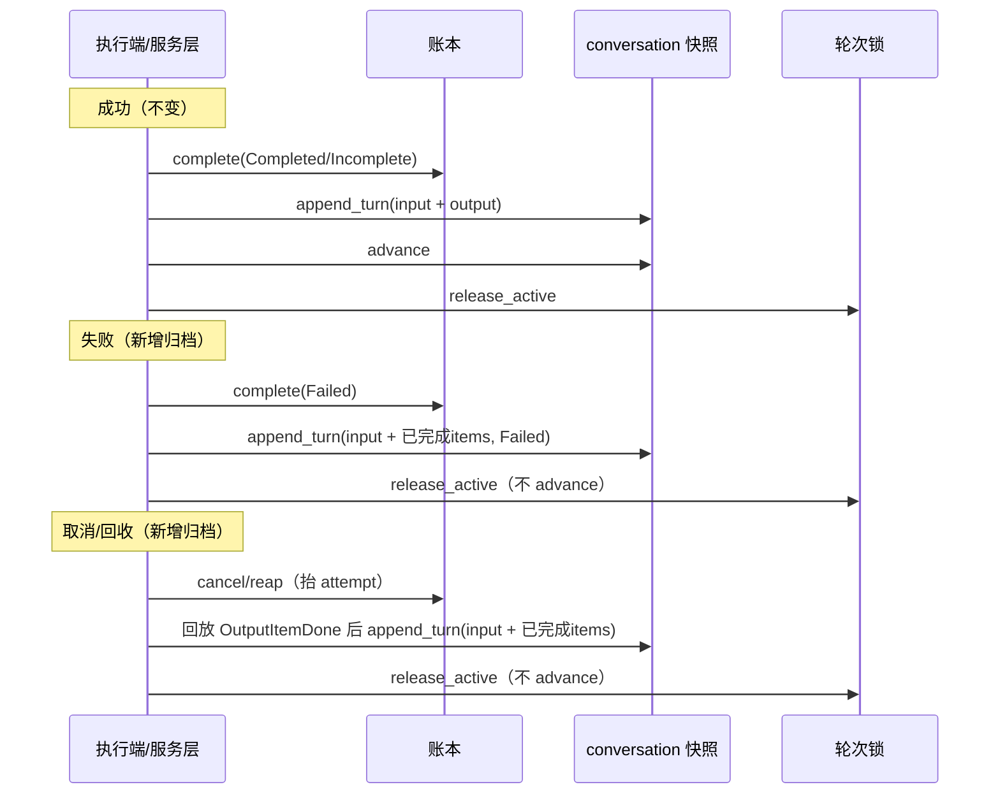

## 产品概述

为 nova-chat 对话系统补齐两项可靠性能力，解决「异常终止丢上下文」与「取消后仍无效生成」两个相关问题。

## 核心功能

- **协作式取消**：agent 能及时感知取消（含 tool call 执行中途），主动终止 ReAct loop，避免用户已取消但仍在生成、产生费用。
- **未完成轮次归档**：失败、取消、失联回收、进程崩溃等异常终态轮次，也把「用户输入 + 尽可能多已完成内容」写入 conversation 主快照，不丢当前轮次上下文、不破坏对话链。
- **归档粒度**：仅归档「已完成 item」（完整 tool call / function_call output / 完整文本段落），不归档半截流式 token。
- **链尾规则不变**：只有提交了输出的轮次才推进 `last_response_id`，失败/取消/回收不推进。
- **既有语义保持**：`store=false` 与无 conversation 锚点的轮次仍不归档。

## 技术栈

- Rust workspace（tokio async/await，trait 端口 + 分层架构）
- 涉及 crate：`nova-responses`（领域/端口/服务层）、`nova-agent-runtime`（编排层）、`verify/mock/server`（验证用内存后端）、`verify/mock/agentd`（mock runner）、`gateway`（装配层）

## 实现方案

### 工作项 A：协作式取消

1. **修复 cancel 抬 attempt**（`verify/mock/server/src/ledger.rs`）：与 reap 对齐，先记 `previous_attempt` 用于 INV-51 部分用量，再 `rec.attempt = previous_attempt.next()`。这是执行端能感知取消的前提。
2. **新增 `CancelProbe` trait**（`crates/agent-runtime/src/runner.rs`）：`async fn cancelled(&self)`，attempt 被取代时返回、否则永不返回。`AgentRuntime` 实现 `LedgerCancelProbe`，轮询 `ResponseLedger::check_attempt`（INV-6 已有），间隔可配（100~500ms）。
3. **改 `AgentRunner::run` 签名**：加第三个参数 `cancel: &dyn CancelProbe`（与 sink 并列的运行时能力，而非塞入 `AgentTask` 数据）。
4. **tool call 竞速取消**（`verify/mock/agentd/src/mock_runner.rs:165`）：`tokio::select! { tools.call(); cancel.cancelled() => return Superseded }`。LLM 流式阶段沿用 sink append 被动检测。

### 工作项 B：归档

1. **`append_turn` 按 `response_id` 幂等**（`crates/responses/src/ports/conversation.rs` + mock 实现）：store 记录 `response_id -> turn_index`，重复调用返回原 index、不重复追加。这是多终态路径竞态写入的安全前提。
2. **数据源分层**：成功=`AgentOutcome.items`（不变）；失败=`EventSink` 累积的已完成 items（改造 `sink.rs` 在 `output_item_done` 累积、暴露 `completed()`）；取消/回收/崩溃=service 层从事件流回放 `OutputItemDone`（`EventBody::Item.item` 按 `output_index` 排序，无需 delta 合并）。
3. **`fail()` 归档**（`crates/agent-runtime/src/runtime.rs`）：`ledger.complete(Failed)` 后，若 `is_stored()` 且 conversation-anchored，归档 input + completed items（空则仅 input），status=Failed。
4. **`cancel()` 与 sweep 归档**：`ResponsesDeps` 增加 `snapshots: Arc<dyn ConversationSnapshots>` facet；`cancel()`（`responses.rs`）与 reap（`sweep.rs`）回放 `OutputItemDone`，归档 input + 已完成 items（status=Cancelled/Failed），不 advance。
5. **`AbortedClaim` 扩展**（`crates/responses/src/ports/ledger.rs`）：增加 `input_items` 与 `store` 字段，reap 单条更新就地读出，避免事后回查。
6. **异常终态轮次 reasoning 统一置 None**：不强求渲染 thinking。
7. **`advance` 仍只在 `complete()` 成功提交输出时调用**（INV-55 不变）。

### 不变量处置

- **INV-48 RESTATE**：正常轮次（执行端可达）快照由权威 items 直接提交、不依赖事件流；仅执行端不可达的补救路径（取消/回收/崩溃）允许在事件流保留窗口内立即回放「已完成 item」并物化，回放后快照独立完整。
- **INV-6**：cancel/reap 抬 attempt 后，执行端 append 与 `check_attempt` 都撞 `StaleAttempt`。
- **INV-55 / INV-58 / INV-34 / INV-46** 均保持既有语义。

## 架构设计

保持现有分层，局部扩展端口与能力面。终态时序：



## 目录结构

```
nova-chat/
├── crates/
│   ├── responses/src/
│   │   ├── ports/ledger.rs              # [MODIFY] AbortedClaim 加 input_items/store；cancel 契约更新（抬 attempt）
│   │   ├── ports/conversation.rs        # [MODIFY] append_turn 幂等契约与空 output 合法说明
│   │   └── service/
│   │       ├── responses.rs             # [MODIFY] ResponsesDeps 加 snapshots facet；cancel() 回放并归档
│   │       └── sweep.rs                 # [MODIFY] reap 后回放并归档
│   └── agent-runtime/src/
│       ├── runner.rs                    # [MODIFY] CancelProbe trait；AgentRunner::run 加 cancel 参数
│       ├── sink.rs                      # [MODIFY] EventSink 累积已完成 items、暴露 completed()
│       └── runtime.rs                   # [MODIFY] LedgerCancelProbe；fail() 归档；构造并传入 cancel
├── gateway/
│   └── src/main.rs                      # [MODIFY] 装配 snapshots facet
├── verify/mock/
│   ├── server/src/
│   │   ├── store.rs                     # [MODIFY] Snapshot 加 appended: BTreeMap<ResponseId, u64>
│   │   ├── conversation.rs              # [MODIFY] MemConversationStore::append_turn 幂等
│   │   └── ledger.rs                    # [MODIFY] cancel 抬 attempt；reap 填充 input_items/store
│   ├── agentd/src/mock_runner.rs        # [MODIFY] tool call 用 select 竞速 cancel
│   └── ...
├── verify/conformance/src/lib.rs        # [MODIFY] 补充取消传播与归档契约断言
└── docs/
    ├── architecture/invariants.md       # [MODIFY] INV-48 RESTATE；补充取消传播说明
    ├── design/05-reliability.md         # [MODIFY] 记录协作式取消与轮询间隔
    └── design/07-conversations-and-sessions.md # [MODIFY] 记录未完成轮次归档设计
```

## 关键代码结构

```rust
// nova-agent-runtime：主动取消探测
#[async_trait]
pub trait CancelProbe: Send {
    async fn cancelled(&self);
}

// AgentRunner::run 新签名
async fn run(
    &self,
    task: &AgentTask,
    sink: &mut dyn AgentEventSink,
    cancel: &dyn CancelProbe,
) -> Result<AgentOutcome, AgentError>;

// AbortedClaim 扩展
pub struct AbortedClaim {
    pub response_id: ResponseId,
    pub previous_attempt: Attempt,
    pub tenant_id: TenantId,
    #[serde(default, skip_serializing_if = "Option::is_none")]
    pub conversation_id: Option<ConversationId>,
    #[serde(default, skip_serializing_if = "Vec::is_empty")]
    pub input_items: Vec<ResponseItem>,
    #[serde(default)]
    pub store: bool,
}
```

## 实现注意事项

- **性能**：`CancelProbe` 轮询间隔可配（100~500ms），`check_attempt` 轻量；事件流回放仅限低频补救路径；`append_turn` 幂等用 `BTreeMap` O(log n)。
- **日志**：复用 `tracing::{info,warn}`，归档失败仅告警（轮次本身已终态），不改变终态事实。
- **防回归**：`complete()` 成功路径保持不变；`append_turn` 签名不变，仅明确幂等契约；`store=false` 与无锚点跳过归档。
- **安全**：无新增 SQL 拼接或命令执行；回放仅读取本租户、本 response 的事件流。