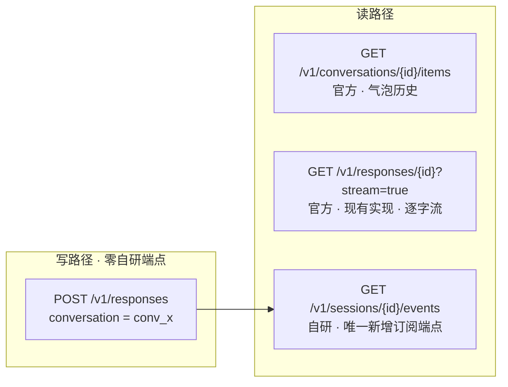
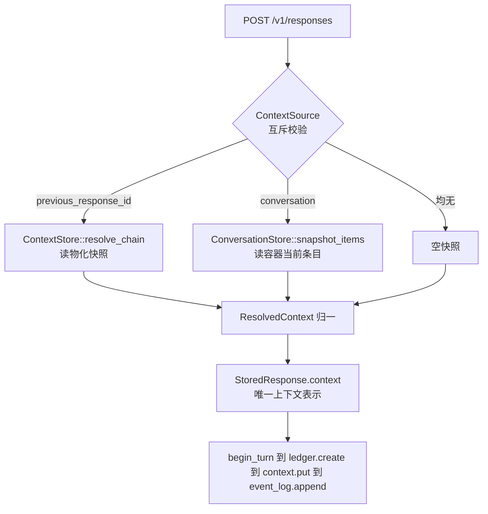
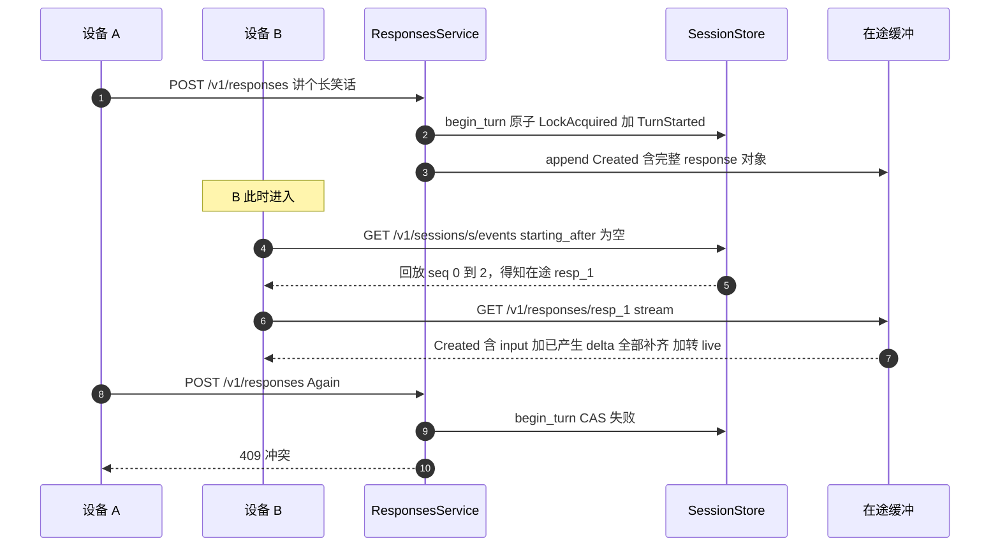

## 用户需求

现有服务只提供「单次生成」（Responses）能力。需要扩展为完整会话能力，同时满足三条此前无法满足的业务诉求：

1. **多端跨设备同步**：同一账号两台设备打开同一会话页面，A 发起流式对话时，B 即使未操作页面也能看到相同的逐字回复
2. **业务事件排入对话历史**：业务侧操作事件需与对话事件保持相对时序；重开页面时业务事件也能被拉取并恢复界面
3. **实时订阅**：会话级持续订阅，断线可从游标续订

调研确认：官方协议族（Conversations REST、Responses SSE、Responses WebSocket mode、Realtime API）**无一能满足这三条**。官方 WebSocket mode 文档本身即指明「多端同步必须由你自己的服务端做扇出与事件持久化」。因此必须自建会话层。

**核心原则**：除绝对必要外一比一对齐官方协议；自研部分严格隔离在独立命名空间，不污染兼容层。

## 产品概述

服务对外呈现两层能力，边界清晰。

**兼容层**：完全对齐官方标准的会话容器。调用方可用官方 SDK 直连——创建容器、读取、更新标签、删除；向容器追加条目、分页列举、读单条、删单条；生成请求携带会话标识即自动继承上下文并在完成后写回。

**会话层**：自研会话事件流。为每个会话提供一条持久、严格有序、可多端订阅的事件流，承载轮次开始与结束、占用状态变化、条目移除，以及业务侧自定义事件。任意设备可从任意游标订阅，先补齐历史再转实时推送，无重复无遗漏。

两层职责严格分离：对话内容唯一存放处是兼容层；事件流只携带引用与业务数据，不复制内容。

## 核心功能

**会话生命周期与订阅**

- 创建会话（自动关联一个会话容器）、读取、删除
- 事件流订阅：从指定游标开始，先回放持久历史再转实时推送，单次调用完成，无需额外快照接口
- 同一会话支持多个订阅者独立投递，慢订阅者不阻塞其他订阅者
- 断线重连凭游标续订，服务端不保存任何连接状态

**会话事件类型**

- 轮次开始、轮次结束（携带终态）、条目已提交、占用锁获取与释放、条目移除
- 业务自定义事件：携带业务类别与任意业务数据，与对话事件在同一序号空间严格保序
- 业务事件不进入模型上下文

**会话级并发控制**

- 同一会话同时只允许一个进行中轮次，冲突方收到明确冲突响应
- 占用状态通过事件流广播，各端据此禁用或恢复输入
- 所有终态路径（完成、失败、取消、不完整）都必须释放占用

**官方会话容器兼容**

- 容器创建、读取、标签更新、删除；条目追加、游标分页列举、单条读取、单条删除
- 生成请求接受会话标识，自动继承容器当前条目作为上下文，并在响应完成后把本轮输入与输出一起写回
- 与「上一次生成标识」两种串联方式并存

**页面恢复**

- 重开页面：拉取条目得对话内容，从游标订阅事件流得状态与业务事件，二者合成完整界面
- 若某轮逐字流已过保留窗口，明确报错并降级到最终内容渲染，绝不静默补半份数据

**质量要求**

- 跨租户访问一律表现为「不存在」，不泄露标识是否存在
- 兼容层未知字段与超范围条目类型一律明确拒绝
- 事件序号严格 0 基连续、并发下无重号
- 上下文来源不可静默降级，断裂与超限一律显式失败
- 分页与批量追加都有明确上界

**自动化验证**

- 会话存储与事件流契约以同一套断言同时验证内存实现与真实数据库实现
- 新增使用官方 Python SDK 打真实 HTTP 的兼容性验证层，缺少运行时依赖的机器上自动跳过而非失败
- 15 个业务场景（含多端、中断恢复、并发冲突、过期降级等边界）全部有验证覆盖

## 一、技术栈

沿用现有栈，不引入新框架、不新增依赖类别。

| 层 | 技术 | 复用点 |
| --- | --- | --- |
| 领域与协议 | Rust + serde（封闭枚举 + deny_unknown_fields）+ thiserror | `crates/core` |
| 端口抽象 | async_trait + Arc dyn Trait | `crates/core/src/ports/` |
| REST 接入 | axum（Path/Query/State/Json）+ axum::response::sse | `crates/nova-responses/src/routes/`、`sse.rs` |
| 适配器 | mem（MemStore）· mem-client（RPC 桩）· sql（sqlx + migrations） | `crates/adapters/{mem,mem-client,sql}` |
| L0 契约 | `testing/conformance` 的 PortSet + cases() 表 | 同断言跑 mem/sql |
| L4 新增 | 官方 openai-python SDK（**仅作验证客户端**） | `testing/sdk-compat/` |
| 编排 | xtask + justfile | `verify --level` |


**关键约束**：官方 SDK 只出现在 `testing/`，绝不进入 `crates/` 任何 crate 的依赖。`xtask` 的 `check_deps()` 需新增门禁断言此事。

---

## 二、实现方案

### 2.1 枢纽决策：高频与低频分成两条流

这是设计核心，也是此前方案零碎的根因。

|  | session 事件流（自研，新增） | response SSE（现有，**零改动**） |
| --- | --- | --- |
| 内容 | 信封事件：轮次边界、锁、业务事件 | token delta 等高频增量 |
| 频率 | 每轮 2-4 条 | 每轮数千条 |
| 命名空间 | per-session seq | per-response seq |
| 持久性 | **持久** | 在途瞬态，终态后短保留窗口 |
| 承载 | 与上下文库同量级，**同库** | 现有在途缓冲（mem / Redis） |
| 多端 | 需新增扇出订阅 | **已支持** |


**已确认的既有能力**：`crates/nova-responses/src/sse.rs` 的 `open_stream` 采用 probe-then-stream + `starting_after` 排他游标，`resolve_cursor` 让 `Last-Event-ID` 优先于查询参数。这意味着**同一个 response 本来就可被多端共订**，逐字流的多端同步不需要新建任何东西。缺的只是「B 如何发现有新轮次开始」——这是 session 事件流唯一要补的能力。

由此得出两个代价修正（此前评估偏重）：

- **D20 ④「不持久化完整事件历史」无需推翻**：④ 针对 token 级完整增量流；session 信封事件频率低三个数量级，不属于「完整事件历史」。ADR 中澄清边界即可。
- **D21 三类存储无需新增第四类**：session 事件写频率与上下文库同量级，与 ledger/context 同库同事务，复用 `MemStore` 与同一 `PgPool`。

### 2.2 写路径完全复用官方标准端点



**事件发射点必须在 `ResponsesService::create`（能力层），不在 routes 层**。这样无论调用方走标准 `/v1/responses` 还是任何门面，session 事件都不会漏。**不新增** `POST /v1/sessions/{id}/turns` 之类自研写端点——这也直接回应「gateway 职责过重」的意见：接入层只做传输，编排留在 service。

### 2.3 单一数据源：事件只放引用

**铁律**：对话内容一律不进 events，只放引用。内容唯一真相源是 ContextStore / conversation items。

```rust
pub enum SessionEventKind {
    SessionCreated,
    TurnStarted    { response_id: ResponseId },
    TurnCompleted  { response_id: ResponseId, status: ResponseStatus },
    ItemsCommitted { response_id: ResponseId, item_ids: Vec&lt;ConversationItemId&gt; },
    LockAcquired   { response_id: ResponseId },
    LockReleased,
    ItemsRemoved   { item_ids: Vec&lt;ConversationItemId&gt; },
    Business       { kind: String, payload: serde_json::Value },
}
```

`Business` 是唯一开放变体。与 D22 ②「严格拒绝未知」的关系需在 ADR 立**分层规则**：兼容层保持封闭枚举 + deny_unknown_fields；自研层信封字段封闭、payload 内部不校验但有体积上界与 json_depth 上界。`Business` 事件不进模型上下文——上下文装配只读 `snapshot_items`，不读事件流。

### 2.4 锁与事件必须同一端口（原子性驱动）

`SessionStore` 单端口承载元数据 CRUD + 锁 CAS + 事件流。**不拆成两个端口**，理由是硬的：锁 CAS 与 `LockAcquired` 事件必须原子——拆开则崩溃窗口内会出现「已上锁但流上无事件」或反之，各端 UI 与服务端状态永久分歧。

```rust
#[async_trait]
pub trait SessionStore: Send + Sync {
    async fn create(&amp;self, session: Session, now_ms: u64) -&gt; Result&lt;Session, SessionError&gt;;
    async fn get(&amp;self, tenant: &amp;TenantId, id: &amp;SessionId)
        -&gt; Result&lt;Option&lt;Session&gt;, SessionError&gt;;
    async fn delete(&amp;self, tenant: &amp;TenantId, id: &amp;SessionId) -&gt; Result&lt;bool, SessionError&gt;;
    async fn delete_by_tenant(&amp;self, tenant: &amp;TenantId) -&gt; Result&lt;u64, SessionError&gt;;

    /// CAS idle 转 busy，成功则原子追加 LockAcquired + TurnStarted。
    /// 已占用返回 SessionError::Busy（接入层映射 409）。
    async fn begin_turn(&amp;self, tenant: &amp;TenantId, id: &amp;SessionId,
        response_id: &amp;ResponseId, now_ms: u64) -&gt; Result&lt;u64, SessionError&gt;;

    /// 原子追加 TurnCompleted + LockReleased。幂等：重复调用不重复追加。
    async fn end_turn(&amp;self, tenant: &amp;TenantId, id: &amp;SessionId, response_id: &amp;ResponseId,
        status: ResponseStatus, now_ms: u64) -&gt; Result&lt;u64, SessionError&gt;;

    async fn append_event(&amp;self, tenant: &amp;TenantId, id: &amp;SessionId,
        kind: SessionEventKind, now_ms: u64) -&gt; Result&lt;u64, SessionError&gt;;

    /// 读 starting_after 之后的事件（排他游标，与 ResponseEventLog 同语义）。
    /// wait_ms 支持长轮询，使持久回放与 live tail 在一次调用内合一。
    async fn read_after(&amp;self, tenant: &amp;TenantId, id: &amp;SessionId, starting_after: Option&lt;u64&gt;,
        limit: usize, wait_ms: u64) -&gt; Result&lt;Vec&lt;SessionEvent&gt;, SessionError&gt;;

    async fn health(&amp;self) -&gt; Result&lt;(), SessionError&gt;;
}
```

游标语义**沿用项目内的 `starting_after`（排他）**，与 INV-11 及 `assert_event_log_conformance` 既有断言一致；不采用参考项目 moray 的 `from_seq`（包含）语义，项目内一致性优先。

### 2.5 上下文来源归一（D24 零改动）

`ResponsesService::create` 保持唯一上下文装配点，两种来源在入口归一为同一个 `StoredResponse.context` 快照。



`snapshot_items` 返回既有的 `ResolvedContext`，使能力层拿到同一种结果、无需分支。`resolve_chain` 与 `context_depth` 语义零改动，D24 全部现有 L0 断言不受影响。

### 2.6 官方协议确证事实（实施时逐字采用）

全部已从 developers.openai.com 官方原文核实。

**8 个端点**（官方只有 4 个会话方法，**没有列举会话的端点**；本次不提供，session 层天然承担索引职责）：

| 操作 | 方法 | 路径 |
| --- | --- | --- |
| Create | POST | `/conversations` |
| Retrieve | GET | `/conversations/{id}` |
| Update | **POST**（非 PATCH/PUT） | `/conversations/{id}` |
| Delete | DELETE | `/conversations/{id}` |
| Create items | POST | `/conversations/{id}/items` |
| List items | GET | `/conversations/{id}/items` |
| Retrieve item | GET | `/conversations/{id}/items/{item_id}` |
| Delete item | DELETE | `/conversations/{id}/items/{item_id}` |


对象形状：`{"id":"conv_123","object":"conversation","created_at":1741900000,"metadata":{"topic":"demo"}}`；删除容器返回 `{"id":"conv_123","object":"conversation.deleted","deleted":true}`。

**必须逐条落实的官方语义**（此前方案有偏差，均需纠正）：

1. `DELETE /conversations/{id}/items/{item_id}` 返回 **Conversation 对象**，无 deleted 字段，成功与否靠 HTTP 状态码
2. `conversation` 参数类型是 **string 或 {id} 或 null**，不是单一 string
3. 写回时机是「**响应完成后，输入项与输出项一起追加**」，不是创建时写输入
4. 删除容器官方原文：**Items in the conversation will not be deleted**（不级联）
5. items 批量上限 **20**（create conversation 与 create items 均如此）
6. list items 的 limit 默认 **20**、范围 1-100；order 默认 **desc**（易错，不是 asc）
7. metadata 16 对 / key 64 / value 512，与现有 `MAX_METADATA_*` 常量一致，**直接复用不新定义**
8. include 有 8 个枚举值，create/list/retrieve 都支持
9. 输入侧 item 33 变体、返回侧 29 变体，**类型集合不对称**，影响 D22 ⑥ 链闭合性表述

**实施前必须核实的两项**（不得凭推测硬编码）：`ConversationItemList` 折叠的 2 个字段（推测 last_id / object）；`conversation` 与 `previous_response_id` 是否官方硬互斥（conversation-state 指南未出现「互斥」字样，第三方兼容实现的错误文案不是官方原文）。权威来源按 D22 ④ 为 openai/openai-openapi 的 openapi.yaml；现锚定 revision `2025-08-07`，抓到的 spec 已是 `info.version: 2.3.0`，若需前移属显式变更须记入 ADR。

---

## 三、场景可行性论证（15 个，须全部落盘设计文档）

### 3.1 场景七是最强验证，依赖一个现有实现细节

B 在轮次进行中加入，能同时拿到「用户说了什么」与「已产生的所有 delta」，依赖 `service/responses.rs` L158-164 的既有行为：`Created` 事件通过 `EventBody::Response { response }` 携带**完整 response 对象**（含 input）。故 B 从 `starting_after=null` 订阅即可，**无需任何内容副本、无需新增机制**。此依赖必须在设计文档中记为不可回退。



### 3.2 场景清单与验证要点

用户原始 8 个：

1. **单设备首轮**：SessionCreated 到订阅到 begin_turn 到逐字到 end_turn
2. **单设备多轮**：第二轮走 snapshot_items 取上一轮输入输出，归一为快照
3. **单设备中断恢复**：拉 items 得内容 + `starting_after=last_seq` 得增量，**不需要渲染快照机制**
4. **多设备单轮提前入会**：两个订阅者独立投递；两端各自订阅同一 response 的逐字流
5. **多设备单轮 B 后入会**：B 拉 items 直接渲染最终内容，无需回放 token
6. **多设备多轮提前入会**：验证跨轮次锁与事件连续
7. **多设备多轮 B 在途入会**：见 3.1
8. **多设备并发冲突**：CAS 失败返回 409，**拒绝路径不写任何事件、不留半状态**

补充的 7 个边界：

9. **在途缓冲已过期降级**：`EventLogError::Expired` 经现有 `map_event_log_error` 映射 410 Gone，客户端降级拉 items。禁止静默从最早可读处续发（INV-40）
10. **业务事件与对话时序交织**：TurnStarted(2) 到 Business{file_uploaded}(3) 到 Business{approval_required}(4) 到 TurnCompleted(5) 到 Business{workflow_advanced}(6)，单一 seq 空间保证严格保序，重开页面完整拉回
11. **多节点部署 B 连到另一网关**：session 事件在共享库故**直连无需转发**；只有高频在途流仍走现有 route_inflight 定向代理（不用 307，避免暴露拓扑）
12. **条目删除多端传播**：ItemsRemoved 事件使 B 移除气泡；后续 snapshot_items 不再含该条，已发出生成的快照不受影响
13. **生成失败或取消**：end_turn 携带终态；**锁必须在所有终态路径释放**，须有 L0 断言否则会话永久锁死
14. **越权访问 session**：跨租户一律 404 不是 403，复刻 parse_id 既有做法
15. **首事件前就订阅**：starting_after 为空且无事件时返回空且保持连接，不报错

---

## 四、执行要点

**安全**

- SEC-2：session 与 conversations 全部端点，跨租户与不存在一律 404；标识解析失败同样按 404
- SEC-6：会话条目含 image/file 引用时必须过 `url_guard::ensure_public_https` / `is_blocked_ip`，与生成入口同一守卫，不重复实现
- SEC-7 / INV-52：limit 硬上界 100；items 批量上限 20；Business payload 体积上界加 json_depth 上界
- SQL 全部值绑定禁止拼接；游标分页走复合索引，禁止 OFFSET 深翻页
- INV-50：兼容层 DTO 全部 deny_unknown_fields 加封闭枚举，禁用 flatten 兜底
- Business payload 反序列化只用安全路径（serde_json::Value），不做任意类型还原

**可靠性**

- INV-46 / D21 ④：会话库不可用时拒写 503，写前沿用 health() 探活；绝不降级为静默不存
- begin_turn / end_turn 必须单事务，锁状态与事件追加原子
- end_turn 幂等，重复调用不重复追加（引擎重试路径可能重入）
- 「宁可显式失败，不可静默降级」：会话不存在、条目不存在、超限一律显式错误

**性能**

- snapshot_items 是带 conversation 的每次生成都走的热路径：一次有界范围查询（复合索引加 ORDER BY seq），禁止 N+1
- session read_after 用长轮询（复用 READ_WAIT_MS 500 量级），避免接入层紧轮询
- 事件 seq 分配必须并发无重号，L0 须在竞争下断言（参照 `the_concurrency_check_rejects_a_racey_sequence_allocator` 的反向验证思路）
- migration 建 (session_id, seq)、(conversation_id, seq) 复合索引与租户过滤索引

**日志**

- 沿用现有 tracing 与既有严重度惯例（参照 engine 的 warn 形态）
- 只记标识与错误，**不打条目正文与 Business payload**，避免 PII 落日志；不 dump 大 payload

**回归控制**

- 领域类型不含展示元素；object 固定值、兜底文案只在 routes 渲染层产生
- ContextStore 契约与 resolve_chain 保持零改动
- `sse.rs` 抽出以 reader 闭包参数化的共用流式骨架，response 与 session 两个入口薄封装，**不重复实现** probe-then-stream 与 keep-alive
- 新增 StoredResponse 字段会波及 sql row 映射、mem store、conformance record()、proto 序列化，须用 code-explorer 做全量构造点审计，一律 struct-update 语法
- `just release`（--no-default-features --features sql）必须仍排除 mem 与验证代码，L4 的 Python 资产不得进入发布产物

---

## 五、架构与目录

### 5.1 分层落位（沿用 xtask 门禁强制的既有分层）

```
crates/core            加 SessionStore/ConversationStore 端口 · 领域类型 · DTO · 三个新 Id
    上
crates/nova-responses  加 service/{sessions,conversations}.rs（能力层，无 axum）
                       加 routes/{sessions,conversations}.rs（接入层，仅传输）
                       改 sse.rs 泛化共用骨架
    上
crates/gateway         Ports 增两字段，mem/sql 两 feature 各装配一处
    平级
crates/agent           终态处 end_turn 加条目写回（唯一扇出点）
    上
crates/adapters/{mem, mem-client, sql}  两端口实现 加 proto wire 加 migration
```

### 5.2 目录结构

```
nova-agent/
├── crates/core/src/
│   ├── ids.rs                      # [MODIFY] 新增 SessionId(sess_uuid)、ConversationId(conv_uuid)、ConversationItemId；沿用现有 newtype 全套（parse/Display/FromStr/Serialize/Deserialize 加严格字符集）；IdError 增变体。三者均不嵌 node_tag（无在途缓冲与定向路由需求，同时避免 SEC-5 路由伪造面）
│   ├── session.rs                  # [NEW] Session{id,tenant_id,conversation_id,lock_state,created_at_ms}、SessionEvent{session_id,seq,kind,ts_ms}、SessionEventKind（见 2.3）、LockState{Idle,Busy{response_id}}。纯领域，无展示元素、无 object 字段
│   ├── conversation.rs             # [NEW] Conversation{id,tenant_id,metadata,created_at_ms}、ConversationItem{id,seq,item,created_at_ms}、ItemPage{items,first_id,last_id,has_more}、ItemQuery{after,limit,order}、ItemOrder{Asc,Desc}（默认 Desc）
│   ├── context.rs                  # [MODIFY] StoredResponse 增 conversation_id 与 session_id 两个 Option 字段；全部构造处 struct-update
│   ├── ports/
│   │   ├── session.rs              # [NEW] SessionStore trait（见 2.4）加 SessionError（NotFound/Busy/Unavailable/ReadOnly/CapacityExceeded/Expired/Internal，与 ContextError 同风格）
│   │   ├── conversation.rs         # [NEW] ConversationStore trait 加 ConversationError；含 snapshot_items 热路径方法，返回既有 ResolvedContext
│   │   ├── context.rs              # [MODIFY] 仅更新 L46-52 命名边界注释：说明新概念为何另开端口而非扩展本端口；trait 签名零改动
│   │   └── mod.rs                  # [MODIFY] 导出两个新端口
│   ├── protocol/
│   │   ├── conversation.rs         # [NEW] CreateConversationRequest/UpdateConversationRequest/CreateItemsRequest/ListItemsQuery。全部 deny_unknown_fields；metadata 复用 MAX_METADATA_* 常量；items 上限 20；limit 上限 100
│   │   ├── session.rs              # [NEW] CreateSessionRequest、AppendBusinessEventRequest{kind,payload}、SessionEventsQuery{starting_after}。信封字段封闭；payload 只做体积与深度校验
│   │   ├── mod.rs                  # [MODIFY] 从 EXPLICITLY_UNSUPPORTED_FIELDS 移除 conversation 条目（保留 context_management 与 prompt）；导出新 DTO；按 openapi.yaml 核实后可能前移 UPSTREAM_SPEC_REVISION
│   │   └── request.rs              # [MODIFY] CreateResponseRequest 增 conversation 字段（string 或 {id} 或 null 的 untagged 枚举）；validate() 增与 previous_response_id 的互斥校验（待核实官方后确定是否硬互斥）；新增 RequestViolation 变体
│   └── lib.rs                      # [MODIFY] 门面导出新类型与端口
├── crates/adapters/mem/src/
│   ├── session.rs                  # [NEW] MemSessionStore：复用 Arc MemStore；seq 原子单调分配；begin_turn/end_turn 在同一锁临界区内完成 CAS 加事件追加；read_after 支持 wait_ms 长轮询（Notify 唤醒）
│   ├── conversation.rs             # [NEW] MemConversationStore：复用 Arc MemStore；items 有序结构；租户校验；容量上界
│   ├── store.rs                    # [MODIFY] MemStore 增 sessions/session_events/conversations/conversation_items 表，与 ledger/context 共享锁保证原子（D21 ①）
│   ├── proto.rs                    # [MODIFY] Request/Response 各增会话与容器变体；ProtoError 增 Session/Conversation 变体
│   ├── server.rs                   # [MODIFY] 新变体 dispatch 分支，形态与既有 Context 分支一致
│   └── lib.rs                      # [MODIFY] MemWorld 增 session/conversation 字段并在 with_integrity 装配
├── crates/adapters/mem-client/src/
│   ├── session.rs                  # [NEW] SessionStore 的 RPC 客户端桩，形态复刻 context.rs
│   ├── conversation.rs             # [NEW] ConversationStore 的 RPC 客户端桩
│   └── lib.rs                      # [MODIFY] MemClientWorld 增两字段并共享 read_only 控制
├── crates/adapters/sql/
│   ├── migrations/                 # [MODIFY] 新增 sessions / session_events / conversations / conversation_items 建表；两组复合索引加租户索引；session_events 对 sessions、conversation_items 对 conversations 建 FK
│   └── src/
│       ├── session.rs              # [NEW] SqlSessionStore：复用同一 pool；begin_turn/end_turn 单事务（条件 UPDATE 加 RETURNING 或 SELECT FOR UPDATE）；read_after 游标走索引；长轮询用短睡眠重试
│       ├── conversation.rs         # [NEW] SqlConversationStore：全参数绑定；游标分页走索引不用 OFFSET
│       ├── row.rs                  # [MODIFY] StoredResponse 新字段映射；会话与容器行映射
│       └── lib.rs                  # [MODIFY] SqlWorld 增 session/conversation 字段
├── crates/nova-responses/src/
│   ├── service/
│   │   ├── sessions.rs             # [NEW] SessionsService：会话 CRUD、业务事件追加、订阅读取编排。无 axum 类型。写前 health() 探活
│   │   ├── conversations.rs        # [NEW] ConversationsService：容器 CRUD 与条目用例编排。写前 health() 探活
│   │   ├── responses.rs            # [MODIFY] create() 增 ContextSource 参数（Previous/Conversation/None）两来源归一；关联 session 时先 begin_turn（Busy 由接入层转 409）；不在创建时写会话条目（官方语义为终态一起写回）
│   │   └── mod.rs                  # [MODIFY] re-export
│   ├── routes/
│   │   ├── sessions.rs             # [NEW] 会话 CRUD 加 GET events 订阅 handler。仅传输：解析、鉴权、游标解析（复用 resolve_cursor）、状态翻译；解析失败按 404
│   │   ├── conversations.rs        # [NEW] 8 个 handler。仅传输加 object 字段渲染；分页默认值（limit 20、order desc）在此层补齐
│   │   ├── responses.rs            # [MODIFY] 解析 conversation 参数（string 或 object）构造 ContextSource；Busy 转 409
│   │   └── mod.rs                  # [MODIFY] 挂载新路由（注意 conversations update 是 POST 同路径，与 GET/DELETE 共用 route 链）
│   ├── sse.rs                      # [MODIFY] 抽出以 reader 闭包参数化的共用流式骨架（probe-then-stream 加 keep-alive 加错误带内上报）；新增 open_session_stream 薄封装；不重复实现
│   ├── error.rs                    # [MODIFY] 新增 map_session_error 与 map_conversation_error，与 map_context_error 同风格；Busy 转 409
│   ├── state.rs                    # [MODIFY] AppState 增 session/conversation 端口与两个 service
│   └── config.rs                   # [MODIFY] 新增 session_event_retention_ms、max_business_payload_bytes、items_page_max、max_in_flight_turns_per_session（默认 1）等旋钮
├── crates/gateway/src/main.rs      # [MODIFY] Ports 结构增 session/conversation 两字段；mem/sql 两个 mount() 各装配；启动期对新端口 health 探活
├── crates/agent/src/engine.rs      # [MODIFY] 终态提交处（紧邻 context.append_output）追加：conversation.append_items 写回本轮输入加输出、session.end_turn(status)、ItemsCommitted 事件；deps 增两个 Option Arc dyn；仅当 record 携带对应 id 时执行
├── testing/
│   ├── conformance/src/lib.rs      # [MODIFY] PortSet 增 session/conversation 字段；新增断言（会话 CRUD、事件 0 基连续、starting_after 排他、并发 seq 无重号、锁 CAS 互斥、所有终态路径锁释放、跨租户不可见、业务事件保序、容器 CRUD 与条目游标分页、超限显式失败）；在 cases() 表登记新 ContractCase（含 covers/scope/asserts）并加 dispatch 分支；record() 助手补新字段
│   ├── sdk-compat/                 # [NEW] 官方 Python SDK 兼容层（L4）。requirements.txt 锁定 openai 版本；脚本用 SDK 走完整流程（create conversation 到 items 到 list 翻页 到 retrieve 到 delete item 到 responses 带 conversation 到 互斥报错）。仅验证资产，绝不被 crates/ 依赖
│   └── scenarios/                  # [MODIFY] 新增会话与多端场景 yaml，沿用既有结构与 covers 标注
├── crates/nova-responses/tests/http_contract.rs  # [MODIFY] 补新端点 REST 契约：状态码、object 字段、未知字段 400、跨租户 404、分页边界、409 冲突、410 过期、多订阅者
├── xtask/src/main.rs               # [MODIFY] verify 增 l4 分支（探测 python3 加 import openai，缺失则打印 SKIPPED 并 Ok，复刻 l3 自跳过）；coverage 纳入 l4；check_deps 增门禁：crates 不得依赖 sdk-compat 或 openai SDK
├── justfile                        # [MODIFY] 文件头注释增 l4 说明；verify all 追加 just verify l4
└── docs/
    ├── architecture/decisions.md   # [MODIFY] 新增 D26（自研 session 层）与 D27（Conversations 兼容层），见 5.3；更新「现行生效」与「完整索引」两张表
    ├── architecture/invariants.md  # [MODIFY] 新增不变量：上下文单一来源、事件只放引用、per-session seq 0 基连续、锁与事件原子、终态必释放锁、业务事件不进模型上下文
    ├── design/07-conversations.md  # [NEW] 兼容层设计：8 端点表、对象形状、分页语义与默认值、写回时机、删除不级联、错误映射表、与快照的关系
    ├── design/08-session-layer.md  # [NEW] 自研层设计：SessionStore 契约、事件类型表、锁语义、订阅与游标语义、**15 个场景时序图全部落此**、与 OpenAI 层的引用关系、为何官方协议满足不了（含官方自证引文）
    ├── design/drafts/realtime-alignment.md  # [NEW] 后续阶段基线（按 design/README「仅编号文档可实现」规则必须落 drafts）：官方 Realtime 事件名逐字速查、两个易错事实（Realtime conversation 与 REST conversation 不同对象；音频字节只在 response.output_audio.delta）
    ├── design/README.md            # [MODIFY] 正式设计表增 07 与 08 行；草稿表增 realtime-alignment；路线图增两环
    ├── design/06-protocol-subset.md # [MODIFY] 移除 conversation 拒绝条目；新增会话子集范围、所依据 spec revision、自研层与兼容层的校验分层规则
    └── requirements/spec.md        # [MODIFY] 补会话与订阅功能需求条目与编号，供 coverage 引用
```

### 5.3 ADR 变更（严格遵守「已生效决策不删改，新增 SUPERSEDED BY」）

**D26 自研会话层**，部分 SUPERSEDES D20 ⑤⑥。须写明：官方协议族无一满足三条需求并附 WebSocket mode 指南的官方自证引文；D20 ④ **保留**并澄清边界（④ 指 token 级完整增量流，session 信封事件低三个数量级不在其列）；D21 **不新增**第四类存储；事件只放引用的单一数据源铁律；锁与事件必须同端口的原子性论证；校验分层规则；不复活 D18 的 snapshot_seq 与热冷分层；场景七依赖 Created 事件携带完整 response 对象且此依赖不可回退。

**D27 Conversations 兼容层**，部分 SUPERSEDES D20 ①。须写明：conversation 的真实增量只有稳定 id、不受 30 天 TTL、可一次读回、历史可增删四条，做它的正当理由是**协议兼容而非能力增强**；不提供官方没有的列举会话端点；删除不级联的官方语义与我方处置；输入 33 与输出 29 变体不对称对 D22 ⑥ 的影响；待核实项清单。

## Agent Extensions

### SubAgent

- **code-explorer**
- Purpose: 三处需要跨文件全量审计，避免编译期之外的静默遗漏。其一，`StoredResponse` 新增 `conversation_id` 与 `session_id` 后，定位其在 `crates/adapters/{mem,sql}`、`crates/agent`、`testing/conformance`、`crates/nova-responses` 中的全部构造点与行映射点，确保无遗漏且一律改为 struct-update 语法。其二，审计四条 wire 装配链：`MemWorld` 字段、gateway `Ports` 与两个 `mount()` 分支、mem 的 `proto` Request/Response 与 `server` dispatch、`MemClientWorld` 字段，确认两个新端口在每一处都已接通。其三，定位 `crates/agent/src/engine.rs` 中所有终态路径（正常完成、失败、取消、reap 回收），确保每条路径都调用 `end_turn` 释放锁。
- Expected outcome: 输出带精确文件路径与行号的构造点、装配点、终态路径清单，作为改动核对表，避免如 sql row 映射漏字段导致会话串联失效、或某条终态路径漏释放锁导致会话永久锁死这类静默故障。