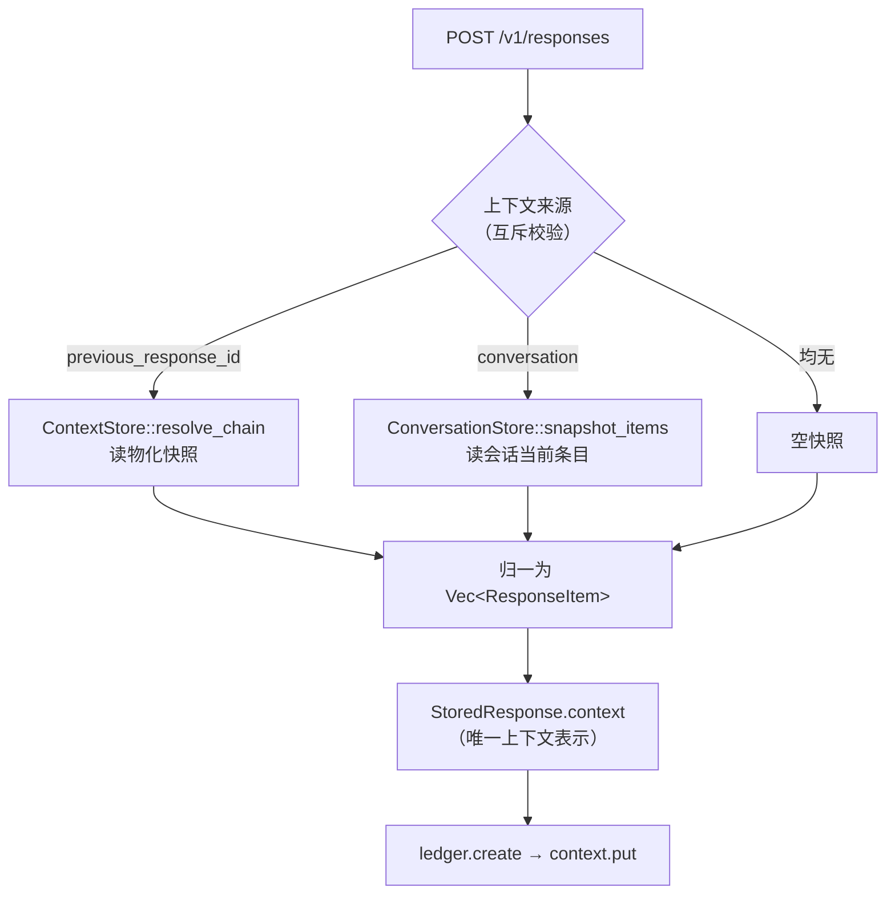

## 用户需求

将服务从「仅单次生成（Responses）」扩展为「一比一对齐 OpenAI 标准的会话（Conversations）能力」，把多次生成请求串联到一个可查询的会话容器中。

**核心原则**：除绝对必要外，完全一比一对齐官方协议；任何偏离需单独论证。分阶段推进，本次为阶段 1。

## 产品概述

新增会话（Conversation）这一对外一等资源：它是一个持久的、可增删条目的对话容器。调用方创建会话后，后续每次生成只需携带会话标识，服务端自动以该会话的当前条目作为上下文，并把本轮的输入与生成结果回写进会话。会话内容可随时分页查询、逐条读取与删除。

会话与既有的「上一次生成标识」串联方式**并存且互斥**：一次请求只能选其一，同时传入则明确报错。

## 核心功能

**会话生命周期**

- 创建会话（可附带初始条目与自定义标签），读取会话、更新会话标签、删除会话
- 删除会话返回明确的删除确认对象

**会话条目管理**

- 向会话追加条目、分页列举条目（按时间顺序、游标翻页、返回是否还有更多）
- 读取单条条目、删除单条条目

**生成与会话串联**

- 生成请求接受会话标识；服务端读取会话当前条目作为本轮上下文
- 本轮输入条目在创建时入会话，生成的输出条目在终态提交时入会话
- 与「上一次生成标识」互斥校验，违反即报错

**边界（本次明确不做）**

- **不提供会话级实时订阅**：流式推送范围仍永远是单次生成。会话级订阅在官方标准中属于另一套实时协议，只能在后续阶段通过对齐该官方协议实现，**禁止自造非标准扩展端点**
- 不提供会话级渲染快照、不持久化完整事件历史

**质量要求**

- 跨租户访问一律表现为「不存在」，不泄露标识是否存在
- 未知字段与超出支持范围的条目类型一律明确拒绝，绝不静默忽略
- 上下文来源不可静默降级：断裂、超限一律显式失败
- 会话条目分页有明确上界

**自动化验证**

- 会话存储契约以同一套断言同时验证内存实现与真实数据库实现
- 新增使用官方 Python SDK 打真实 HTTP 的兼容性验证层；在缺少运行时依赖的机器上自动跳过而非失败

## 一、技术栈

沿用现有栈，不引入新框架：

| 层 | 技术 | 复用点 |
| --- | --- | --- |
| 领域与协议 | Rust + `serde`（封闭枚举 + `deny_unknown_fields`）+ `thiserror` | `crates/core` |
| 端口抽象 | `async_trait` + `Arc<dyn Trait>` | `crates/core/src/ports/` |
| REST 接入 | `axum`（`Path`/`Query`/`State`/`Json`）+ `tower_http::CorsLayer` | `crates/nova-responses/src/routes/` |
| 适配器 | mem（`MemStore`）· sql（`sqlx` + migrations） | `crates/adapters/{mem,sql}` |
| L0 契约 | `testing/conformance` 的 `PortSet` + `cases()` 表 | 同断言跑 mem/sql |
| L4 新增 | 官方 `openai-python` SDK（**仅作验证客户端**） | `testing/sdk-compat/` |
| 编排 | `xtask` + `justfile` | `verify --level` |


**关键约束**：官方 SDK 只出现在 `testing/`，**绝不进入 `crates/` 任何 crate 的依赖**。这是用户「REST 协议层和 SDK 封装完全分离」要求的落地方式——REST 网关只做传输协议，SDK 仅是外部验证客户端。`xtask/src/main.rs` 的 `check_deps()` 需新增一条门禁断言此事。

---

## 二、实现方案

### 2.1 核心策略：会话是「快照的输入来源」，不是并行的上下文机制

这是整个方案的枢纽决策，用以化解 conversation 与 D24 物化快照的语义冲突。

**做法**：会话不引入第二套上下文拼接逻辑。`ResponsesService::create` 保持唯一的上下文装配点，两种来源在**入口处归一**为同一个 `Vec<ResponseItem>` 快照，写入既有的 `StoredResponse.context` 字段：



**由此得到的性质**：

- `resolve_chain` **零改动**，`StoredResponse.context` / `context_depth` 语义**零改动**，D24 全部现有 L0 断言**不受影响**——回归面被压到最小。
- 会话条目在创建时被固化进本次生成的快照。故「会话条目被删除」不会让已发出的生成失忆（与 D24 「删除是记录级、下游继承副本保留」一致），但**后续新生成**不再看到该条目——这正是官方会话删除语义，两者天然相容，无需新语义。
- 下游（执行端、检索、计费）看到的仍只有一种上下文形态，不存在分支。

### 2.2 新开独立端口 `ConversationStore`，而非扩展 `ContextStore`

`crates/core/src/ports/context.rs` 现有文档注释明确写道：命名为 `ContextStore` 而非 `ConversationStore` 是刻意的，后者读起来像「UI 渲染的东西」，而它恰恰不持有那个。

**决策：尊重这条既有边界，不改写其含义，而是给新概念独立端口。** 理由：

| 维度 | `ContextStore` | `ConversationStore` |
| --- | --- | --- |
| 单元 | 单次生成的不可变快照 | 有序可变条目容器 |
| 键空间 | `resp_{node}_{uuid}` | `conv_{uuid}` |
| 生命周期 | 保留期天级、可过期清扫 | 官方语义为永久保留 |
| 变更语义 | 创建时固化，此后仅追加输出 | 追加 / 逐条删除 |


SRP 与 OCP 双重成立：新增端口不改动 `ContextStore` 契约，既有断言与实现零触碰。**代价**是 mem/sql/proto/mem-client 四处各多一个实现，但这正是既有 D14 端口化模式的常规成本。

**载体共享**：`MemConversationStore` 复用同一 `Arc<MemStore>`；`SqlConversationStore` 复用同一连接池——使会话追加与内容写入落在同一库，满足 D21 ① 的原子性前提。

### 2.3 输出条目回写会话：唯一扇出点

官方语义要求本轮输出也进入会话。终态提交的唯一现存位置是 `crates/agent/src/engine.rs`（约 L450，调用 `context.append_output`）。

**做法**：

- `StoredResponse` 新增 `conversation_id: Option<ConversationId>`（执行端从 claim 得到的记录里读取，无需额外查询）。
- 引擎在**已有的** `append_output` 调用点紧邻处追加 `conversation.append_items`。全局仅两个会话写入点：创建时（`ResponsesService::create`，紧邻 `context.put`）与终态时（引擎，紧邻 `append_output`），各自与既有条目持久化调用点**同位**，不新增编排路径。
- 新增字段一律用 struct-update 语法构造，禁止手工枚举字段。

### 2.4 一比一对齐的协议细节

**已确证事实**（官方 API Reference）：

- 8 个端点；**update 用 `POST` 而非 PATCH/PUT**；items 无「更新单条」端点。
- `Conversation` 对象：`{id, object:"conversation", created_at, metadata}`；`metadata` 最多 16 对、key ≤64、value ≤512 —— 与现有 `MAX_METADATA_ENTRIES/KEY_BYTES/VALUE_BYTES` 完全一致，**直接复用常量，不新定义**。
- 删除返回 `{id, deleted:true, object:"conversation.deleted"}`。

**必须从权威来源提取的细节**：文档站已重构，`list-items` / `create` 子页均重定向至总览页。按 D22 ④，权威来源是 `openai/openai-openapi` 的 `openapi.yaml`（现锚定 `UPSTREAM_SPEC_REVISION = "2025-08-07"`）。实现前须从该 spec 提取并核对：

- `limit` 默认值与上界、`order`（`asc`/`desc`）默认值、`after`/`before` 游标、`include[]` 取值
- List 返回体是否为 `{object:"list", data, first_id, last_id, has_more}`
- Create/Update 请求体必填性、Delete item 返回体

若锚定 revision 尚未含 Conversations，前移 revision 属显式变更，须在 ADR 记录。**在核对完成前不得凭推测硬编码默认值。**

**条目类型集合**：官方 `ConversationItem` 有 29 个变体，本项目按 D22 只支持封闭子集。会话条目**直接复用现有 `ResponseItem`**（message / function_call / function_call_output），不另立类型，从而 D22 ⑥ 链闭合性自动成立，`protocol-subset` 既有拒绝断言自动覆盖会话入口。

### 2.5 标识设计

`ConversationId` 为 `conv_{uuid_simple}`。**不嵌 node_tag**：node_tag 的存在理由是把在途事件订阅路由到宿主进程（FR-30），会话无在途缓冲、无订阅（D20 ⑤ 继续生效），故不需要，也避免了 SEC-5 的路由伪造面。

`ConversationItemId` 按官方前缀习惯从 `ResponseItem::item_type()` 派生（`msg_` / `fc_` / `fco_`），插入时分配，使 retrieve/delete 可寻址。派生逻辑集中一处，禁止各处重写。

---

## 三、执行要点

**安全**

- SEC-2：会话全部 8 个端点，跨租户与不存在**一律返回 404**，标识解析失败同样按 404 处理（复刻 `routes/responses.rs::parse_id` 的既有做法），绝不返回 403。
- SEC-6：会话条目若含 image/file 引用，必须过 `url_guard::ensure_public_https` / `is_blocked_ip`，与生成入口同一守卫，不重复实现。
- SEC-7 / INV-52：`limit` 必须有硬上界；批量创建条目数量、JSON 深度沿用 `InputLimits` / `json_depth`。
- SQL 全部参数绑定，禁止拼接。
- INV-50：所有请求 DTO 用 `deny_unknown_fields` + 封闭枚举，禁用 `flatten` 兜底。

**可靠性**

- INV-46 / D21 ④：会话库不可用时**拒写 503**，绝不降级为静默不存；写入前探活沿用 `context.health()` 的既有模式。
- 「宁可显式失败，不可静默降级」：会话不存在、条目不存在、超限一律显式错误，禁止静默截断与静默跳过。

**性能**

- `snapshot_items` 是每次带 conversation 的生成都会走的热路径：必须是一次有界范围查询（按 `(conversation_id, seq)` 索引，`ORDER BY seq`），**禁止逐条 N+1**。
- 条目 seq 单调分配需与 event log 的 0 基连续分配同样保证并发无重号，L0 契约须在竞争下断言。
- 列举分页走游标（`after` + 索引定位），禁止 OFFSET 深翻页。
- sql migration 须建 `(conversation_id, seq)` 复合索引与租户过滤索引。

**日志**

- 沿用现有 `tracing` 与既有严重度惯例（参照 engine 中 `warn!(response = %id, error = %e, ...)` 的形态）。只记标识与错误，**不打条目正文**（含用户内容），避免 PII 落日志；不 dump 大 payload。

**回归控制**

- 领域类型不含展示元素；`object` 字段固定值、兜底文案只在 routes 渲染层产生。
- 不做与本次无关的重构；`ContextStore` 契约与 `resolve_chain` 保持零改动。
- 新增 `StoredResponse` 字段会波及 sql row 映射、mem store、`conformance::record()` 助手、proto 序列化——须逐一核对，用 `code-explorer` 做一次全量构造点审计。
- `just release`（`--no-default-features --features sql`）必须仍能排除 mem 与验证代码，L4 的 Python 资产不得进入发布产物。

---

## 四、架构与目录

### 4.1 分层落位（沿用 xtask 门禁强制的既有分层）

```
crates/core            + ConversationStore 端口 · Conversation 领域类型 · 会话协议 DTO · ConversationId
    ↑
crates/nova-responses  + service/conversations.rs（能力层，无 axum）
                       + routes/conversations.rs（接入层，仅传输协议）
    ↑
crates/gateway         + 装配新端口（mem / sql 两 feature 各一处）
    ↕
crates/agent           + 终态提交处追加输出条目至会话（唯一扇出点）
    ↑
crates/adapters/{mem, mem-client, sql}  + ConversationStore 实现 + wire 变体
```

### 4.2 目录结构

```
nova-agent/
├── crates/core/src/
│   ├── ids.rs                          # [MODIFY] 新增 ConversationId(conv_{uuid}) 与 ConversationItemId，含 parse/Display/serde 及 IdError 变体；沿用现有 newtype + 严格 parse 模式
│   ├── conversation.rs                 # [NEW] 会话领域类型：Conversation{id,tenant_id,metadata,created_at_ms}、ConversationItem{id,seq,item:ResponseItem,created_at_ms}、ItemPage{items,first_id,last_id,has_more}、ItemQuery{after,limit,order}。纯领域，无展示元素、无 object 字段
│   ├── context.rs                      # [MODIFY] StoredResponse 新增 conversation_id: Option<ConversationId>；构造处一律 struct-update
│   ├── ports/
│   │   ├── conversation.rs             # [NEW] ConversationStore trait + ConversationError（含 NotFound/Unavailable/ReadOnly/CapacityExceeded 等，与 ContextError 同风格）。含 snapshot_items 热路径方法
│   │   ├── context.rs                  # [MODIFY] 仅更新命名边界注释：说明为何新概念另开端口而非扩展本端口；trait 方法签名零改动
│   │   └── mod.rs                      # [MODIFY] 导出新端口
│   ├── protocol/
│   │   ├── conversation.rs             # [NEW] 会话协议 DTO：CreateConversationRequest/UpdateConversationRequest/CreateItemsRequest/ListItemsQuery。全部 deny_unknown_fields；metadata 校验复用 MAX_METADATA_* 常量
│   │   ├── mod.rs                      # [MODIFY] 从 EXPLICITLY_UNSUPPORTED_FIELDS 移除 conversation 条目（保留 context_management/prompt）；导出新 DTO；按 openapi.yaml 核对后可能前移 UPSTREAM_SPEC_REVISION
│   │   └── request.rs                  # [MODIFY] CreateResponseRequest 新增 conversation: Option<String>；validate() 增互斥校验（与 previous_response_id 同时出现即 RequestViolation）；新增 RequestViolation 变体
│   └── lib.rs                          # [MODIFY] 门面导出新类型与端口
├── crates/adapters/mem/src/
│   ├── conversation.rs                 # [NEW] MemConversationStore：复用 Arc<MemStore>；seq 原子单调分配；租户校验；容量上界
│   ├── store.rs                        # [MODIFY] MemStore 增会话与条目表（按 conversation_id 索引的有序结构），与 ledger/context 共享锁以保证原子性
│   ├── proto.rs                        # [MODIFY] Request/Response 各增会话变体（ConversationCreate/Get/Update/Delete/ItemsAppend/ItemsList/ItemGet/ItemDelete/SnapshotItems）；ProtoError 增 Conversation(ConversationError)
│   ├── server.rs                       # [MODIFY] 新变体的 dispatch 分支，形态与既有 Context* 分支一致
│   └── lib.rs                          # [MODIFY] MemWorld 增 conversation 字段并在 with_integrity 中装配
├── crates/adapters/mem-client/src/
│   ├── conversation.rs                 # [NEW] ConversationStore 的 RPC 客户端桩，形态复刻 context.rs
│   └── lib.rs                          # [MODIFY] 导出
├── crates/adapters/sql/
│   ├── migrations/                     # [MODIFY] 新增 conversations 与 conversation_items 建表；(conversation_id, seq) 复合索引 + 租户索引；items 对 conversations 建 FK
│   └── src/
│       ├── conversation.rs             # [NEW] SqlConversationStore：复用同一 pool；全参数绑定；游标分页走索引不用 OFFSET
│       ├── row.rs                      # [MODIFY] StoredResponse 新字段的 row 映射；会话行映射
│       └── lib.rs                      # [MODIFY] 导出并在装配结构中暴露 conversation
├── crates/nova-responses/src/
│   ├── service/
│   │   ├── conversations.rs            # [NEW] 能力层：会话 CRUD 与条目用例编排。无 axum 类型、无 HeaderMap、无 StatusCode。写前 health() 探活（INV-46）。ConversationsService + ConversationServiceError
│   │   ├── responses.rs                # [MODIFY] create() 参数增 ContextSource（Previous(id) | Conversation(id) | None），两来源归一为同一快照；创建成功后把本轮输入条目追加进会话
│   │   └── mod.rs                      # [MODIFY] re-export
│   ├── routes/
│   │   ├── conversations.rs            # [NEW] 接入层：8 个 handler。仅做 JSON 解析、租户鉴权、id 解析、分页参数校验、HTTP 状态翻译与 object 字段渲染。复用 tenant_or_reject 模式；解析失败按 404（SEC-2）。不直接操作端口
│   │   ├── responses.rs                # [MODIFY] 解析 conversation 参数并构造 ContextSource；互斥违反返回 400
│   │   └── mod.rs                      # [MODIFY] 挂载 8 条路由（注意 update 是 POST 同路径，与 GET/DELETE 共用 route 链）
│   ├── error.rs                        # [MODIFY] 新增 map_conversation_error，与 map_context_error 同风格
│   ├── state.rs                        # [MODIFY] AppState 增 conversation 端口与 conversations service
│   └── config.rs                       # [MODIFY] 会话条目上界、分页上界等旋钮（RawConfig deny_unknown_fields）
├── crates/gateway/src/main.rs          # [MODIFY] mem/sql 两 feature 分支各装配 conversation 端口；启动期 health 探活；Ports 结构增字段
├── crates/agent/src/engine.rs          # [MODIFY] 终态提交处（紧邻 append_output）追加输出条目至会话；deps 增 Option<Arc<dyn ConversationStore>>；仅当 record.conversation_id 存在时执行
├── testing/
│   ├── conformance/src/lib.rs          # [MODIFY] PortSet 增 conversation 字段；新增断言函数（会话 CRUD、条目追加/列举/游标/删除、SEC-2 跨租户不可见、并发 seq 无重号、超限显式失败、快照与官方删除语义相容）；在 cases() 表登记新 ContractCase（含 covers/scope/asserts）并加 dispatch 分支；record() 助手补新字段
│   ├── sdk-compat/                     # [NEW] 官方 Python SDK 兼容层（L4）。requirements.txt 锁定 openai 版本；测试脚本用 SDK 走完整会话流程（create→items→list 翻页→retrieve→delete→responses 带 conversation→互斥报错）。仅验证资产，绝不被 crates/ 依赖
│   └── scenarios/                      # [MODIFY] 新增会话相关 L1/L2 场景 yaml，沿用既有 yaml 结构与 covers 标注
├── crates/nova-responses/tests/http_contract.rs  # [MODIFY] 补 8 端点的 REST 契约：状态码、object 字段、未知字段 400、跨租户 404、分页边界
├── xtask/src/main.rs                   # [MODIFY] verify 增 "l4" 分支（探测 python3 + import openai，缺失则打印 SKIPPED 并 Ok(())，复刻 l3 自跳过）；coverage 纳入 l4；check_deps 增门禁：crates/ 任何 crate 不得依赖 sdk-compat 或 openai SDK
├── justfile                            # [MODIFY] 文件头注释增 l4 说明；verify all 追加 just verify l4
└── docs/
    ├── architecture/decisions.md       # [MODIFY] 新增 D26：部分 SUPERSEDES D20 ①。须写明：⑤⑥ 继续生效且与官方同构（官方 Conversations API 本身无订阅）；会话级订阅只能通过对齐官方 Realtime 协议实现，禁止自造扩展；items 是协议条目非渲染事件历史，故不冲突 D20 ④；会话作为快照输入来源而非并行上下文机制；为何另开端口。同时更新「现行生效」与「完整索引」两张表
    ├── architecture/invariants.md      # [MODIFY] 会话相关不变量（上下文单一来源、互斥、seq 连续、拒写不降级）
    ├── design/07-conversations.md      # [NEW] 会话设计文档（正式编号，本期实现）：端点表、对象形状、分页语义、与快照的关系、删除语义、错误映射表 + §时序图（场景 1 会话串联多轮生成 / 场景 2 跨设备分页查询 / 场景 3 两种串联方式互斥）
    ├── design/drafts/realtime-alignment.md  # [NEW] 后续阶段基线（按 design/README「仅编号文档可实现」规则，本期不实现故必须落 drafts/，将来实现时改写并取下一序号移出）：官方 Realtime 事件名速查 + §时序图（场景 4 会话建立与文本轮次 / 场景 5 语音轮次 VAD 与打断截断 / 场景 6 函数调用）+ 两协议边界对照表
    ├── design/README.md                # [MODIFY] 「正式设计」表增 07 行；「草稿」表增 realtime-alignment 行；路线图增「后续：对齐官方 Realtime」一环
    ├── design/06-protocol-subset.md    # [MODIFY] §1.1 移除 conversation 拒绝条目；新增会话子集范围与所依据 spec revision
    └── requirements/spec.md            # [MODIFY] 补会话功能需求条目与编号，供 coverage 引用
```

### 4.3 时序图归档位置（用户明确要求落盘）

调研阶段产出的 6 张交互时序图与 1 张协议边界对照表**必须入库**，落点按 `docs/design/README.md` 的既有规则分配：

| 图 | 内容 | 落点 | 依据 |
| --- | --- | --- | --- |
| 场景 1 | 创建会话 → 携带会话标识串联多轮生成（含 snapshot_items 读、输入条目入会话、终态输出条目入会话、每轮各一条单次生成 SSE） | `design/07-conversations.md` | 本期实现，属正式契约 |
| 场景 2 | 跨设备读取会话记录（retrieve → items 游标分页 → 单条读取 → 单条删除） | `design/07-conversations.md` | 同上 |
| 场景 3 | `previous_response_id` 与 `conversation` 并存且互斥（同时传入 400） | `design/07-conversations.md` | 同上 |
| 场景 4 | Realtime 会话建立 + 文本轮次事件流 | `design/drafts/realtime-alignment.md` | 本期不实现，不得占正式编号 |
| 场景 5 | Realtime 语音轮次（VAD 自动）+ 打断截断 | 同上 | 同上 |
| 场景 6 | Realtime 函数调用往返 | 同上 | 同上 |
| 对照表 | 两协议在传输/会话生命周期/串联方式/记录查询/实时订阅/条目增删六维度的差异 | **D26 正文** + 上述两文档交叉引用 | 它是「本期不做订阅并非妥协」的核心论据，属决策理由，须留在 ADR |


**已核实的官方 Realtime 事件名**（GA 后规格，写入 drafts 文档时须逐字采用，禁止凭记忆改写）：

- 客户端：`session.update`、`conversation.item.create`、`conversation.item.truncate`、`response.create`、`response.cancel`、`input_audio_buffer.append/commit/clear`、`output_audio_buffer.clear`（WebRTC）
- 服务端：`session.created/updated`、`conversation.item.added/done`、`input_audio_buffer.speech_started/speech_stopped/committed`、`response.created`、`response.output_item.added|created`、`response.content_part.added/done`、`response.output_text.delta/done`、`response.output_audio.delta/done`、`response.output_audio_transcript.delta/done`、`response.function_call_arguments.delta`、`response.output_item.done`、`response.done`、`response.cancelled`、`rate_limits.updated`、`error`

**须在 drafts 文档中显式记录的两条易错事实**：

1. Realtime 的 `conversation` 与 Conversations API 的 `conversation` **不是同一对象**——前者是 session 内项集合（session 上限 60 分钟），后者是永久持久化的 REST 资源。混淆二者会导致后续阶段误把持久会话塞进 socket 生命周期。
2. 音频字节**只**由 `response.output_audio.delta` 携带；`response.output_audio.done` 与 `response.done` 均不含音频数据。

**图表规范**：统一用 mermaid `sequenceDiagram` + `autonumber`；消息文本内避免冒号（mermaid 分隔符）；沿用仓库既有 `%%{init: ...}%%` 配置惯例。

---

## 五、关键接口定义

```rust
// crates/core/src/ports/conversation.rs
#[async_trait]
pub trait ConversationStore: Send + Sync {
    async fn create(&self, conversation: Conversation, initial: Vec<ResponseItem>, now_ms: u64)
        -> Result<Conversation, ConversationError>;
    async fn get(&self, tenant: &TenantId, id: &ConversationId)
        -> Result<Option<Conversation>, ConversationError>;
    async fn update_metadata(&self, tenant: &TenantId, id: &ConversationId,
        metadata: BTreeMap<String, String>) -> Result<Conversation, ConversationError>;
    async fn delete(&self, tenant: &TenantId, id: &ConversationId) -> Result<bool, ConversationError>;

    async fn append_items(&self, tenant: &TenantId, id: &ConversationId,
        items: Vec<ResponseItem>, now_ms: u64) -> Result<Vec<ConversationItem>, ConversationError>;
    async fn list_items(&self, tenant: &TenantId, id: &ConversationId, query: ItemQuery)
        -> Result<ItemPage, ConversationError>;
    async fn get_item(&self, tenant: &TenantId, id: &ConversationId, item: &ConversationItemId)
        -> Result<Option<ConversationItem>, ConversationError>;
    async fn delete_item(&self, tenant: &TenantId, id: &ConversationId, item: &ConversationItemId)
        -> Result<bool, ConversationError>;

    /// 生成创建时的上下文来源。必须是一次有界范围查询，禁止 N+1（热路径）。
    async fn snapshot_items(&self, tenant: &TenantId, id: &ConversationId, limits: ChainLimits)
        -> Result<ResolvedContext, ConversationError>;

    async fn delete_by_tenant(&self, tenant: &TenantId) -> Result<u64, ConversationError>;
    async fn health(&self) -> Result<(), ConversationError>;
}
```

`snapshot_items` 返回既有的 `ResolvedContext`，是「两来源归一」在类型层的体现：能力层拿到的是同一种结果，无需分支。

## Agent Extensions

### SubAgent

- **code-explorer**
- Purpose: 两处需要跨文件全量审计。其一，`StoredResponse` 新增 `conversation_id` 字段后，定位其在 `crates/adapters/{mem,sql}`、`crates/agent`、`testing/conformance`、`crates/nova-responses` 中的**全部构造点与行映射点**，确保无遗漏且一律改为 struct-update 语法。其二，审计 `MemWorld` / gateway `Ports` / proto `Request`+`Response`+`server` dispatch / mem-client 这四处 wire 装配链，确认新端口在每一处都已接通。
- Expected outcome: 输出带精确文件路径与行号的构造点/装配点清单，作为改动核对表，避免编译期之外的静默遗漏（如 sql row 映射漏字段导致会话串联失效）。