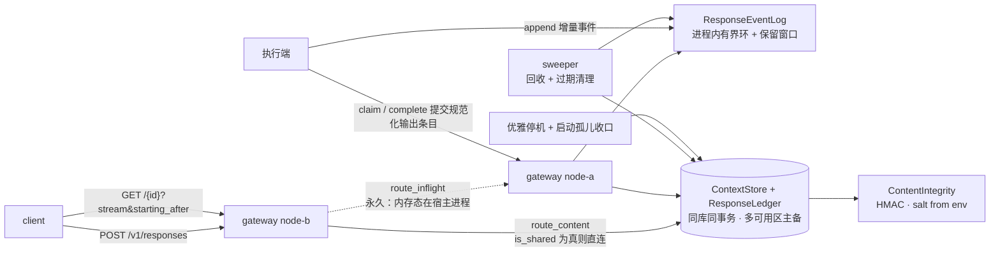

## 用户需求

将现有「Session 级可回放消息服务」重构为**对齐 OpenAI Responses 协议封闭子集的生成服务**。需求经四轮修订收敛为最终边界。

## 产品概述

主资源由「会话」收敛为「单次生成」。每次生成在其生命周期内于内存中缓冲增量事件，供订阅与精确续订，终态后经短暂保留窗口即释放；生成的输入输出条目与生成账本写入具备高可用的持久化存储，供后续轮次凭上一次生成的标识寻回历史，实现多轮对话而无需调用方重传全部历史。

核心命题是**存储与订阅分离**：服务持有生成内容用于按需拼接上下文，但不提供会话线程级的流式订阅与开屏还原。

## 核心功能

### 对外接口

- 创建生成，支持三种响应模式：同步等待、同连接流式、后台创建后另行订阅
- 查询生成，返回完整生成对象（含输出条目与用量）
- 按序号精确续订流式事件，无重复无遗漏
- 取消在途生成
- 删除已存内容，并提供租户级批量清除

### 协议封闭子集

对外协议为官方协议的**封闭子集**，超出范围一律明确拒绝而非静默忽略。

| 层 | 支持 | 拒绝 |
| --- | --- | --- |
| 请求参数 | 模型、输入、指令、存储开关、流式、后台、上一次标识、最大输出、元数据、工具与工具选择、采样参数 | 会话参数、上下文压缩、提示模板 |
| 条目类型 | 消息、函数调用、函数调用结果 | 条目引用、推理项、程序执行、计算机操作、托管工具 |
| 内容片段 | 文本输入输出、拒答、图片与文件（仅标识或链接引用） | 内联二进制 |


子集范围作为**可发布契约**交付调用方，并声明所依据的上游规范版本。

### 多轮上下文

- 每次生成只存自身条目与指向上一环的指针，拼接时逆向走链还原完整历史
- 设深度上限与体积上限，超限明确报错，禁止静默截断
- 四类断裂必须显式报错、不得静默降级为单轮：某环缺失或已过期、被引用者未开启存储、被引用者属其他租户、指令不跨轮继承
- 指令字段按生成单独存储供查询回显，但不参与走链拼接

### 明确移除的能力

会话创建与占用锁、会话忙闲事件、开屏快照（气泡历史、运行列表、快照序号协议）、跨轮次事件日志、热层冷层归档与缺口引导恢复、跨区只读镜像投影与权威区边缘区拓扑。

### 可靠性与高可用

- 上下文库与账本：真实持久化、同城多可用区主备、定期备份、同库同事务
- 在途事件缓冲：进程内有界环，终态后保留可配置时长；位点已驱逐或标识未知时返回明确错误，不返回部分数据、无恢复路径
- 四项崩溃缓解：优雅停机、启动期孤儿收口、部分用量入账、上下文库不可用时拒写
- 故障语义分层：已完成生成不受节点故障影响；在途生成明确失败并可重试，历史完好

### 访问控制与合规

按租户校验归属，越权返回「不存在」以避免标识枚举；走链每一环都校验租户。保留期与删除接口可配置并给出默认值；内容写入时计算完整性校验值，读取时校验并告警。

## 交付范围

领域层、协议子集类型与校验、接入层、内存适配器、新增持久化适配器、分层验证体系、开发夹具、部署配置，以及需求/架构/决策/设计/计划全套文档；同时完成服务与代码包同步更名，并对外发布协议子集规范。

## 技术栈

沿用现有栈，新增三组依赖：

| 层 | 技术 | 说明 |
| --- | --- | --- |
| 语言/工具链 | Rust 2021（`rust-toolchain.toml`） | 沿用 |
| 接入 | `axum 0.8` + `tower-http`(cors) + `futures::stream::unfold` SSE | 沿用 `crates/gateway/src/main.rs` 现有模式 |
| 异步 | `tokio 1` | **已含 `signal` 特性**（`Cargo.toml` 第 25 行已验证），优雅停机可直接用，无需改依赖 |
| 端口抽象 | `async-trait` + `thiserror` | 沿用 D14 端口化 |
| 内存态 | `parking_lot::Mutex` + `tokio::sync::Notify` | 沿用现有唤醒模式 |
| 节点间转发 | `reqwest 0.12` | 复用现有 `forward_json` / `forward_raw` 骨架 |
| 验证 | conformance / harness + `serde_yaml` 场景 + xtask 门禁 | 沿用 D15 / D17 |
| **新增：持久化** | `sqlx 0.8`（postgres / runtime-tokio-rustls / json / migrate；**关闭编译期 macros**，避免构建期依赖数据库） | 上下文库 + 账本同库 |
| **新增：完整性** | `hmac` + `sha2` + `subtle` + `unicode-normalization` | 规范化与防篡改校验 |
| **新增：链接校验** | `url` | 图片文件引用的 SSRF 纵深防御 |


依赖统一登记到根 `Cargo.toml` 的 `[workspace.dependencies]`（现 19-40 行）；`members`（现 3-12 行）追加 `crates/adapters/sql`；`nova-sessions-core` 键改 `nova-responses-core`。

**不引入分词库**：上下文预算用**字节上限**而非 token 计数；token 精确计量属模型适配层职责，不为一个上限检查引入重量级依赖。

## 实现策略

### 核心思路

**端口重塑而非补丁**，五个方向同时收敛：

1. `StreamChannel`（per-session 无限可回放日志 + 热冷分层 + Gap 引导）→ `ResponseEventLog`（per-response 有界环 + 保留窗口 + 显式过期）
2. `MetaStore`（会话锁 + 轮次账本）→ `ResponseLedger`（生成账本，去会话锁，加孤儿收口与部分用量）
3. `SnapshotStore`（开屏快照）→ **整体删除**
4. **新增** `ContextStore`（生成条目持久化 + 走链解析 + 共享能力标志）
5. **新增** `ContentIntegrity`（防篡改校验）

关键在于拆分曾被 `SessionSnapshot` 混在一起的两个职责：`bubbles`（生成条目内容）与 `snapshot_seq`（流式开屏起点）。本次**保留前者实质并升格为独立持久化端口**，**彻底删除后者**。

端口命名刻意避开 `Conversation`——该词易被读作「渲染用事件历史」，是误解温床；改用 `ContextStore` 明确它承载模型上下文条目。

### 关键技术决策

**1. 输出条目由执行端在终态直接提交，不由事件流回放派生（须立为不变量）**

执行端在 `complete` 时直接提交规范化最终输出条目，服务端写入上下文库。

**自证理由**：在途事件缓冲被定义为有界瞬态、终态即释放；若输出内容需回放事件流才能得出，事件日志就被迫成为持久化真相源，与其定位直接冲突，且完整事件历史将不得不长期持久化。这不是实现细节而是架构约束，必须写进 ADR 与不变量——否则将来有人以「减少一次写入」为由做这个"优化"，会无声推翻整个存储边界。

有利副作用：事件流可自由携带仅供渲染的内容（思考过程、工具进度、渲染提示）而完全不影响存储条目的纯净度，因为两者是彼此独立的写入路径。

**2. 封闭子集 + 严格拒绝未知，使「往返丢字段」风险由构造消失**

早期方案曾考虑「接受未知类型 + `#[serde(flatten)]` 保留未知字段」，该路线有四个 serde 陷阱。**采用封闭子集后四者全部消解**：

| 原陷阱 | 封闭子集下 |
| --- | --- |
| 未知条目类型解析失败 | **变成期望行为**——本就要返回 400 |
| `untagged` 兜底掩盖真实错误 | **不需要兜底**，用封闭枚举 + `deny_unknown_fields`，字段错误如实上报 |
| 逐层 flatten 漏层丢字段 | **不需要 flatten** |
| 数值精度与 flatten 冲突 | flatten 消失；且用量字段类型化为 `u64`，不经过 `f64`，更彻底解决 |


严格拒绝未知参数**恰好也是官方行为**（返回 400 未识别参数），故严进既更安全也更兼容，不存在取舍。同时官方那三个「必须原样回传」的字段（消息阶段标记、加密推理内容、程序指纹）全部失效——它们由执行端产生，而执行端是我方组件，子集不含这些特性即不存在这些字段。

**3. 严进带来的三处风险转移（必须显式处理）**

风险性质从「静默损坏」转为「显式拒绝」，这是好的方向，但需三条配套：

- **链闭合性（最重要）**：存储的输出条目会在下一轮作为输入回放。若执行端产出了输入校验器不接受的类型，**自家链就断了**。立为不变量：**输出条目类型集合 ⊆ 可接受的输入条目类型集合**，配 L0 断言强制。
- **部署顺序**：执行端若先升级并产出新类型，网关会拒绝，表现为线上 400 突增。规则：**网关先行升级**（先放宽接受面再升执行端），写入部署文档。
- **子集是可发布契约**：调用方按官方全集调用会大面积 400，故**发布自有协议子集规范**从加分项变为必要交付物。

**4. 以官方规范为权威事实来源，但只提取子集**

权威来源为 `openai/openai-openapi` 仓库的 `openapi.yaml`（官方维护，SDK 由它生成）。该规范覆盖 Chat Completions / Assistants / Fine-tuning / Batch / Audio 等全产品线，**全量生成会引入数万行无关类型**。做法：提取 Responses 相关 schema 子集据以定义类型，**锁定并记录所依据的规范版本**作为对外兼容声明依据；配 CI 定期拉取做字段级 diff 并告警——**该门禁性质是「是否扩展子集」的产品决策输入，非正确性门禁**，不阻塞。

**5. 指令字段不跨轮继承（原设计缺口，已核实官方语义）**

指令是一条插入上下文最前面的 system/developer 消息，优先级高于 user；**不是条目**，不出现在条目列表，而在响应对象上独立回显；且**与上一次标识一起使用时，上一轮的指令不会被带入下一轮**。

由此产生硬契约：**指令按生成单独存储供查询回显，但绝不进入走链输出**。走链只拼条目。若误将历史环的指令拼进去，会表现为「调用方换了系统提示却仍受旧指令影响」这类极难排查的问题。

**6. 走链解析：内存单锁遍历，SQL 递归单查询**

- 内存适配器：**必须在单次加锁内完成整条遍历**——每环一次加锁是本设计最易踩的性能坑
- SQL 适配器：用 `WITH RECURSIVE` 把走链从「N 次往返」压成**一次查询**，这是选 PostgreSQL 系的决定性理由；深度上限、租户、起点**全部绑定参数**传入（防注入），租户在递归内逐环校验
- 深度上限默认 50、字节上限默认 1 MiB。因图片文件仅支持引用形式（标识或链接，均为短字符串），**1 MiB 上限保持有效**
- **链亲和路由**：带上一次标识的创建请求导向该链所属节点，使走链全程本地完成。**仅在上下文库非共享时需要，共享库后必须退役**——否则长会话把流量钉死单节点造成热点

**7. 序号改 0 基连续（强于原 INV-11 的「单调」）**

`starting_after=N` 的正确性依赖「N+1 必然是下一条」。原 `SeqMonotonic` 只保证递增，无法排除跳号。收敛到单次生成后事件在同一把锁内顺序追加，连续性天然成立且可被裁判强断言。**这是删掉整套 Gap / 快照恢复机制的前提**：序号连续且生命周期有界，缺口只可能来自驱逐，而驱逐必须显式报错。

现有实现是 1 基（`crates/adapters/mem/src/stream.rs:76-78` 的 `earliest: 1` 与 `log.hot.len() + log.earliest`；`testing/conformance/src/lib.rs:23` 断言 `seq1 == 1`），需改 0 基。因 0 是合法序号，`starting_after` 用 `Option<u64>`，`None` 表示从头。

顺带获得性能改善：0 基连续使 `read_after` 可**直接下标定位**，`O(limit)` 取代现 `stream.rs:125-131` 的 `filter().take()` 全扫——现有 SSE 每 50ms 轮询一次并全扫事件表，在数千事件的长生成下是明确热点。

**8. 可靠性分层——只在收益成本比最优的层投入**

| 存储 | 丢失后果 | 写频率 | 本期决策 |
| --- | --- | --- | --- |
| 上下文库 | **历史永久丢失，调用方无法继续对话** | ~70/s | **真实持久化 + 同城多可用区主备 + 备份** |
| 账本 | 生成记录 / 计费 / 幂等键丢失 | ~70/s | **同库同事务** |
| 在途事件缓冲 | 调用方重试该次生成 | ~2 万/s | **进程内内存 + 四项缓解** |


关于在途高可用的诚实结论（须完整写入 ADR，避免将来重复争论）：共享中间件**确实**买到真实可用性，但价值仅集中于两种情形——

| 崩溃对象 | 进程内内存 | 共享中间件 |
| --- | --- | --- |
| **网关挂、执行端存活** | 追加失败，生成被孤立作废 | 执行端改投他节点，**生成不中断** |
| 执行端挂 | 新 attempt 重跑 | 同（无差异） |
| 整机 / 可用区故障 | 重跑 | 同（无差异） |
| **滚动发布** | 在途全丢 | 无损 |


而第 4 行可由**优雅停机零成本消除**；第 1 行按锚点量化后月损失率约 0.031%（悲观 0.093%），满足 99.9% 但**几乎无余量**——故四项缓解不是可选项：

1. **优雅停机**：翻转拒新标志 → 等在途自然完成 → 退出，消除最高频事件（发布）的损失
2. **孤儿快速判定**：节点启动即按节点标签将账本中归属本节点的未终态记录置失败，把现有心跳超时 90s（`main.rs:159`）的长时间挂起变为秒级明确失败
3. **部分用量入账**：中途作废时 token 已消耗，须记录该 attempt 的部分用量，否则计费对不上
4. **上下文库不可用时拒写**：复用现有只读降级机制返回 503，**绝不降级为静默不存**——否则链在后续轮次无声断裂

**三层高可用升级触发条件**（写入 ADR）：非计划网关崩溃导致的失败率实测 > 0.05%/月 ｜ 单次生成时长 P99 > 15 分钟（优雅停机不再可行）｜ 合作方明确要求网关故障对生成无感知并接受延迟与成本。届时选 **Redis Streams 而非消息队列**——形状匹配（按标识范围随机定位，契合 `starting_after` 语义）；消息队列是消费者游标模型，与连续序号需额外维护映射，且高基数短命 topic 的创建销毁属元数据抖动、三副本持久化引入毫秒级追加延迟影响逐字输出。该决定**可逆**：端口形状即抽象层，只需新增适配器，领域层与接入层零改动。

**9. 两条转发路径必须分离——性质完全不同**

| 路径 | 性质 | 直连是否可能 |
| --- | --- | --- |
| `route_inflight`（在途事件） | **永久架构特征** | **不可能**——状态在特定进程堆内，无共享端点可连 |
| `route_content`（上下文库） | **临时措施，随共享存储退役** | 共享库后**应当直连** |


实现手段：`ContextStore` 增加**能力标志 `is_shared() -> bool`**。内存适配器返回 `false` 走转发（服务 L2 多进程场景），SQL 适配器返回 `true` 直连且链亲和自动失效。**接真库时接入层零改动**。

流式请求只能**代理**不能 307 重定向：重定向会暴露内部拓扑，且跨区或负载均衡后调用方未必能直达宿主节点。

**10. 三种响应模式共用同一条内部事件流**

现有架构是执行端拉取式异步。同步模式实现为：创建后在同一请求内等待事件日志出现终态事件（超时可配），随后从上下文库组装完整对象返回；超时则返回当前状态对象让调用方转为轮询而非报错。这样同步 / 同连接流式 / 后台订阅三种模式无分叉逻辑。

**11. 完整性校验（指纹职责降级）**

存了原文后纠纷定责直接调原文，指纹**降级为存储层防篡改校验**：写入时对规范化内容算 HMAC-SHA256 并随记录保存，读取时重算比对（`subtle` 常数时间），不匹配返回完整性错误并计入指标。规范化仍必需（否则哈希不稳定）：输入走 canonical JSON（键排序 + 紧凑分隔符 + NFC），输出走「按序号顺序拼接全部增量 + NFC」，否则分片边界差异会造成误报。salt 仅从环境变量读取；启用校验但 salt 缺失时**启动即失败**。

### 适配器分层与验证边界（协调 D15 / D17）

| 层 | 适配器 | Docker |
| --- | --- | --- |
| L0 端口契约 | 内存 + SQL 共用同一套 `assert_*` | 内存部分无需 |
| L1 场景（进程内） | 内存 | 无 |
| L2 场景（多进程 HTTP） | 内存 + `route_content` 转发路径 | 无 |
| L3 端到端 | SQL | 允许（D17 明确 L3 可用） |


内存适配器**保留**，是 L0–L2 无 Docker 的基础；SQL 适配器是当期真实实现而非占位，不违反 D14。**同一套 L0 契约函数必须能同时跑两个适配器**——这是端口化的验收方式，需把现有 `assert_*`（`conformance/src/lib.rs:11/33/54/94`）从接收具体 `MemWorld` 改为接收 trait 对象并新增泛型入口。

### 避免技术债

- 遵循「先改契约与接入层，再填适配器」的既有工作方式，禁止适配器私货
- ADR 纪律：不删改 D1–D19 正文，新增 D20/D21/D22 并补 `SUPERSEDED BY` 链；**D11 标 RESTATED 而非废止**（分承载理由由「会话日志 vs 会话锁」变为「高频在途缓冲 vs 低频上下文库」，结论不变）
- 四项缓解与升级触发条件全部落为可验证条目，不留口头承诺

## 实现要点

- **改动顺序**：契约文档（FR/CR/INV/SEC 编号）→ 协议子集类型 → core → 内存适配器 → SQL 适配器 → 接入层 → 验证 → 更名。**编号必须先定**，因 `xtask/src/main.rs:288-292` 的 coverage 基线与 `:299-300` 的 L0 常开覆盖集、以及全部 24 份场景 YAML 的 `covers` 字段直接引用这些标识。
- **门禁静默失效风险（已核实）**：`xtask/src/main.rs:504` 硬编码 `core.contains("adapters-mem") || core.contains("nova-sessions-gateway")`。改名后若不同步更新，该门禁将**永远通过而不报错**；新增 SQL 适配器后还需禁止 core 依赖它。同理 `:91/96` 的 `start_bin("nova-sessions-gateway", …)` 与 config 路径、`:93/98/103` 的 pid 文件名、`:118` 的 procs_down 列表、以及 `testing/config/home.toml`、`edge-b.toml` 路径。
- **SQL 注入**：一律参数绑定；递归走链的深度上限、租户、起点标识全部以绑定参数传入，禁止字符串拼接。
- **SSRF 双入口防护**：① 节点间转发目标**只能取自配置的对等节点注册表**，禁止从标识拼装地址或接受请求头指定上游，标签不在表内直接返回未找到且不外发请求；② **图片与文件引用的链接是第二个 SSRF 入口**——执行端会去拉取，故在网关入口即做纵深防御：仅允许 https、解析后拒绝内网地址段（含 9./10./11./21./30./127./169.254./172.16-31./192.168. 与 IPv6 私有段）。
- **归属边界须书面化**：**文件标识的归属校验由文件服务负责，不在本服务边界内**。若不写明，跨租户文件标识引用会成为无主风险。
- **访问控制**：查询、删除、取消全部校验租户归属，不匹配返回**未找到而非禁止访问**，避免标识枚举；**走链每一环都校验**，遇跨租户环立即中断报错；**条目引用类型一律拒绝**（它可绕过逐环校验）；节点间转发以独立内部头透传租户并校验内部凭据，禁止外部伪造该头。
- **密钥**：HMAC salt、数据库连接串、接口密钥全部仅从环境变量读取；配置文件只存**环境变量名**不存值。
- **反序列化防护**：输入数组限条目数、单条长度、总字节数与 JSON 嵌套深度；`deny_unknown_fields` 严格拒绝。
- **日志**：沿用 `tracing`；**禁止记录输入输出原文、salt、密钥、数据库凭据**，错误日志只输出标识、状态、错误码；SSE 轮询路径不得逐事件打日志（现有代码即无，保持）。
- **爆炸半径控制**：`/v1/agent/*` 四端点与 `/v1/admin/{read_only,pending_limit}` 行为语义保持不变，仅将会话标识参数替换为生成标识，使 `testing/mock-agent` 改动最小；`/v1/admin/trim_hot` 随冷层一并删除。
- **保留资产**：`JitteredBackoff`（含 3 个单测）、幂等闸门（无 TTL 窗口）、attempt 栅栏、回收器、只读降级、过载保护全部保留——这些与存储策略无关。

## 架构设计



### 端口收敛对照

| 现有 | 重构后 | 变化 |
| --- | --- | --- |
| `StreamChannel::read_from` + `StreamGap` + 冷层 | **删除** | 跨轮次回放需求消失 |
| `StreamChannel::append` / `read_after` | `ResponseEventLog::append` / `read_after` | 键改生成标识；0 基连续；`read_after` 即 `starting_after` 语义 |
| — | `ResponseEventLog::close(id, ttl)` | **新增** 终态标记 + 保留窗口起算 |
| `SnapshotStore` | **整体删除** | 开屏能力取消 |
| `SessionSnapshot.bubbles` | `ContextStore` | 条目内容实质保留但**升格为独立持久化端口**，脱离流式序号协议 |
| `MetaStore::create_session` / `lock` / `SessionLock` | **删除** | 无会话资源与会话锁 |
| `MetaStore` 其余方法 | `ResponseLedger` 对应方法 | 标识统一为生成标识 |
| — | `ResponseLedger::reclaim_orphans(node_tag)` | **新增** 启动期孤儿收口 |
| — | `ResponseLedger::record_partial_usage` | **新增** 中途作废的用量入账 |
| — | `ContextStore::resolve_chain` / `is_shared` / `health` | **新增** 走链解析 + 共享标志 + 探活 |
| — | `ContentIntegrity` | **新增** 写入签名、读取校验 |
| `Clock` / `MetricsSink` | 原样保留 | — |


## 目录结构

```
nova-chat/
├── Cargo.toml                      # [MODIFY] members(3-12行) 追加 crates/adapters/sql；
│                                   #   workspace.dependencies(19-40行) 中 nova-sessions-core
│                                   #   → nova-responses-core；新增 adapters-sql / sqlx / hmac /
│                                   #   sha2 / subtle / unicode-normalization / url。
│                                   #   tokio 已含 signal 特性，无需改动
├── crates/core/
│   ├── Cargo.toml                  # [MODIFY] package.name → nova-responses-core；加
│   │                               #   unicode-normalization（规范化需 NFC）
│   └── src/
│       ├── lib.rs                  # [MODIFY] 删 mod snapshot；新增 mod protocol / context /
│       │                           #   canonical；ports 增 event_log / ledger / context /
│       │                           #   integrity；重写 10-19 行全部 pub use 导出面
│       ├── ids.rs                  # [MODIFY] 删 SessionId / TurnId；新增 ResponseId（内含
│       │                           #   node_tag，格式 resp_{node}_{uuid}，带 new / parse /
│       │                           #   node_tag / Display，**严格校验标签字符集防路由伪造与
│       │                           #   地址注入**）与 TenantId；保留 AgentId、Attempt(INV-5
│       │                           #   单调)、IdempotencyKey
│       ├── protocol/               # [NEW] 协议封闭子集类型层
│       │   ├── mod.rs              #   导出面 + 所依据上游规范版本号常量（对外兼容声明依据）
│       │   ├── request.rs          # [NEW] CreateResponseRequest 强类型信封，
│       │   │                       #   #[serde(deny_unknown_fields)]：model / input /
│       │   │                       #   instructions / store(默认true) / stream / background /
│       │   │                       #   previous_response_id / max_output_tokens / metadata /
│       │   │                       #   tools / tool_choice / temperature / top_p。
│       │   │                       #   带 conversation / context_management / prompt 时明确
│       │   │                       #   400 并说明本服务仅支持 previous_response_id
│       │   ├── item.rs             # [NEW] ResponseItem 封闭枚举(tag="type")：Message /
│       │   │                       #   FunctionCall / FunctionCallOutput。**ItemReference 及
│       │   │                       #   Reasoning / Program / ComputerCall / Mcp* 不在枚举内**
│       │   │                       #   （反序列化直接失败 → 400，条目引用可绕过逐环租户校验）。
│       │   │                       #   附 item_type() 供指标、is_acceptable_as_input() 供
│       │   │                       #   链闭合性断言
│       │   ├── content.rs          # [NEW] ContentPart 封闭枚举：InputText / OutputText /
│       │   │                       #   Refusal / InputImage / InputFile。**图片文件仅接受
│       │   │                       #   file_id 或 https 链接，拒绝 base64 内联**
│       │   ├── limits.rs           # [NEW] ItemLimits / InputLimits：条目数、单条长度、总
│       │   │                       #   字节、JSON 嵌套深度上限（反序列化防护）
│       │   └── url_guard.rs        # [NEW] 引用链接 SSRF 纵深防御：仅 https；解析后拒绝内网
│       │                           #   地址段(9./10./11./21./30./127./169.254./172.16-31./
│       │                           #   192.168. 与 IPv6 私有段)；拒绝时返回明确 400
│       ├── events.rs               # [MODIFY] EventKind → ResponseEventKind，serde rename 为
│       │                           #   response.created / response.in_progress /
│       │                           #   response.output_text.delta / response.completed /
│       │                           #   response.failed / response.incomplete；删 TurnBegin /
│       │                           #   SessionBusy / SessionIdle；StreamEvent → ResponseEvent
│       │                           #   { response_id, sequence_number, kind, attempt, payload }；
│       │                           #   保留 coalescible()（仅增量可合并，INV-16）
│       ├── context.rs              # [NEW] StoredResponse{response_id, previous_response_id,
│       │                           #   tenant_id, instructions, input_items, output_items,
│       │                           #   status, usage, created_at_ms, completed_at_ms, stored,
│       │                           #   expires_at_ms, integrity, integrity_alg, node_tag}、
│       │                           #   Usage{input_tokens,output_tokens,total_tokens: u64}、
│       │                           #   ChainLimits{max_depth,max_items,max_bytes}、
│       │                           #   ResolvedContext{items,depth,bytes}。
│       │                           #   **文档注明 instructions 不参与走链输出**
│       ├── canonical.rs            # [NEW] canonical_json(&Value)->String（键排序 + 紧凑分隔符
│       │                           #   + NFC）与 canonical_items(&[ResponseItem])->String。
│       │                           #   含单测覆盖分片边界 / 空白 / 编码变体的签名不变性
│       ├── snapshot.rs             # [DELETE] Bubble / SessionSnapshot / stream_from_seq 整体移除
│       ├── error.rs                # [MODIFY] DomainError 去 Busy；新增 Expired / Unauthorized /
│       │                           #   ChainBroken / ChainTooLong / InvalidId /
│       │                           #   IntegrityMismatch / UnsupportedItemType / BlockedUrl
│       ├── reconnect.rs            # [KEEP] JitteredBackoff 与 3 个单测原样保留（INV-33）
│       └── ports/
│           ├── mod.rs              # [MODIFY] 删 snapshot / stream / meta；加 event_log /
│           │                       #   ledger / context / integrity
│           ├── stream.rs           # [DELETE] 由 event_log.rs 取代
│           ├── snapshot.rs         # [DELETE]
│           ├── meta.rs             # [DELETE] 由 ledger.rs 取代
│           ├── event_log.rs        # [NEW] ResponseEventLog：append -> u64、read_after(id,
│           │                       #   starting_after: Option<u64>, limit, wait_ms)、
│           │                       #   close(id, ttl_ms)。EventLogError{Unknown, Expired,
│           │                       #   StaleAttempt, ReadOnly, CapacityExceeded, Internal}。
│           │                       #   **无 Gap / read_from / trim / cold**
│           ├── ledger.rs           # [NEW] ResponseLedger：create / claim / heartbeat /
│           │                       #   complete / cancel / reap / get / check_attempt /
│           │                       #   reclaim_orphans(node_tag) / record_partial_usage。
│           │                       #   ResponseStatus{Queued,InProgress,Completed,Failed,
│           │                       #   Incomplete,Cancelled}；CreateOutcome{Accepted,
│           │                       #   Duplicate,ReadOnly,Overloaded}（**无 Busy**）
│           ├── context.rs          # [NEW] ContextStore：is_shared() -> bool、put /
│           │                       #   append_output / get / resolve_chain / delete /
│           │                       #   delete_by_tenant / sweep_expired / health。
│           │                       #   ContextError{NotFound, NotStored, ChainBroken,
│           │                       #   ChainTooLong, ChainTooLarge, CrossTenant,
│           │                       #   IntegrityMismatch, CapacityExceeded, Unavailable,
│           │                       #   ReadOnly, Internal}。文档注明：逐环校验租户；容量
│           │                       #   触顶拒绝新建而非驱逐；不可用时拒写不降级；
│           │                       #   **resolve_chain 只返回条目，绝不含 instructions**
│           ├── integrity.rs        # [NEW] ContentIntegrity：sign / verify（常数时间）/ alg()。
│           │                       #   文档注明 salt 必须仅来自环境变量
│           ├── clock.rs            # [KEEP]
│           └── metrics.rs          # [KEEP]
├── crates/adapters/mem/
│   ├── Cargo.toml                  # [MODIFY] 依赖改名；新增 hmac / sha2 / subtle
│   └── src/
│       ├── lib.rs                  # [MODIFY] MemWorld 去 snapshot / mirror 字段与 sync_mirror
│       │                           #   （现 20-67 行）；改为 ledger / event_log / context /
│       │                           #   integrity / clock / metrics；new() 接受容量与保留期配置
│       ├── event_log.rs            # [NEW，取代 stream.rs] 删 SessionLog.cold / earliest(76) /
│       │                           #   trim_earliest(151) / test_trim_earliest(166) /
│       │                           #   cold_len(171) / tip_seq(180) / RECOVER_VIA_SNAPSHOT(14)
│       │                           #   及其单测(188-222)；改为 ResponseLog{ring: VecDeque,
│       │                           #   next_seq, evicted_before, terminal_at_ms, ttl_ms}。
│       │                           #   **序号 0 基连续**；read_after 用下标定位 O(limit) 取代
│       │                           #   现 125-131 行的 filter().take() 全扫；位点低于
│       │                           #   evicted_before 或已过保留窗口即 Expired；保留 Notify
│       │                           #   唤醒(139-142)与追加前的 attempt 栅栏校验(61-70)
│       ├── stream.rs               # [DELETE]
│       ├── ledger.rs               # [NEW，取代 meta.rs] 删 SessionRow / sessions / lock /
│       │                           #   SessionLock 分支（现 12-14、91-98、122-126、199-201、
│       │                           #   259-266 行）；保留幂等闸门、attempt 单调、reap 抬栅栏、
│       │                           #   read_only、pending_limit、inflight 统计；新增 cancel、
│       │                           #   store 标志、node_tag 归属、reclaim_orphans、部分用量
│       ├── meta.rs                 # [DELETE]
│       ├── context.rs              # [NEW] MemContextStore：is_shared()=false；
│       │                           #   HashMap<ResponseId,StoredResponse> + 租户二级索引（支撑
│       │                           #   批量清除）+ BTreeMap<(expires_at_ms,ResponseId)> 过期
│       │                           #   索引（O(log n) 清理，避免全表扫描）。**resolve_chain
│       │                           #   在单次加锁内完成整条遍历**，逐环校验租户与 stored
│       │                           #   标志，累计深度与字节并在超限时报错；容量触顶返回
│       │                           #   CapacityExceeded。文件头注明「服务 L0–L2 验证；
│       │                           #   生产用 SQL 适配器」
│       ├── integrity.rs            # [NEW] HmacSha256Integrity：salt 仅从环境变量读取（可选
│       │                           #   per-tenant 覆盖），构造失败返回错误供启动期立即失败；
│       │                           #   verify 用 subtle 常数时间比较；alg = "hmac-sha256-v1"
│       ├── snapshot.rs             # [DELETE]
│       ├── mirror.rs               # [DELETE] MemMirrorView / SharedMirror / project_* 整体移除
│       ├── clock.rs                # [KEEP]
│       └── metrics.rs              # [KEEP]
├── crates/adapters/sql/            # [NEW CRATE] adapters-sql，生产承载 + L3
│   ├── Cargo.toml                  # nova-responses-core、sqlx(postgres,runtime-tokio-rustls,
│   │                               #   json,migrate；关闭 macros)、hmac、sha2、subtle、
│   │                               #   async-trait、thiserror
│   ├── migrations/
│   │   └── 0001_init.sql           # [NEW] responses 表：response_id PK、previous_response_id、
│   │                               #   tenant_id、status、stored、node_tag、attempt、owner、
│   │                               #   idempotency_key UNIQUE、instructions、input_items JSONB、
│   │                               #   output_items JSONB、usage JSONB、integrity、
│   │                               #   created_at/completed_at/expires_at。索引：(tenant_id)、
│   │                               #   (expires_at) 部分索引、(node_tag,status) 部分索引（供
│   │                               #   孤儿收口）、(previous_response_id)。**账本与上下文同表，
│   │                               #   创建时单事务写入避免不一致**
│   └── src/
│       ├── lib.rs                  # [NEW] SqlWorld 装配 + 连接池配置 + 启动期 migrate
│       ├── ledger.rs               # [NEW] claim 用 UPDATE … WHERE status='queued' RETURNING
│       │                           #   保证原子领取（对应 INV-1）；幂等键靠 UNIQUE 冲突判定；
│       │                           #   reclaim_orphans 按 node_tag 批量置失败
│       ├── context.rs              # [NEW] is_shared()=true。resolve_chain 用 WITH RECURSIVE
│       │                           #   一次查询完成走链，**深度上限 / 租户 / 起点全部绑定
│       │                           #   参数**，不选取 instructions 列；delete_by_tenant 分批
│       │                           #   删除避免长事务；sweep_expired 走 expires_at 部分索引
│       │                           #   并限量；health 探活供拒写降级判定
│       ├── integrity.rs            # [NEW] 复用 core 侧同一 HMAC 实现，避免两处漂移
│       └── error.rs                # [NEW] sqlx::Error 映射；**连接失败映射为 Unavailable
│                                   #   以触发拒写降级**
├── crates/gateway/
│   ├── Cargo.toml                  # [MODIFY] package.name → nova-responses-gateway；依赖改名；
│   │                               #   加 adapters-sql
│   └── src/
│       ├── main.rs                 # [REWRITE] 从 935 行拆分，仅保留：配置加载、按配置装配
│       │                           #   mem 或 sql 适配器、salt 与上下文库探活的启动期立即失败
│       │                           #   校验、启动期 reclaim_orphans、sweeper 起线程、路由注册、
│       │                           #   优雅停机接线、ready 哨兵写入
│       ├── config.rs               # [NEW] Config{node_tag, listen, peers, store_backend(mem|sql),
│       │                           #   database_url_env, pending_limit, max_events_per_response,
│       │                           #   retain_after_terminal_ms, content_retention_ms,
│       │                           #   chain_max_depth, chain_max_bytes, input_max_items,
│       │                           #   input_max_bytes, sync_wait_timeout_ms, drain_timeout_ms,
│       │                           #   verify_integrity, run_sweeper}。删除 region / role /
│       │                           #   home_upstream。**peers 即 SSRF 白名单**，加载时校验为
│       │                           #   合法 host:port；**连接串只存环境变量名不存值**
│       ├── state.rs                # [NEW] AppState{cfg, ledger, event_log, context, integrity,
│       │                           #   clock, metrics, http, accepting: AtomicBool}——全部以
│       │                           #   trait 对象持有，接入层不感知适配器种类
│       ├── auth.rs                 # [NEW] Bearer → TenantId（密钥表来自环境变量）；
│       │                           #   require_owner 不匹配返回**未找到而非禁止**；内部转发用
│       │                           #   独立头透传租户并校验内部凭据，禁止外部伪造该头
│       ├── routing.rs              # [NEW] **两个独立函数**：route_inflight（解析 node_tag，
│       │                           #   非本节点则查 peers 代理，永久机制）与 route_content
│       │                           #   （仅当 context.is_shared()==false 时转发，否则直连；
│       │                           #   同时服务按 previous_response_id 的链亲和创建）。标签不在
│       │                           #   注册表内直接返回未找到，**绝不拼装地址**
│       ├── sse.rs                  # [NEW] 从原 open_sse_from_stream(449 行)提炼：先探首批判定
│       │                           #   Unknown / Expired 并映射状态码，再 stream::unfold +
│       │                           #   read_after 轮询；每事件设 .event(kind) 与
│       │                           #   .id(sequence_number) 支持 Last-Event-ID；KeepAlive 15s；
│       │                           #   批量 limit 可配以降低唤醒次数
│       ├── routes/mod.rs           # [NEW] 注册 GET /health（含上下文库探活与 accepting 状态）、
│       │                           #   POST /v1/responses、GET /v1/responses/{id}、
│       │                           #   DELETE /v1/responses/{id}、POST /v1/responses/{id}/cancel、
│       │                           #   POST /v1/admin/{read_only,pending_limit}、
│       │                           #   POST /v1/tenants/{tenant}/purge、
│       │                           #   POST /v1/agent/{claim,heartbeat,append,complete}。
│       │                           #   **删除全部 /v1/sessions/* 与 /v1/admin/trim_hot**
│       ├── routes/responses.rs     # [NEW] create：拒新检查 → 协议子集校验（含限长限深与链接
│       │                           #   SSRF 防护）→ 带 previous 时按 is_shared 决定链亲和转发
│       │                           #   或本地 resolve_chain → 生成标识 → ledger.create →
│       │                           #   append response.created → store 时写上下文库（含签名，
│       │                           #   失败即 503 不降级）→ 按同步 / 流式 / 后台三模式分流。
│       │                           #   retrieve：校验租户后返回完整对象（含 output_items、
│       │                           #   usage、instructions 回显）。stream：starting_after 与
│       │                           #   Last-Event-ID 双入口，Expired→410、Unknown 或越权→404。
│       │                           #   cancel：置终态 + 发 failed(cancelled) + 记录部分用量 +
│       │                           #   close。delete：租户校验 + 上下文库删除
│       ├── routes/agent.rs         # [NEW] 平移原 claim/heartbeat/append/complete(714-893 行)，
│       │                           #   会话标识改生成标识；**删除原三处快照累积逻辑**
│       │                           #   （325-340、796-802、875-891）；complete 改为**接收执行端
│       │                           #   提交的规范化最终输出条目**并 append_output + 算签名 +
│       │                           #   ledger.complete + event_log.close
│       ├── routes/admin.rs         # [NEW] 平移 read_only / pending_limit（去 role 判定，改本
│       │                           #   节点生效）；新增租户级 purge（需管理凭据）
│       ├── sweeper.rs              # [NEW] 合并原 reap_once(157 行)与过期清理为**单个 2s 循环**：
│       │                           #   回收失联领取（抬 attempt + 发 failed + 记录部分用量 +
│       │                           #   close）、驱逐过保留窗口的事件日志、限量清理过期上下文
│       │                           #   记录并计入指标
│       └── shutdown.rs             # [NEW] 优雅停机：接 SIGTERM/SIGINT → 翻转 accepting=false
│                                   #   （创建接口返回 503，查询与订阅继续）→ 轮询在途归零或
│                                   #   drain_timeout_ms 超时 → 交给 axum with_graceful_shutdown
├── testing/
│   ├── conformance/
│   │   ├── Cargo.toml              # [MODIFY] 依赖改名；加 adapters-sql（L3 契约复用）
│   │   └── src/lib.rs              # [MODIFY] 删 assert_snapshot_conformance(33)；
│   │                               #   assert_stream_conformance(11) → assert_event_log_
│   │                               #   conformance（**第 23 行 seq1==1 改 0**、starting_after
│   │                               #   排他、Unknown、close 后过期为 Expired、容量触顶）；
│   │                               #   assert_meta_conformance(54) → assert_ledger_conformance
│   │                               #   （**删第 74 行 Busy 断言**，加 cancel / reclaim_orphans /
│   │                               #   部分用量）；新增 assert_context_conformance（往返、走链
│   │                               #   正序还原、**instructions 不入走链**、深度与字节超限、
│   │                               #   链断裂、未存储不可引用、跨租户拒绝、单条删除、租户清除、
│   │                               #   过期清理）、assert_integrity_conformance、
│   │                               #   **assert_output_items_are_valid_input（链闭合性）**、
│   │                               #   assert_protocol_subset_rejects（未知字段 / 条目引用 /
│   │                               #   内联二进制 / 内网链接一律拒绝）。
│   │                               #   **关键重构：全部 assert_* 改为接受 trait 对象，新增
│   │                               #   run_suite(world) 泛型入口使同一套契约既能跑 mem 也能跑
│   │                               #   sql**；保留 run_mem_suite(165) / run_mem_suite_reported
│   │                               #   (177) 作为 L0 入口并同步用例打印
│   ├── harness/src/trace.rs        # [MODIFY] TraceEvent：删 SessionCreated / StreamTrimmed；
│   │                               #   TurnSubmitted → ResponseCreated{response_id,key,outcome,
│   │                               #   store,previous}；TurnClaimed → ResponseClaimed；
│   │                               #   StreamAppended → EventAppended{sequence_number,kind}；
│   │                               #   StreamRead → EventRead{starting_after,count,expired}；
│   │                               #   TurnTerminal → ResponseTerminal；新增 ChainResolved
│   │                               #   {depth,items,bytes}、ChainRejected{reason}、
│   │                               #   ContentStored{stored}、IntegrityChecked{ok}、
│   │                               #   CapacityRejected、OrphanReclaimed{node_tag,count}、
│   │                               #   PartialUsageRecorded、DrainStarted、
│   │                               #   ProtocolRejected{reason}
│   ├── harness/src/oracle.rs       # [MODIFY] SeqMonotonic → SequenceContiguous（per-response
│   │                               #   0 基连续）；NoSilentGap → ExpiredIsExplicit；
│   │                               #   SubmittedTurnsTerminal → CreatedResponsesTerminal；
│   │                               #   IdempotentSameTurn → IdempotentSameResponse；保留
│   │                               #   SingleClaimPerAttempt / StaleAppendRejected；新增
│   │                               #   ChainBounded（深度字节不超限、无跨租户环）、
│   │                               #   NoSilentContentLoss（容量触顶 / 链断裂 / 库不可用必须
│   │                               #   显式拒绝）、IntegrityVerified、UsageAccounted、
│   │                               #   ChainClosure（输出条目类型 ⊆ 输入可接受集）；
│   │                               #   同步 builtin() 查表与各 covers()
│   ├── harness/src/scenario.rs     # [MODIFY] 删 step CreateSession / SnapshotPut / SnapshotGet /
│   │                               #   TrimEarliest / ExpectColdMin / ExpectGap / ExpectLock /
│   │                               #   MirrorSync / ObserveBoth / MirrorAppend /
│   │                               #   MirrorSnapshotPut；SubmitTurn → CreateResponse{input,key,
│   │                               #   store,previous,tenant,instructions}；ResumeFrom →
│   │                               #   ResumeStartingAfter；新增 ResolveChain{expect_depth,
│   │                               #   expect_items,expect_no_instructions}、ExpectChainError、
│   │                               #   ExpectExpired、DeleteResponse、PurgeTenant、SweepExpired、
│   │                               #   ExpectIntegrityOk、ReclaimOrphans、ExpectPartialUsage、
│   │                               #   ExpectProtocolReject、CloseLog
│   ├── harness/src/l2.rs           # [MODIFY] HttpSseCollect 的 capture_last_seq 改捕获
│   │                               #   sequence_number（配合 {{cursor_next}}）；保留 HttpGet /
│   │                               #   HttpPost / SleepMs / HttpGetUntil / KillListener；
│   │                               #   HttpPost 支持自定义 Authorization 头以覆盖跨租户场景；
│   │                               #   新增 HttpDelete 与 GracefulStop（发信号而非强杀，覆盖 drain）
│   ├── harness/src/l3.rs           # [NEW] L3 runner：以 SQL 适配器跑同一套 YAML schema，前置
│   │                               #   探测数据库可用性；**不可用时跳过而非失败**（保持 D17）
│   ├── scenarios/l1/               # [MODIFY] 删 mid-snapshot / snapshot-monotonic / hot-miss-gap /
│   │                               #   session-busy / mirror-dual-read；重写 resume-stream →
│   │                               #   resume-starting-after、sequential-turns →
│   │                               #   sequential-responses、idempotent-submit →
│   │                               #   idempotent-create、attempt-fence、double-claim、
│   │                               #   claim-when-empty、overload-reject-consistent、
│   │                               #   pending-limit-overload、read-only-reject；新增
│   │                               #   chain-multi-turn、chain-depth-limit、chain-bytes-limit、
│   │                               #   chain-broken-explicit、chain-cross-tenant-denied、
│   │                               #   instructions-not-inherited、store-false-not-referencable、
│   │                               #   event-expired-explicit、content-delete-and-sweep、
│   │                               #   integrity-tamper-detected、orphan-reclaim-on-boot、
│   │                               #   partial-usage-accounted、context-store-down-rejects-write、
│   │                               #   item-reference-rejected、inline-binary-rejected、
│   │                               #   internal-url-rejected、chain-closure
│   ├── scenarios/l2/               # [MODIFY] 删 hot-miss-recover-http / open-screen-mid-http /
│   │                               #   edge-read-mirror；重写 health-and-submit、
│   │                               #   home-turn-idempotent → idempotent-create-http、
│   │                               #   cross-instance-resume → directed-routing-resume、
│   │                               #   stop-edge-resume → node-down-response-failed、
│   │                               #   edge-turn-agent → any-node-create-http、
│   │                               #   pending-limit-http、read-only-http；新增
│   │                               #   background-then-subscribe-http、sync-mode-http、
│   │                               #   multi-turn-chain-http、chain-affinity-routing-http、
│   │                               #   expired-starting-after-410、delete-response-http、
│   │                               #   cross-tenant-404-http、graceful-drain-no-loss、
│   │                               #   unknown-field-400-http
│   ├── scenarios/l3/               # [NEW] sql-multi-turn-chain（验证递归走链）、
│   │                               #   sql-shared-store-no-forward（is_shared 为真时任意节点
│   │                               #   直连、链亲和退役）、sql-restart-history-intact（重启后
│   │                               #   历史完好、仅在途失败）、sql-tenant-purge、sql-expiry-sweep
│   ├── config/                     # [MODIFY] home.toml / edge-b.toml / edge-c.toml →
│   │                               #   node-a.toml(18080) / node-b.toml(18081) /
│   │                               #   node-c.toml(18082)；字段 node_tag + peers + store_backend
│   │                               #   + 各类上限；三节点对等（均可创建、均跑 sweeper）；
│   │                               #   .ready-* 哨兵改 .ready-node-*；新增 node-*-sql.toml
│   ├── mock-agent/src/main.rs      # [MODIFY] claim 响应字段会话标识改生成标识；append /
│   │                               #   complete 请求体同步；事件 kind 用
│   │                               #   response.output_text.delta；**complete 携带规范化最终
│   │                               #   输出条目与用量**（对齐「输出条目由执行端直接提交」）
│   ├── sim/src/supervisor.rs       # [MODIFY] 进程名与配置路径改名；region/role 概念改 node_tag；
│   │                               #   端点改 /v1/responses；停止改发信号以演示优雅停机
│   ├── sim/src/main.rs             # [MODIFY] 控制台端点改 /v1/responses；注入演示用租户凭据
│   ├── sim/static/chat.html        # [REWRITE] 删除 /snapshot 开屏逻辑；改为「创建生成 →
│   │                               #   订阅流式 → 记住返回标识 → 下一轮只发新输入 +
│   │                               #   previous_response_id」，直观演示服务端上下文寻回；
│   │                               #   断线重连用 starting_after 续订
│   ├── sim/static/index.html       # [MODIFY] 拓扑控制台改对等节点视图，展示两条转发路径与
│   │                               #   上下文库共享状态
│   └── reports/traces/             # [CLEANUP] 删除 24 份陈旧 jsonl（下次 verify 自动重建）
├── xtask/src/main.rs               # [MODIFY] coverage baseline(288-292) 与 L0 常开覆盖集
│                                   #   (299-300) 按 spec v3 编号全量重写；新增 L3 子命令与
│                                   #   verify l3、上游规范 diff 子命令；procs() 的 start_bin
│                                   #   名(91,96) 改 nova-responses-gateway、config 路径改
│                                   #   node-*.toml 且三节点全启、pid 文件名(93,98,103) 与
│                                   #   procs_down 列表(118) 同步；**check_deps()(504) 硬编码
│                                   #   字符串必须同步改为 adapters-mem / adapters-sql /
│                                   #   nova-responses-gateway，否则该门禁静默永久通过**
├── justfile                        # [MODIFY] 服务名与 sim 入口说明；verify 增 l3 档位；补
│                                   #   环境变量本地开发提示
├── deploy/docker/docker-compose.yml # [MODIFY] 当前仅骨架。补三个对等 gateway + PostgreSQL
│                                   #   （供 L3 与本地演示）；挂载 node-*.toml；注入 salt /
│                                   #   数据库连接串 / 接口密钥环境变量（**不落文件**）；声明
│                                   #   健康检查与**优雅停机宽限期**
├── deploy/docker/.env.example      # [MODIFY] 增加各环境变量占位与「生产须用多可用区主备实例」
│                                   #   「网关先行升级」说明
├── README.md                       # [MODIFY] 标题改 nova-responses；定位改为「OpenAI Responses
│                                   #   协议子集兼容的生成服务」；仓库结构、命令表、验证层级
│                                   #   （含 L3）同步；**显著位置声明存储边界、子集范围、
│                                   #   完整事件历史由调用方自持**
└── docs/
    ├── README.md                   # [MODIFY] 文档地图与核心约束按新边界重写
    ├── requirements/spec.md        # [REWRITE→v3.0] §1 目标改「单次生成流式服务 + 服务端上下文
    │                               #   寻回」；§1.1 角色「观测者」改「订阅者」；**§1.2 术语表
    │                               #   改为定义本服务自有术语：生成、条目、事件流、在途事件
    │                               #   缓冲、上下文链、上下文库、宿主节点、执行端**，删 Session /
    │                               #   快照 / 热层冷层；FR 重编为生成生命周期、流式与续订、
    │                               #   存储与上下文、协议子集与拒绝、接入与路由、可靠性与降级
    │                               #   六组；CR 新增上下文拼接确定性且不跨租户、内容完整性
    │                               #   可检测、用量不丢、链闭合性；SEC 扩为认证 / 租户归属 /
    │                               #   逐环校验 / 密钥 env-only / 转发白名单 / 引用链接防护 /
    │                               #   请求体限制 / 参数绑定 / 日志脱敏；§6 范围界定明列
    │                               #   「不做开屏恢复、不做会话级订阅、不做跨节点在途续订、
    │                               #   不做跨地域灾备、不持久化完整事件历史、不支持条目引用
    │                               #   与推理项与内联二进制」
    ├── requirements/parameters.md  # [MODIFY] 删「同 Session 订阅者 ≤5」「快照开屏 P99」「热层
    │                               #   窗口」；A3 改平均生成时长；§4.1 分承载依据改「在途缓冲
    │                               #   ~2 万条/s vs 上下文库 ~70/s」；**新增上下文库容量估算
    │                               #   （按最终条目计算，不含增量事件，约数 KB/次）**、崩溃
    │                               #   损失率量化表（10 节点月 10 次 → 0.031% 即 99.97%；悲观
    │                               #   月 30 次 → 0.093% 即 99.91%，无余量）、环容量与两段保留
    │                               #   窗口、链深度与字节上限、优雅停机上界、签名开销
    ├── architecture/decisions.md   # [MODIFY] 新增 **D20「交付边界收口：存储与订阅分离」**
    │                               #   （store 开关、previous 链服务端拼接、**「输出条目不由
    │                               #   事件流回放派生」及其自证理由**；背景段可用一句白话说明
    │                               #   最初「不存储会话侧对话记录」指的是渲染用完整事件历史
    │                               #   而非生成内容本身；否决方案：全量物化为何不选、静默截断
    │                               #   与静默驱逐为何禁止）、**D21「可靠性分层」**（量化表、
    │                               #   「网关挂而执行端存活 / 滚动发布」两情形下共享中间件确实
    │                               #   买到真实可用性的诚实结论、优雅停机零成本消除后者的论证、
    │                               #   三条升级触发条件、届时选 Redis Streams 而非消息队列的
    │                               #   形状匹配理由**（须先从选型草稿提取进正文再归档）**、
    │                               #   两条转发路径性质差异与 is_shared 标志）、**D22「协议
    │                               #   子集与严格拒绝」**（子集清单、严格拒绝为何同时更安全更
    │                               #   兼容、四个 serde 陷阱如何由封闭子集消解、链闭合性与部署
    │                               #   顺序规则、上游规范版本锁定与 diff 门禁性质）。标注
    │                               #   SUPERSEDES D19①②③⑦⑧ 与 D18③④⑤⑧⑨⑩；**D11 标
    │                               #   RESTATED 非废止**；索引表补链，**正文一律不删改**
    ├── architecture/invariants.md  # [MODIFY] 删 INV-10/13/14/15；INV-11 改 per-response 0 基
    │                               #   连续；INV-12 改「游标 =(response_id, sequence_number)；
    │                               #   response 级归属路由，非连接粘性」；新增：在途缓冲有界
    │                               #   且过期显式无恢复路径、链解析有界且逐环租户隔离、内容
    │                               #   不静默丢失、完整性可校验且 salt env-only、孤儿必被显式
    │                               #   判定、上下文库不可用时拒写、**链闭合性（输出 ⊆ 输入）**、
    │                               #   **输出条目不由事件流回放派生**、**instructions 不参与
    │                               #   走链**；保留 INV-1/2/5/6/16/29/30/32/33/34/35
    ├── architecture/README.md      # [MODIFY] 架构图改对等节点 + 两条转发路径 + 双存储层；
    │                               #   组件表加上下文库、账本、完整性、sweeper、优雅停机
    ├── architecture/arc.md         # [MODIFY] 顶部加说明：推导文基于 Session 假设，已由
    │                               #   D20/D21/D22 收口
    ├── design/01-session-stream.md # [RENAME→01-responses-api.md] 整体重写：端点与字段契约、
    │                               #   事件序列、三种响应模式时序、starting_after 语义、两条
    │                               #   转发路径、保留窗口、状态码表（400/404/409/410/429/503）
    ├── design/02-verification.md   # [MODIFY] 裁判清单与场景矩阵按新集合更新；补 L3 定位与
    │                               #   「同一套 L0 契约跑两个适配器」的验收方式
    ├── design/03-context-chain.md  # [NEW] 上下文库数据模型、走链解析（内存单锁遍历 vs SQL
    │                               #   递归单查询）、深度与字节上限、四类断裂错误契约、
    │                               #   **instructions 不继承的语义与实现约束**、链亲和路由及其
    │                               #   随共享存储退役的条件、保留期与删除、跨租户隔离
    ├── design/04-content-integrity.md # [NEW] 规范化规则、HMAC 方案、salt 生命周期与轮换、
    │                               #   校验失败处置与告警、为何降级为防篡改
    ├── design/05-reliability.md    # [NEW] 存储分层与故障语义分层、优雅停机流程、孤儿收口、
    │                               #   部分用量入账、拒写降级、三层高可用升级触发条件与迁移步骤
    ├── design/06-protocol-subset.md # [NEW] **对外可发布的协议子集契约**：支持与拒绝清单、
    │                               #   错误码与错误信息、所依据的上游规范版本、扩展流程、
    │                               #   **调用方职责声明（完整事件历史需自行从实时流构建并持有；
    │                               #   查询接口返回最终生成对象，不含中间态）**、文件标识归属
    │                               #   校验边界
    ├── design/drafts/stream-channel-adapters.md # [MOVE→docs/archive/] 结论须**先提取进 D21
    │                               #   正文**再归档（遵守「归档不被现行引用」纪律）
    ├── design/drafts/security.md   # [MODIFY] 补密钥 env-only、越权返未找到、逐环校验、peers
    │                               #   白名单、引用链接内网拦截、请求体限长限深、参数绑定、脱敏
    ├── plans/current.md            # [ARCHIVE+NEW] 归档 V10–V13（热 miss 冷层、开屏契约、只读
    │                               #   Mirror 成果被 D20 推翻）；新起一期 W1–W9 对应本计划九项
    │                               #   交付与退出标准，明列「三层高可用」为条件触发的下期入口
    └── plans/README.md             # [MODIFY] 迭代表追加本期
```

## 关键代码结构

```rust
// crates/core/src/protocol/item.rs — 封闭枚举，严格拒绝，无 flatten 无兜底
#[derive(Serialize, Deserialize)]
#[serde(tag = "type", rename_all = "snake_case", deny_unknown_fields)]
pub enum ResponseItem {
    Message { role: Role, content: Vec<ContentPart>, #[serde(default)] id: Option<String> },
    FunctionCall { call_id: String, name: String, arguments: String },
    FunctionCallOutput { call_id: String, output: String },
    // item_reference / reasoning / program / computer_call / mcp_* 不在枚举内：
    // 反序列化直接失败 → 400，这是期望行为（条目引用可绕过逐环租户校验）
}

impl ResponseItem {
    /// 供指标与排障，不用于业务分支
    pub fn item_type(&self) -> &'static str;
    /// 链闭合性断言依据：输出类型必须落在输入可接受集内
    pub fn is_acceptable_as_input(&self) -> bool;
}
```

```rust
// crates/core/src/ports/context.rs — 生成条目持久化 + 走链解析
#[async_trait]
pub trait ContextStore: Send + Sync {
    /// 决定接入层走转发还是直连：mem=false，sql=true。
    /// 返回 true 时链亲和路由自动失效，避免长会话把流量钉死单节点。
    fn is_shared(&self) -> bool;

    async fn put(&self, rec: StoredResponse) -> Result<(), ContextError>;

    /// 由执行端在终态直接提交规范化输出条目（不由事件流回放派生）
    async fn append_output(
        &self, tenant: &TenantId, id: &ResponseId,
        items: Vec<ResponseItem>, usage: Usage, status: ResponseStatus, now_ms: u64,
    ) -> Result<(), ContextError>;

    async fn get(&self, tenant: &TenantId, id: &ResponseId)
        -> Result<Option<StoredResponse>, ContextError>;

    /// 从 `from` 逆向走链，返回按时间正序的历史条目。
    /// 逐环校验租户与 stored 标志；超深度/超字节即报错，禁止静默截断。
    /// **绝不包含任何环的 instructions**（官方语义：指令不跨轮继承）。
    async fn resolve_chain(
        &self, tenant: &TenantId, from: &ResponseId, limits: ChainLimits,
    ) -> Result<ResolvedContext, ContextError>;

    async fn delete(&self, tenant: &TenantId, id: &ResponseId) -> Result<bool, ContextError>;
    async fn delete_by_tenant(&self, tenant: &TenantId) -> Result<u64, ContextError>;
    async fn sweep_expired(&self, now_ms: u64, limit: usize) -> Result<u64, ContextError>;

    /// 探活，供不可用时的拒写降级判定
    async fn health(&self) -> Result<(), ContextError>;
}
```

```sql
-- crates/adapters/sql/src/context.rs — 走链从 N 次往返压成一次查询
-- 深度上限 / 租户 / 起点全部绑定参数（防注入）；逐环校验租户与 stored
-- 不选取 instructions 列——指令不参与走链
WITH RECURSIVE chain AS (
    SELECT response_id, previous_response_id, input_items, output_items, 1 AS depth
      FROM responses
     WHERE response_id = $1 AND tenant_id = $2 AND stored = TRUE
    UNION ALL
    SELECT r.response_id, r.previous_response_id, r.input_items, r.output_items, c.depth + 1
      FROM responses r
      JOIN chain c ON r.response_id = c.previous_response_id
     WHERE r.tenant_id = $2 AND r.stored = TRUE AND c.depth < $3
)
SELECT * FROM chain ORDER BY depth DESC;   -- depth 降序 = 时间正序
```

## Agent Extensions

### SubAgent

- **code-explorer**
- Purpose: 在裁剪与更名阶段执行两轮跨文件符号清扫。第一轮定位 `SessionId` / `TurnId` / `SessionSnapshot` / `SnapshotStore` / `StreamChannel` / `StreamGap` / `Bubble` / `snapshot_seq` / `trim_hot` / `trim_earliest` / `test_trim_earliest` / `cold_len` / `tip_seq` / `RECOVER_VIA_SNAPSHOT` / `MemMirrorView` / `SharedMirror` / `sync_mirror` / `home_upstream` / `role` / `region` 在 crates、testing、xtask、docs 中的全部残留引用点；第二轮核对 `nova-sessions` 字符串是否已在代码、配置、部署脚本、文档中彻底消失。
- Expected outcome: 产出带文件路径与行号的完整引用清单并逐项确认清零，确保无悬挂引用导致编译失败。必须重点覆盖 `xtask/src/main.rs:504` 的 `check_deps()` 硬编码字符串（改漏会使门禁静默永久通过）、`xtask/src/main.rs:91/96` 的可执行名与 config 路径、`:93/98/103/118` 的 pid 文件名、`:288-292/299-300` 的覆盖基线、全部 24 份场景 YAML 的 `covers` 字段、以及 `testing/config/.ready-*` 哨兵文件名。