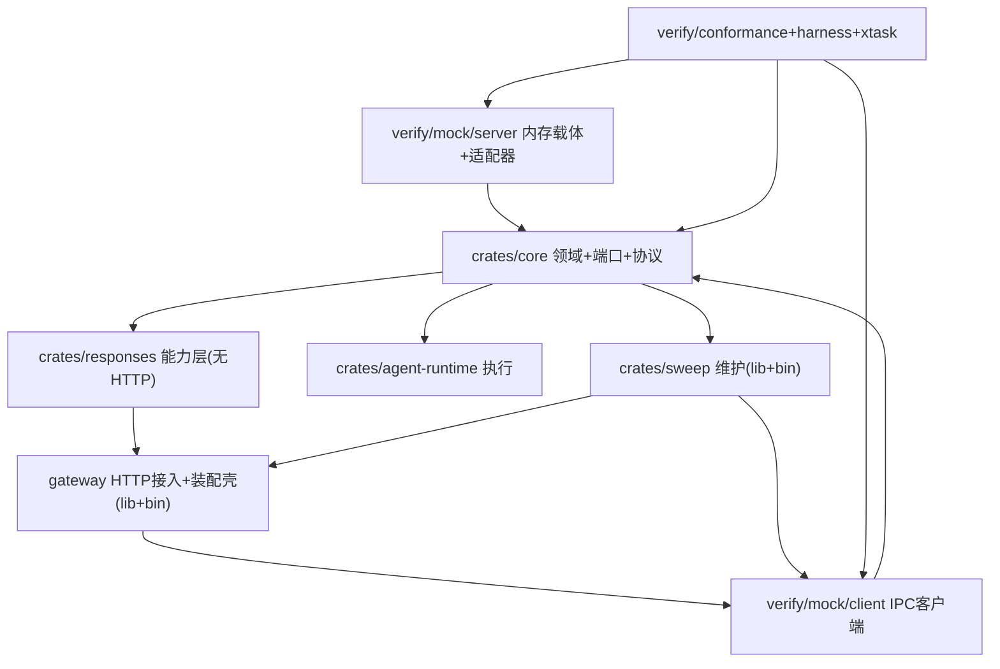

## 产品概述

对 nova-chat 项目做一次大规模结构重构，将当前的「横切分层」组织调整为「按领域特性 + 明确生产/验证边界」的组织，使领域概念与其数据结构共置、HTTP 接入层回归 gateway、内存 mock 与验证设施归入 verify。

## 核心调整

- **core 内部按领域重组**：把集中横切的 `ids.rs` 拆散到 response / conversation / shared 等领域模块；领域模型与对应数据结构共置。`ports` 端口层保留独立横切（它是依赖倒置 DIP 的抽象边界，`check-deps` 门禁守护的对象）。
- **能力层与 HTTP 接入层分离**：`nova-responses` 中的 `service` 能力层（无 axum）留在 `crates/responses`；`routes` / `sse` / `auth` / `shutdown` / `state` 等强耦合 gateway 的 HTTP 接入层移入顶层 `gateway` crate（lib + bin 装配壳），使业务可独立集成能力层、生产 REST 进程可复用 HTTP 层。
- **sweep 独立**：`sweeper` 维护逻辑从 `nova-responses` 抽出到 `crates/sweep`（lib），`sweep` bin 退化为薄壳，gateway 的配置门控 sweep 改为依赖 sweep lib。
- **mock 归 verify**：`adapters-mem`（含 `mem-server` 载体进程）→ `verify/mock/server`，`adapters-mem-client` → `verify/mock/client`，`agentd-mock` → verify 下的 mock，明确「内存载体是验证替身」的边界（D17）。
- **验证设施归拢**：`conformance` / `harness` / `xtask` / `scenarios` / `config` / `reports` / `sdk-compat` / `verifier` 统一归入 `verify/`（其中 verifier → `verify/web`）。
- **移除 reconnect 孤儿类型**：删除 `JitteredBackoff`（零生产消费者，重连退避消费者是前端 SDK、不在本仓库）及其 conformance 验证；顺带修正 FR-35 覆盖错位（FR-35 真实含义是 reap 收口，已由 L1 `reap-closes-lost-claim.yaml` 正确覆盖），并从服务端 `coverage_baseline` 移除 INV-33（客户端侧需求，不做 deferred）。

## 视觉/边界效果

重构后项目呈现清晰三层：`crates`（领域/能力/执行/维护）、`gateway`（HTTP 接入 + 装配壳）、`verify`（mock + 测试 + 编排 + web 手动验证）。产品闭包与验证闭包仅在 `core` 处相交，验证替身（mem）与生产载体（sql/redis）物理隔离。

## 技术栈选择

- 语言/构建：Rust 2021 + Cargo workspace（复用现有技术栈，不引入新依赖）。
- 运行库：tokio / axum / tower-http / tracing / clap 等保持现状。
- 本次为纯结构重构：不改变运行时行为、不改 trait 语义、不引入新架构模式。

## 实现策略

采用**自底向上、每步保持可编译**的重构顺序，避免一次性大爆炸：

1. 先做独立的 `reconnect` 移除（含 conformance case、coverage baseline），单独验证。
2. 重组 `core` 模块（最底层），并同步更新所有依赖 core 的上层 crate 的 import 路径。
3. 拆分 `nova-responses`：能力层留在 `crates/responses`，HTTP 层迁入 `gateway`（lib + bin）。
4. 抽出 `sweep` lib；随后将 mem mock、验证设施归入 `verify/`。
5. 最后更新 workspace 清单与 `xtask` 硬编码门禁，跑通全量验证。

关键权衡：`ports` 保留横切是刻意的（DIP 抽象边界），不随领域共置；`protocol` 保留为「对外契约」关注点，内部仅按领域细分，不整体拆散——避免破坏 FR-23 可发布协议子集的单一数据源。

## 实现要点

- **import 追踪**：每个模块移动后，必须用全库搜索更新所有 `use` / `pub use` 路径，尤其 `nova_responses_core::` 前缀在 responses / agent-runtime / sweep / mock / conformance / harness 中的引用。
- **门禁同步**：`xtask/src/main.rs` 的 `check_deps()` 与 `coverage_baseline()` 含大量硬编码（crate 名、路径、requirement id），必须随移动同步更新，否则门禁会真空通过或误报。
- **INV-33 移除**：从 `coverage_baseline()` 删除 `"INV-33"`，并在注释中标注「客户端侧需求，不在服务端验证范围」；`check_coverage_baseline_tracks_invariants` 会校验 baseline 与 `invariants.md` 的对应关系，需确认 INV-33 在 invariants.md 中的状态处理方式（标记为客户端侧或从服务端基线豁免）。
- **FR-35 保留**：FR-35 仍在 baseline 中，由 L1 `reap-closes-lost-claim.yaml` 覆盖，删除 reconnect-backoff case 后不得误删 FR-35。
- **package 命名**：产品 crate 名尽量保持（`nova-responses-core` / `nova-responses` / `nova-responses-gateway` / `nova-responses-sweep`），减少门禁改动；验证 crate 按新目录改名（如 `adapters-mem` → `mock-server`、`adapters-mem-client` → `mock-client`），并同步 `FORBIDDEN_IN_CORE`、`check_service_and_gateway_boundaries` 中的硬编码列表。
- **verifier README 修正**：`verifier/README.md` 已漂移到 D25 前拓扑（agentd/completions-http），归入 `verify/web` 时同步修正为当前 agent-runtime / mock 拓扑。

## 架构设计

目标依赖方向保持既有 D 决策不变（D14 core 不依赖 adapter/ingress、D25 能力层抽离、D27/D28 conversation 与 response 聚合关系）。



## 目录结构

```
nova-chat/
├── Cargo.toml                    # [MODIFY] workspace members / dependencies 重写
├── crates/
│   ├── core/                     # [MODIFY] 原 nova-responses-core，内部按领域重组
│   │   └── src/
│   │       ├── lib.rs
│   │       ├── response/         # [NEW] ResponseId、StoredResponse、ResponseEvent、ResponseStatus、Usage
│   │       ├── conversation/     # [NEW] ConversationId、Conversation、ConversationEvent
│   │       ├── context/          # [NEW] ContextStore 端口、ResolvedContext、ChainLimits
│   │       ├── event_log/        # [NEW] ResponseEventLog 端口
│   │       ├── integrity/        # [NEW] ContentIntegrity 端口、HmacSha256Integrity、canonical
│   │       ├── protocol/         # [MODIFY] 对外协议子集，内部按领域细分
│   │       ├── ports/            # [KEEP] 保留独立横切（DIP 边界）
│   │       ├── shared/           # [NEW] TenantId、NodeTag、AgentId、Attempt、IdempotencyKey
│   │       ├── error.rs
│   │       └── provenance.rs
│   ├── responses/                # [MODIFY] 原 nova-responses 能力层，移除 HTTP 模块
│   │   └── src/                  # service/、config.rs、clock.rs、metrics.rs、error.rs、lib.rs
│   ├── agent-runtime/            # [KEEP] 执行运行时
│   └── sweep/                    # [MODIFY] lib（SweepDeps/spawn/tick）+ bin 薄壳
│       └── src/                  # lib.rs、main.rs
├── gateway/                      # [NEW] HTTP 接入层 + 装配壳（lib + bin）
│   └── src/
│       ├── lib.rs                # [NEW] 导出 routes/sse/auth/shutdown/state
│       ├── routes/               # 原 nova-responses/src/routes
│       ├── sse.rs                # 原 nova-responses/src/sse.rs
│       ├── auth.rs               # 原 nova-responses/src/auth.rs
│       ├── shutdown.rs           # 原 nova-responses/src/shutdown.rs
│       ├── state.rs              # 原 nova-responses/src/state.rs
│       ├── config.rs             # HTTP 侧配置
│       └── main.rs               # 装配壳，挂 mock-client，起 HTTP
└── verify/
    ├── mock/
    │   ├── server/               # [MODIFY] 原 adapters-mem + mem-server（lib + bin）
    │   ├── client/               # [MODIFY] 原 adapters-mem-client
    │   └── agentd/               # [MODIFY] 原 testing/agentd-mock
    ├── conformance/              # [MODIFY] 原 testing/conformance，删 reconnect-backoff case
    ├── harness/                  # [MODIFY] 原 testing/harness
    ├── xtask/                    # [MODIFY] 原 xtask，更新硬编码门禁
    ├── scenarios/                # [MOVE] 原 testing/scenarios
    ├── config/                   # [MOVE] 原 testing/config
    ├── reports/                  # [MOVE] 原 testing/reports
    ├── sdk-compat/               # [MOVE] 原 testing/sdk-compat
    └── web/                      # [MODIFY] 原 verifier（index.html、serve.sh、README）
```

## 关键接口约定

- `crates/responses` 保持能力层纯净：只依赖 `nova-responses-core` 端口，禁止依赖 axum / tower-http / 任何 adapter（沿用 D25 与现有 check_deps 语义）。
- `gateway` 是唯一 backend 注入点：`mock-client` 只在 `gateway` 与 `sweep` 的装配处被引用，lib 层通过端口 trait 对象消费。
- `verify/mock/server` 的 `lib` 供 `conformance` / `harness` / `mem-server` bin 复用；`verify/mock/client` 供 `gateway` / `sweep` 装配使用。