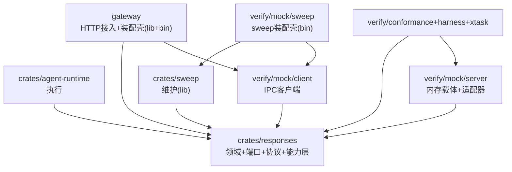

## 产品概述

对 nova-chat 工作区做一次大规模分层重构，将当前的「横切分层 + 生产/验证混杂」调整为「按领域特性组织 + 明确生产/验证边界」，不改变任何运行时行为与 trait 语义。

## 核心调整

- **core 并入 responses**：`crates/core`（领域类型 + 端口 + 协议子集）的全部内容合并进 `crates/responses`，conversation 作为 response 聚合的子模块，非独立 crate。
- **领域数据结构共置**：把横切的 `ids.rs` 按领域拆散到 response / conversation / shared 等模块；`ports` 端口层保留独立横切（DIP 抽象边界）。
- **能力层与 HTTP 接入层分离**：responses 只保留能力层（service，无 axum）；routes / sse / auth / shutdown / state 等强耦合网关的 HTTP 接入层迁入顶层 `gateway`（lib + bin 一体）。
- **sweep 拆开**：sweeper 维护逻辑留在 `crates/sweep`（纯 lib），sweep 的 bin 装配壳（挂 mock-client）归 `verify/mock/sweep`。
- **mock 归 verify**：adapters-mem（含 mem-server）→ verify/mock/server，adapters-mem-client → verify/mock/client，agentd-mock → verify/mock/agentd，明确内存载体是验证替身。
- **验证设施归拢**：conformance / harness / xtask / scenarios / config / reports / sdk-compat 归入 verify/，verifier → verify/web。
- **移除 reconnect 孤儿**：删除 `JitteredBackoff` 及其 conformance 验证；修正 FR-35 覆盖错位（已由 L1 场景正确覆盖），INV-33 从服务端 coverage_baseline 移除并标注为客户端侧需求。
- **移除 clock 命名封装**：`system_now()` / `system_now_ms()` 只有一种真实墙钟实现，内联到 gateway / sweep 两个装配点，不保留库 API；时钟注入 seam（`Arc<dyn Fn() -> u64 + Send + Sync>`）与虚拟时钟 `MemClock` 保留。

## 技术栈

- Rust 2021 + Cargo workspace，复用现有 tokio / axum / tower-http / tracing / clap / serde 依赖，不引入新依赖。
- 纯结构重构：不改变运行时行为、不改变 trait 语义、不引入新架构模式。

## 实现策略

采用**自底向上、每步保持可编译**的顺序，避免一次性大爆炸：

1. 先做独立的 reconnect 移除（含 conformance case、coverage_baseline、invariants.md），单独验证。
2. 将 core 全部内容合并进 responses，按领域重组模块，统一 package 名为 `nova-responses`，同步更新所有依赖 crate 的 import 与 Cargo.toml。
3. 把 HTTP 接入层从 responses 剥离到 gateway（lib + bin）。
4. 把 sweeper 逻辑从 responses 抽出到 crates/sweep（纯 lib），sweep bin 装配壳迁到 verify/mock/sweep。
5. 把 mem mock 归入 verify/mock。
6. 把验证设施归拢到 verify/。
7. 更新 workspace 清单与 xtask 硬编码门禁，跑通全量验证。

关键权衡：`ports` 保留横切是刻意的（DIP 边界）；`protocol` 保留为对外契约关注点，内部按领域细分；`system_now` 工厂内联但 `Arc<dyn Fn() -> u64 + Send + Sync>` 时钟 seam 保留（D15，测试注入 MemClock）。

## 架构设计

依赖方向为「依赖方 → 被依赖方」，responses 是唯一领域基础 crate，不依赖任何执行 / 维护 / 网关 / mock / adapter 层。



## 目录结构

```
nova-chat/
├── Cargo.toml                    # [MODIFY] workspace members / dependencies 重写
├── crates/
│   ├── responses/                # [MODIFY] 原 core 全部 + 原 nova-responses 能力层
│   │   └── src/
│   │       ├── lib.rs
│   │       ├── response/         # ResponseId、StoredResponse、ResponseEvent、ResponseStatus、Usage
│   │       ├── conversation/     # ConversationId、Conversation、ConversationEvent（response 子集）
│   │       ├── ledger/           # ResponseLedger 端口
│   │       ├── context/          # ContextStore 端口 + ResolvedContext + ChainLimits
│   │       ├── event_log/        # ResponseEventLog 端口
│   │       ├── integrity/        # ContentIntegrity 端口 + HmacSha256Integrity + canonical
│   │       ├── protocol/         # 对外协议子集，内部按领域细分
│   │       ├── shared/           # TenantId、NodeTag、AgentId、Attempt、IdempotencyKey
│   │       ├── service/          # ResponsesService、ConversationsService
│   │       └── error.rs、provenance.rs、config.rs、metrics.rs（无 clock.rs）
│   ├── agent-runtime/            # [KEEP] 执行运行时，依赖 responses 端口
│   └── sweep/                    # [MODIFY] 纯 lib（SweepDeps/spawn/tick），无 bin
├── gateway/                      # [MODIFY] HTTP 接入层 + 装配壳（lib + bin）
│   └── src/                      # lib.rs、routes/、sse.rs、auth.rs、shutdown.rs、state.rs、config.rs、main.rs
└── verify/
    ├── mock/
    │   ├── server/               # [MODIFY] 原 adapters-mem + mem-server（lib + bin，含 MemClock）
    │   ├── client/               # [MODIFY] 原 adapters-mem-client（lib）
    │   ├── agentd/               # [MODIFY] 原 testing/agentd-mock（lib + bin）
    │   └── sweep/                # [NEW] sweep bin 装配壳（挂 mock-client）
    ├── conformance/              # [MODIFY] 原 testing/conformance，删 reconnect-backoff case
    ├── harness/                  # [MODIFY] 原 testing/harness
    ├── xtask/                    # [MODIFY] 原 xtask，更新硬编码门禁
    ├── scenarios/ config/ reports/ sdk-compat/   # [MOVE] 原 testing 下迁入
    └── web/                      # [MODIFY] 原 verifier（index.html、serve.sh、README）
```

## 实现要点

- **import 追踪**：core 并入 responses 后，`nova_responses_core::` 前缀在 agent-runtime / sweep / gateway / mock / conformance / harness 中的引用需全库搜索更新为 `nova_responses::`，并同步各 Cargo.toml 依赖声明。
- **clock 内联**：删除 `nova-responses/src/clock.rs` 与 lib.rs 的 `pub use clock::system_now`；gateway main.rs 与 verify/mock/sweep main.rs 直接内联 `Arc::new(|| SystemTime::now().duration_since(UNIX_EPOCH)…)`。`MemClock`（adapters/mem/src/clock.rs）随 mock 归 verify/mock/server，其注释中「production timestamp function is `nova_responses::system_now`」同步微调。
- **package 命名**：crates/responses package 名统一为 `nova-responses`；验证 crate 按新目录改名（adapters-mem → mock-server、adapters-mem-client → mock-client），并同步 xtask 中 FORBIDDEN 列表。
- **门禁同步**：xtask/src/main.rs 的 check_deps 与 coverage_baseline 含大量硬编码（crate 名、路径、requirement id）。合并后「nova-responses-core」概念消失，需改写为 responses；`check_execution_claims_globally_through_the_port` 读 `core/src/ports/ledger.rs` 的路径改为 responses 下 ledger 路径；coverage_baseline 删 INV-33、保留 FR-35。
- **invariants.md 处理**：INV-33 从 baseline 移除后，需在 docs/architecture/invariants.md 将 INV-33 标记为「客户端侧需求」或从服务端基线豁免，否则 `check_coverage_baseline_tracks_invariants` 会误报缺失。
- **procs 路径更新**：sweep bin 归 verify/mock/sweep 后，xtask 的 procs up/down 启动路径与 pidfile 命名需同步更新（当前起 `nova-responses-sweep` 进程）。
- **保持既有 D 决策**：D14（responses 不依赖 adapter/ingress）、D15（时钟 seam 保留）、D17（mem 是验证替身）、D25（能力层抽离、执行走端口）、D27/D28（conversation 与 response 聚合）不被破坏。