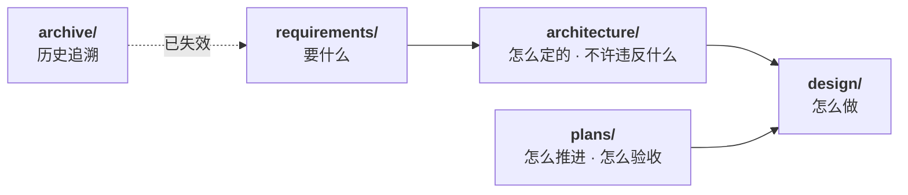

# nova-tasks 文档

分布式任务系统：多区域提交 · 容量感知调度 · 分布式执行 · 跨区域流式观测与协作。

---

## 文档地图

| 目录 | 角色 | 变更频率 |
|------|------|---------|
| [`requirements/`](./requirements/) | **要什么**——需求与参数，唯一依据 | 低（需求）/ 中（参数） |
| [`architecture/`](./architecture/) | **怎么定的**——决策记录与设计不变量 | 低 |
| [`design/`](./design/) | **怎么做**——按步骤展开的设计 | 高 |
| [`plans/`](./plans/) | **怎么推进**——迭代表、验收命令、三级详略 | 高（随迭代） |
| [`archive/`](./archive/) | 历史文档，**不作为设计依据** | 冻结 |

---

## 文档清单

### requirements/ — 需求基线

| 文档 | 内容 |
|------|------|
| [`spec.md`](./requirements/spec.md) | 需求规格：FR / CR / 质量需求、冲突矩阵、范围界定 |
| [`parameters.md`](./requirements/parameters.md) | 量化参数：业务锚点（含 A6）、守恒关系、导出量、SLO、适用区间 |
| [`task-profiles.md`](./requirements/task-profiles.md) | 三类任务质性画像；数值以 parameters 为准 |

> **拆分原因**：需求相对稳定，参数需随实测校准。二者变更节奏不同。

### architecture/ — 决策与约束

| 文档 | 内容 |
|------|------|
| [`decisions.md`](./architecture/decisions.md) | 架构决策（D1~D18）及其理由、代价、备选方案 |
| [`invariants.md`](./architecture/invariants.md) | 设计不变量（INV-1~INV-37），违反任一即某条 CR 不成立；§3 含连接会话 vs Session 用语澄清 |

### design/ — 分步设计

路线图与规范见 [`design/README.md`](./design/README.md)。

| 文档 | 性质 | 说明 |
|------|------|------|
| [`01-claim-and-match.md`](./design/01-claim-and-match.md) | ✅ **实现依据** | 领取与匹配 |
| [`drafts/observation.md`](./design/drafts/observation.md) | ⛔ **草稿，禁止实现** | 须按 D18 改写（跨区回源分期、Session UX、热→冷） |
| [`drafts/conversation.md`](./design/drafts/conversation.md) | ⛔ **草稿，禁止实现** | 对话层（Session 日志 / Turn=Task），落实 D18 |
| [`drafts/stream-channel-adapters.md`](./design/drafts/stream-channel-adapters.md) | 📋 **选型对比** | StreamChannel：Redis Streams vs NATS JetStream（对齐 D18） |
| [`drafts/security.md`](./design/drafts/security.md) | ⚠️ **草稿，禁止实现** | 鉴权素材，缺 DSL 沙箱防护 |

> **编号按完成顺序分配**，因此 `design/` 下的编号永远连续。未开始的步骤不预留文件与编号。
> `drafts/` 内为未对齐基线的素材，改写完成后取下一序号移出。

### plans/ — 落地推进

| 文档 | 内容 |
|------|------|
| [`plans/README.md`](./plans/README.md) | 迭代总览、三级详略规则、双轨自动化入口 |
| [`plans/iteration-0.md`](./plans/iteration-0.md) | 当期（展开级）迭代文档 |
| [`plans/conversation-and-stream.md`](./plans/conversation-and-stream.md) | D18 后对话层 / StreamChannel 工作包（不插队） |

> 人工模拟验收控制台：仓库根目录执行 `just sim`，浏览器打开 http://127.0.0.1:19090 （`nova-sim`）。

> `plans/` 是执行视图，**不**另开 `roadmap/` / `verification/` 主干，避免与 `design/README.md` §3 形成第三份路线图。

---

## 阅读路径

| 目的 | 顺序 |
|------|------|
| **首次了解系统** | `requirements/spec.md` §1~§4 → `architecture/decisions.md` 索引 → `design/README.md` |
| **参与设计评审** | `architecture/invariants.md`（必读）→ 对应 `design/` 文档 |
| **评估容量与选型** | `requirements/parameters.md` §4 §7 · `task-profiles.md` |
| **质疑某项决策** | `architecture/decisions.md` 对应条目（含备选方案与否决理由） |
| **实现某个模块** | 对应 `design/` 文档 + `architecture/invariants.md` 相关小节 |
| **推进与验收** | `plans/README.md` → 当期 `iteration-*.md` → `just verify` |

---

## 核心约束速览

新加入者最容易踩的条目：

| # | 约束 | 出处 |
|---|------|------|
| 1 | **领取必须是单点条件更新**，不可先查后改 | INV-1 |
| 2 | **提交幂等不得依赖 TTL 窗口**，须「存在即拒绝」 | INV-2 |
| 3 | **容量核算不得采信设备自报** | INV-3 / D10 |
| 4 | **尝试序号严格单调，永不重置**（四处语义共用） | INV-5 |
| 5 | **一切重建起点必须记录序号** | INV-13 |
| 6 | **每个非终态都必须有超时出口**，否则任务会永久停滞 | INV-34 |
| 7 | **领取路径与输出路径不共用承载**（吞吐差数个数量级） | D11 |
| 8 | **承载技术端口化**；具体产品仅为适配器 | D14 |
| 9 | **本机 L0–L2 验证不依赖 Docker** | D17 |
| 10 | **任务类型不进核心流程分支** | D16 |
| 11 | **多轮对话：Session 可回放日志 + Turn=Task；连接粘性禁止** | D18 / INV-12 |

---

## 文档纪律

| 规则 | 说明 |
|------|------|
| 需求不引用设计 | `requirements/` 自闭环，只描述「要什么」 |
| 设计引用需求编号 | 每项设计标注其满足的 FR/CR 编号 |
| 不变量集中管理 | 跨步骤的「不可违反」条目统一进 `invariants.md` |
| 决策不删改 | 变更时新增 `SUPERSEDED BY` 记录，保留追溯链 |
| 归档不被引用 | 现行文档不得引用 `archive/`；如需其结论，先提取到现行文档 |
| 规划三级详略 | 当期展开、下一期入口、更远标题；见 `plans/README.md` |
| 图样统一 | 流程图使用 `%%{init: {"flowchart": {"curve": "basis"}}}%%` 曲线连线 |
