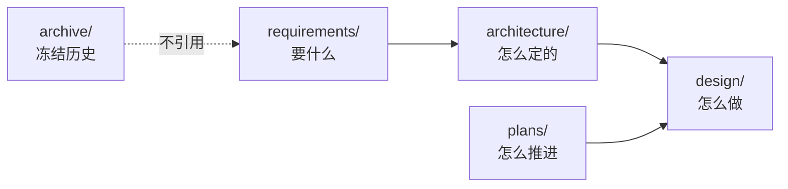

# nova-sessions 文档

Session 级可回放消息服务（Nova 子服务）：建会话 · 异步 Turn · 跨 Turn 流式观测与续订。

---

## 文档地图

| 目录 | 角色 |
|------|------|
| [`requirements/`](./requirements/) | 需求与参数（v2，Session 流） |
| [`architecture/`](./architecture/) | ADR、不变量、推导文 |
| [`design/`](./design/) | 正式设计 + 少量草稿 |
| [`plans/`](./plans/) | 当期推进与验收 |
| [`archive/`](./archive/) | **冻结**；不得作为实现依据 |

---

## 清单

### requirements/

| 文档 | 内容 |
|------|------|
| [`spec.md`](./requirements/spec.md) | FR / CR / 范围界定 |
| [`parameters.md`](./requirements/parameters.md) | 锚点、SLO、适用区间 |

### architecture/

| 文档 | 内容 |
|------|------|
| [`README.md`](./architecture/README.md) | 现行架构速览 |
| [`decisions.md`](./architecture/decisions.md) | ADR（D19 为产品范围） |
| [`invariants.md`](./architecture/invariants.md) | 不可违反条目 |
| [`arc.md`](./architecture/arc.md) | 推导文（非实现依据） |

### design/

| 文档 | 内容 |
|------|------|
| [`01-session-stream.md`](./design/01-session-stream.md) | ✅ 实现依据：gateway + 流 |
| [`02-verification.md`](./design/02-verification.md) | ✅ Trace + Oracle 验证 |
| [`drafts/stream-channel-adapters.md`](./design/drafts/stream-channel-adapters.md) | Redis vs JetStream 选型 |
| [`drafts/security.md`](./design/drafts/security.md) | 鉴权后续素材 |

### plans/

| 文档 | 内容 |
|------|------|
| [`README.md`](./plans/README.md) | 迭代表 |
| [`current.md`](./plans/current.md) | 当期展开级 |

---

## 阅读路径

| 目的 | 顺序 |
|------|------|
| 首次了解 | `requirements/spec.md` → `architecture/README.md` → `design/01-session-stream.md` |
| 质疑决策 | `architecture/decisions.md`（先看索引里 ✅ 生效项） |
| 实现 / 验收 | `design/01` + `plans/current.md` → `just verify` / `just sim` |

---

## 核心约束

| # | 约束 | 出处 |
|---|------|------|
| 1 | 主资源是 **Session**；Turn = 一轮生成 | D19 |
| 2 | 服务身份是 **`nova-sessions-gateway`**（产品名 nova-sessions） | D19 |
| 3 | 游标 `(session_id, last_seq)`；无 sticky | INV-12 |
| 4 | meta ≠ stream | D11 |
| 5 | 热 miss 明确报错；有效 Session 可订 | INV-14 |
| 6 | attempt fence | INV-5/6 |
| 7 | 一期 POST+SSE 同进程 | D19 |
| 8 | L0–L2 不依赖 Docker | D17 |

---

## 纪律

| 规则 | 说明 |
|------|------|
| 需求不引用设计 | `requirements/` 自闭环 |
| 设计引用 FR/CR/INV | 可追溯验收 |
| ADR 不删改正文 | 用 `SUPERSEDED BY` |
| 归档不被现行引用 | 需结论时先提取到现行文档 |
| 图样 | `%%{init: {"flowchart": {"curve": "basis"}}}%%` |
