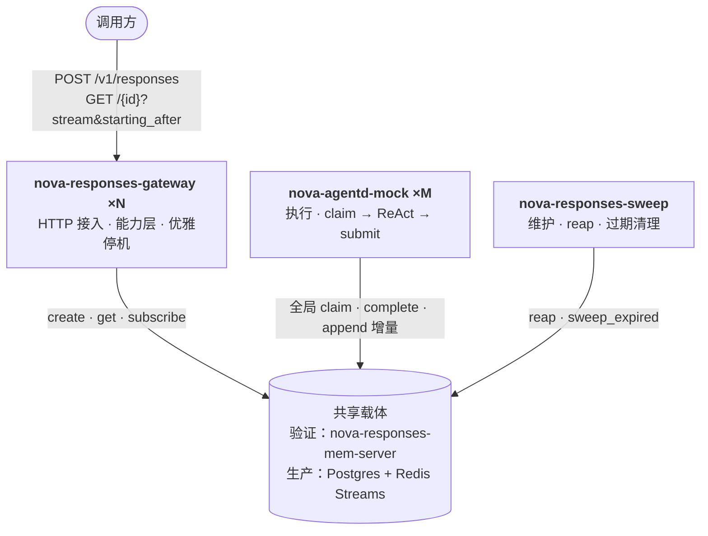

# 架构速览

> 权威决策见 [`decisions.md`](./decisions.md)；不变量见 [`invariants.md`](./invariants.md)；逐组件核对的完整复验图见 [`../design/00-architecture-review.md`](../design/00-architecture-review.md)

---

## 拓扑

两种**载体**（mem / sql）共享**同一进程拓扑**：gateway（接入）+ `nova-agentd-mock`（执行）+ `nova-responses-sweep`（维护）+ 独立载体。唯一差异是载体。

节点**对等**：每个 gateway 都能创建 / 查询 / 订阅，无权威节点、无节点间转发——任意节点直读共享载体。

---

## 组件

| 组件 | 职责 | 关键约束 |
|---|---|---|
| `nova-responses-gateway` | HTTP 接入、三种响应模式、优雅停机 | **薄装配**；后端是编译期 feature（mem / sql），`check-deps` 强制依赖 `optional` |
| `nova-responses` | 能力层 + HTTP 层 + 后台维护（sweeper / shutdown） | 只依赖 core 端口，不依赖任何 adapter |
| `nova-agentd-mock` | 执行进程：全局 claim → ReAct → submit | 经端口连共享载体，零 HTTP；`nova-agent-runtime` 无 socket/DB 依赖 |
| `nova-responses-sweep` | 独立维护进程：reap / 过期清理 | 共享载体下单一收口方 |
| `nova-responses-core` | 领域类型、协议封闭子集、端口 trait、规范化与 HMAC | 不依赖任何适配器（`check-deps` 强制） |
| `adapters-mem` + `adapters-mem-client` | 验证载体：`mem-server` 数据本体 + 客户端 RPC 桩 | 不持久化；L0/L1 进程内直用，L2 经 mem-server 共享 |
| `adapters-sql` + `adapters-event-log-redis` | 生产载体（Postgres + Redis Streams） | — |
| `adapters-completions-mock` | Echo / Scripted 调度器，供验证 | 无模型、无 IO |

---

## 端口

| 端口 | 职责 | 显著缺失的能力 |
|---|---|---|
| `ResponseEventLog` | per-response 有界缓冲、`starting_after` 读取、终态关闭 | **无 Gap / 无 read_from / 无冷层** |
| `ResponseLedger` | 生命周期、原子领取（全局 claim）、幂等、心跳收口（reap）、部分用量 | **无会话锁 / 无 Busy 结果** |
| `ContextStore` | 条目持久化、快照读取与记录级删除、探活 | 快照结果**绝不含 instructions** |
| `ContentIntegrity` | 签名 / 常数时间校验 | 仅防篡改，非不可否认性 |
| `Clock` / `MetricsSink` | 原样保留 | — |

---

## 相对上一形态的收敛

| 原有 | 现在 |
|---|---|
| `StreamChannel` + `StreamGap` + 冷层 | `ResponseEventLog`（有界缓冲 + 显式过期，无恢复路径） |
| `MetaStore` + `SessionLock` | `ResponseLedger`（无会话锁） |
| `SnapshotStore` | **整体删除**（开屏能力取消） |
| `SessionSnapshot.bubbles` | 升格为 `ContextStore`，脱离流式序号协议 |
| 权威区 / 边缘区 + 只读镜像 | 对等节点 + 共享载体直读（无转发） |
| per-session 1 基序号 | **per-response 0 基连续** |
| 网关内嵌执行 | **独立执行进程** `nova-agentd-mock`（D25） |
| 进程内在途缓冲 | **共享载体**在途缓冲（D25） |
| — | **新增** `ContextStore` / `ContentIntegrity` |

---

## 三条最易被误改的约束

1. **输出条目不由事件流回放派生**（INV-48）。若为「少一次写入」而改成回放派生，事件日志将被迫成为持久化真相源，整个存储边界失守。
2. **服务端信封事件不带 `attempt`**。否则终态事件会被自身栅栏拒绝，流永不终止。
3. **claim 全局（无 node filter），无节点间转发**。链亲和路由与转发子系统已整体移除——共享载体下任意节点直读，`is_shared()` 能力位也已随之删除。
