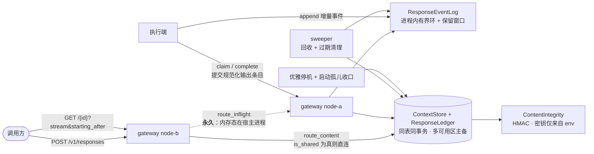

# 架构速览

> 权威决策见 [`decisions.md`](./decisions.md)；不变量见 [`invariants.md`](./invariants.md)

---

## 拓扑

节点**对等**：每个都能创建、每个都跑自己的 sweeper，无权威节点。

---

## 组件

| 组件 | 职责 | 关键约束 |
|---|---|---|
| `nova-responses-gateway` | HTTP 接入、三种响应模式、两条转发路径、sweeper、优雅停机 | 全部端口以 trait 对象持有，不感知后端 |
| `nova-responses-core` | 领域类型、协议封闭子集、端口 trait、规范化与 HMAC | 不依赖任何适配器（`check-deps` 强制） |
| `adapters-mem` | L0–L2 验证基底 | **不持久化、不跨进程**；`is_shared()` 为 `false` |
| `adapters-sql` | 生产承载 + L3 | `is_shared()` 为 `true` ⇒ 直连且链亲和退役 |
| 执行端 | 领取、写事件、**终态提交规范化输出** | 输出不由事件流回放派生（INV-48） |

---

## 端口

| 端口 | 职责 | 显著缺失的能力 |
|---|---|---|
| `ResponseEventLog` | per-response 有界环、`starting_after` 读取、终态关闭 | **无 Gap / 无 read_from / 无冷层** |
| `ResponseLedger` | 生命周期、原子领取、幂等、孤儿收口、部分用量 | **无会话锁 / 无 Busy 结果** |
| `ContextStore` | 条目持久化、快照读取与记录级删除、`is_shared()`、探活 | 快照结果**绝不含 instructions** |
| `ContentIntegrity` | 签名 / 常数时间校验 | 仅防篡改，非不可否认性 |
| `Clock` / `MetricsSink` | 原样保留 | — |

---

## 相对上一形态的收敛

| 原有 | 现在 |
|---|---|
| `StreamChannel` + `StreamGap` + 冷层 | `ResponseEventLog`（有界环 + 显式过期，无恢复路径） |
| `MetaStore` + `SessionLock` | `ResponseLedger`（无会话锁） |
| `SnapshotStore` | **整体删除**（开屏能力取消） |
| `SessionSnapshot.bubbles` | 升格为 `ContextStore`，脱离流式序号协议 |
| 权威区 / 边缘区 + 只读镜像 | 对等节点 + 单一定向转发 |
| per-session 1 基序号 | **per-response 0 基连续** |
| — | **新增** `ContextStore` / `ContentIntegrity` |

---

## 三条最易被误改的约束

1. **输出条目不由事件流回放派生**（INV-48）。若为「少一次写入」而改成回放派生，事件日志将被迫成为持久化真相源，整个存储边界失守。
2. **链亲和路由必须随共享存储退役**。否则长会话把流量钉死单节点。由 `is_shared()` 自动完成，不要手写条件。
3. **服务端信封事件不带 `attempt`**。否则终态事件会被自身栅栏拒绝，流永不终止。
