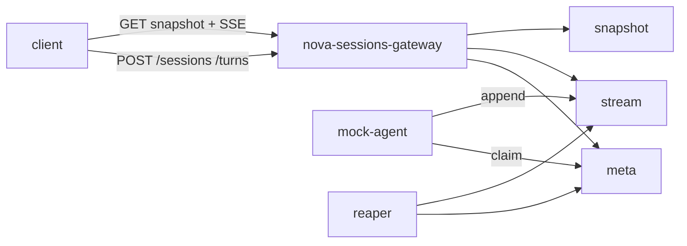

# 架构

> 产品：`nova-sessions`（D19）。推导过程见 [`arc.md`](./arc.md)（**非**实现依据）。

## 现行形态（一期）

| 组件 | 职责 |
|------|------|
| **nova-sessions-gateway** | 唯一对外 HTTP 进程：建 Session、发 Turn、快照、SSE；外区写转发、读回源 |
| **nova-sessions-core** | 领域类型 + meta/stream/snapshot 协议 |
| **adapters**（如 mem） | 协议实现；与 core 分仓 |
| **meta / stream / snapshot** | 逻辑承载（一期同进程注入） |
| **mock-agent / reaper** | pull 写流；失联/上界回收 + fence |

**不做**：容量匹配、任务池、独立 Gateway/Realtime 两服务、一期 Mirror。

## 生效决策（速览）

先读这些，再翻完整 ADR 正文：

| # | 要点 |
|---|------|
| **D19** | 产品 = Session 流；`nova-sessions-gateway` 单门面；POST+SSE 同进程 |
| **D11** | meta ≠ stream（存储分路径） |
| **D18**（继承） | Session 日志、快照、游标、热→冷、跨区回源、Redis 默认 |
| **D8 / D4** | 单域权威；Turn claim 不跨区 |
| **D14 / D15 / D17** | 端口化；分层验证；L0–L2 无 Docker |

已废止的任务系统决策（D1/D2/D3/D5…）仍保留在 [`decisions.md`](./decisions.md) 供追溯，索引标 ⛔。

## 不变量

见 [`invariants.md`](./invariants.md)：claim 原子性、attempt fence、游标协议、热 miss、meta/stream 分离等。
