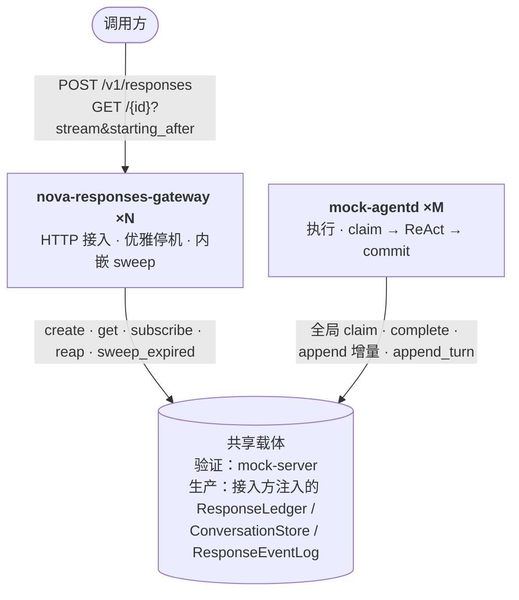

# 架构速览

> 权威决策见 [`decisions.md`](./decisions.md)；不变量见 [`invariants.md`](./invariants.md)；逐组件核对的完整复验图见 [`../design/00-architecture-review.md`](../design/00-architecture-review.md)

---

## 拓扑

两种**载体**（mem / 生产存储）共享**同一进程拓扑**：gateway（接入 + 内嵌 sweep）+ `mock-agentd`（执行）+ 独立载体。唯一差异是载体。

节点**对等**：每个 gateway 都能创建 / 查询 / 订阅，无权威节点、无节点间转发——任意节点直读共享载体。

---

## 组件

| 组件 | 职责 | 关键约束 |
|---|---|---|
| `nova-responses-gateway`（`gateway/`） | HTTP 接入、三种响应模式、优雅停机 | **薄装配**；只依赖端口与能力层，`check-deps` 强制边界 |
| `nova-responses`（`crates/responses`） | 领域类型、协议封闭子集、端口 trait、规范化、service 能力层（含 sweeper） | 只依赖端口，不依赖任何 adapter（`FORBIDDEN_IN_CORE` 强制） |
| `nova-agent-runtime`（`crates/agent-runtime`） | 编排：全局 claim → 组装 → commit | 经端口连共享载体，零 HTTP/DB；`check-deps` 拒绝 `reqwest`/`hyper`/`axum` |
| `mock-agentd`（`verify/mock/agentd`） | 执行进程：ReAct loop + Scheduler + ToolExecutor | 无模型、无持久化；completions 出站形状在此 |
| `mock-server` + `mock-client`（`verify/mock/`） | 验证载体：数据本体 + `/rpc` 数据面 + 控制面 + 客户端 RPC 桩 | 不持久化；L0/L1 进程内直用，L2 经 mock-server 共享 |

---

## 端口

| 端口 | 职责 | 显著缺失的能力 |
|---|---|---|
| `ResponseEventLog` | per-response 有界缓冲、`starting_after` 读取、终态关闭、**TTL 内回放重建 response 对象**（D30） | **无 Gap / 无 read_from / 无冷层** |
| `ResponseLedger` | 生命周期、原子领取（全局 claim）、幂等、心跳收口（reap）、部分用量 | **无会话锁 / 无 Busy 结果** |
| `ConversationStore` | 会话 CRUD、链尾指针、轮次锁、事件流，**持久物化主快照**（`read_snapshot` / `append_turn`，D30） | 官方 `items` 子资源不暴露；快照不逐条增删 |
| `ContentIntegrity` | 签名 / 常数时间校验 | 仅防篡改，非不可否认性 |
| `MetricsSink` | 指标上报 | — |

> `ContextStore` 已在 **D30 移除**：快照读写并入 `ConversationStore`，response 检索重建并入 `ResponseEventLog`。时钟不是端口，是注入的 `Arc<dyn Clock>`（生产挂 `SystemClock`，验证挂带 `advance`/`set` 的虚拟钟）。

---

## 相对上一形态的收敛

| 原有 | 现在 |
|---|---|
| `StreamChannel` + `StreamGap` + 冷层 | `ResponseEventLog`（有界缓冲 + 显式过期，无恢复路径） |
| `MetaStore` + `SessionLock` | `ResponseLedger`（无会话锁）+ `ConversationStore`（轮次锁，D28） |
| `ContextStore`（条目 + 每环物化快照） | **移除（D30）**：快照并入 `ConversationStore` 主快照，检索并入事件流回放 |
| `Session` / `SessionStore` / `SessionsService` | **移除（D28）**：conversation 单实体吸收锁 + 事件流 |
| 每环物化全量快照（O(n²)，D24） | 会话主快照 + 每轮 delta（O(n)，D30） |
| 权威区 / 边缘区 + 只读镜像 | 对等节点 + 共享载体直读（无转发） |
| per-session 1 基序号 | per-response / per-conversation 0 基连续 |
| 网关内嵌执行 | **独立执行进程** `mock-agentd`（D25） |
| 进程内在途缓冲 | **共享载体**在途缓冲（D25） |

---

## 三条最易被误改的约束

1. **输出条目不由事件流回放派生**（INV-48）。会话主快照由编排层手中的 `AgentOutcome.items` 直接提交（`append_turn`），若改成回放派生，持久历史将依赖一个随时可被驱逐的有界缓存。
2. **服务端信封事件不带 `attempt`**。否则终态事件会被自身栅栏拒绝，流永不终止。
3. **claim 全局（无 node filter），无节点间转发**。链亲和路由与转发子系统已整体移除——共享载体下任意节点直读。
