# 从朴素结构到可运营架构

一次加一个系统变量。每步：**问题 → 方案 → 推导 → 结构图 / 增量时序**。

> 推导文，非实现依据。拍板见 [`decisions.md`](./decisions.md)（**D19** / D8 / D11 / D18 继承条款）与 [`invariants.md`](./invariants.md)。
>
> **D19 注（2026-08-27）**：产品契约为 **单一会话 API**（POST+SSE 同进程）；下文 §3「Gateway + Realtime」描述的是规模部署可选形态，**不是**现行服务身份。meta 与 stream 分承载（D11）仍成立。

| 步 | 变量 | 问题 | 方案 |
|----|------|------|------|
| **0** | — | — | client · gateway · buss-db · agent · jsonls |
| **1** | 延时与执行面 | 推理占请求路径；Agent 同步调用，异构难扩 | Turn 异步 + Agent pull + reaper |
| **2** | 流式存储 | jsonl 难多订、难续订、开屏随历史变差 | StreamChannel + snapshot |
| **3** | 读写面 + 跨区 | Gateway 兼观测；外区 SSE 打权威区 | 各区 Gateway+Realtime；写就近入、权威区落；读就近 Realtime |
| **3′** | 跨区副本（可选） | 回源延迟与源区故障伤外区热读 | Realtime-B 读本地 Mirror |
| **4** | HA | 接入单点；数据面单副本 | 接入无 sticky 多实例；数据面承载原生 HA |
| **5** | 热→冷 | 热层按事件量堆积 | cold；热 miss 由 Realtime 导向快照/冷层 |

```mermaid
%%{init: {"flowchart": {"curve": "basis", "rankSpacing": 70, "nodeSpacing": 28}}}%%
flowchart LR
    S0["0 朴素"] --> S1["1 延时与执行面"]
    S1 --> S2["2 流存储"]
    S2 --> S3["3 读写面+跨区"]
    S3 --> S3b["3′ 副本"]
    S3 --> S4["4 HA"]
    S3b --> S4
    S4 --> S5["5 热→冷"]
```

---

## 0. 朴素结构

单区、单 Gateway。会话元数据进库；Gateway 同步调 Agent；流式内容按 Session 追加到 jsonl；客户端 SSE/WS 收增量。

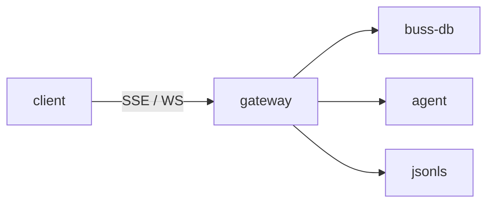
```mermaid
%%{init: {"flowchart": {"curve": "basis", "rankSpacing": 70, "nodeSpacing": 28}}}%%
flowchart LR
    client -->|"SSE / WS"| gateway
    gateway --> buss-db
    gateway --> agent
    gateway --> jsonls
```

| 组件 | 职责 |
|------|------|
| **client** | 建 Session、发 Turn、挂 SSE/WS |
| **gateway** | 鉴权、写库、调 Agent、写 jsonl、推流 |
| **buss-db** | Session 行（id / owner / 标题 / 锁） |
| **agent** | 推理运行时；被 Gateway 同步调用 |
| **jsonls** | 每 Session 一个 append-only 文件 |

### 0.1 创建 Session

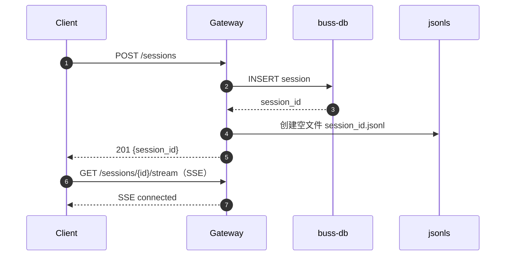
```mermaid
sequenceDiagram
    autonumber
    participant C as Client
    participant G as Gateway
    participant DB as buss-db
    participant J as jsonls

    C->>G: POST /sessions
    G->>DB: INSERT session
    DB-->>G: session_id
    G->>J: 创建空文件 session_id.jsonl
    G-->>C: 201 {session_id}

    C->>G: GET /sessions/{id}/stream（SSE）
    G-->>C: SSE connected
```

### 0.2 发起 Chat Turn

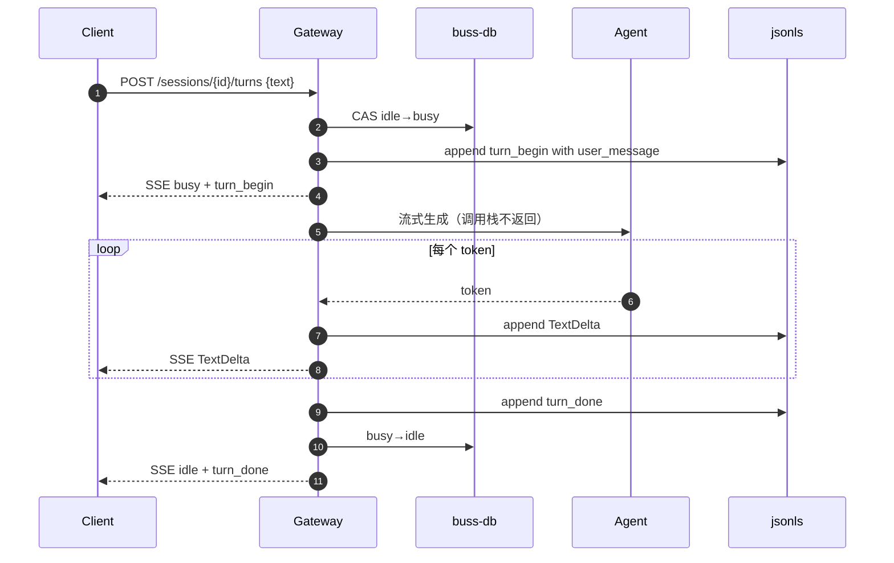
```mermaid
sequenceDiagram
    autonumber
    participant C as Client
    participant G as Gateway
    participant DB as buss-db
    participant A as Agent
    participant J as jsonls

    C->>G: POST /sessions/{id}/turns {text}
    G->>DB: CAS idle→busy
    G->>J: append turn_begin with user_message
    G-->>C: SSE busy + turn_begin

    G->>A: 流式生成（调用栈不返回）
    loop 每个 token
        A-->>G: token
        G->>J: append TextDelta
        G-->>C: SSE TextDelta
    end

    G->>J: append turn_done
    G->>DB: busy→idle
    G-->>C: SSE idle + turn_done
```

同步链：

1. Turn 的 HTTP 等待整轮生成
2. 每个 token：推理 → 落盘 → 推客户端
3. Agent 变慢或挂掉时，Gateway 同连接阻塞，且须知道调哪台 Agent

---

## 1. 延时与执行面 — Turn 异步 + Agent pull

### 问题

1. 生成在 Gateway 调用栈内，一轮秒到分钟级；并发时接入按在途 Turn 占满。
2. Gateway 同步调 Agent：接入与 GPU 同命运；异构扩容要在 Gateway 维护「谁能跑什么」。

根因是同一条边 `gateway → agent`。

### 方案

Turn 提交落库后立即返回；Agent **pull** 待领取 Turn 并写 jsonl；Gateway tail 后推 SSE。领取粒度是 Turn。  
非终态由 **reaper** 根据设备存活与执行上界回收；过期 `attempt` 的写入被拒绝。

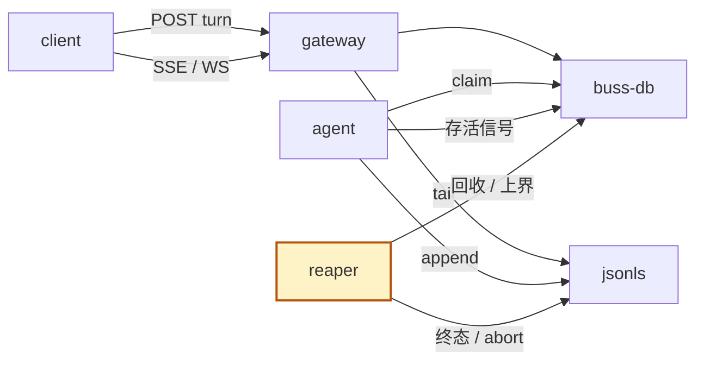
```mermaid
%%{init: {"flowchart": {"curve": "basis", "rankSpacing": 70, "nodeSpacing": 28}}}%%
flowchart LR
    client -->|"POST turn"| gateway
    client -->|"SSE / WS"| gateway
    gateway --> buss-db
    gateway -->|"tail"| jsonls
    agent -->|"claim"| buss-db
    agent -->|"append"| jsonls
    agent -->|"存活信号"| buss-db
    reaper -->|"回收 / 上界"| buss-db
    reaper -->|"终态 / abort"| jsonls

    classDef new fill:#FEF3C7,stroke:#B45309,stroke-width:2px
    class reaper new
```

| 组件 | 职责 |
|------|------|
| **gateway** | 提交 Turn、锁 CAS、tail 推 SSE |
| **buss-db** | Session 锁、pending Turn、attempt、设备存活 |
| **agent** | pull / claim、写日志、上报存活 |
| **reaper** | 存活超时与执行上界巡检；回收或失败收口；写 abort/failed |
| **jsonls** | 会话可回放日志 |

`gateway → agent` 消失；执行面经 buss-db 与 jsonl 耦合。

### 推导

| 备选 | 结果 |
|------|------|
| Gateway 同步调 Agent，仅提前结束 HTTP | 接入仍被推理占用 |
| Gateway 异步推给指定 Agent | 延时缓解，选机仍在接入面 |
| **Agent pull** | 提交与推理解耦；异构机按「能领什么」扩 |

终态由执行侧或回收器写入日志；Gateway 只 tail 转推。

### 1.1 时序：异步 Chat Turn

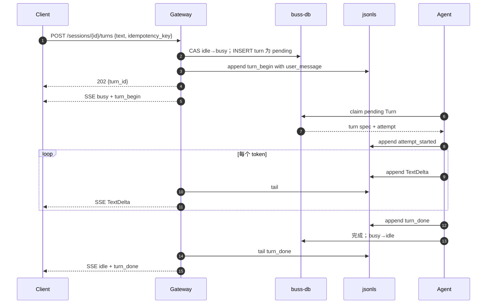
```mermaid
sequenceDiagram
    autonumber
    participant C as Client
    participant G as Gateway
    participant DB as buss-db
    participant J as jsonls
    participant A as Agent

    C->>G: POST /sessions/{id}/turns {text, idempotency_key}
    G->>DB: CAS idle→busy；INSERT turn 为 pending
    G->>J: append turn_begin with user_message
    G-->>C: 202 {turn_id}
    G-->>C: SSE busy + turn_begin

    A->>DB: claim pending Turn
    DB-->>A: turn spec + attempt
    A->>J: append attempt_started

    loop 每个 token
        A->>J: append TextDelta
        G->>J: tail
        G-->>C: SSE TextDelta
    end

    A->>J: append turn_done
    A->>DB: 完成；busy→idle
    G->>J: tail turn_done
    G-->>C: SSE idle + turn_done
```

### 1.2 时序：Agent 失败 / 失联

| 出口 | 触发 | 动作 |
|------|------|------|
| 主动失败 | 推理报错 | Agent append `turn_failed`；结束 Turn；`busy→idle` |
| 失联 | 存活信号超时 | 回收器收回在途 Turn |
| 执行上界 | 领取时写定的截止到达 | 超时失败或再入队重试 |

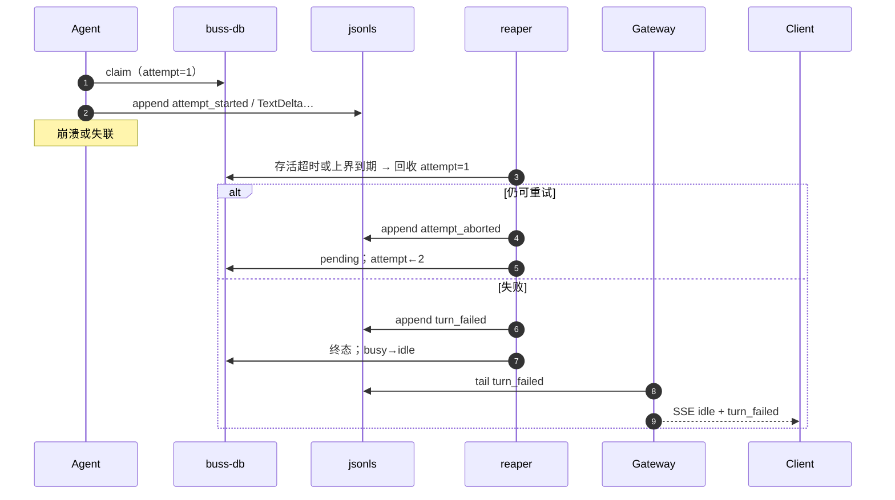
```mermaid
sequenceDiagram
    autonumber
    participant A as Agent
    participant DB as buss-db
    participant J as jsonls
    participant R as reaper
    participant G as Gateway
    participant C as Client

    A->>DB: claim（attempt=1）
    A->>J: append attempt_started / TextDelta…
    Note over A: 崩溃或失联

    R->>DB: 存活超时或上界到期 → 回收 attempt=1
    alt 仍可重试
        R->>J: append attempt_aborted
        R->>DB: pending；attempt←2
    else 失败
        R->>J: append turn_failed
        R->>DB: 终态；busy→idle
        G->>J: tail turn_failed
        G-->>C: SSE idle + turn_failed
    end
```

过期 `attempt` 的迟到 append 由库/日志拒绝（fence）：回收抬高当前 attempt 后，旧持有者无法再写入。

---

## 2. 流式存储 — StreamChannel + 快照

### 问题

执行已异步，观测仍靠 Gateway `tail jsonl`：

| jsonl | 需要 |
|-------|------|
| 行号随文件布局变 | 逻辑 seq |
| 难多订、难第二进程续读 | 多订阅者从任意 seq 续订 |
| 开屏扫全量 token | 快照 + 短增量 |
| 位点缺失时从最早可读行续发 | 明确报错 |

### 方案

**StreamChannel**（per-session 连续 seq 的可回放 WAL）替换 jsonls；**snapshot** 存折叠开屏态（含 `snapshot_seq`）。领取库与流分承载。产品适配器对比见 [`../design/drafts/stream-channel-adapters.md`](../design/drafts/stream-channel-adapters.md)（Redis Streams vs JetStream；一期默认 Redis，D18/D19）。

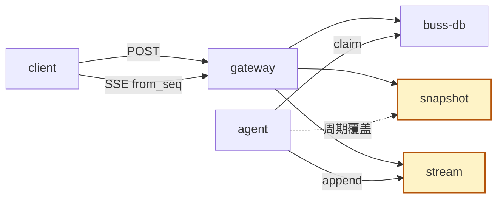
```mermaid
%%{init: {"flowchart": {"curve": "basis", "rankSpacing": 70, "nodeSpacing": 28}}}%%
flowchart LR
    client -->|"POST"| gateway
    client -->|"SSE from_seq"| gateway
    gateway --> buss-db
    gateway --> snapshot
    gateway --> stream
    agent -->|"claim"| buss-db
    agent -->|"append"| stream
    agent -.->|"周期覆盖"| snapshot

    classDef new fill:#FEF3C7,stroke:#B45309,stroke-width:2px
    class stream,snapshot new
```

| 组件 | 职责 |
|------|------|
| **stream** | `append` 分配 seq；`read_from(seq)` |
| **snapshot** | 覆盖写 `{气泡, running[], snapshot_seq}` |
| **buss-db** | Session 元数据、锁、Turn、领取 |

客户端游标 `(session_id, last_seq)`；服务端无连接级游标。

### 推导

| 备选 | 结果 |
|------|------|
| 强化 jsonl | 仍缺稳定 seq 与多订契约 |
| 仅有流、无快照 | 开屏随历史变差 |
| 流与领取同库 | 高频 append 与低频 CAS 互相拖死 |
| **独立流 + 带 seq 快照** | 多订、续订、开屏、缺口可诊断；领取与输出分路径 |

### 2.1 时序：开屏

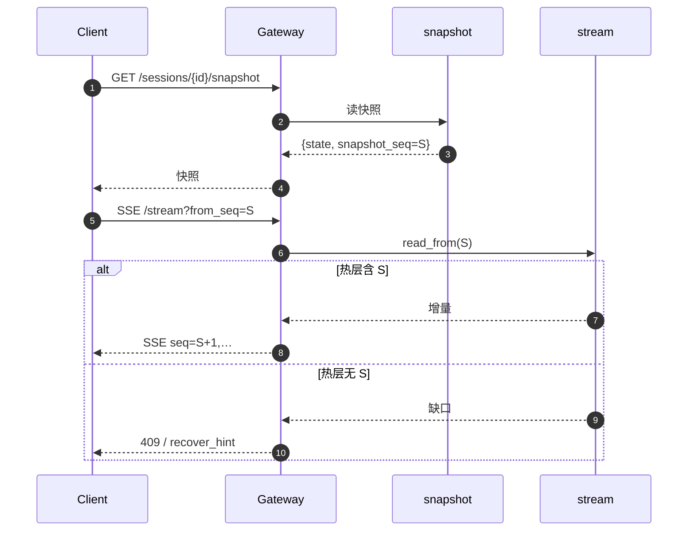
```mermaid
sequenceDiagram
    autonumber
    participant C as Client
    participant G as Gateway
    participant SN as snapshot
    participant ST as stream

    C->>G: GET /sessions/{id}/snapshot
    G->>SN: 读快照
    SN-->>G: {state, snapshot_seq=S}
    G-->>C: 快照

    C->>G: SSE /stream?from_seq=S
    G->>ST: read_from(S)
    alt 热层含 S
        ST-->>G: 增量
        G-->>C: SSE seq=S+1,…
    else 热层无 S
        ST-->>G: 缺口
        G-->>C: 409 / recover_hint
    end
```

### 2.2 时序：Worker append

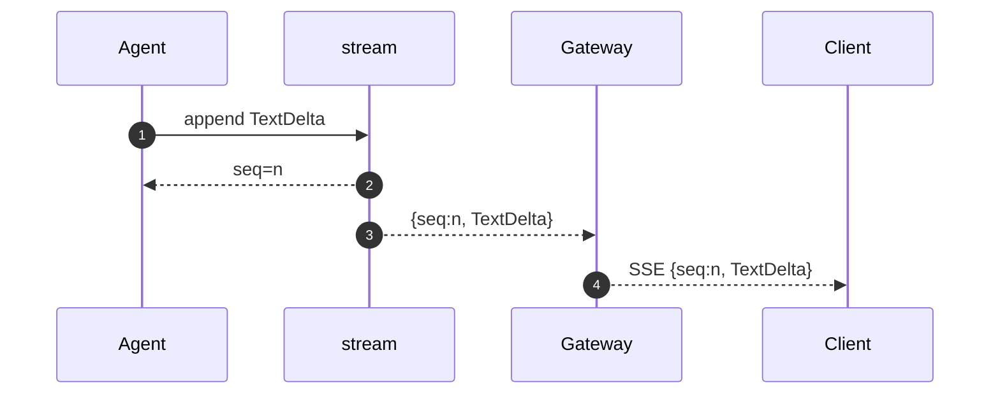
```mermaid
sequenceDiagram
    autonumber
    participant A as Agent
    participant ST as stream
    participant G as Gateway
    participant C as Client

    A->>ST: append TextDelta
    ST-->>A: seq=n
    ST-->>G: {seq:n, TextDelta}
    G-->>C: SSE {seq:n, TextDelta}
```

---

## 3. 读写面拆分 + 跨区就近订

### 问题

1. 权威区：写与 SSE 同在 Gateway，观测面与写面无法分扩。
2. 跨区：外区 SSE 打权威区 ⇒ 跨区 RTT + 绑死权威区接入。

A、B 身份平权；不对称的是权威落点与就近 Realtime。

### 方案

各区部署 **Gateway（写入口）** 与 **Realtime（订阅面）**。客户端访问对称：

| 路径 | 落到 |
|------|------|
| 写（Session / Turn / 锁） | **就近 Gateway**；仅权威区 Gateway 落库写信封；外区 Gateway **路由**到权威区，不落锁/领取 |
| 读（快照 + SSE） | **就近 Realtime**（权威区直读 Stream；外区回源） |

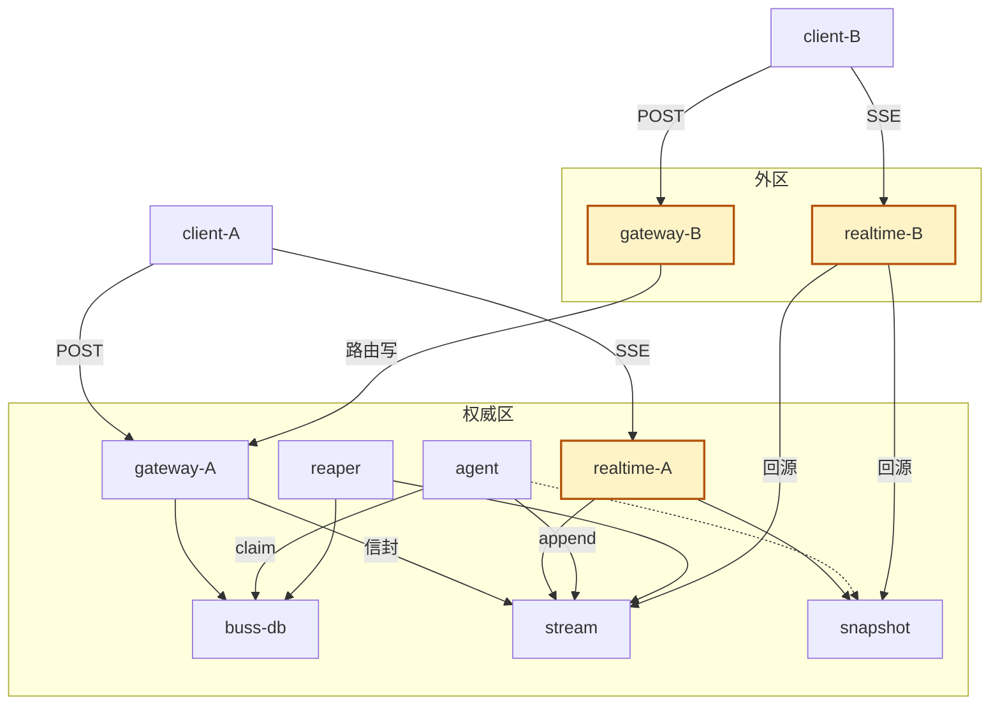
```mermaid
%%{init: {"flowchart": {"curve": "basis", "rankSpacing": 70, "nodeSpacing": 28}}}%%
flowchart TB
    subgraph home ["权威区"]
        GWA["gateway-A"]
        RTA["realtime-A"]
        DB["buss-db"]
        ST["stream"]
        SN["snapshot"]
        A["agent"]
        R["reaper"]
        GWA --> DB
        GWA -->|"信封"| ST
        RTA --> ST
        RTA --> SN
        A -->|"claim"| DB
        A -->|"append"| ST
        A -.-> SN
        R --> DB
        R --> ST
    end

    subgraph away ["外区"]
        GWB["gateway-B"]
        RTB["realtime-B"]
    end

    CA["client-A"] -->|"POST"| GWA
    CA -->|"SSE"| RTA
    CB["client-B"] -->|"POST"| GWB
    CB -->|"SSE"| RTB
    GWB -->|"路由写"| GWA
    RTB -->|"回源"| ST
    RTB -->|"回源"| SN

    classDef new fill:#FEF3C7,stroke:#B45309,stroke-width:2px
    class RTA,RTB,GWB new
```

### 推导

| 备选 | 结果 |
|------|------|
| 仅外区 Realtime，权威区 Gateway 兼 SSE | 模型不对称；观测面难单扩 |
| 外区客户端直打权威区 Gateway | 写入口不对称；客户端要感知权威区地址 |
| 外区 Gateway 本地落锁 / 领取 | 多权威 |
| 各区合并成单一「接入」服务（写+SSE 同进程） | 部署省事，但写面与读面扩缩、故障域、滚更绑死；长连接风暴可拖死 Turn/CAS |
| **各区 Gateway + Realtime 分面** | 访问对称；权威唯一；读写分扩、分故障 |

「各区都要有写和读」要求的是**入口对称**，不是**进程合并**。Gateway 与 Realtime 可以同机部署，甚至早期同二进制双端口，但契约上仍是两个面：写走 Gateway、订走 Realtime；外区 Gateway 只路由、不落权威。

### 3.1 时序：就近订阅

| 客户端 | Realtime | 数据 |
|--------|----------|------|
| A | realtime-A | 本区直读 |
| B | realtime-B | 回源 |

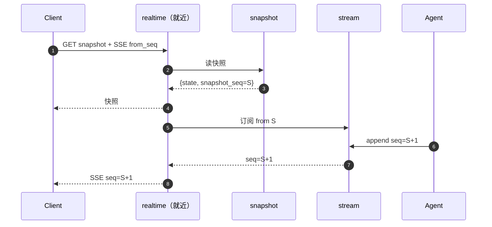
```mermaid
sequenceDiagram
    autonumber
    participant C as Client
    participant RT as realtime（就近）
    participant SN as snapshot
    participant ST as stream
    participant A as Agent

    C->>RT: GET snapshot + SSE from_seq
    RT->>SN: 读快照
    SN-->>RT: {state, snapshot_seq=S}
    RT-->>C: 快照

    RT->>ST: 订阅 from S
    A->>ST: append seq=S+1
    ST-->>RT: seq=S+1
    RT-->>C: SSE seq=S+1
```

### 3.2 时序：外区发 Turn

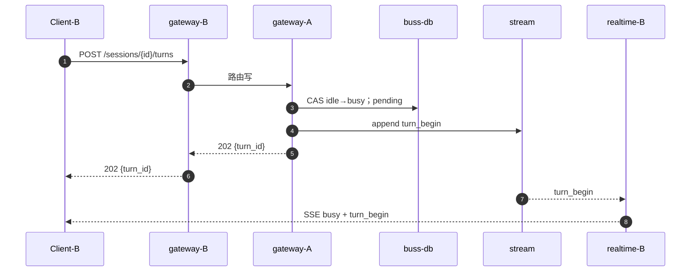
```mermaid
sequenceDiagram
    autonumber
    participant CB as Client-B
    participant GWB as gateway-B
    participant GWA as gateway-A
    participant DB as buss-db
    participant ST as stream
    participant RTB as realtime-B

    CB->>GWB: POST /sessions/{id}/turns
    GWB->>GWA: 路由写
    GWA->>DB: CAS idle→busy；pending
    GWA->>ST: append turn_begin
    GWA-->>GWB: 202 {turn_id}
    GWB-->>CB: 202 {turn_id}
    ST-->>RTB: turn_begin
    RTB-->>CB: SSE busy + turn_begin
```

---

## 3′. 跨区副本（可选）

### 问题

外区 Realtime 回源：热路径含跨区 RTT；权威区热层不可用时外区热订不可用。

### 方案

外区 **只读 Mirror**（Stream + Snapshot 异步副本）。Realtime-B 读本地 Mirror。  
客户端契约不变：写→就近 Gateway（外区仍路由到权威区），读→就近 Realtime。

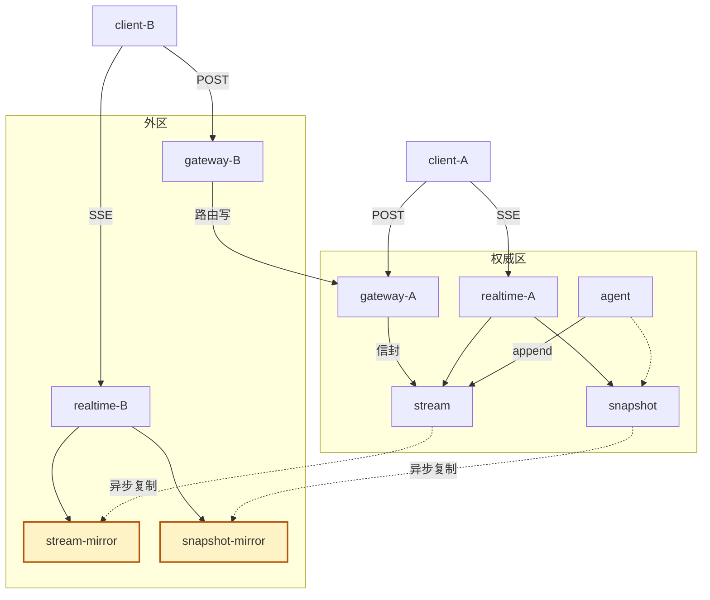
```mermaid
%%{init: {"flowchart": {"curve": "basis", "rankSpacing": 70, "nodeSpacing": 28}}}%%
flowchart TB
    subgraph home ["权威区"]
        GWA["gateway-A"]
        RTA["realtime-A"]
        ST["stream"]
        SN["snapshot"]
        A["agent"]
        GWA -->|"信封"| ST
        RTA --> ST
        RTA --> SN
        A -->|"append"| ST
        A -.-> SN
    end

    subgraph away ["外区"]
        GWB["gateway-B"]
        STM["stream-mirror"]
        SNM["snapshot-mirror"]
        RTB["realtime-B"]
        RTB --> STM
        RTB --> SNM
    end

    ST -.->|"异步复制"| STM
    SN -.->|"异步复制"| SNM
    CA["client-A"] -->|"POST"| GWA
    CA -->|"SSE"| RTA
    CB["client-B"] -->|"POST"| GWB
    CB -->|"SSE"| RTB
    GWB -->|"路由写"| GWA

    classDef new fill:#FEF3C7,stroke:#B45309,stroke-width:2px
    class STM,SNM new
```

副本滞后时：短等、回源补洞或显式降级；不得把未复制 seq 当成不存在。

### 推导

| 备选 | 结果 |
|------|------|
| Mirror 承接写 | 多写权威 |
| 为 Mirror 改客户端 API | 多余 |
| **只复制读路径** | 外区热读降延迟；源区短暂故障时可读已复制部分 |

### 3′.1 时序：就近读副本

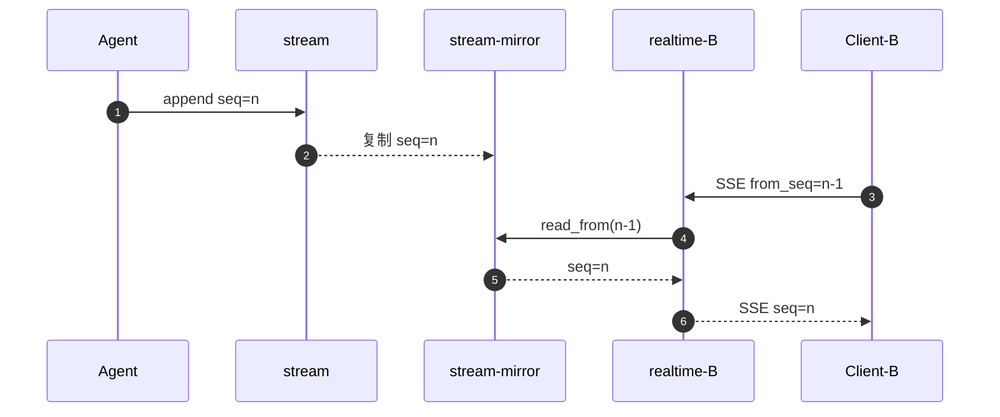
```mermaid
sequenceDiagram
    autonumber
    participant A as Agent
    participant ST as stream
    participant STM as stream-mirror
    participant RTB as realtime-B
    participant CB as Client-B

    A->>ST: append seq=n
    ST-->>STM: 复制 seq=n
    CB->>RTB: SSE from_seq=n-1
    RTB->>STM: read_from(n-1)
    STM-->>RTB: seq=n
    RTB-->>CB: SSE seq=n
```

---

## 4. HA — 接入多实例 + 数据面原生高可用

### 问题

1. 接入：Gateway / Realtime 单进程挂则写或 SSE 断；连接级游标会迫使 sticky。
2. 数据：buss-db / stream / snapshot 单副本挂则权威写、热订、开屏不可用。

### 方案

| 层 | 做法 |
|----|------|
| **接入** | Gateway、Realtime 各自无状态多实例；无粘性、无连接级游标；客户端持 `(session_id, last_seq)` 换实例续订 |
| **数据** | buss-db / stream / snapshot 使用承载原生副本与故障切换 |

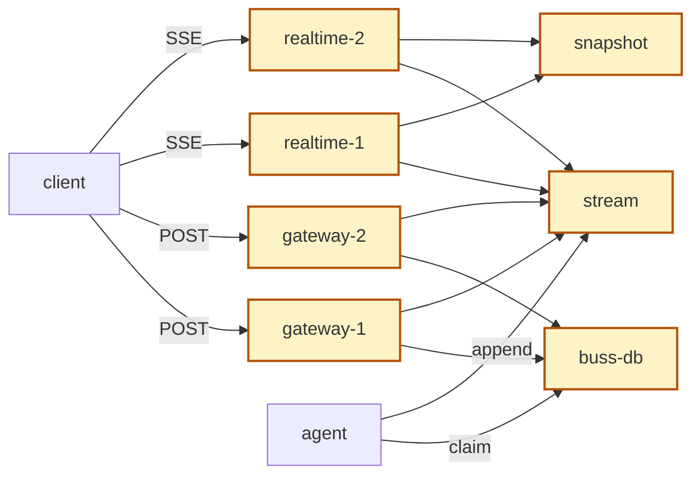
```mermaid
%%{init: {"flowchart": {"curve": "basis", "rankSpacing": 70, "nodeSpacing": 28}}}%%
flowchart LR
    client -->|"POST"| GW1["gateway-1"]
    client -->|"POST"| GW2["gateway-2"]
    client -->|"SSE"| RT1["realtime-1"]
    client -->|"SSE"| RT2["realtime-2"]
    GW1 --> DB["buss-db"]
    GW2 --> DB
    GW1 --> ST["stream"]
    GW2 --> ST
    RT1 --> ST
    RT2 --> ST
    RT1 --> SN["snapshot"]
    RT2 --> SN
    agent -->|"claim"| DB
    agent -->|"append"| ST

    classDef new fill:#FEF3C7,stroke:#B45309,stroke-width:2px
    class GW1,GW2,RT1,RT2,DB,ST,SN new
```

数据面在故障切换下须满足：

| 承载 | 要求 |
|------|------|
| **buss-db** | CAS / 锁不双主；已提交写不丢 |
| **stream** | seq 不回拨、不双写分叉；已持久事件可续订 |
| **snapshot** | `snapshot_seq` 单调；开屏点与流一致 |

权威区整体不可用时提交与领取不可用。已部署 Mirror 时，外区可读已复制部分。

### 推导

| 备选 | 结果 |
|------|------|
| 只扩接入、数据单副本 | 库挂则全站挂 |
| 多实例保留连接级游标 | sticky |
| 自研跨区共识承载 | 超出单域起步 |
| **接入无 sticky + 数据面原生 HA** | 两层单点消除；客户端契约不变 |

### 4.1 时序：Realtime 实例切换

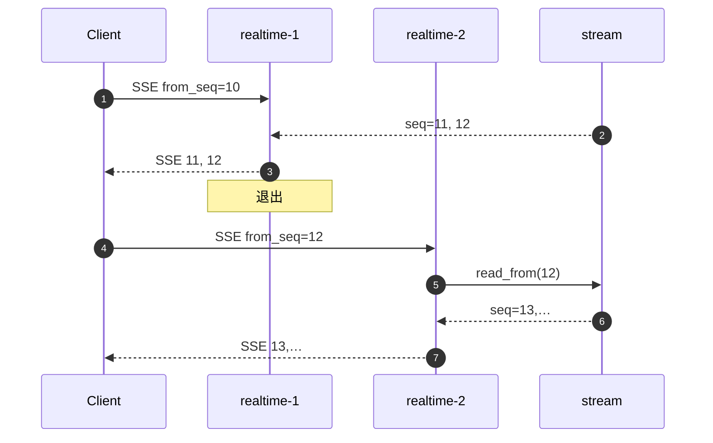
```mermaid
sequenceDiagram
    autonumber
    participant C as Client
    participant RT1 as realtime-1
    participant RT2 as realtime-2
    participant ST as stream

    C->>RT1: SSE from_seq=10
    ST-->>RT1: seq=11, 12
    RT1-->>C: SSE 11, 12
    Note over RT1: 退出
    C->>RT2: SSE from_seq=12
    RT2->>ST: read_from(12)
    ST-->>RT2: seq=13,…
    RT2-->>C: SSE 13,…
```

同一 Session 多订阅者在同一 Realtime 实例内复用一路 Stream 订阅。

### 4.2 时序：stream 主从切换

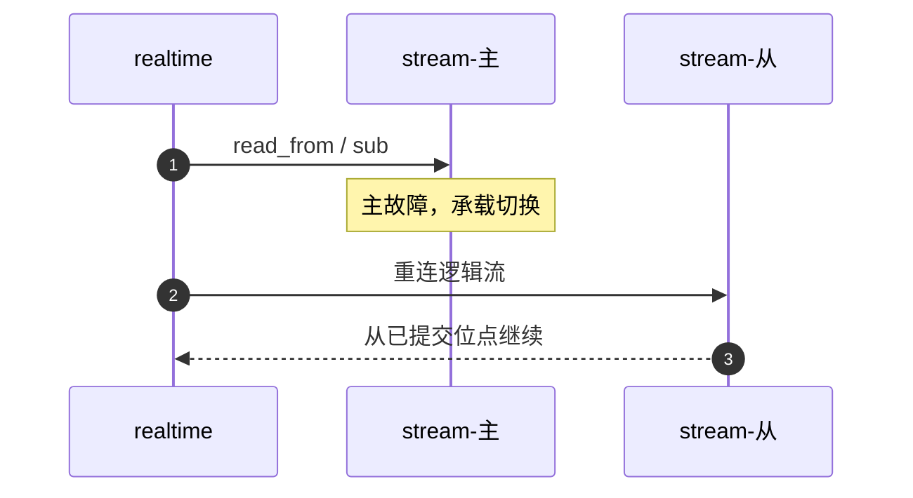
```mermaid
sequenceDiagram
    autonumber
    participant RT as realtime
    participant STprim as stream-主
    participant STsec as stream-从

    RT->>STprim: read_from / sub
    Note over STprim: 主故障，承载切换
    RT->>STsec: 重连逻辑流
    STsec-->>RT: 从已提交位点继续
```

---

## 5. 热→冷

### 问题

热层无限保留使成本按事件量涨。热 miss 出口在读面（Realtime）。

### 方案

**冷层**承接卸载；有效 Session 始终可恢复。由 **归档器**（或与 reaper 同巡检面）将热层卸载到冷层。  
Realtime 在热层无请求 seq 时明确报错，并导向快照或冷层。

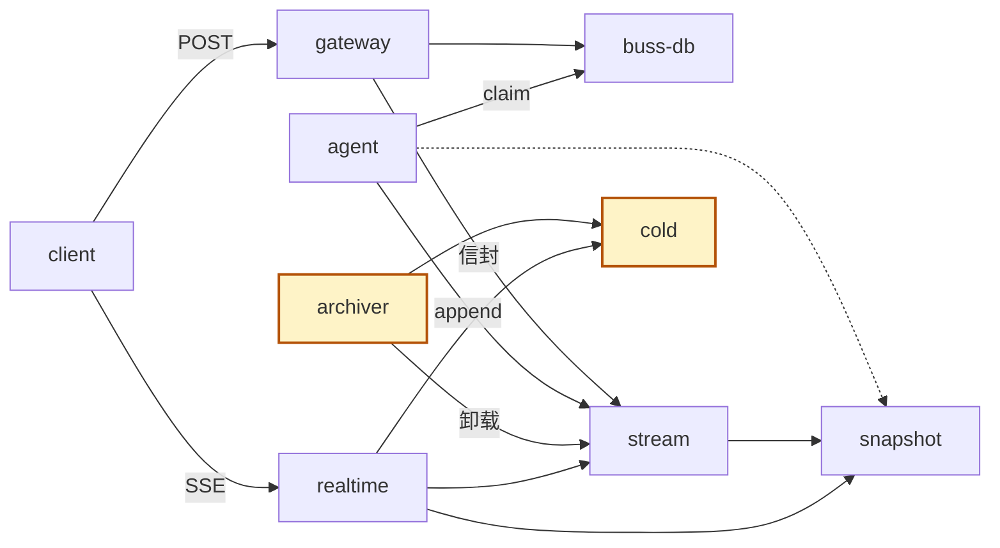
```mermaid
%%{init: {"flowchart": {"curve": "basis", "rankSpacing": 70, "nodeSpacing": 28}}}%%
flowchart LR
    client -->|"POST"| gateway
    client -->|"SSE"| realtime
    gateway --> buss-db
    gateway -->|"信封"| stream
    agent -->|"claim"| buss-db
    agent -->|"append"| stream
    agent -.-> snapshot
    stream --> snapshot
    archiver -->|"卸载"| stream
    archiver --> cold
    realtime --> snapshot
    realtime --> stream
    realtime --> cold

    classDef new fill:#FEF3C7,stroke:#B45309,stroke-width:2px
    class cold,archiver new
```

| 层 / 组件 | 能力 | 使用者 |
|-----------|------|--------|
| **stream** | seq 精确 resume | Realtime；Agent / Gateway append |
| **snapshot** | 折叠开屏 | Realtime |
| **cold** | 归档 | Realtime（热 miss 后） |
| **archiver** | 热→冷卸载 | 巡检面 |

### 推导

| 备选 | 结果 |
|------|------|
| 热 miss 静默从残存位点续发 | 缺口不可诊断 |
| 热层淘汰即作废 | 旧会话不可恢复 |
| 冷层出口在 Gateway | 恢复读绕回写面 |
| **冷层 + Realtime 明确出口** | 热层可瘦；读面闭环 |

### 5.1 时序：热 miss

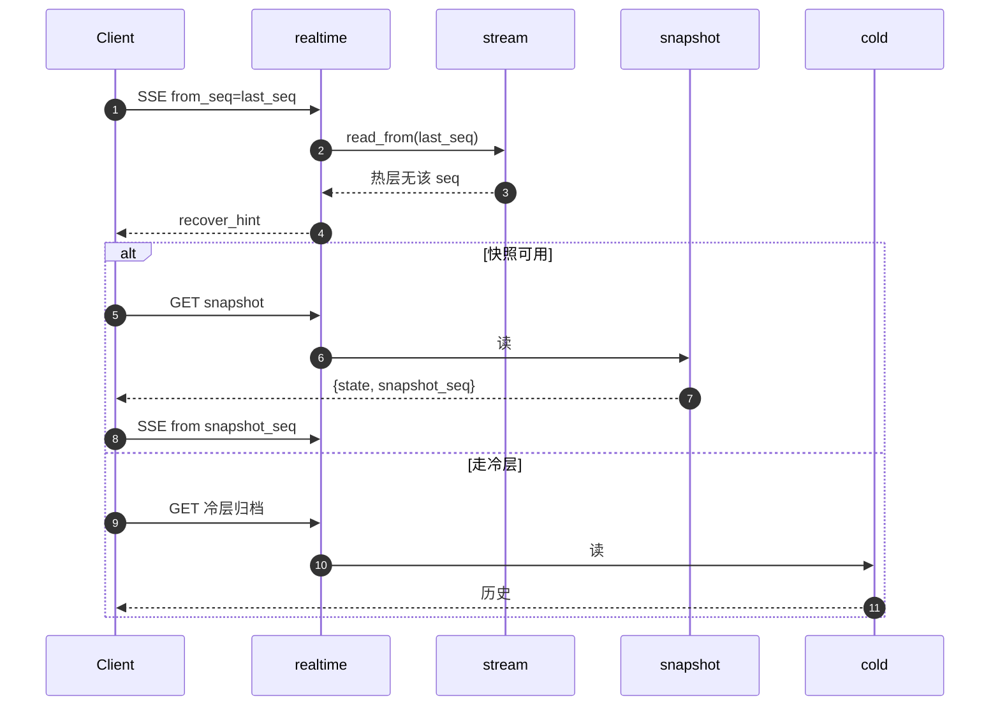
```mermaid
sequenceDiagram
    autonumber
    participant C as Client
    participant RT as realtime
    participant ST as stream
    participant SN as snapshot
    participant CD as cold

    C->>RT: SSE from_seq=last_seq
    RT->>ST: read_from(last_seq)
    ST-->>RT: 热层无该 seq
    RT-->>C: recover_hint

    alt 快照可用
        C->>RT: GET snapshot
        RT->>SN: 读
        SN-->>C: {state, snapshot_seq}
        C->>RT: SSE from snapshot_seq
    else 走冷层
        C->>RT: GET 冷层归档
        RT->>CD: 读
        CD-->>C: 历史
    end
```

---

## 稳定形态

| 面 / 承载 | 角色 |
|-----------|------|
| Gateway | 写入口（各区就近；外区路由到权威区落地） |
| Realtime | 读面（各区；外区回源或 Mirror） |
| Agent | 执行面 pull |
| reaper / archiver | 回收与热→冷巡检 |
| buss-db · stream · snapshot · cold | 领取与会话元数据 · 热日志 · 开屏 · 冷归档 |

---

## 本稿未展开

| 后续变量 | 所破问题 |
|----------|----------|
| 容量感知匹配 + 服务端容量账本 | 按容量正确领取，防超卖 |
| 任务池与 buss-db 分离 | 领取权威与会话元数据隔离扩缩 |
| 匹配器沙箱 / 策略版本快照 | 可扩展规则的安全与不停机切换 |
| 鉴权与订阅票 | 写/订授权 |
| 收件箱流 / 并行 Turn | 多 Session 列表实时性；同 Session 多 Turn |

---

## 与决策对照

| 步骤 | 结论 | 出处 |
|------|------|------|
| 1 | Turn=Task；pull；reaper + attempt fence | D18 · D2 · D9 · INV-5/6/35 |
| 2 | 可回放日志；快照开屏；领取与输出分路径 | D18 · D11 · INV-11~16 |
| 3 | 各区 Gateway+Realtime；写路由、读就近；观测跨区 ≠ 领取跨区 | D18 · D4 · D8 |
| 3′ | Mirror 可选；不改客户端契约 | D18 |
| 4 | 无 sticky；数据面原生 HA；单域权威 | INV-12 · INV-33 · D8 · D14 |
| 5 | 热 miss 明确出口；有效 Session 可恢复 | INV-14 |
