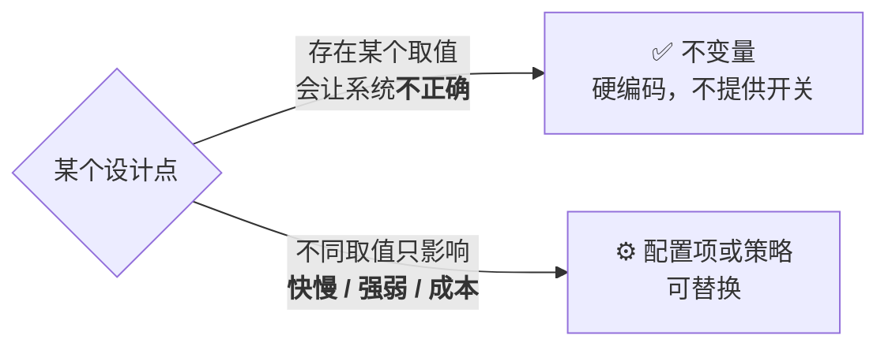
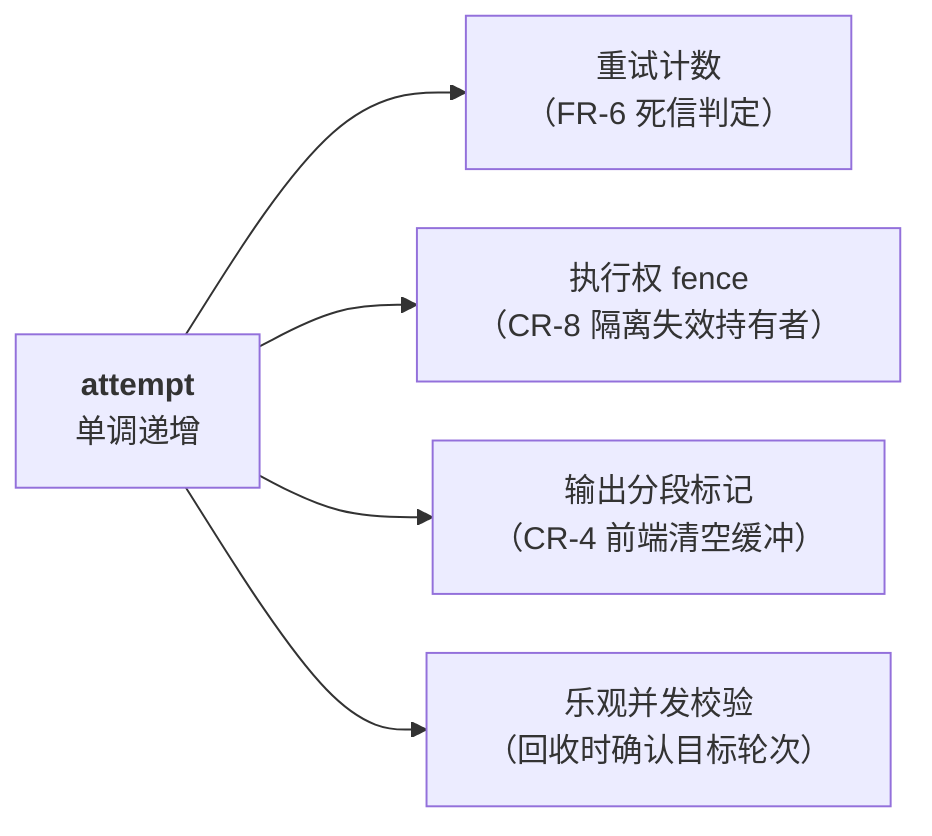
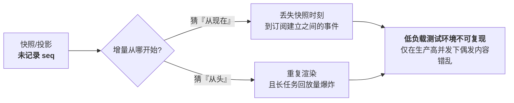
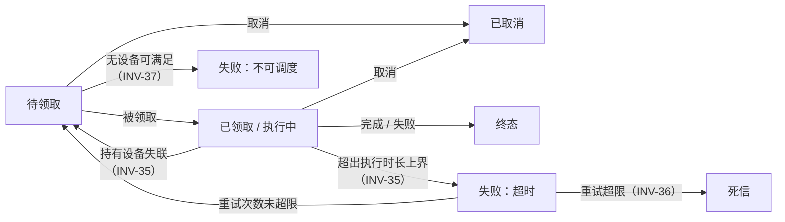

# 设计不变量

> 版本：v1.0
> 依据：[`spec.md`](../requirements/spec.md)
> 本文集中管理**跨设计步骤的「不可违反」条目**。这些不是优化项、不是配置项、不是可替换策略——**违反其中任一条，都会使某条 CR 需求不成立**。
>
> 使用方式：每份设计文档的评审必须逐条核对本文，确认无违反。

---

## 0. 判据：什么才算不变量

> **判据一句话**：如果一个「配置项」的某个取值会让系统变得**不正确**（而非只是变慢或变弱），它就不该是配置项。

---

## 1. 唯一性与幂等

| # | 不变量 | 支撑需求 | 违反后果 |
|---|--------|---------|---------|
| **INV-1** | **领取必须是单点条件更新**：判定「可否领取」与「置为已领取」在同一原子操作内完成，不可先查后改 | CR-1 | 并发窗口内双领 |
| **INV-2** | **提交幂等闸门必须无时间窗口**：以「存在即拒绝」语义实现，不得依赖 TTL 去重窗口 | CR-2 | 窗口过期后重放产生第二个任务，用户被重复计费 |
| **INV-3** | **容量核算不得采信执行设备的自我申报** | CR-3, CR-10 | 谎报容量即可绕过容量约束 |
| **INV-4** | **容量占用的增减与任务状态变更必须原子** | CR-3 | 容量账目漂移，长期累积后超卖 |

> INV-2 的常见错误实现：用「幂等键 + 24h TTL」做去重。**24 小时后同一意图重放会创建新任务**。正确做法是让幂等键与任务身份绑定，使重复提交在任务记录存在期间始终被拒绝。

---

## 2. 执行权与隔离

| # | 不变量 | 支撑需求 | 违反后果 |
|---|--------|---------|---------|
| **INV-5** | **尝试序号（attempt）严格单调递增，永不重置** | CR-4, CR-8 | 失效持有者的写入无法被识别 |
| **INV-6** | **一切来自执行设备的写入必须携带 `(task_id, attempt)`，服务端校验 attempt 为当前值** | CR-4, CR-8 | 僵尸设备覆盖新一轮结果 |
| **INV-7** | **执行权自检必须是只读操作**，不得延长任何时限 | S9 简化的前提 | 自检退化为续期，重新引入「漏调用即任务被杀」的故障模式 |
| **INV-8** | **失去执行权的设备必须立即停止执行并丢弃结果** | CR-4 | 无效算力消耗 + 输出污染风险 |
| **INV-9** | **任务执行时长上界在领取时一次性写定，之后不得更新** | S9, FR-2.4 | 若可延长则等价于续期；且排水时间失去上界，FR-2.4 不可验收 |

### 2.1 attempt 是三个机制的共同依赖

> 四个用途共用**同一个字段**，避免多字段间的漂移。这是它不可重置的根本原因——重置会同时破坏四处语义。

---

## 3. 观测与流式输出

| # | 不变量 | 支撑需求 | 违反后果 |
|---|--------|---------|---------|
| **INV-10** | **输出流的身份是 `task_id`**，与用户、会话、连接无关 | FR-11, FR-14 | 无法支持多人共享观测与断线续订 |
| **INV-11** | **全序号由单点分配**，输出与互动进入同一有序流 | CR-6 | 不同观测者看到相反的因果顺序 |
| **INV-12** | **客户端唯一需持久化的观测状态是 `(task_id, last_seq)`**；服务端不保存会话态 | FR-14 | 需要连接粘性路由，且换设备无法续订 |
| **INV-13** | **一切可作为重建起点的载体必须记录其对应序号**（快照、投影、归档、异步查询视图均须携带 `seq`） | CR-5, FR-23 | 增量起点不确定 ⇒ 重复渲染或静默丢事件；异步视图无法判断滞后程度与重建位点 |
| **INV-14** | **序号已被淘汰时必须明确报错**，不得静默从可用位置续发 | CR-5 | 产生静默数据缺口，生产环境极难排查 |
| **INV-15** | **快照序号严格单调**，回退的快照写入必须被丢弃 | CR-5 | 增量起点回退，重复投递 |
| **INV-16** | **可合并事件与不可合并事件必须显式区分**：输出增量可丢弃中间态，生命周期与互动消息不可丢 | CR-5, FR-12 | 慢客户端场景下丢失关键事件 |

### 3.1 INV-13 是最易被忽略的一条

---

## 4. 匹配与调度

| # | 不变量 | 支撑需求 | 违反后果 |
|---|--------|---------|---------|
| **INV-17** | **粗过滤必须是过度近似**：凡精确判定可能为真的任务，粗过滤必须保留 | FR-2.1, FR-2.3 | 任务永久停留待领取，且无报错（静默故障） |
| **INV-18** | **精确判定必须是纯函数**：无 I/O、无随机、无当前时间、无外部状态 | FR-2.1, OR-4 | 领取结果不可复现，不同实例判定不一致 |
| **INV-19** | **精确判定必须有界执行**：指令数与时间双上限 | SEC-5, SEC-6 | 领取路径被拖死（DoS） |
| **INV-20** | **硬容量约束必须在原子领取阶段独立再校验一次**，不得仅依赖可扩展的匹配规则 | CR-3, SEC-6 | 匹配规则出错或被绕过即可超额领取 |
| **INV-21** | **排序规则必须含老化项** | FR-2.4（排序型饥饿） | 低优先级任务永不执行 |
| **INV-22** | **硬约束以过滤方式处理，不得并入加权评分** | FR-2.6, SEC-4 | 出现「权重足够高即可违反硬约束」 |
| **INV-23** | **防饥饿机制必须能保证进展**：被暂留的容量在有限时间内必然满足目标任务 | FR-2.4（容量型饥饿） | 大容量任务永不执行 |
| **INV-24** | **单次领取判定内不得混用不同版本的匹配规则**：粗过滤、精确判定、排序必须取自同一版本快照 | FR-2.1, FR-19 | INV-17 的过度近似关系跨版本不成立 ⇒ 本可领取的任务被漏掉，且无报错 |

> **INV-20 是纵深防御的核心**：它把「可扩展匹配规则出错」的影响面从「破坏正确性（CR-3）」降级为「匹配次优（FR-2.5）」。这是允许 FR-2.6 动态扩展的前提条件，**也是策略可在不停机前提下切换的根本原因**（D12）。
>
> **INV-24 与 INV-17 的关系**：INV-17 要求粗过滤是精确判定的过度近似，该关系**仅在同一版本内部成立**。因此版本快照不是优化，而是 INV-17 成立的前提。

---

## 5. 身份与恢复

| # | 不变量 | 支撑需求 | 违反后果 |
|---|--------|---------|---------|
| **INV-25** | **幂等键必须在发出提交请求之前由客户端生成并本地持久化** | FR-15, CR-2 | 请求超时后无法判断是否已提交，产生孤儿任务 |
| **INV-26** | **幂等键必须是高熵随机值**（≥128 bit CSPRNG） | CR-9 | 任务标识可枚举，可绕过 INV-28 探测存在性 |
| **INV-27** | **不得以标识不可猜测作为授权手段**：每次访问均须校验权限 | CR-9 | 越权访问 |
| **INV-28** | **无权访问的响应不得与「不存在」可区分** | CR-9 | 通过响应差异枚举任务存在性 |

### 5.1 孤儿任务的三种情形

INV-25 的作用范围：

| 情形 | 服务端状态 | 客户端可否恢复 |
|------|-----------|--------------|
| 请求未到达 | 无记录 | ✅ 查无结果 ⇒ 重放提交（凭 INV-2 保证不重复） |
| **已处理但响应丢失** | 记录完整 | ✅ **凭幂等键定位** ⇒ 恢复观测（最常见情形） |
| 处理中途失败 | 记录不完整 | ✅ 查到非法中间态 ⇒ 重放提交自愈 |

> 若违反 INV-25（幂等键在收到响应后才生成/保存），第二种情形**完全无法恢复**——任务在执行但用户永远找不到它。

---

## 6. 过载与降级

| # | 不变量 | 支撑需求 | 违反后果 |
|---|--------|---------|---------|
| **INV-29** | **过载时必须拒绝新提交，不得静默无界积压** | FR-21, CR-11 | 等待时长失控 + 连带故障 |
| **INV-30** | **拒绝提交时不得进入不一致状态** | CR-11 | 过载引发的数据损坏最难恢复 |
| **INV-31** | **降级状态必须对用户显式可见** | OR-2 | 用户基于陈旧数据做决策 |
| **INV-32** | **处于只读降级时必须拒绝上行写入**，不得写入非权威副本 | CR-6 | 破坏全序，观测者看到矛盾顺序 |
| **INV-33** | **客户端重连必须带随机抖动的指数退避** | OR-1 | 服务滚动升级时大量连接同时重连，打垮新实例 |

---

## 7. 终结性与进展（liveness）

§1~§6 多为**安全性**（不发生坏事），本节为**活性**（好事最终发生）。二者的验收方式不同：安全性可用反例证伪，活性须在有界时间内观察到结果。

| # | 不变量 | 支撑需求 | 违反后果 |
|---|--------|---------|---------|
| **INV-34** | **持久化先于成功响应**：向提交者返回成功之前，任务必须已进入可被领取的持久状态 | CR-7 | 返回成功但任务不存在，用户任务凭空消失 |
| **INV-35** | **每个非终态都有超时出口**：待领取、已领取、执行中三态均须存在导致状态迁移的时限或事件，不存在无出口的停留 | CR-7 | 任务永久停滞（最典型：持有设备失联后无人回收） |
| **INV-36** | **重试必须在有限次内收敛到终态** | CR-7, FR-6 | 无限重试，任务永不终结且持续消耗容量 |
| **INV-37** | **不可满足的任务必须被判定失败，而非无限等待** | FR-8, CR-7 | 任务永久待领取，界面上仅显示「排队中」 |

### 7.1 非终态的出口清单（INV-35 的具体化）

> **审查方法**：对状态机中每个非终态，逐一回答「如果此后不再发生任何外部事件，它会在多久后离开这个状态？」**答不出有限时间的，即违反 INV-35。**

---

## 8. 不可抽象清单

以下**硬编码，不提供配置开关**。它们不是策略，而是不变量本身——做成可配置即等于允许实现违反它。

| 项 | 若可配置会发生什么 |
|----|------------------|
| 全序号单点分配（INV-11） | 配成多点分配 ⇒ 观测者看到相反因果顺序 |
| 提交幂等的「存在即拒绝」语义（INV-2） | 配成 TTL 窗口去重 ⇒ 窗口外重放导致任务执行两次 |
| attempt 单调性（INV-5） | 配成可重置 ⇒ 四处语义同时破坏（§2.1） |
| 客户端游标协议（INV-12） | 改为服务端会话态 ⇒ FR-14 全部失效，需连接粘性 |
| 快照序号单调（INV-15） | 允许回退 ⇒ 静默丢事件 |
| 无权响应与不存在不可区分（INV-28） | 配成返回 403 ⇒ 泄露任务存在性 |
| 领取阶段的容量再校验（INV-20） | 允许关闭 ⇒ 匹配规则 bug 直接导致超卖 |

---

## 9. 可替换的部分（与本文相对）

明确列出**不属于**不变量的部分，避免过度僵化：

| 可替换项 | 约束 |
|---------|------|
| 容量模型与匹配规则 | 须满足 INV-17~INV-20 |
| 优先级与排序策略 | 须满足 INV-21 |
| 防饥饿的具体手段（预留 / 排水 / 混合） | 须满足 INV-23 |
| 重试与终止策略 | 须满足 INV-36（有限次内收敛到终态） |
| 快照的编解码方式 | 须满足 INV-15、须携带序号 |
| 存储与流通道的技术选型 | 须满足 INV-1、INV-4、INV-11；且须遵守 D11（领取与输出路径分离） |
| 事件聚合窗口、保留期、各类阈值 | 无正确性约束，按成本与体验权衡 |

> **判别方式**：若某项变更只影响性能、成本或体验 ⇒ 属本节；若可能导致双领、超卖、丢任务、输出错乱、越权 ⇒ 属不变量。

---

## 10. 验收对应关系

| 不变量组 | 验收手段 |
|---------|---------|
| §1 唯一性与幂等 | 高并发抢占测试 + 幂等键重放测试（含跨时间窗口） |
| §2 执行权与隔离 | 进程强杀 + 网络分区注入 + 假死恢复场景 |
| §3 观测与流式 | 随机断连 200 次后逐字节比对 + 长任务中途接入 |
| §4 匹配与调度 | 注入违规匹配规则（须 fail-fast）+ 容量型饥饿压力场景 |
| §5 身份与恢复 | 提交后立即断开 + 越权访问 + 标识枚举尝试 |
| §6 过载与降级 | 10 倍设计容量持续压测 + 滚动升级期间连接风暴 |
| §7 终结性与进展 | **状态机出口审查**（每个非终态须有有限时限出口）+ 故障注入后观察全部任务是否达终态 |

> **§2、§3、§4、§7 的不变量在常规功能测试中几乎不可复现**，必须设计专门的并发与故障注入场景。
