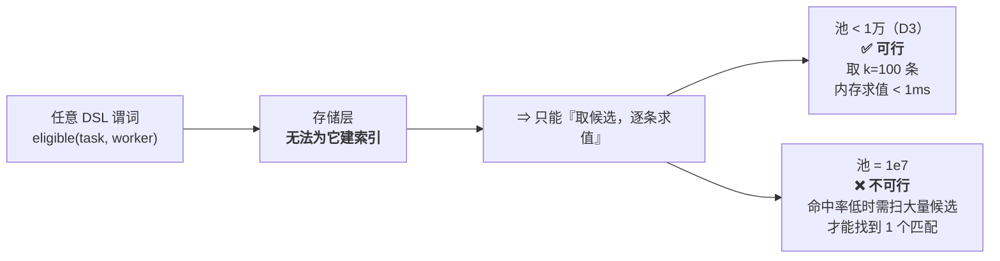
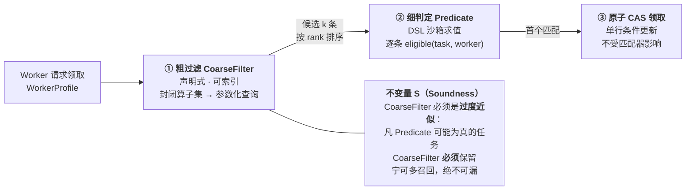
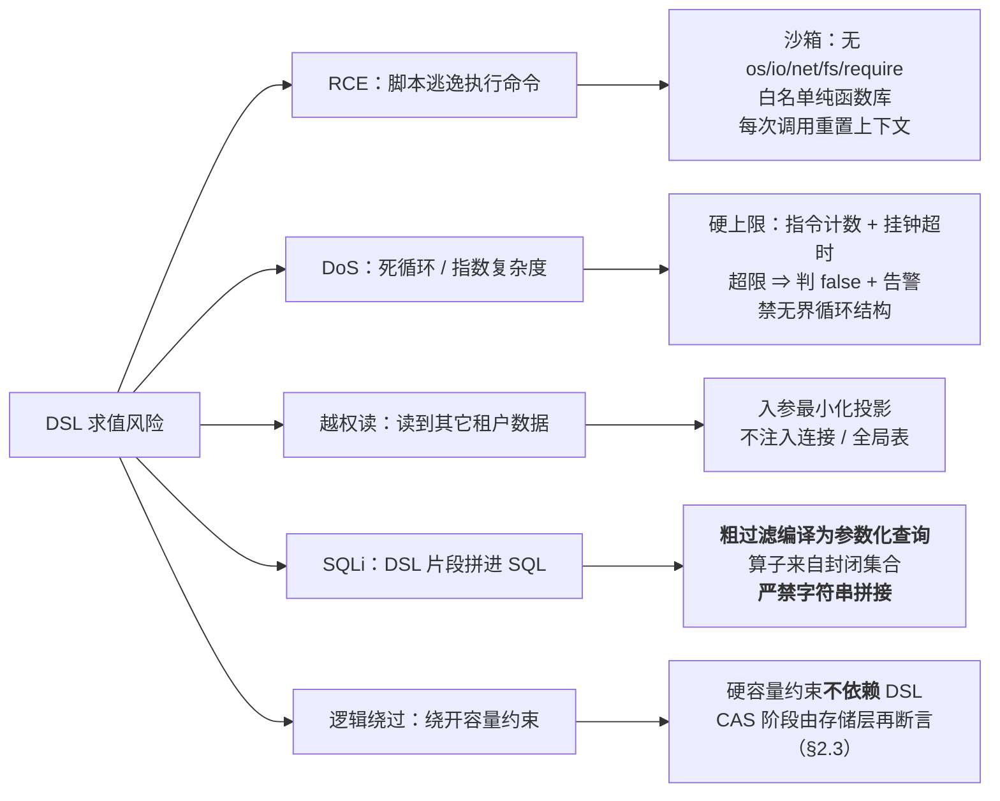
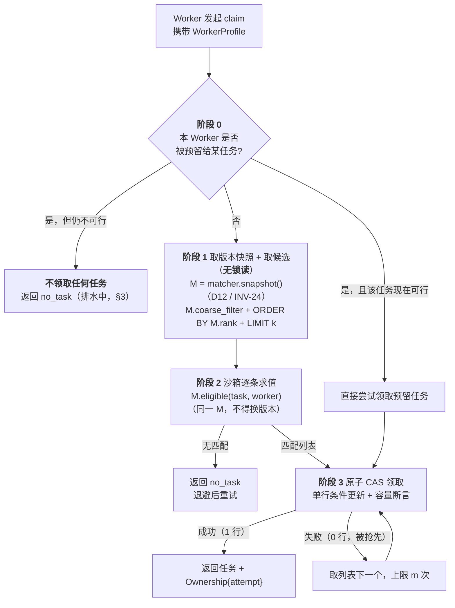
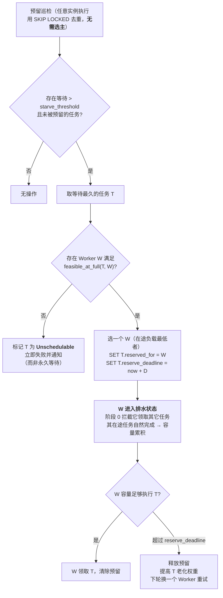
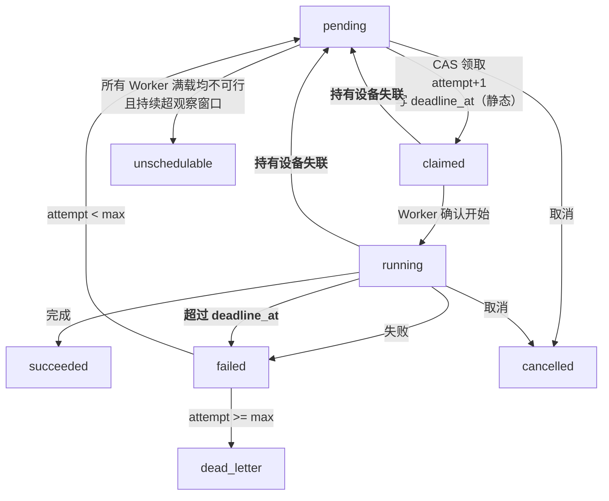

# 领取语义与匹配器

> 版本：v1.0 · 状态：✅ 定稿
> 覆盖需求：FR-2 全部子项 · FR-16~FR-20 · CR-1 · CR-3 · CR-7 · CR-8 · CR-10 · OR-4 · SEC-6
> 依据：[`spec.md`](../requirements/spec.md) · [`parameters.md`](../requirements/parameters.md) · 约束：[`invariants.md`](../architecture/invariants.md) §2 §4
> 本文产出：匹配器抽象与边界 · 无锁三段领取协议 · 防饥饿机制 · 执行权与失效回收
> 本文不涉及：存储实现（表结构、索引、事务）· 事件模型 · 观测层

---

## 0. 依据的架构决策

详见 [`decisions.md`](../architecture/decisions.md)。

| 决策 | 结论 | 对本文的直接影响 |
|------|------|----------------|
| **D1** 容量模型 | 抽象为匹配器，规则以受限 DSL 表达 | **§1 全部内容** |
| **D2** 匹配方式 | first-fit + 设备自主拉取 | 无中心调度器、**无选主组件**（§2） |
| **D3** 规模基准 | 待领取 < 1 万，峰值领取 70/s | 候选可逐条求值，无需索引下推（§1.1） |
| **D5** 防饥饿 | 老化 + 定向预留排水 | §3 |
| **D9** 执行权时限 | 设备级存活 + 静态执行上界 | §4 |
| **D10** 容量账本 | 服务端按在途任务核算 | §1.3 `WorkerProfile` 的来源 |
| **D12** 策略切换 | 请求级版本快照 | §1.3 `version()` 的用途、§2.2 阶段 1 取版本 |
| D4 / D6 / D7 | 区域内领取、不抢占、无延迟任务 | 状态机与待领取集合结构最简 |

---

## 1. 匹配器抽象（D1 的落地）⭐

### 1.1 前提：DSL 无法下推到索引

DSL 的灵活性有一个物理代价，需先明确：



| | 结论 |
|---|---|
| **D3 是 D1 的前提** | 正因池 < 1万、领取 < 100/s，「取候选 + 逐条求值」成本可忽略。**DSL 抽象在此规模下几乎免费** |
| **规模增长的退路** | §1.2 两层结构：把可索引子集声明式化，DSL 只做剩余细判定 |

### 1.2 两层匹配器结构

即使当前不需要，**结构上也应从一开始分两层**，否则规模增长时无处插入索引优化。



**不变量 S 是这个结构唯一的正确性要求。** 若粗过滤误排除了本可匹配的任务，会产生「明明有 Worker 能干却没人领」的静默故障——生产中表现为「任务莫名卡在 pending」，极难排查。

**本期默认实现**：`CoarseFilter = state='pending'`（不做容量过滤，即最保守的过度近似）；`Predicate = DSL`。D3 规模下足够。

### 1.3 匹配器契约

```
trait Matcher {
  // ① 可索引的必要条件（过度近似，见不变量 S）
  fn coarse_filter(worker: WorkerProfile) -> FilterExpr

  // ② 精确判定（DSL 求值，纯函数）
  fn eligible(task: TaskSpec, worker: WorkerProfile) -> bool

  // ③ 候选排序（rank 越小越先考察，必须含老化项）
  fn rank(task: TaskSpec, now: Instant) -> i64

  // ④ 可行性上界：worker 在【满容量】下是否可能执行 task
  //    用于防饥饿预留与 Unschedulable 判定（§3），不用于领取
  fn feasible_at_full(task: TaskSpec, worker: WorkerCapability) -> bool

  fn candidate_window() -> usize    // k，默认 100
  fn version() -> MatcherVersion   // 审计与回滚；单次领取内必须固定（INV-24）
}
```

| # | 不变量 | 违反后果 | 如何断言 |
|---|--------|---------|---------|
| **S** | `eligible(t,w) ⇒ t ∈ coarse_filter(w)` | 任务永久卡 pending | 影子校验：定期用最宽过滤重扫，比对是否存在「被粗过滤排除但 eligible」的任务 → 告警 |
| **P** | `eligible` 是**纯函数**：无 I/O、无随机、无时钟、无外部状态 | 同一任务在不同实例结果不同，CR-1 不可推理 | 沙箱不提供相关 API（§1.4） |
| **T** | `eligible` **有界执行** | 领取路径被拖死；DoS | 沙箱强制指令计数 + 超时 |
| **A** | `rank` 含**老化项** | 排序型饥饿（FR-2.4） | 配置静态检查 + 监控 P99 等待 |
| **F** | `eligible(t, w满载) ⇒ feasible_at_full(t, w.cap)` | 预留失效 → 容量型饥饿 | 属性测试：随机 profile 下二者一致 |
| **V** | **单次领取内 `coarse_filter` / `eligible` / `rank` 必须取自同一 `version()`** | 不变量 S 跨版本不成立 ⇒ 任务被漏掉且无报错 | 领取入口取一次版本快照并全程传递；记录该版本用于审计 |

> **`feasible_at_full` 为什么必须单独存在**：防饥饿需回答「这个大任务**究竟有没有**机器能跑」。若无任何 Worker 满载可行 ⇒ 应立即判 `Unschedulable` 而非永久等待（§3.4）。

### 1.4 DSL 安全约束（必须实现，不可省）

匹配器 DSL 是**代码执行入口**，本设计最高风险点。



| 约束 | 具体要求 |
|------|---------|
| **沙箱** | 无文件/网络/进程/环境变量/时钟/随机源；仅白名单纯函数（算术、比较、字符串、集合） |
| **有界** | 指令计数上限（如 1e5）+ 挂钟超时（如 5ms）。超限 ⇒ 判 `false` + 计入 `matcher_timeout_total` |
| **入参投影** | 只传本次判定所需字段，不传完整对象、不传数据库句柄 |
| **参数化** | 粗过滤只允许封闭算子集（`=`、`<=`、`IN`、`AND/OR`）生成**参数化**条件；DSL 文本**永不进入** SQL |
| **来源管控** | 匹配器由**运营方**发布，纳入配置版本管理与审计；**默认不开放租户上传**。若将来开放，需额外做资源配额与多租户沙箱隔离 |
| **变更安全** | `version()` 记入审计日志；发布走灰度；支持一键回滚。**发布须声明变更类型**（放宽 / 收紧 / 仅排序），收紧型按 D12 走双版本校验或暂停切换 |
| **兜底断言** | 硬容量约束在 CAS 阶段由存储层**独立再校验一次**（§2.3） |

> 最后一条是纵深防御关键：**即使 DSL 写错或被绕过，存储层断言仍能阻止超额领取**。这把「策略 bug」的影响面从「破坏正确性」降级为「匹配次优」。

### 1.5 DSL 能力边界

**能表达**（纯函数、可判定）：

```
task.req_gpu <= worker.avail_gpu                      # 单维标量

task.req_gpu <= worker.avail_gpu                      # 多维向量
  and task.req_mem <= worker.avail_mem
  and task.req_cpu <= worker.avail_cpu

task.model_family in worker.supported_models          # 标签硬约束
  and (task.zone == "" or task.zone == worker.zone)

worker.hw_gen >= task.min_hw_gen                      # 组合条件
  and not (task.exclusive and worker.running_count > 0)
```

**不能表达**（需在架构层解决）：

| 不能表达 | 为什么 | 应放在哪 |
|---------|--------|---------|
| 「选最贴合的 Worker」 | best-fit 需全局 Worker 视图 | D2 已定 first-fit，本期不需要 |
| 「这批任务合起来怎么放最优」 | 装箱优化需全局视图 | 未来中心调度器（与 D2 冲突，需重定夺） |
| 「查外部系统再决定」 | 违反不变量 P | 提前物化到 `TaskSpec` / `WorkerProfile` |
| 「记住上次跳过了谁」 | 有状态，违反 P | 由 `rank` 老化项 + 预留机制（§3）承担 |

> 判据：**DSL 只回答「这一对 (task, worker) 是否可行」，不回答「应该怎么分配」。** 前者是局部纯判定，后者是全局优化。

---

## 2. 领取协议（无锁三段式）

### 2.1 为什么不用 `FOR UPDATE SKIP LOCKED` 包住全程

直觉写法是「`SELECT … FOR UPDATE SKIP LOCKED` 取候选 → 求值 DSL → 更新」。**问题：DSL 求值期间持有行锁。**

| 方案 | 锁持有时间 | 风险 |
|------|-----------|------|
| `SKIP LOCKED` 全程持锁 | 含 DSL 求值（最坏 5ms × k） | 慢 DSL 放大为锁竞争；长事务；连接池压力 |
| **无锁三段式**（推荐） | 仅第三段单行 CAS（微秒级） | 候选可能被抢先 → 重试下一个（成本极低） |

D3 规模下（领取 < 100/s）抢先冲突概率很低，重试成本远低于持锁成本。

### 2.2 协议



### 2.3 阶段 3 的 CAS（核心正确性点）

```sql
-- 全参数绑定，无字符串拼接（防 SQLi）
UPDATE tasks
   SET state        = 'claimed',
       owner_worker = $2,
       attempt      = attempt + 1,       -- 单调递增 ⇒ fence token
       claimed_at   = now(),
       deadline_at  = now() + $3::interval   -- 静态执行上界，之后永不更新
 WHERE id    = $1
   AND state = 'pending'                            -- CAS 闸门
   AND (reserved_for IS NULL OR reserved_for = $2)   -- 尊重预留（§3）
   AND req_gpu <= $4                                 -- 存储层容量断言
   AND req_mem <= $5                                 -- （不信任 DSL）
RETURNING id, attempt, payload_ref;
```

| 性质 | 如何保证 |
|------|---------|
| **CR-1 不双领** | 单行条件更新，`state='pending'` 是唯一闸门；行级原子性即 CAS |
| **CR-8 执行权失效后隔离** | `attempt` 单调递增即 fence token；旧持有者携旧 attempt，写入被识别为过期 |
| **纵深防御** | 容量条件在 SQL 再断言一次；DSL 出错也无法超额领取 |
| **SQLi 防护** | 全参数绑定；容量列名来自**封闭列集合**，不接受外部输入拼接 |

> `attempt` **同时是重试计数与 fence token**——一字段两用，避免二者不一致（全量设计中它们是两个字段，存在漂移风险）。

### 2.4 Worker 拉取节奏（无中心通知）

D2 选自主拉取，因此**不需要「有新任务」通知通道**：

| 场景 | 行为 |
|------|------|
| 领到任务 | 立即再尝试（可能还有余量） |
| `no_task` | 指数退避 + jitter：`min(2^n × 100ms, 2s) × rand(0.5,1.5)` |
| 本地容量变化（任务完成） | 立即触发一次领取 |
| 被预留但暂不可行 | 按预留剩余时间退避，不做无效轮询 |

> 可选优化（非必需）：用轻量 pub/sub 广播「有新任务入池」以降低空轮询。**丢失不影响正确性**——退避轮询是权威路径。

---

## 3. 防饥饿（D5 定夺）⭐

### 3.1 两类饥饿，只有一类能靠老化解决


> **这是最容易被漏掉的一类需求。** 只做老化会留下一类永不执行的任务，且在测试环境（负载低、容量充裕）几乎不可复现——上线后才暴露。

### 3.2 机制：定向预留 + 排水

关键洞察：**D2 无中心调度器，但预留不需要中心组件——它只是数据库里的一行。**



**为什么这能保证进展（liveness）**：被预留的 Worker 不再接新任务，其在途任务在有限时间内（受 `deadline_at` 上界约束）全部结束，容量必然回到满载。由不变量 F，满载可行 ⇒ 该任务必被领取。

> 这里也体现了 `deadline_at` 的第二个作用：**它为「排水需要多久」提供了确定的上界**。若没有任务执行时长上界，排水时间将无界，防饥饿机制无法给出等待上界（FR-2.4 不可验收）。

### 3.3 参数与代价

| 参数 | 作用 | 建议起始值 | 调参方向 |
|------|------|-----------|---------|
| `starve_threshold` | 等待多久触发预留 | P99 正常等待 × 3 | 太小 → 频繁排水伤吞吐；太大 → 大任务等待长 |
| `reserve_deadline D` | 单次预留最长持有 | 该 Worker 在途任务的最大剩余 `deadline_at` × 1.5 | 太小 → 预留反复失败；太大 → 资源长期闲置 |
| 同时预留上限 | 最多几个任务在预留 | **1**（本期） | 提高会显著降低装箱率 |

**这是 X2 冲突（无饥饿 × 装箱效率）的显式仲裁**：排水期间被预留 Worker 的容量闲置，用**短期装箱率下降**换取**饥饿上界**。

| 监控项 | 期望 |
|--------|------|
| `starvation_reserve_total` | 低频；持续升高说明容量结构与任务需求不匹配 |
| `packing_ratio{demand=true}` | ≥ 目标值。**仅在待领取队列非空时采样**，否则空闲时段会污染指标（需求 §3.3） |
| `drain_idle_seconds` | 排水造成的闲置时长 = 为满足 FR-2.4 付出的装箱率代价，X2 仲裁的实测依据 |
| `fragment_capacity` | 碎片容量：剩余容量不足以容纳任何待领取任务的部分。区分「碎片损失」与「预留损失」 |
| `unschedulable_total` | 理想为 0；非 0 说明有任务需求超过所有 Worker 能力 |
| `wait_time_p99{priority}` | 各优先级等待上界，验证 FR-2.4 |

### 3.4 顺带解决：`Unschedulable`

若任务需求超过**所有** Worker 的满载能力（如需 16 卡但最大机器 8 卡），朴素实现会让它**永久 pending**，界面上只显示「排队中」。

`feasible_at_full` 使这种情况可被检出并**立即失败**并附明确原因。这是很多任务系统的通病，成本极低但体验差异很大。

> 注意边界：Worker 集合会变化（扩容后可能变得可行）。因此 `Unschedulable` 判定需**保守**：仅当「当前注册的所有 Worker 满载均不可行」且**持续超过一个观察窗口**（如 5 分钟）才判定，避免扩容窗口期的误杀。

---

## 4. 执行权与失效回收（CR-8 / FR-18）

> 本节遵循需求范围界定 S9：**不做任务级时限凭证与续期**。失效判定按**设备粒度**，配合**任务执行时长上界**兜底。

### 4.1 两个时限，各管一类故障

| 时限 | 归属 | 覆盖的故障 | 是否需要续期 |
|------|------|-----------|------------|
| `worker.last_seen` + 失联判定时限 | **设备**（每设备 1 个） | 进程崩溃、宿主断电、网络中断、下线遗漏 | ❌ 存活信号是设备级心跳，与任务无关 |
| `task.deadline_at`（领取时一次性写入） | **任务**（静态值） | 设备存活但单任务卡死 | ❌ **静态，永不续期** |

> 关键简化：`deadline_at = claimed_at + 该任务类型的时长上界`，**在领取的那一次 CAS 里一次性写好，之后永不更新**。这消除了续期路径，也消除了「续期失败导致正常任务被误杀」这一类最难排查的故障（与 SR-4 长任务需求直接相关）。

### 4.2 状态机



> 与「任务级租约」方案的差异：`running → pending` 的触发条件从「**该任务**的租约到期」变为「**持有设备**失联」，`running` 上没有自环续期。

### 4.3 回收：靠领取查询顺带完成，无专职组件

传统做法需要一个专职回收器（且需选主）。**在单库方案下不需要**——把可回收条件直接写进粗过滤：

| 做法 | 是否需要选主 |
|------|------------|
| 专职回收进程定期扫描 | 需要（避免多实例重复回收） |
| **粗过滤中包含可回收任务**（推荐） | **不需要** |

```sql
-- 领取时顺带回收失效任务（与正常领取同一条 CAS，无额外组件）
UPDATE tasks t
   SET state = 'claimed', owner_worker = $2,
       attempt = attempt + 1,
       claimed_at = now(),
       deadline_at = now() + $3::interval    -- 静态上界，一次写定
 WHERE t.id = $1
   AND ( t.state = 'pending'
         OR ( t.state IN ('claimed','running')          -- ← 持有设备失联
              AND NOT EXISTS (
                    SELECT 1 FROM workers w
                     WHERE w.id = t.owner_worker
                       AND w.last_seen > now() - $7::interval ) ) )
   AND t.attempt = $6      -- 乐观并发：确保回收的是我看到的那一轮
   AND t.req_gpu <= $4 AND t.req_mem <= $5
RETURNING id, attempt;
```

| 收益 | 说明 |
|------|------|
| **少一个组件** | 无专职回收器，无选主 |
| **回收即刻发生** | 有 Worker 来领时立即回收，不等扫描周期 |
| **天然幂等** | `attempt = $6` 保证只有一个回收者成功 |
| **无续期路径** | Worker 侧无 per-task 续期逻辑，只有一条设备级心跳 |

> **仍需一个低频兜底巡检**（与 §3.2 的预留巡检合并为同一个任务）：处理 `deadline_at` 超时判定、`max_attempt` 判定、`Unschedulable` 判定，以及「长期无 Worker 来领」时的统计告警。它**不在关键路径**，因此也不需要选主。

### 4.4 attempt 作为 fence 的使用约定（不可省）

| 场合 | 约定 |
|------|------|
| Worker 上报进度/输出 | 必须携带 `(task_id, attempt)` |
| 服务端校验 | `attempt < 当前 attempt` 的写入被拒绝；读侧亦忽略 |
| 前端渲染 | 收到更大的 `attempt` ⇒ **清空渲染缓冲**（CR-4） |
| Worker 自检 | 周期调用 `verify_ownership(task_id, attempt, worker_id)`，返回假即**立即停止执行并丢弃结果** |

```sql
-- verify_ownership：Worker 确认自己是否仍持有执行权（只读，无副作用）
SELECT EXISTS (
  SELECT 1 FROM tasks
   WHERE id = $1 AND attempt = $2 AND owner_worker = $3
     AND state IN ('claimed','running')
);
```

> **`verify_ownership` 不是续期**：它是只读检查，不延长任何时限，因此不存在「忘记调用导致任务被杀」的风险——不调用只会让 Worker 白干一段活，不影响任务正确性。这与续期机制的失败模式完全不同（续期失败会**杀掉正在正常执行的任务**）。
>
> 假死 Worker 恢复后其 `attempt` 已落后，`verify_ownership` 返回假，据此主动退出。这是 CR-8 的落地点。

---

## 5. 接口契约

```
// 领取服务（无状态，多副本；Worker 通过它访问池）
trait ClaimService {
  fn claim(worker: WorkerProfile) -> ClaimResult   // Task+Ownership | NoTask | Draining
  fn verify_ownership(task_id, attempt, worker_id) -> bool   // 只读，不延长任何时限
  fn complete(task_id, attempt, worker_id, outcome) -> Result<()>
  fn release(task_id, attempt, worker_id, reason) -> Result<()>   // 主动放回
}

// 设备存活（与任务无关，每设备一条）
trait WorkerRegistry {
  fn register(worker: WorkerCapability) -> Result<()>
  fn heartbeat(worker_id) -> Result<()>          // 设备级，非任务级
  fn deregister(worker_id) -> Result<()>         // 优雅下线
  fn is_alive(worker_id, within: Duration) -> bool
}

// 待领取集合与原子领取（存储实现另行设计）
trait TaskPool {
  fn insert(task: TaskSpec) -> Result<Inserted | AlreadyExists>   // 幂等（CR-2）
  fn candidates(filter: FilterExpr, order: RankExpr, k: usize) -> Vec<TaskRow>
  fn try_claim(id, worker, expected_attempt, caps, deadline) -> Option<Ownership>
  fn finish(id, attempt, worker, terminal_state) -> bool
  fn reserve(id, worker, deadline) -> bool
  fn release_reservation(id) -> bool
}
```

**关键：`Matcher` 与 `TaskPool` 完全解耦。** `Matcher` 只产出 `FilterExpr` / `RankExpr` / 纯判定；`TaskPool` 只负责原子性与持久性。这使存储选型不受匹配策略影响，反之亦然。

---

## 6. 需求覆盖对照

| 需求 | 覆盖方式 |
|------|---------|
| FR-2.1 容量感知 | DSL `eligible` + CAS 阶段容量断言（双重） |
| FR-2.2 优先级偏序 | `rank` 排序 + 候选窗口顺序考察 |
| FR-2.3 无队头阻塞 | 候选窗口逐条求值，不匹配即跳过 |
| FR-2.4 无饥饿 | 老化（排序型）+ 定向预留排水（容量型） |
| FR-2.5 匹配效率 | first-fit；预留上限为 1 以限制闲置 |
| FR-2.2 优先级偏序 | `rank` 中的优先级项 |
| CR-1 不双领 | 单行 CAS，`state='pending'` 闸门 |
| CR-8 执行权失效后隔离 | `attempt` 单调 fence + `verify_ownership` 自检 |
| FR-17 优雅下线 | `deregister` + `release` 主动放回 |
| FR-18 失联回收 | 设备级 `last_seen` 判定 + 领取时顺带回收（§4.3） |
| FR-20 执行时长上界 | 领取时写入静态 `deadline_at`，巡检判超时 |
| FR-6 重试与死信 | `attempt >= max` → `dead_letter` |
| OR-4 策略可演进 | `Matcher` 与 `TaskPool` 解耦；DSL 版本化可回滚 |

---

## 7. 遗留问题

| # | 问题 | 影响 | 定夺时机 |
|---|------|------|---------|
| 1 | **`rank` 的老化系数与优先级权重如何配比** | 影响 FR-2.2（优先级偏序）与 FR-2.4（无饥饿）能否同时达标 | 需压测数据支撑，实现阶段调参 |
| 2 | **匹配器 DSL 选型**（沙箱化脚本 / 表达式求值器 / 自研） | 影响 §1.4 各项安全约束的落地难度与求值开销 | 安全设计时定夺 |
| 3 | 单设备的**并发任务上限**如何强制（仅靠容量约束，还是另设并发数上限） | 容量约束已隐含限制；显式上限可降低设备级回收的影响面 | 存储设计时定夺 |

> 问题 1 与 2 是本文两处**未闭合的实现细节**，均不影响本文确立的契约与不变量。
>
> **已在本文成文期间定夺、不再列为遗留的问题**：剩余容量的核算方式（**D10**：服务端按在途任务核算，设备仅上报总容量，故 `WorkerProfile` 不可伪造）；单设备并发任务数（`parameters.md` 锚点 A5 = 2）。

---

## 8. 本文向后续设计交付的契约

| 交付物 | 后续设计需据此展开 |
|--------|------------------|
| `TaskPool` 契约（§5） | 存储选型、表结构与索引设计 |
| `insert` 的 `AlreadyExists` 语义（§5） | 幂等提交落地（CR-2 / INV-2） |
| `coarse_filter` 的封闭算子集（§1.4） | 索引设计与查询计划验证 |
| 状态机（§4.2） | 事件类型与生命周期事件模型 |
| `attempt` 的四重语义（§2.3 / §4.4） | 输出分段、观测端渲染切换 |
| DSL 安全约束清单（§1.4） | 安全设计中的沙箱方案与攻击面 |
