> ⚠️ **本文档已归档（2026-08），不作为设计依据。**
> 现行文档见 [`../README.md`](../README.md) · [`../requirements/spec.md`](../requirements/spec.md) · [`../architecture/invariants.md`](../architecture/invariants.md)。
> 保留目的：追溯早期架构探讨的决策由来。**文内链接可能已失效，属预期情况。**其中仍然有效的结论已提取至 `requirements/` 与 `architecture/`。

---

# nova-nats 全景架构基线

> 版本：v0.1（讨论基线）
> 目标场景：多区域高并发任务提交 + 全球分散的算力 Worker（受**可插拔放置策略**驱动的跨区调度）+ 任务需按 capacity 匹配领取（非严格 FIFO）
> 配套文档：
> - [`core-design.md`](./core-design.md) —— ⭐ **最小可行子集**（1 个有状态系统 + 2 个二进制即满足 R1–R6）。**建议先读这份**
> - [`realtime-stream-collab.md`](./realtime-stream-collab.md) —— 实时流式输出、跨区域多用户共享观测与互动（回答本文 §11.8）
> - [`task-identity-and-sot.md`](./task-identity-and-sot.md) —— 任务身份、状态权威、孤儿任务与双写规避（回答本文 §11.10）
> - [`security-authz.md`](./security-authz.md) —— 鉴权授权，含流式长连接的权限撤销与跨区域授权
>
> ⚠️ **本文是「全量目标态」，不是 Day-1 落地方案。** 其中 Redis Task Pool / Scheduler / Lease Reaper / etcd Control Plane 四个组件由公理 A6（按数值 capacity 匹配、可跳过）驱动；若不需要该语义，可全部删除，见 `core-design.md` §2。

---

## 0. 设计公理（先立骨架，后填细节）

这几条是后续所有决策的依据，讨论时如果要推翻某个设计，请先检查是否与这些公理冲突。

| # | 公理 | 推论 |
|---|------|------|
| A1 | **任务池是数据结构，不是消息流** | 任务状态存在可原子操作的状态存储（Redis/DB），不存在消息队列里<br/>⚠️ **该公理的唯一论据是 A6**。若不需要 A6，应改用消息流（见 `core-design.md` §2） |
| A2 | **领取是 CAS，必须落在单一强一致点** | 每个任务有唯一 owner Cell；跨 Cell 不竞争同一任务 |
| A3 | **跨区域强一致不可得（CAP）** | 用「静态分片 + 单 Cell 强一致」规避，而非追求全网一致 |
| A4 | **消息队列负责事件与通知，不负责状态** | NATS Core 通知、JetStream 事件流、Kafka 数仓管道 |
| A5 | **一切执行必须幂等** | 任务带全局唯一 ID + 幂等键，重复领取由执行侧兜底 |
| A6 | **相对有序，允许跳过** | 待领取池按优先级排序，但领取时可跳过 capacity 不匹配的任务 |
| A7 | **Cell 是故障与扩展的最小单元** | 单 Cell 挂掉只影响其分片，不影响全局 |
| A8 | **放置策略是可插拔输入，不是架构假设** | 任务域不感知任何具体信号口径；策略只输出「区域权重表」；策略层可最终一致，状态层必须强一致 |

---

## 1. 节点清单（含你未列出的补充项）

### 1.1 接入层
| 节点 | 是否分布式 | 有状态 | 职责 |
|------|-----------|--------|------|
| `Browser / CLI / SDK` | N/A | 客户端本地态 | 发起任务、订阅进度 |
| `GSLB / DNS` | 全球 | 无 | 智能解析，就近接入 |
| `CDN` | 全球边缘 | 缓存态 | 静态资源、大文件分发 |
| `API Gateway` | 多区域多副本 | 无 | TLS 卸载、鉴权、限流、路由 |

### 1.2 Web / BFF 层
| 节点 | 是否分布式 | 有状态 | 职责 |
|------|-----------|--------|------|
| `Web/BFF Node` | 多区域多副本 | **无状态** | SSR、聚合 API、参数校验 |
| `Realtime Gateway`（SSE/WS） | 多区域多副本 | **有连接态** | 长连接持有、进度推送；需连接路由 |
| `Auth Service` | 多副本 | 无（JWT 自验证） | 签发/校验 token、账户与配额 |

### 1.3 任务域（核心）⭐
| 节点 | 是否分布式 | 有状态 | 职责 |
|------|-----------|--------|------|
| `Task Ingress API` | 多区域多副本 | **无状态** | 任务收单、幂等去重、配额校验 |
| `Global Task Router` | 多副本（读全局路由表） | 读缓存 | 决定任务归属哪个 Cell |
| `Task Scheduler / Matcher` | **每分片单 Leader** | **有状态（分片 owner）** | capacity 匹配、优先级仲裁、抢占 |
| `Task Pool`（Redis Cluster） | 每 Cell 一套 | **强状态** | 待领取池/延迟池/执行中/租约/去重 |
| `Task Metadata DB` | 分片 + 主从 | **强状态** | 任务定义、最终状态、审计、计费依据 |
| `Lease Reaper` | 每分片单 Leader | 无（读池） | 扫描超时租约，回收重派 |
| `Result Collector` | 多副本 | 无状态 | 结果校验、落库、触发下游 |

### 1.4 Worker 域
| 节点 | 是否分布式 | 有状态 | 职责 |
|------|-----------|--------|------|
| `Worker Agent` | **全球分散，必定分布式** | 本地执行态 | 注册、上报 capacity、拉取、执行、心跳、续租 |
| `Capacity Registry` | 每 Cell 一套 | **状态（TTL）** | Worker 存活、剩余 capacity 索引 |
| `Runtime Sandbox` | 随 Worker | 临时态 | 隔离执行（容器/VM/进程） |
| `Object Storage` | 全球 + 区域桶 | **强状态** | 任务输入输出大文件（S3/COS） |

### 1.5 业务状态域
| 节点 | 是否分布式 | 有状态 | 职责 |
|------|-----------|--------|------|
| `Business State Service` | 多副本 | **无状态计算** | 业务实体状态机（订单/作业/项目） |
| `Business DB` | 分片 + 主从 | **强状态** | 业务事实数据 |
| `Cache Layer` | 每区域 | 缓存态 | 热点读缓存 |

### 1.6 消息 / 事件层（多种，职责不同）⭐
| 节点 | 是否分布式 | 用途 |
|------|-----------|------|
| `NATS Core Cluster` | 每区域集群 + Gateway 互联 | 轻量通知、心跳、控制指令、Request/Reply RPC、推送 fanout |
| `NATS JetStream` | 每 Cell R3 + 跨区 Mirror | 任务生命周期事件流（审计/溯源）、可靠结果回传、跨区容灾复制 |
| `Kafka / TDMQ`（可选） | 集中或多区 | 指标/日志/计费流水 → 数仓、离线分析 |

### 1.7 控制平面（**你的列表里缺的关键一块**）
| 节点 | 是否分布式 | 有状态 | 职责 |
|------|-----------|--------|------|
| `Global Control Plane`（etcd/Raft） | 跨区 3/5 节点 | **强一致** | 分片映射表、Cell 注册、Leader 选举、全局配额 |
| `Config Center` | 多副本 | 强一致 | 配置下发、灰度、Feature Flag |
| `Service Discovery` | 多副本 | 状态 | 服务实例发现与健康 |

### 1.8 放置策略 / 弹性调度（**必须单列**）

本层的作用是把「任务应该去哪个 Cell 执行」从架构中**解耦为可替换策略**。架构本身**不依赖任何具体的信号口径**——放置策略是业务可插拔的输入，不是架构假设。

| 节点 | 职责 |
|------|------|
| `Placement Signal Collector` | 采集各区域的**放置信号**（signal），信号种类可插拔 |
| `Placement Planner` | 将信号聚合为**区域权重表**，影响任务路由与扩缩容决策 |
| `Autoscaler` | 按队列积压 + 区域权重弹性扩缩 Worker |
| `Region Health Monitor` | Cell 健康度评分，驱动故障转移 |

**放置信号是抽象接口，不是具体指标。** 常见维度（按业务自行选择与加权）：

| 信号类别 | 语义 | 变化频率 |
|---------|------|---------|
| `unit_cost` | 单位算力的相对代价（无量纲，归一化后比较） | 慢（分钟~小时） |
| `headroom` | 区域可用容量余量 | 快（秒级） |
| `backlog` | 待领取积压量与 P95 等待时长 | 快（秒级） |
| `proximity` | 到任务发起方的网络时延 | 慢（准静态） |
| `reliability` | 历史成功率、故障频次评分 | 慢 |
| `constraint` | 硬约束：数据驻留、合规、专属资源池 | 事件驱动 |

> `constraint` 与其余信号性质不同：**它是过滤器（filter），不参与加权**。先过滤出合法候选集，再在候选集内按权重择优。把硬约束混入加权会导致"权重足够高就能违规"的严重错误。

**设计要求**：`Placement Planner` 必须可在**不改动任务域任何代码**的前提下替换策略实现（读同一份信号接口、写同一张权重表）。这保证放置策略的演进不会波及强一致核心。

### 1.9 可观测性
`Metrics(Prometheus)` · `Logs(Loki/ES)` · `Traces(OTel/Jaeger)` · `Alerting` · `Dashboard`

---

## 2. 全景架构图

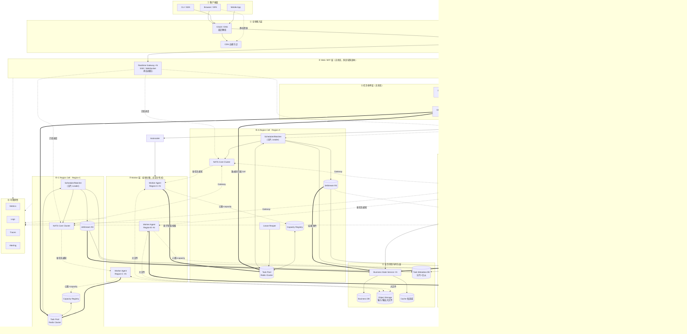

**图例约定**
- `==>` 粗实线 = **强一致关键路径**（原子领取、路由落池）
- `-->` 细实线 = 常规同步/异步调用
- `-.->` 虚线 = **通知 / 事件 / 可丢失**（NATS Core、心跳、遥测）
- `[( )]` 圆柱 = 存储 / 有状态组件

---

## 3. 单 Cell 内部详图（一致性域的边界）

一个 Cell 就是一个**完整的强一致域**，它内部所有领取决策都是线性一致的。

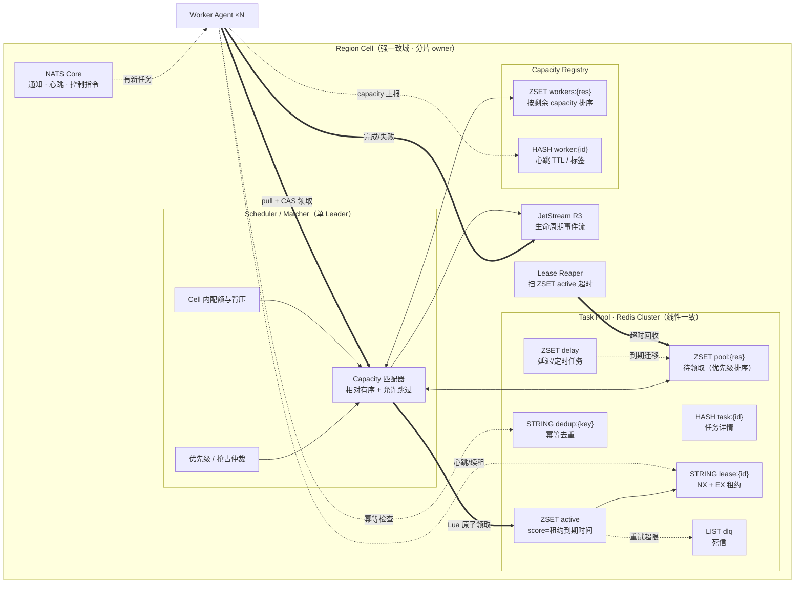

### 3.1 领取为什么是「相对有序 + 可跳过」

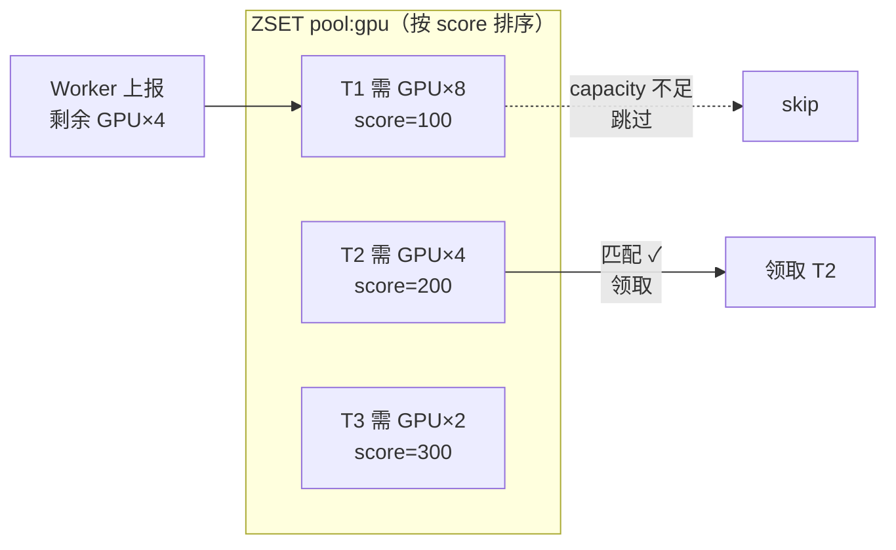

> 这正是你的直觉：**T1 排在最前，但因资源不足被跳过；T2 后到却先执行。** 这个语义消息队列（Kafka/JetStream 按 offset 顺序）无法表达，ZSET + Lua 天然表达。

---

## 4. 消息层职责分工（为什么需要多种）

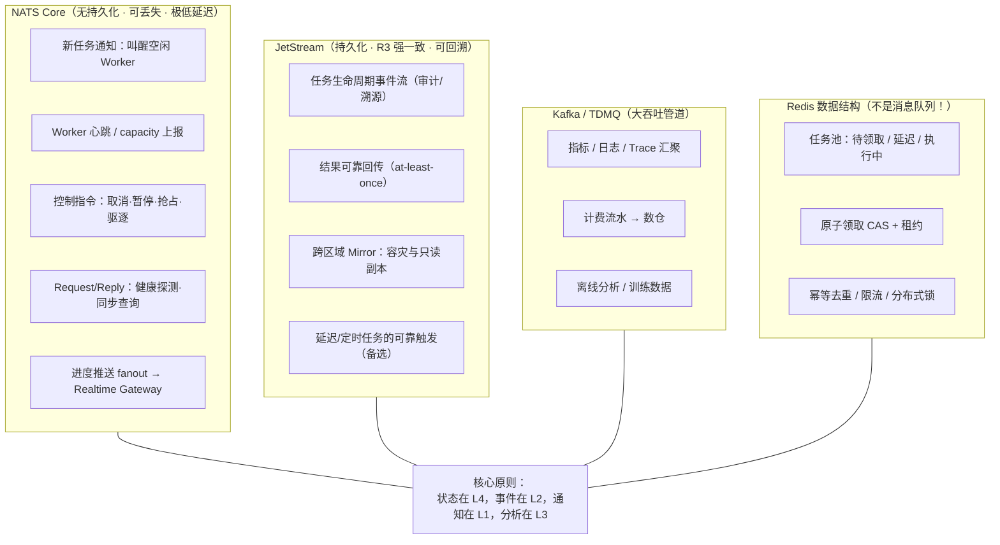

| 如果丢了会怎样 | NATS Core | JetStream | Kafka | Redis 池 |
|---------------|-----------|-----------|-------|---------|
| 影响 | Worker 晚几秒轮询到 | 审计缺失、结果需补偿 | 报表延迟 | **任务丢失，不可接受** |
| 可靠性要求 | 低（有兜底轮询） | 高 | 中 | **最高（+ DB 双写）** |

---

## 5. 一致性域划分图（最关键的一张）

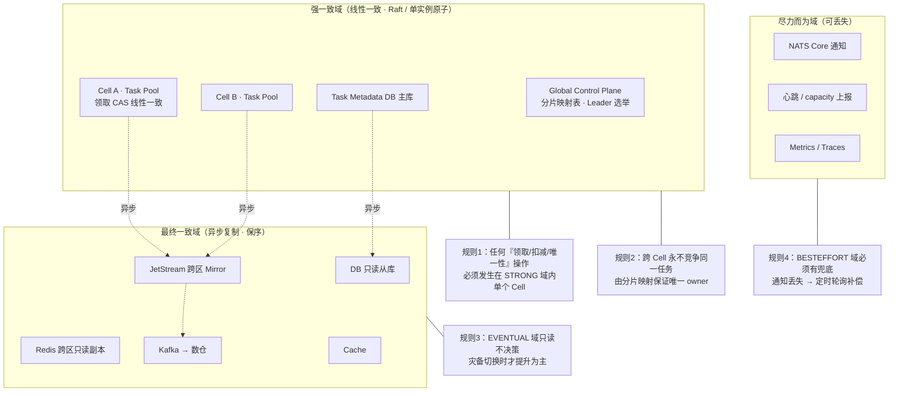

---

## 6. 任务生命周期状态机

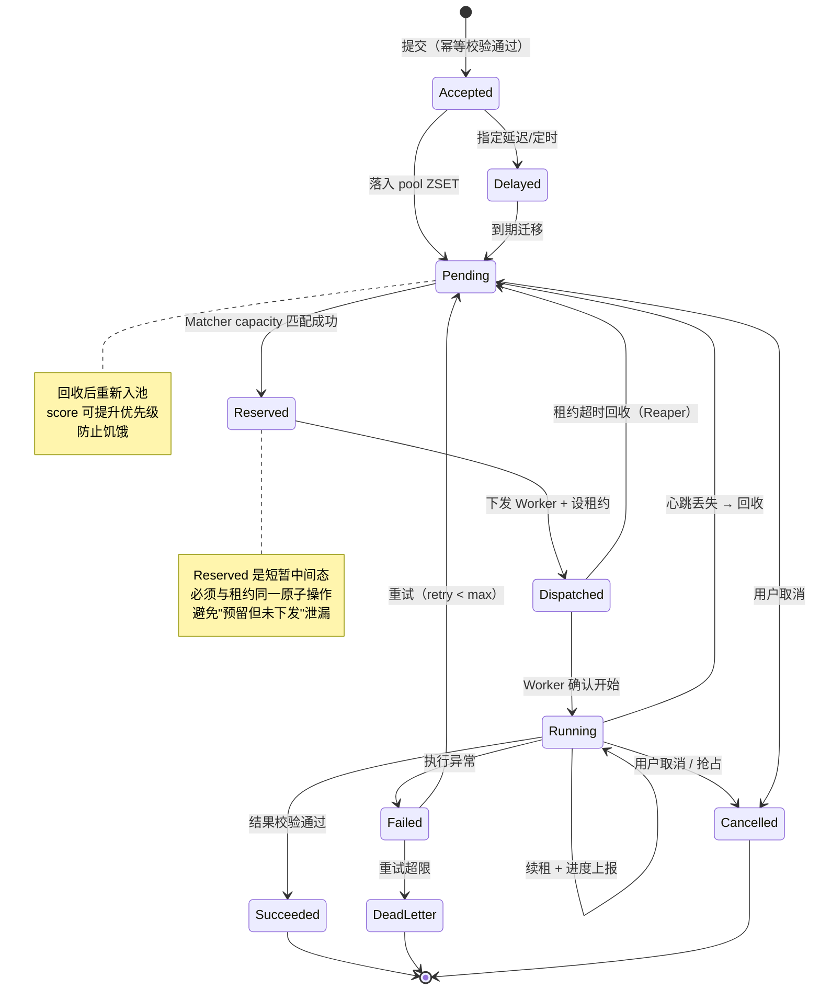

---

## 7. 场景时序图

### 7.1 场景一：任务提交 → 匹配领取 → 执行 → 进度推送（主链路）

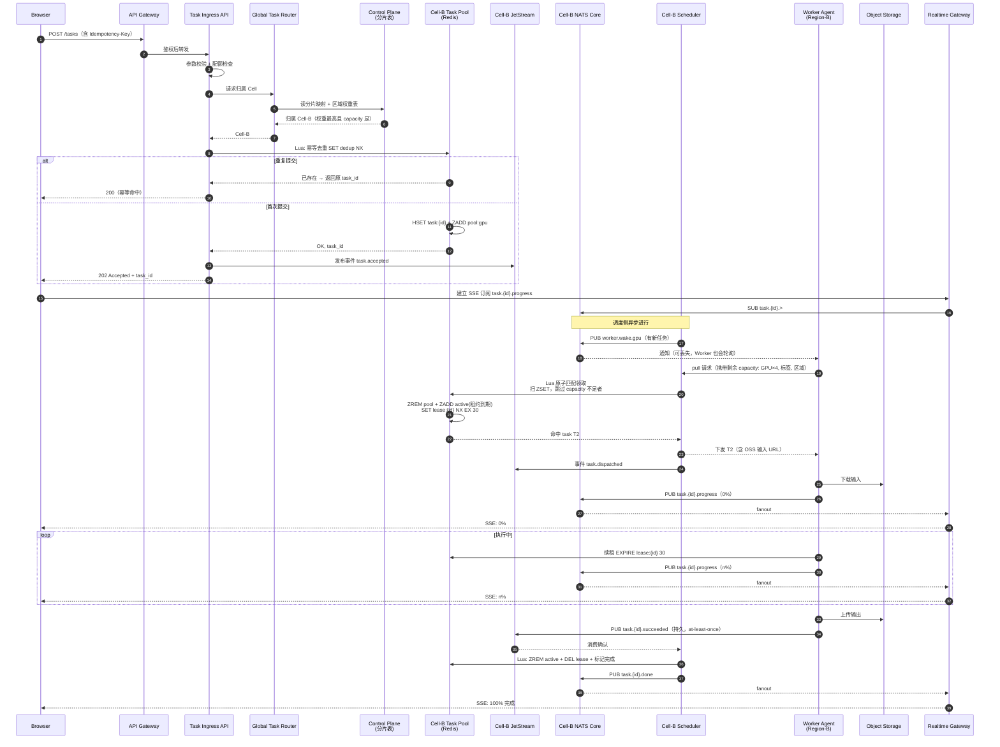

### 7.2 场景二：Worker 宕机 → 租约超时 → 回收重派（可靠性核心）

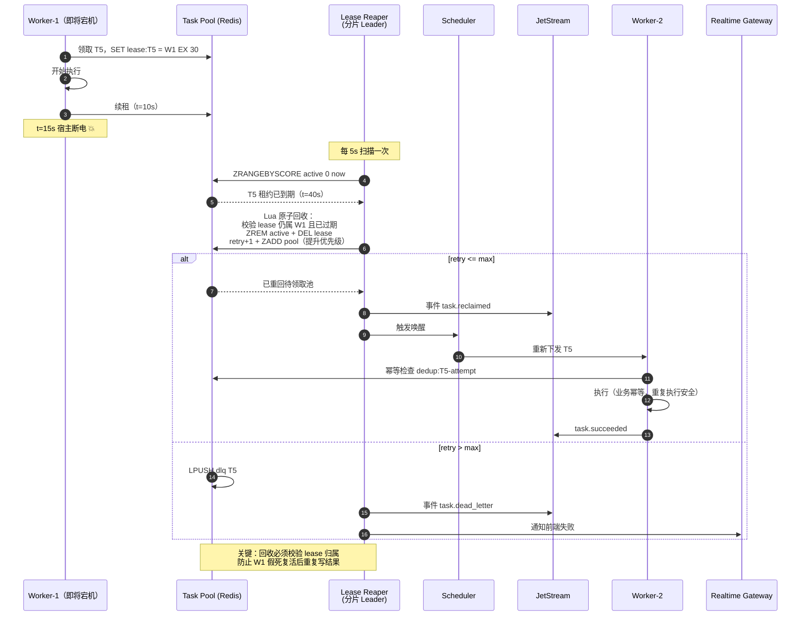

### 7.3 场景三：跨区域路由 + Cell 故障转移

```mermaid
sequenceDiagram
    autonumber
    participant API as Task Ingress API
    participant RT as Global Task Router
    participant CP as Control Plane (Raft)
    participant HM as Region Health Monitor
    participant PA as Cell-A Pool（故障）
    participant JA as Cell-A JetStream
    participant JB as Cell-B JetStream（Mirror）
    participant PB as Cell-B Pool
    participant PLAN as Placement Planner

    Note over PLAN,CP: 常态：策略驱动路由
    PLAN->>CP: 更新区域权重表（Cell-B 综合评分上升）
    API->>RT: 新任务
    RT->>CP: 读分片表 + 权重
    CP-->>RT: 分片 7 → Cell-A
    RT->>PA: 落池 ✓

    Note over PA: Cell-A 整体故障 💥
    HM->>PA: 健康探测失败 ×3
    HM->>CP: 上报 Cell-A unhealthy
    CP->>CP: Raft 提案：分片 7 owner<br/>A → B（唯一决策，强一致）
    CP-->>RT: 分片表更新（watch 推送）

    Note over JB: 灾备提升
    JA-.异步 Mirror（有 lag）.->JB
    CP->>JB: 提升为主，从 Mirror 重建 Pool
    JB->>PB: 回放事件流，重建待领取任务

    RT->>PB: 新任务落 Cell-B ✓

    Note over PB: ⚠️ 关键风险点
    Note over PB: Mirror 有复制延迟 → 可能丢失<br/>Cell-A 最后几秒已领取记录<br/>→ 靠幂等 + Metadata DB 对账兜底
```

### 7.4 场景四：策略驱动的跨区放置与弹性调度

> 本节描述的是**机制**，不绑定任何具体信号口径。信号如何取值、如何加权，属于策略实现细节（§1.8）。

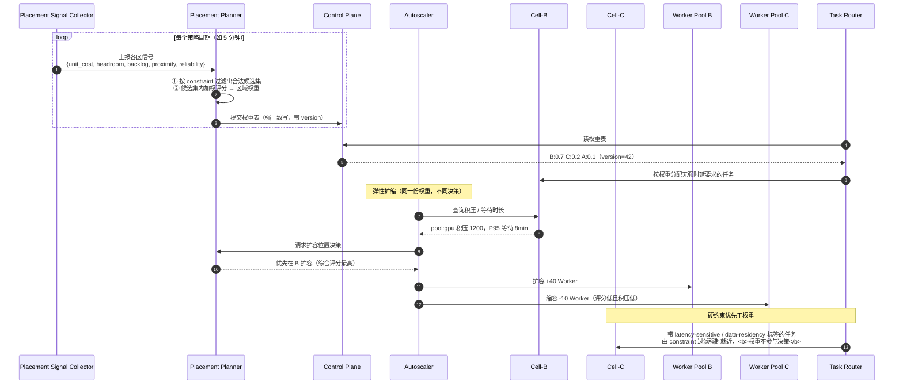

**两条不可违反的规则**：

| 规则 | 理由 |
|------|------|
| **权重只影响"选哪个候选"，不影响"哪些是候选"** | 硬约束（数据驻留、专属池、时延 SLA）必须在过滤阶段处理。否则调低阈值即可绕过合规 |
| **权重表变更不得影响已入池任务的归属** | 已入池任务的 owner Cell 已确定（公理 A2）。权重仅作用于**新任务路由**与**扩缩容位置**；已入池任务的迁移是独立议题（§11.5） |

> 权重表带 `version` 单调递增：Router 缓存旧版本时可继续工作（策略陈旧只影响最优性，不影响正确性）——这是典型的「策略层可最终一致，状态层必须强一致」分层。

### 7.5 场景五：任务取消 / 抢占（控制指令下行）

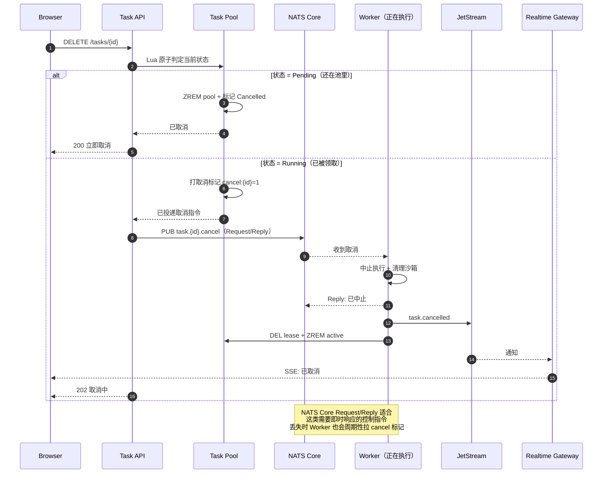

---

## 8. 数据模型（Task Pool 的 Redis 结构）

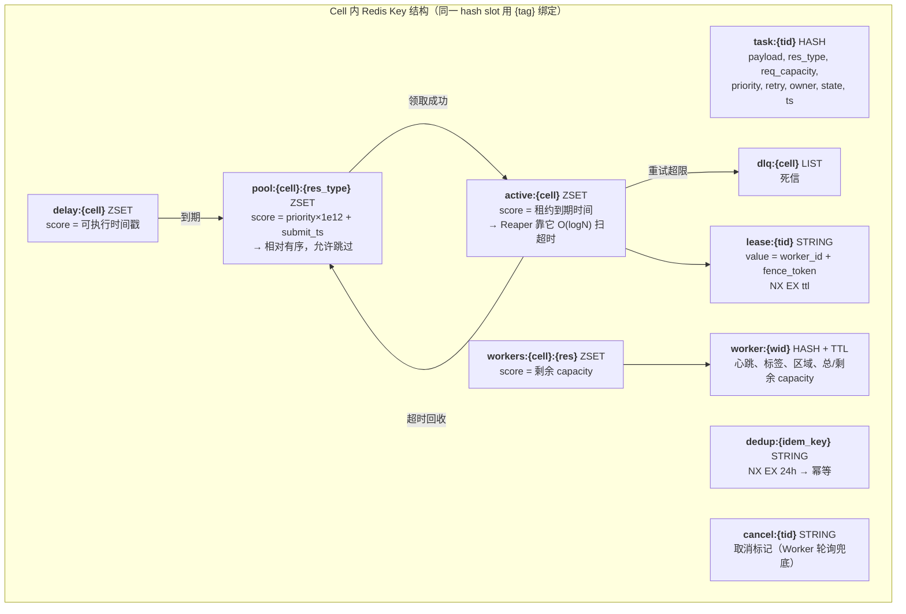

### 8.1 原子领取脚本骨架（伪码）

```lua
-- KEYS[1]=pool:{cell}:{res}  KEYS[2]=active:{cell}
-- ARGV[1]=worker_id ARGV[2]=avail_capacity ARGV[3]=now ARGV[4]=lease_ttl
-- ARGV[5]=scan_limit（候选窗口，如 50）

local cands = redis.call('ZRANGE', KEYS[1], 0, ARGV[5]-1)
for i, tid in ipairs(cands) do
  local t = redis.call('HMGET', 'task:'..tid, 'req_capacity', 'labels', 'state')
  if t[3] == 'pending' and tonumber(t[1]) <= tonumber(ARGV[2])
     and match_labels(t[2], ARGV[6]) then      -- ← 关键：不匹配就 continue（跳过）
    redis.call('ZREM', KEYS[1], tid)
    redis.call('ZADD', KEYS[2], ARGV[3]+ARGV[4], tid)
    redis.call('SET', 'lease:'..tid, ARGV[1]..':'..fence, 'NX', 'EX', ARGV[4])
    redis.call('HSET', 'task:'..tid, 'state','dispatched', 'owner',ARGV[1])
    return tid                                  -- 领到即返回（相对有序）
  end
end
return nil                                      -- 无匹配任务
```

> `fence_token` 单调递增，Worker 回写结果时必须带上，Pool 校验 token 与当前 lease 一致才接受 → 防止假死 Worker 复活后覆盖新执行者的结果（**fencing**，比纯 TTL 锁安全）。

---

## 9. 依赖关系矩阵（强依赖 vs 弱依赖）

| 消费方 ↓ / 依赖 → | Control Plane | Task Pool | JetStream | NATS Core | Metadata DB | OSS |
|---|---|---|---|---|---|---|
| `Task Ingress API` | **强**（路由表） | **强** | 弱 | — | 弱（异步落库） | — |
| `Scheduler/Matcher` | **强**（Leader 选举） | **强** | 弱 | 弱 | 弱 | — |
| `Worker Agent` | — | **强**（领取/续租） | 弱（结果回传，可重试） | 弱（通知，有轮询兜底） | — | **强**（输入输出） |
| `Lease Reaper` | **强**（Leader） | **强** | 弱 | — | — | — |
| `Realtime Gateway` | — | — | 弱 | 弱（丢了可轮询） | — | — |
| `Business State Svc` | — | — | **强**（事件驱动） | — | **强** | 弱 |
| `Autoscaler` | **强** | 弱（读积压） | — | — | — | — |

**强依赖 = 挂了核心功能不可用；弱依赖 = 挂了有降级路径。**
关键结论：**只有 `Control Plane` 和 `Task Pool` 是不可降级的**，其余全部可降级——这决定了 SLO 投入的优先级。

---

## 10. 部署形态与分布式策略汇总

| 组件 | 部署形态 | 一致性 | 扩容方式 | 单点风险 |
|------|---------|--------|---------|---------|
| API Gateway / BFF | 多区域 × N 副本 | 无状态 | 水平 | 无 |
| Realtime Gateway | 多区域 × N 副本 | 连接态 | 水平 + 连接路由 | 单实例挂 → 客户端重连 |
| Task Ingress API | 多区域 × N 副本 | 无状态 | 水平 | 无 |
| **Global Control Plane** | 跨区 3/5 节点 Raft | **线性一致** | 垂直为主 | 失去多数派 → 只读降级 |
| **Scheduler/Matcher** | 每分片 1 Leader + Standby | 分片内强一致 | **增加分片数** | Leader 切换有秒级窗口 |
| **Task Pool（Redis）** | 每 Cell 一套 Cluster | 单实例原子 | 加 slot / 加 Cell | 主从切换可能丢写 → DB 对账 |
| JetStream | 每 Cell R3 + 跨区 Mirror | Cell 内强一致 | 加 Stream / 分区 | 失去 quorum → 只读 |
| NATS Core | 每区集群 + Gateway | 无状态 | 水平 | 无（可丢失） |
| Worker Agent | 全球分散，海量 | 无共享态 | 水平 + Autoscale | 无（租约回收） |
| Metadata DB | 分片 + 主从 | 主库强一致 | 分片 | 主库切换 |
| Object Storage | 托管多区 | 最终一致（对象级强） | 托管 | 低 |

---

## 11. 待讨论的开放问题（下一轮基线）

1. **分片粒度**：按 `task_id hash`、按 `tenant`、还是按 `resource_type + region`？影响热点与迁移成本。
2. **Scheduler 是「Worker pull」还是「Scheduler push」**？pull 更简单抗压，push 更好做全局最优匹配。
3. **抢占策略**：高优任务是否可抢占低优正在执行的任务？涉及检查点/续跑设计。
4. **Redis 持久化等级**：AOF everysec 是否可接受？是否需要 Task Pool 与 Metadata DB 双写 + 定期对账？
5. **跨 Cell 任务迁移**：区域权重显著下降时，已入池未领取的任务是否允许迁移到其他 Cell？（涉及跨 Cell 原子转移，与公理 A2「唯一 owner Cell」直接冲突，需专门设计两阶段移交）
6. **饥饿防护**：大 capacity 任务被反复跳过怎么办？（预留/装箱/老化提权）
7. **多租户隔离**：Cell 内是否需要按租户做公平调度（DRF / 权重轮转）？
8. ~~**Realtime Gateway 连接路由**：客户端断线重连到别的实例，如何继续收到 `task.{id}` 事件？（subject 广播 or 连接注册表）~~ → **已定论**，见 [`realtime-stream-collab.md` §5.1](./realtime-stream-collab.md)：不做连接注册表，改为「共享可回放流 + 任意实例订阅 + 客户端游标」
9. **是否真的需要 Kafka/TDMQ**：如果数仓量不大，JetStream 直出是否够用？（减少一套组件）
10. ~~**Metadata DB 与 Task Pool 的真相来源（SoT）**：谁是权威？~~ → **已定论**，见 [`task-identity-and-sot.md` §4](./task-identity-and-sot.md)：四类权威分工（运行时=Pool / 观测=事件流 / 审计=DB+OSS / 业务=业务服务），单向投影，投影层永不回写运行时权威。
