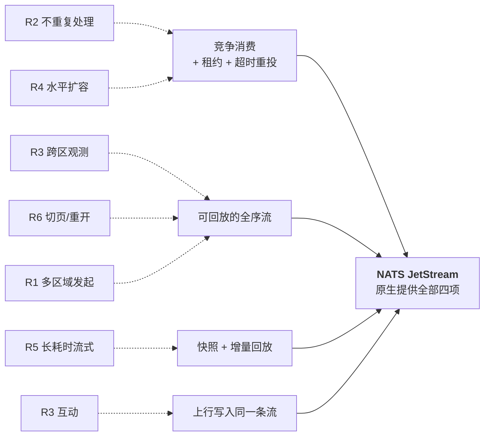
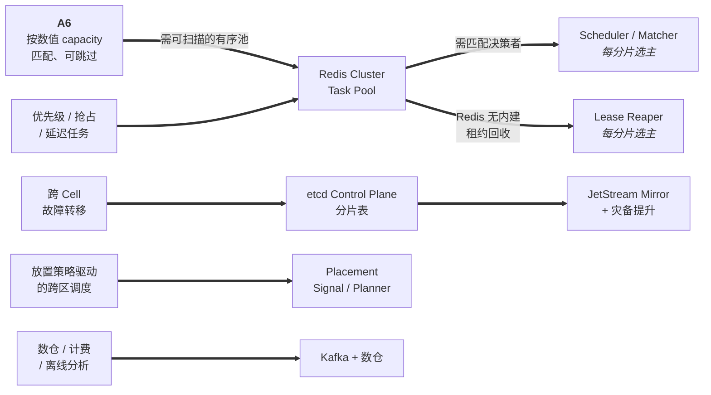
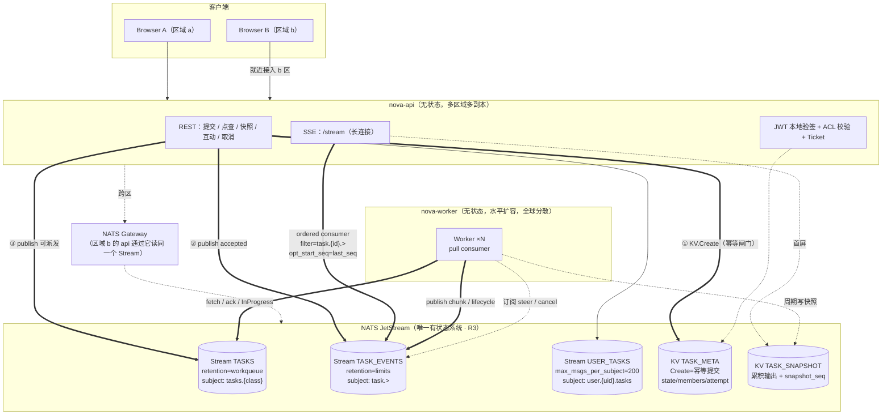
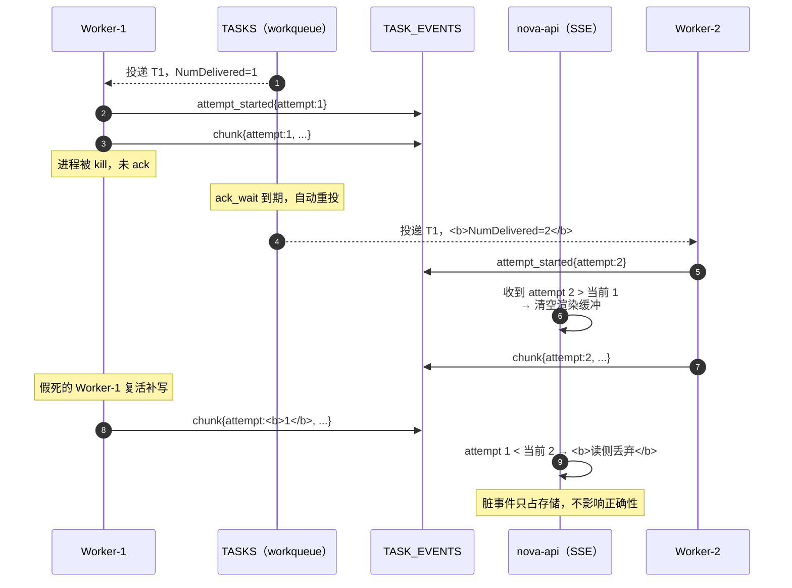
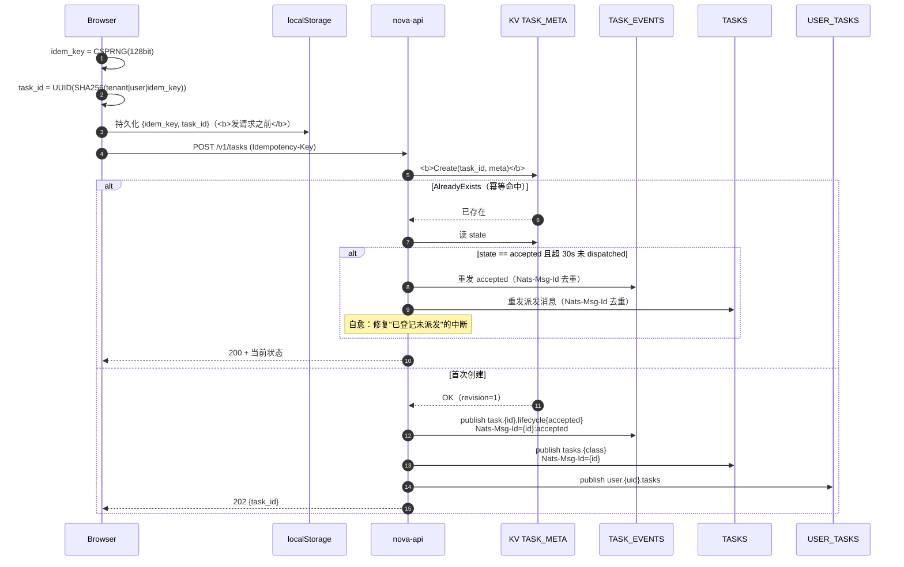
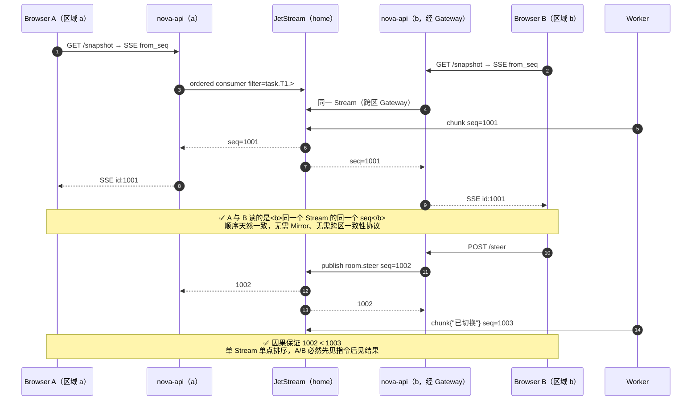
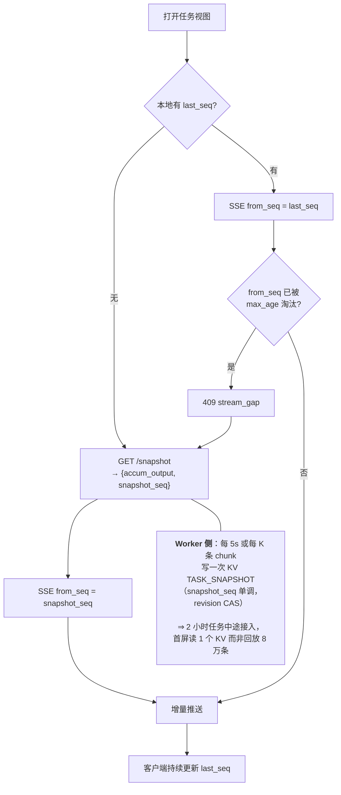
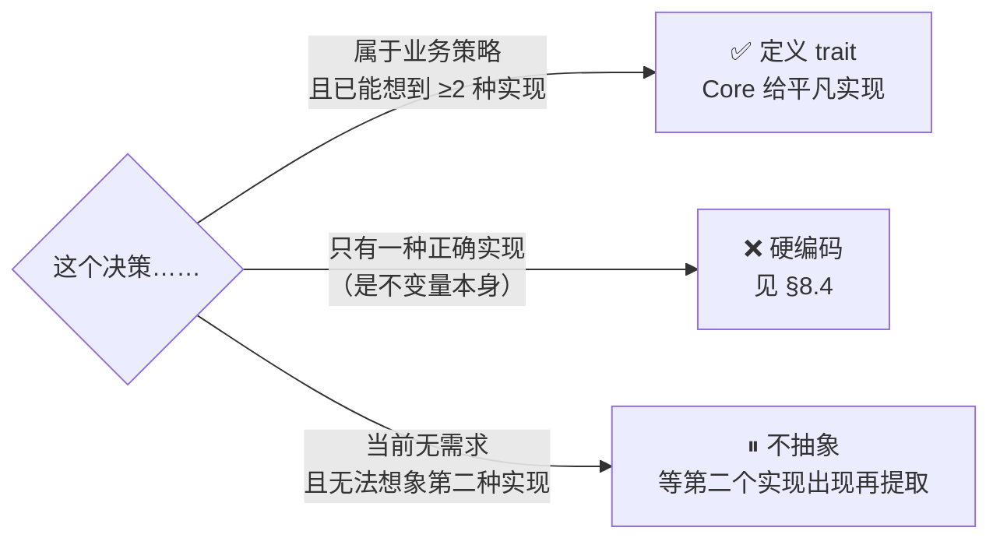
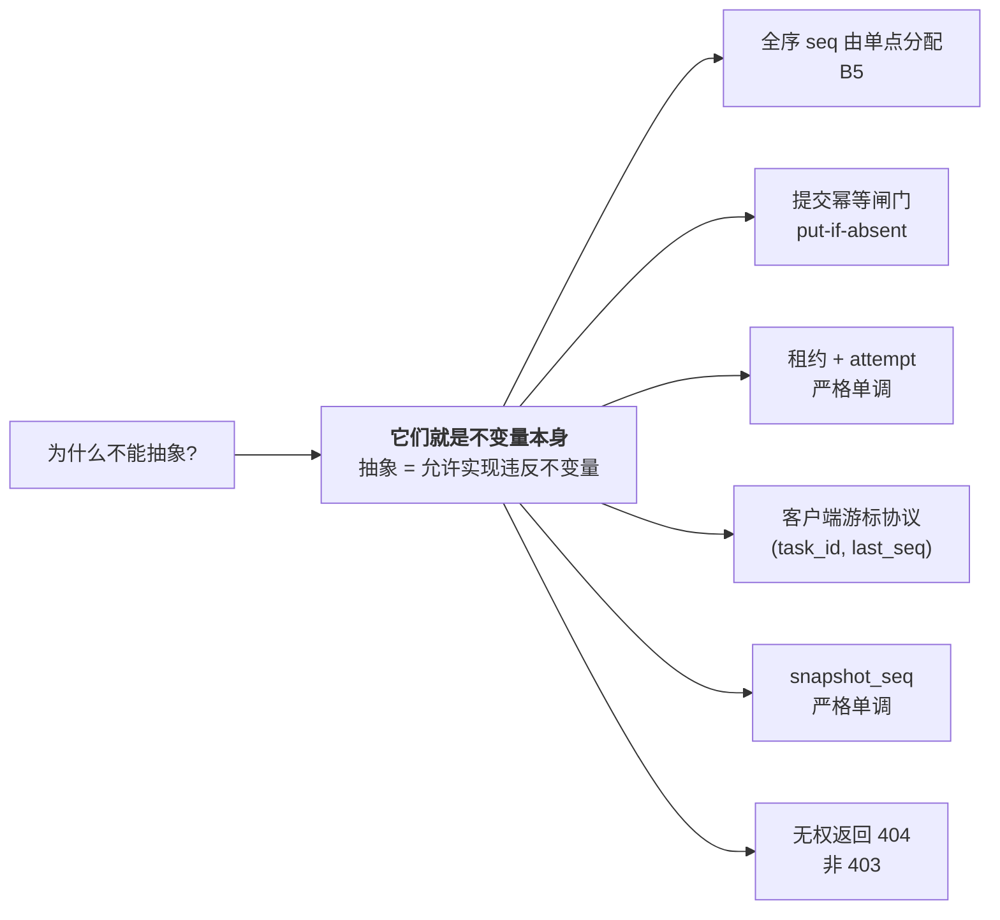

> ⚠️ **本文档已归档（2026-08），不作为设计依据。**
> 现行文档见 [`../README.md`](../README.md) · [`../requirements/spec.md`](../requirements/spec.md) · [`../architecture/invariants.md`](../architecture/invariants.md)。
> 保留目的：追溯早期架构探讨的决策由来。**文内链接可能已失效，属预期情况。**其中仍然有效的结论已提取至 `requirements/` 与 `architecture/`。

---

# nova-nats Core：最小可行系统设计

> ⚠️ **本文核心前提已失效（2026-08）**：`A6`（容量感知匹配 + 无队头阻塞）已确认为**必要需求**，见 [`requirements.md`](./requirements.md) §3。
> 本文 §2 的论证「砍掉 A6 ⇒ 用 workqueue 替代任务池」**不再适用**——纯 FIFO 队列无法表达「跳过容量不匹配的任务」。
>
> **仍然有效的部分**：§4.2 语义边界 · §8 扩展点契约 · §8.4 不可抽象清单 · §9 不可省清单 · §13 B 系列公理对照。
> **已失效的部分**：§2 归约论证 · §3 组件清单 · §4 机制映射（Dispatch 部分）· §5 数据模型（TASKS stream）· §10 配置基线（TASKS/consumer 部分）。
>
> 保留本文的价值：它精确记录了「若无 A6，系统可以简化到什么程度」，是评估 A6 复杂度代价的基准线。

> 版本：v0.1（历史基线）
> 定位：**满足 R1–R6 的最小完备子集**。全量设计见 [`architecture.md`](./architecture.md) / [`realtime-stream-collab.md`](./realtime-stream-collab.md) / [`task-identity-and-sot.md`](./task-identity-and-sot.md) / [`security-authz.md`](./security-authz.md)。
> 本文与全量设计**不是两套架构**：Core 是全量设计的真子集，所有对外契约一致，演进不需要重写。
> 其余需求（优先级 / 抢占 / 数值装箱 / 放置策略 / 数仓 / 故障转移 …）在 §8 以**扩展点契约**形式定义，Core 提供平凡实现，不做面面俱到的实现设计。
>
> **图样约定**：所有流程图使用 `%%{init: {"flowchart": {"curve": "basis"}}}%%` 曲线连线，减少正交折线交叉造成的歧义。

---

## 0. TL;DR

| | 全量设计 | **Core** |
|---|---|---|
| 有状态系统 | Redis Cluster + etcd + JetStream + KV + Metadata DB + Business DB + Kafka + OSS + Cache = **9 类** | **NATS JetStream = 1 类** |
| 需部署的服务 | ~20 个逻辑组件 | **2 个二进制**（`nova-api`、`nova-worker`） |
| 需选主的组件 | Scheduler / Reaper / Outbox Relay（每分片 Leader） | **0 个** |
| 不可降级依赖 | Control Plane + Task Pool | **JetStream（唯一）** |
| 消息通道 | NATS Core + JetStream + Kafka | **JetStream 单通道** |
| 其余需求的处理 | 逐项实现 | **10 个扩展点契约 + 平凡实现**（§8） |
| 满足需求 | R1–R6 + 容量匹配 + 成本放置 + 数仓 + 抢占 | **R1–R6**（其余为契约预留） |

**一句话**：把「按数值 capacity 匹配 + 可跳过」这条需求（原公理 A6）拿掉，Redis Task Pool、Scheduler、Lease Reaper、Control Plane 分片表**四个组件同时消失**，因为 JetStream 的 pull consumer 原生提供了它们的全部替代能力。

---

## 1. 文档集 Review 发现

### 1.1 需要修正的实质问题

| # | 位置 | 问题 | 处理 |
|---|------|------|------|
| 1 | `architecture.md` §2 图 vs §3 图 vs §7.1 时序 | **Worker 领取的对端不一致**：§2 画 `Worker ==原子领取==> Pool`（直连），§7.1 却是 `W->>SC: pull` 再 `SC->>P`（经 Scheduler）。这是 pull / push 两种模型混写，直接影响 Scheduler 是否在关键路径上 | Core 明确为 **Worker 直连，无 Scheduler**；全量设计需在 §11.2 定夺后统一图示 |
| 2 | `architecture.md` A1「任务池是数据结构，不是消息流」 | 该公理的**唯一论据**是 A6（capacity 匹配可跳过）。若无 A6，A1 不成立且成本高昂。公理之间存在隐含依赖但未标注 | 已定位为**范围依赖公理**：A1 ⇐ A6。Core 不采纳 A6 ⇒ 不采纳 A1 |
| 3 | `architecture.md` §9 依赖矩阵 | 结论「只有 Control Plane 和 Task Pool 不可降级」——而这两者**都是为 A6/分片服务的**。即：不可降级的部分全部来自可选需求 | 这正是 Core 能砍到 1 个有状态系统的原因 |
| 4 | `task-identity-and-sot.md` §3.3 | Lua 内嵌 Outbox 依赖「所有 key 同 hash tag」，成立；但 `outbox:pending:{cell}` 用的是 **cell 作 tag**，与 `{task_id}` 不同 slot，该行不在同一原子域内 | Core 无 Redis，问题消失；全量设计需改为每 task 一个 pending 标记或用 Stream 替代 |
| 5 | `realtime-stream-collab.md` §7.1 与 §5.1 | §7.1 称点查「路由到 home Cell」，但 §5.1 又说 RG 无 sticky、任意实例可服务——两处对「是否需要 Cell 路由」表述不一 | Core 无 Cell 概念，统一为单 Stream；全量设计中二者其实不冲突（点查走 Cell、订阅走流），需补一句澄清 |

### 1.2 重复与冗余

| 重复项 | 位置 |
|--------|------|
| steer 语义边界 / 抢占检查点 | `architecture.md` §11.3 与 `realtime-stream-collab.md` §12.5 是同一问题 |
| 分片键选择 | `architecture.md` §11.1 与 `task-identity-and-sot.md` §11.5 是同一问题 |
| 幂等 | 三份文档各写一次，`task-identity-and-sot.md` §9 的三层模型是权威版本 |

### 1.3 缺口

| 缺口 | 影响 |
|------|------|
| **未定义"最小可行子集"** | 无法判断哪些组件是 Day-1 必需 → 本文补齐 |
| 任务输入 payload 大小阈值未定 | 「多大算大、何时必须走 OSS」无界定 |
| Pending 长时间无事件时的 SSE 行为 | 由 keepalive 覆盖，但未显式写明 |

---

## 2. 关键洞察：需求 ≠ 全量设计的假设

对照你的 6 条需求，逐一检查全量设计里的组件是**必需**还是**为额外假设服务**：

**第一步：把 6 条需求归约为 4 项抽象能力**，可见全部落在 JetStream 原生能力内。



**第二步：全量设计的复杂度来自哪里**——每条额外假设都拖出一条组件链。



| | 结论 |
|---|---|
| 左侧 5 项 | **全部是你未提出的需求** |
| 右侧 7 个组件 | **全部由左侧引入，与 R1–R6 无关** |
| 最高杠杆 | 砍掉 `A6` 一刀带走 `Redis Pool` + `Scheduler` + `Lease Reaper` **三个组件、两处选主** |

### 2.1 为什么砍掉 A6 是最高杠杆

### 2.0 为什么砍掉 A6 是最高杠杆

A6 要求「池按优先级排序，领取时可**扫描并跳过** capacity 不匹配的任务」。这个语义消息队列表达不了，所以必须自建 ZSET —— 而一旦自建，就要自己实现租约、回收、重试计数、去重、背压，于是 Redis + Scheduler + Reaper 全部被拖进来。

**但 R2/R4 只要求「不重复处理」和「水平扩容」，这是标准竞争消费语义。** 且大多数真实系统的资源匹配是**按类别**而非按连续数值：

| 匹配方式 | 表达手段 | 是否需要 Redis |
|---------|---------|---------------|
| 按类别（GPU / CPU / 大内存 / 特定模型） | **subject 分流**：`tasks.gpu` / `tasks.cpu`，每类一个 consumer | **否** |
| 按数值 best-fit + 跳过（要 GPU×4，跳过 GPU×8 的任务） | ZSET 扫描 + Lua | **是** |

> **subject 分流覆盖了绝大多数场景**。只有当你确实需要「同一队列内按连续数值做最佳装箱且允许乱序跳过」时，才需要把 Redis 加回来。Core 采用 subject 分流。

---

## 3. Core 组件清单



| 组件 | 形态 | 有状态 | 副本 | 职责 |
|------|------|--------|------|------|
| `nova-api` | 单一二进制 | **无状态**（仅连接态） | 每区域 ≥2 | REST + SSE + 鉴权。合并了全量设计的 API GW / BFF / Ingress / Router / Room API / Realtime Gateway |
| `nova-worker` | 单一二进制 | **无状态** | 任意，按需 | pull → 执行 → 发布事件 → ack |
| `NATS JetStream` | 3 节点集群（home 区）+ 其它区 Gateway | **强状态** | R3 | 任务队列 + 事件流 + KV。合并了全量设计的 Redis / etcd / Metadata DB / NATS Core / Mirror |
| *(可选)* `Postgres` | 单实例 | 强状态 | 1 | 仅当需要复杂列表查询/搜索时加入（§8） |

**被完全删除的组件**：Redis Cluster、etcd、Scheduler/Matcher、Lease Reaper、Capacity Registry、Outbox Relay、对账器、Placement Signal Collector、Placement Planner、Autoscaler、Business State Service、Kafka、数仓、Cache Layer、JetStream Mirror、独立 Auth Service、独立 API Gateway、独立 Realtime Gateway。

---

## 4. 核心机制映射（本文最重要的一张表）

Core 的全部可靠性来自 JetStream 原生能力，**不自建任何一项**：

| 全量设计的机制 | Core 的实现 | 说明 |
|---------------|------------|------|
| Redis ZSET 待领取池 | Stream `TASKS`，`retention=workqueue` | 消息 ack 后即删除，天然是「待办队列」 |
| Lua 原子 CAS 领取 | pull consumer `Fetch()` | 同一条消息在 ack_wait 内只投递给一个实例 |
| `lease:{tid}` NX EX 30 | consumer `ack_wait=30s` | 未 ack 自动重投 = 租约到期回收 |
| Worker 续租 `EXPIRE` | `msg.InProgress()` | 重置 ack_wait 计时器 |
| **Lease Reaper（选主组件）** | **JetStream 内建重投** | **整个组件消失** |
| `retry` 计数字段 | `msg.Metadata().NumDelivered` | 免维护 |
| 重试超限 → DLQ | `max_deliver=N` + 订阅 `$JS.EVENT.ADVISORY.CONSUMER.MAX_DELIVERIES.>` | 落 DLQ stream |
| **`fence_token`（防僵尸写入）** | **`NumDelivered` 即天然单调 fence** | 见 §4.1 |
| `dedup:{idem_key}` | **`KV.Create()`（put-if-absent）** | 等价 `HSETNX`，**永久有效**，不受 dedup window 限制 |
| Cell 内配额 / 背压 | consumer `max_ack_pending` | in-flight 上限 |
| Scheduler 唤醒通知（NATS Core） | pull consumer 长轮询（`FetchBatch` with expires） | 不需要通知通道 |
| 全序 seq 分配 | Stream sequence | 单 Stream 单点串行，天然全序 |
| 断线续订 `opt_start_seq` | ordered consumer + `DeliverByStartSequence` | 原生 |
| 快照存储 | KV bucket（覆盖式 + revision CAS） | 原生 |
| 跨区域观测 | NATS Gateway 跨区订阅同一 Stream | seq 完全一致（同一个 Stream） |
| Metadata DB（审计） | `TASK_EVENTS` 保留窗口 | 事件流即审计日志 |
| 「我的任务」列表 | Stream `USER_TASKS`，`max_msgs_per_subject=200` | 每用户 subject 保留最近 200 条，append-only 无 CAS 竞争 |
| ACL 存储 | KV `TASK_META` 的 `members` 字段 | |

### 4.1 `NumDelivered` 作为 fence token



**Core 采用「读侧过滤」而非「写侧拦截」**：全量设计需要 Stream Ingress 校验 fence 才允许写入；Core 直接让 Worker 发布，由 api 与归档侧忽略过期 attempt。代价是脏数据占存储，收益是**少一个服务**。

### 4.2 必须诚实说明的语义边界 ⚠️

| | Core 的保证 |
|---|---|
| 「任务不会被重复**领取**」 | ✅ ack_wait 内只有一个持有者 |
| 「任务不会被重复**执行**」 | ⚠️ **不保证**。ack_wait 到期后原 Worker 若仍存活，会出现两个实例并行执行同一任务 |
| 「输出不会被污染」 | ✅ 由 §4.1 的 attempt fence 保证 |
| 「外部副作用不会重复」 | ❌ **依赖业务幂等**（公理 A5） |

**这是 at-least-once 语义的固有属性，Redis 方案同样如此**（TTL 锁也会在 Worker 假死时被抢走）。真正的 exactly-once 不存在。

应对：
1. Worker 必须周期 `InProgress()`（建议 `ack_wait/3`），把并行窗口压到极小。
2. `ack_wait` 设为「P99 执行时长 × 1.5」而非固定 30s——长耗时任务尤其重要。
3. **若任务有不可幂等的外部副作用**（扣款、发送邮件、写外部系统），必须在业务侧加幂等键。这是 Core 唯一的硬性业务约束。

---

## 5. 数据模型

### 5.1 Streams

| Stream | retention | subjects | 关键配置 | 用途 |
|--------|-----------|----------|---------|------|
| `TASKS` | `workqueue` | `tasks.*`（`tasks.gpu` / `tasks.cpu` …） | `replicas=3`<br/>`discard=new`<br/>`max_msgs` 上限（背压） | 待派发任务。**每 class 一个 durable pull consumer**（workqueue 要求 consumer filter 不重叠） |
| `TASK_EVENTS` | `limits` | `task.>` | `replicas=3`<br/>`max_age=7d`<br/>`max_msg_size=64KB` | 生命周期 + 流式输出 + 互动。**全序 seq 来源** |
| `USER_TASKS` | `limits` | `user.*.tasks` | `max_msgs_per_subject=200` | 「我的任务」列表索引 |
| `DLQ` | `limits` | `dlq.>` | `max_age=30d` | 重试超限的任务 |

### 5.2 KV Buckets

| Bucket | key | value | 写入方式 |
|--------|-----|-------|---------|
| `TASK_META` | `{task_id}` | `{owner, tenant, members[], class, state, attempt, created_at}` | 提交时 `Create()`（幂等闸门）；后续 `Update(revision)` |
| `TASK_SNAPSHOT` | `{task_id}` | `{snapshot_seq, attempt, accum_output, progress}` | Worker 周期 `Update(revision)`，`snapshot_seq` 必须单调 |

### 5.3 Subject 约定

```
tasks.{class}                     # 待派发（TASKS）
task.{task_id}.lifecycle          # accepted/dispatched/running/succeeded/failed/cancelled
task.{task_id}.attempt            # attempt 边界
task.{task_id}.chunk              # 流式输出（200ms 聚合）
task.{task_id}.progress           # 结构化进度
task.{task_id}.room.msg           # 人类互动
task.{task_id}.room.steer         # 运行中追加指令
task.{task_id}.control.cancel     # 取消
user.{user_id}.tasks              # 用户任务索引
```

### 5.4 Consumers

| Consumer | 类型 | 配置 | 使用者 |
|----------|------|------|--------|
| `worker-{class}` | durable pull on `TASKS` | `filter=tasks.{class}`<br/>`ack_wait=<P99×1.5>`<br/>`max_deliver=4`<br/>`max_ack_pending=<并发上限>` | 所有该 class 的 Worker **共享同一个 consumer** → 竞争消费 |
| *(动态)* SSE 订阅 | **ordered ephemeral** on `TASK_EVENTS` | `filter=task.{id}.>`<br/>`DeliverByStartSequence(last_seq+1)` | 每个 task 在每个 api 实例上**复用 1 个**，实例内 fan-out |
| `worker-ctrl-{task}` | ephemeral on `TASK_EVENTS` | `filter=task.{id}.room.steer, task.{id}.control.>` | Worker 接收 steer / cancel |

> **订阅复用是 Core 也不能省的**：1000 个观众看同一任务，若各建一个 consumer 会打爆 JetStream 元数据。必须 per-(实例, task) 复用（`realtime-stream-collab.md` §5.1 决策 2）。

---

## 6. Core API（8 个端点）

| 方法 | 路径 | 说明 |
|------|------|------|
| `POST` | `/v1/tasks` | 提交。`Idempotency-Key` 必带；`task_id` 客户端本地确定性计算 |
| `GET` | `/v1/tasks/{id}` | 点查（读 `TASK_META`，强一致）。无权限 → **404** |
| `GET` | `/v1/tasks/{id}/snapshot` | 首屏（读 `TASK_SNAPSHOT`，返回 `snapshot_seq`） |
| `POST` | `/v1/tasks/{id}/subscribe` | 换一次性 ticket（TTL 60s） |
| `GET` | `/v1/tasks/{id}/stream` | **SSE**。`?ticket=` + `Last-Event-ID` / `?from_seq=` |
| `POST` | `/v1/tasks/{id}/messages` | 互动消息 |
| `POST` | `/v1/tasks/{id}/steer` | 追加指令（需 `can_write`） |
| `DELETE` | `/v1/tasks/{id}` | 取消 |
| *(附)* `GET` | `/v1/tasks` | 列表（读 `USER_TASKS`，最近 200 条） |

### 6.1 提交流程（无双写事务，靠幂等闸门）



**关键点**：
- `KV.Create` 是**唯一的幂等闸门**，永久有效（不像 `Nats-Msg-Id` 的 dedup window 只有分钟级）。这一点如果搞错，10 分钟后的重放会导致**任务被执行两次**。
- 顺序必须是 `Create → accepted → 派发`：中断在任何一步，任务都是「可观测的」而非「在跑但查不到」。
- 中断自愈由**客户端重试**触发（重开页面时本地算出 task_id 去点查，命中 accepted 停滞则重发）。**Core 不需要独立对账器。**

### 6.2 观测流程（跨区域一致）



> **Core 在跨区域一致性上比全量设计更简单也更强**：因为只有一个 Stream，不存在 Mirror lag，也不存在 seq 映射问题。代价是每个跨区事件走一次 Gateway（观众多时带宽线性增长）——这正是 Mirror 的引入触发条件（§8）。

### 6.3 长耗时 + 重连（R5 + R6）



---

## 7. Core 如何满足 R1–R6（逐条论证）

| # | 需求 | Core 的满足方式 | 依赖的原语 |
|---|------|----------------|-----------|
| R1 | 多区域 Web 发起任务 | `nova-api` 无状态多区域部署；写请求经 Gateway 落 home Stream | NATS Gateway |
| R2 | 分布式领用不重复 | workqueue stream + 共享 durable pull consumer；`ack_wait` 租约；`NumDelivered` fence 保证输出不污染 | `workqueue` / `ack_wait` / `NumDelivered` |
| R3 | 跨区观测 + 互动 | 输出与互动写入**同一个 Stream**，A/B 读同一 seq 序列；因果顺序天然一致 | 单 Stream 全序 |
| R4 | 设备水平扩容 | Worker 无状态，加实例即加消费能力（同一 consumer 竞争消费），无中心分发瓶颈 | pull consumer |
| R5 | 长耗时流式输出 | `TASK_EVENTS` 持久可回放（`max_age=7d`）+ KV 快照跳过历史 | Stream + KV |
| R6 | 切页 / 重开 / 换设备 | 客户端仅持 `(task_id, last_seq)`；`Last-Event-ID` → `DeliverByStartSequence`；task_id 本地可算，孤儿任务自愈 | ordered consumer + 确定性 ID |

**没有一条需要 Redis / etcd / 选主 / 跨区一致性协议。**

---

## 8. 扩展点契约（Protocol / Trait）

前期架构设计对「同类问题」只需定义**契约与不变量**，不需要面面俱到的实现。Core 为每个扩展点提供一个**平凡但完备**的默认实现，后续演进只是替换实现。

### 8.1 抽象原则（五条硬规则）

| # | 规则 | 违反后果 |
|---|------|---------|
| **P1** | **扩展点只输出决策，不持有状态** | 实现变成有状态服务 → 需要选主、需要一致性，复杂度反噬 |
| **P2** | **扩展点不得跨越强一致边界**：不参与 seq 分配、幂等闸门、租约续期、快照 CAS | 一个策略 bug 就能破坏任务正确性 |
| **P3** | **每个扩展点必须有可运行的默认实现**（Null Object） | 抽象出「必须有人实现才能跑」的接口 = 把复杂度提前引入 Day-1 |
| **P4** | **不变量由调用方断言，不信任实现** | 换实现时静默破坏正确性，且无处报错 |
| **P5** | **硬约束（filter）与软偏好（score）分离** | 出现「偏好分足够高就能违规」——合规事故（延续公理 A8） |

**何时该抽象、何时不该**：



> P3 与「等第二个实现出现再提取」并不矛盾：**已知会变化**的维度（下表 10 项，均已在全量设计中出现第二种实现）现在就定契约；未知的不预留。

### 8.2 扩展点全景

```mermaid
%%{init: {"flowchart": {"curve": "basis", "rankSpacing": 100, "nodeSpacing": 30}}}%%
flowchart LR
    subgraph CORE["<b>不可替换核心</b>（正确性不变量）"]
        direction TB
        K1["全序 seq 单点分配"]
        K2["幂等闸门 KV.Create"]
        K3["租约 + attempt fence 单调"]
        K4["客户端游标 (task_id, last_seq)"]
        K5["snapshot_seq 单调"]
    end

    subgraph EXT["<b>扩展点</b>（Core 给平凡实现）"]
        direction TB
        T1["Placement 放置域"]
        T2["Dispatch 待办与领取"]
        T3["Match 能力匹配"]
        T4["OrderPolicy 排序/优先/延迟"]
        T5["RetryPolicy 重试与终止"]
        T6["Authz 权限判定"]
        T7["SnapshotCodec 快照编解码"]
        T8["ArtifactStore 大产物"]
        T9["EventSink 事件外送"]
        T10["FailoverPolicy 域故障"]
    end

    EXT -->|"只读取、只返回决策"| CORE
    CORE -->|"断言不变量<br/>拒绝违规决策"| EXT
```



| # | 扩展点 | 决策什么 | **Core 默认实现** | 替换触发条件（量化） |
|---|--------|---------|------------------|---------------------|
| T1 | `Placement` | 任务去哪个执行域 | `SingleDomain`（恒返回唯一域） | 出现多区域算力差异 / 数据驻留要求 |
| T2 | `Dispatch` | 待办如何存储与领取 | `WorkQueueStream`（JetStream） | 需要 T3/T4 的非平凡实现时被迫一起换 |
| T3 | `Match` | worker 能否领此任务 | `ClassMatch`（subject 分流） | 装箱率 < 60% 或大任务反复饥饿 |
| T4 | `OrderPolicy` | 排序 / 优先级 / 延迟 / 抢占 | `FifoWithinClass` | 高优任务 P95 等待不达 SLO |
| T5 | `RetryPolicy` | 失败后重试还是终止 | `FixedMaxDeliver(4)` | 需按错误类型区分（永久失败不该重试 4 次） |
| T6 | `Authz` | 谁能读 / 写 / 管 | `MemberList`（KV 成员表） | 引入分享链接 / 组织 RBAC / 即时撤销 |
| T7 | `SnapshotCodec` | 如何压缩累积输出 | `TextAccum`（字符串拼接） | 输出为图像 / 表格 / 二进制 |
| T8 | `ArtifactStore` | 大产物存哪 | `InlineUpTo64KB` | 单产物 > 64KB 或需 > 7d 保留 |
| T9 | `EventSink` | 事件外送到哪 | `Noop` | 需要计费 / BI / 长期审计 |
| T10 | `FailoverPolicy` | 域故障时怎么办 | `FailFast`（拒写 + 只读降级） | 可用性 SLO > 99.9% |

### 8.3 契约定义

以下为语言中立伪码。**关键不在签名，而在每项的「不变量」**——那是换实现时不可破坏的部分。

#### T1 `Placement` — 放置域

```
trait Placement {
  // 硬约束过滤：返回合法候选域（P5：与 score 严格分离）
  fn candidates(task: TaskSpec) -> Set<DomainId>
  // 软偏好打分：仅在候选集内排序
  fn score(domain: DomainId, signals: SignalSnapshot) -> f64
}
```
| | |
|---|---|
| **不变量** | ① `candidates` 为空 ⇒ 任务拒收（**不得回退到任意域**）② 已入池任务的域**永不因策略变更而改变**（公理 A2）③ `score` 只影响新任务路由与扩缩容位置 |
| **Core 实现** | `candidates` 恒返回 `{home}`；`score` 恒返回 `1.0`。**信号采集器不存在** |
| **调用方断言** | 返回域必须在已注册域集合内；否则 fail-fast 而非静默降级 |

#### T2 `Dispatch` — 待办存储与领取

```
trait Dispatch {
  fn enqueue(task: TaskSpec) -> Result<()>            // 必须幂等（同 task_id 重复调用无副作用）
  fn claim(worker: WorkerProfile) -> Option<Lease>    // 竞争消费，同一任务同时只归一个 Lease
  fn heartbeat(lease: Lease) -> Result<()>            // 续租
  fn complete(lease: Lease) -> Result<()>             // 完成并移除
  fn release(lease: Lease, reason) -> Result<()>      // 主动放回
}
```
| | |
|---|---|
| **不变量** | ① `claim` 返回的 `Lease` 携带**单调递增的 `attempt`**（fence 来源）② 超时未 `heartbeat` 必须自动回收 ③ `enqueue` 幂等 ④ 队列满时**拒新**而非丢旧 |
| **Core 实现** | `WorkQueueStream`：`Fetch` / `InProgress` / `Ack` / `Nak`；`attempt = NumDelivered` |
| **全量实现** | `RedisPoolDispatch`：Lua CAS + `lease:{tid}` + Lease Reaper |
| **注意** | 这是**唯一同时承担状态的扩展点**，因此它是 P1 的例外 —— 换实现时必须整体替换存储，不能只换决策逻辑。这也说明 T2 的抽象边界价值有限，**其真正作用是隔离 T3/T4** |

#### T3 `Match` — 能力匹配

```
trait Match {
  fn eligible(task: TaskSpec, worker: WorkerProfile) -> bool
  fn scan_limit() -> usize   // 0 = 不扫描（队列语义）；>0 = 扫描候选窗口（池语义）
}
```
| | |
|---|---|
| **不变量** | ① `eligible` 必须**纯函数**（同输入同输出，无副作用，不查外部状态）② `scan_limit() == 0` 时 `Dispatch` 可用队列实现；`> 0` 时必须用可扫描池 |
| **Core 实现** | `ClassMatch`：`task.class == worker.class`，`scan_limit = 0` |
| **全量实现** | `NumericBestFit`：`task.req_capacity <= worker.avail`，`scan_limit = 50` |
| **关键** | `scan_limit()` 就是 **A6 开关**。它从 0 变为非 0 的那一刻，T2 必须换成池实现 —— **把「为什么加 Redis」变成一个显式的接口返回值，而不是一次架构重写** |

#### T4 `OrderPolicy` — 排序 / 优先级 / 延迟 / 抢占

```
trait OrderPolicy {
  fn rank(task: TaskSpec, now: Instant) -> i64         // 越小越先
  fn visible_at(task: TaskSpec) -> Instant             // 延迟/定时
  fn preemptable(running: TaskRef, incoming: TaskSpec) -> Option<PreemptPlan>
}
```
| | |
|---|---|
| **不变量** | ① `rank` 必须含**老化项**（防饥饿：等待越久 rank 越小）② `preemptable` 返回 `Some` 要求被抢占任务**可检查点或可安全重放**，否则必须返回 `None` ③ 抢占产生的中断必须走 `attempt` 分段，不得续写原 attempt |
| **Core 实现** | `FifoWithinClass`：`rank = submit_ts`；`visible_at = now`；`preemptable = None` |
| **提醒** | 抢占是全量设计 §11.3 的开放问题。**Core 明确返回 `None`，把该问题冻结为契约的一个取值**，而不是留在文档里悬空 |

#### T5 `RetryPolicy` — 重试与终止

```
trait RetryPolicy {
  fn on_failure(attempt: u32, err: ErrorClass) -> Decision  // Retry{after} | DeadLetter | Cancel
}
```
| | |
|---|---|
| **不变量** | ① 必须在有限次内收敛到 `DeadLetter`（禁止无限重试）② `ErrorClass::Permanent`（如参数非法）**不得** `Retry` |
| **Core 实现** | `FixedMaxDeliver(4)`：`attempt < 4 → Retry`，否则 `DeadLetter` |
| **注意** | Core 未区分 `ErrorClass`，意味着参数错误也会重试 4 次。**这是已知缺陷**，是 Day-2 第一个该换的实现 |

#### T6 `Authz` — 权限判定

```
trait Authz {
  fn decide(subject: Subject, perm: Perm, task: TaskRef) -> Decision  // Allow | Deny
  fn epoch(task: TaskRef) -> u64      // 单调递增；变化 ⇒ 长连接需复验
  fn max_stale() -> Duration          // 决策缓存上限 = 撤销生效时间上限
}
```
| | |
|---|---|
| **不变量** | ① `Deny` 一律对外表现为 **404**（不得 403，防存在性枚举）② `epoch` 单调递增 ③ 实际撤销生效时间 ≤ `max_stale()`，且该值必须对外承诺 ④ `Perm::Read` 与 `Perm::Write` 独立判定 |
| **Core 实现** | `MemberList`：读 `TASK_META.members`；`max_stale = 60s`；`epoch` = KV revision |
| **扩展形态** | 分享链接 Capability / 组织 RBAC / 即时撤销（`max_stale = 0` ⇒ 每事件校验） |

#### T7 `SnapshotCodec` — 快照编解码

```
trait SnapshotCodec {
  fn fold(prev: Snapshot, event: Event) -> Snapshot   // 必须满足：可交换律不要求，但必须严格按 seq 顺序折叠
  fn encode(s: Snapshot) -> (Bytes, Option<ArtifactRef>)   // 超阈值时外置
  fn decode(b: Bytes, r: Option<ArtifactRef>) -> Snapshot
}
```
| | |
|---|---|
| **不变量** | ① `fold` 必须**幂等于 seq**：重复折叠同一 seq 结果不变 ② 编码结果必须携带 `snapshot_seq` ③ `encode` 结果 > 256KB 必须外置到 `ArtifactStore` |
| **Core 实现** | `TextAccum`：字符串追加，`snapshot_seq = 最后折叠的 seq` |
| **扩展形态** | 图像逐步生成（保留最新帧引用）、表格（保留行集）、结构化状态机 |
| **对应** | 这是 `realtime-stream-collab.md` §12.1 开放问题的契约化 |

#### T8 `ArtifactStore` / T9 `EventSink` / T10 `FailoverPolicy`

```
trait ArtifactStore {
  fn put(task: TaskRef, blob: Bytes) -> ArtifactRef     // 不变量：ref 不可变、可寻址
  fn presign_get(r: ArtifactRef, ttl) -> Url            // 不变量：URL 必须带过期，不得公开可读
}

trait EventSink {
  fn emit(events: &[Event], cursor: Seq) -> Result<Seq> // 不变量：必须返回已消费位点，供断点续传
}

trait FailoverPolicy {
  fn on_domain_unhealthy(d: DomainId) -> Action         // ReadOnly | Reroute{to} | FailFast
}
```
| trait | Core 实现 | 不变量要点 |
|-------|----------|-----------|
| `ArtifactStore` | `InlineUpTo64KB`（超限即拒收，返回明确错误） | 预签名 URL 必须过期；ref 不可变 |
| `EventSink` | `Noop`（恒返回最新位点） | 必须返回位点，否则换实现时无法断点续传 |
| `FailoverPolicy` | `FailFast`：拒绝写入 + 观测降级只读 + 下发 `degraded` 事件 | **只读降级期间必须拒绝上行写入**，否则破坏全序（B4/B5） |

### 8.4 不可抽象的部分（硬编码，且不提供开关）



| 硬编码项 | 若做成可配置会发生什么 |
|---------|----------------------|
| 全序 seq 单点分配 | 有人配成多点分配 → A/B 看到相反因果顺序，跨区协作产生严重误解 |
| 幂等闸门 | 有人配成「TTL 窗口去重」→ 窗口外重放导致任务执行两次 |
| 租约 / attempt 单调 | 有人配成可重置 → 僵尸 Worker 输出与新 attempt 交织 |
| 客户端游标协议 | 有人改成服务端会话态 → R6 全部失效，需要 sticky 路由 |
| `snapshot_seq` 单调 | 快照回退 → delta 起点错误 → 静默丢事件 |
| 404 而非 403 | 确定性 task_id 可预测 ⇒ 403 直接泄露任务存在性 |

> **判据**：如果一个"配置项"的某个取值会让系统变得**不正确**（而非只是变慢或变弱），它就不该是配置项。

### 8.5 演进路径


**每一步都是替换某个扩展点的实现，而非重写架构。** 对外 API 契约、事件 subject、seq 语义、客户端游标协议在 Core 中已与全量设计一致。

唯一的**架构级断点**是 `T3.scan_limit()` 从 0 变为非 0：它迫使 `T2` 从队列换成池，是全链路改动最大的一步。因此需要提前判断——若已明确会需要数值装箱，可以考虑 Day-1 就用池实现（但仍建议先跑 Core 收集真实装箱率数据）。

### 8.6 被砍能力与后果对照

| 砍掉的能力 | 后果 | 对应扩展点 |
|-----------|------|-----------|
| 数值 capacity 匹配 + 跳过 | 只能按 class 分流，无最佳装箱 | T3 |
| 优先级 / 抢占 / 延迟任务 | FIFO within class | T4 |
| 错误分类重试 | 永久失败也重试 4 次 | T5 |
| 放置策略 / Autoscaler | 手动扩缩，无跨域优化 | T1 |
| 多域 / 故障转移 | JetStream 失去 quorum ⇒ 全站写不可用 | T1 + T10 |
| Metadata DB | 无复杂查询；7d 后事件淘汰 | T9 |
| OSS 归档 | 产物受 64KB 限制 | T8 |
| Kafka / 数仓 | 无计费与 BI | T9 |
| 分享链接 / 即时撤销 / 差异化脱敏 | 只能显式邀请；撤销 ≤60s | T6 |
| 结构化快照 | 仅支持文本累积输出 | T7 |
| JetStream Mirror | 跨区带宽 O(事件数 × 跨区观众数) | *(无 trait，读路径优化)* |
| NATS Core 快通道 | 200ms 批量刷新，非逐字流 | *(无 trait，读路径优化)* |

---

## 9. Core 中不可省的部分（看起来能砍，实际不能）

这几项常被当作「优化」砍掉，但砍掉会直接导致 R1–R6 不成立：

| 项 | 为什么不能省 | 省掉的后果 |
|----|-------------|-----------|
| **KV 快照** | R5 的唯一解 | 2h 任务重开页面要回放数万条，首屏几十秒 + 带宽爆炸 |
| **确定性 task_id** | R6 的孤儿任务解 | 「提交后立刻关页面」产生永久孤儿任务 |
| **`KV.Create` 幂等闸门** | R2 的正确性基础 | 重放提交（尤其超出 dedup window 后）导致任务执行两次 |
| **attempt fence（`NumDelivered`）** | R2 + R5 | 僵尸 Worker 输出与新 attempt 交织，前端内容错乱 |
| **投影/快照记录 `snapshot_seq`** | R5 + R6 的衔接 | delta 起点不确定 → 重复渲染或静默丢事件（生产偶发，测试难复现） |
| **per-(实例, task) 订阅复用** | R3 的可扩展性 | 热门任务 1000 观众 → 1000 个 consumer 打爆 JetStream |
| **一次性 SSE ticket** | 安全底线 | `EventSource` 带不了 header，替代方案是长期 token 进 URL/日志 |
| **无权限返回 404** | 安全底线 | 确定性 task_id 可预测，403 会泄露任务存在性 |
| **`409 stream_gap`** | 正确性 | 服务端「补一半」会造成静默数据缺口 |
| **客户端重连 jitter 退避** | 可用性 | api 滚动升级时万级连接同时重连打垮新实例 |
| **Worker `InProgress()` 心跳** | R2 | 长耗时任务必然超 `ack_wait` → 被重复派发 |

> 与 §8 的关系：**这 11 项都不是扩展点**。它们是 §8.4 所列不变量的具体载体——按 P2 规则，扩展点不得触碰它们。

---

## 10. 关键配置基线

```yaml
# ---- Streams ----
TASKS:
  retention: workqueue
  subjects: ["tasks.*"]
  replicas: 3
  discard: new              # 满了拒绝新消息（背压），不丢老任务
  max_msgs: 1_000_000
  duplicate_window: 2m      # 仅防瞬时重复；永久幂等由 KV.Create 负责

TASK_EVENTS:
  retention: limits
  subjects: ["task.>"]
  replicas: 3
  max_age: 7d               # ≥ 最长任务时长 + 用户回看窗口
  max_msg_size: 64KB        # 超出走 artifact 引用
  duplicate_window: 2m

USER_TASKS:
  subjects: ["user.*.tasks"]
  max_msgs_per_subject: 200
  replicas: 3

# ---- Consumer（每 class 一个）----
worker-gpu:
  filter_subject: tasks.gpu
  ack_policy: explicit
  ack_wait: 90s             # = P99 单步执行时长 × 1.5，配合 InProgress()
  max_deliver: 4
  max_ack_pending: 200      # 全局在途上限 = 背压

# ---- KV ----
TASK_META:      { replicas: 3, history: 1 }
TASK_SNAPSHOT:  { replicas: 3, history: 1, max_value_size: 256KB }
```

| 参数 | 取值原则 | 取错的后果 |
|------|---------|-----------|
| `ack_wait` | P99 执行时长 × 1.5，且 Worker 每 `ack_wait/3` 调 `InProgress()` | 过小 → 重复执行；过大 → 宕机后恢复慢 |
| `max_age`（TASK_EVENTS） | ≥ 最长任务时长 + 用户回看窗口 | 过小 → 大量 `409 stream_gap` |
| `discard` | `new`（拒新） | 用 `old` 会**静默丢失待办任务** |
| `duplicate_window` | 2m 足够 | **不要依赖它做提交幂等**——必须用 `KV.Create` |
| chunk 聚合窗口 | 200ms | 不聚合 → 事件量与存储成本失控 |
| `max_msg_size` | 64KB | 过大 → 单条事件阻塞流、内存放大 |

---

## 11. 落地清单（Day-1）

| # | 项 | 归属 |
|---|----|------|
| 1 | 创建 2+2 个 Stream、2 个 KV bucket（IaC 声明式） | 基础设施 |
| 2 | 前后端共享 `task_id = UUID(SHA256(tenant\|user\|idem_key))` 实现 | 共享库 |
| 3 | 客户端**提交前**生成并持久化 `idem_key` | 前端 SDK |
| 4 | 提交流程：`KV.Create` → `accepted` → 派发（含停滞自愈） | `nova-api` |
| 5 | SSE：ticket 鉴权 + `from_seq` + per-(实例,task) 复用 + `409 stream_gap` | `nova-api` |
| 6 | 慢客户端处理：chunk 可合并丢弃，lifecycle/room.msg 不可丢 | `nova-api` |
| 7 | ACL：`TASK_META.members` 校验 + 无权 404 + 60s 复验 | `nova-api` |
| 8 | Worker：`Fetch` → `InProgress` 心跳 → 200ms 聚合发 chunk → 每 5s 写快照 → `Ack` | `nova-worker` |
| 9 | Worker：订阅自身 task 的 `steer` / `cancel` | `nova-worker` |
| 10 | 客户端：`last_seq` 持久化 + 重连 jitter 退避 + attempt 切换清缓冲 | 前端 SDK |
| 11 | DLQ：订阅 `MAX_DELIVERIES` advisory 落 DLQ stream | `nova-api` |
| 12 | 渲染侧 Markdown 白名单 sanitizer + CSP | 前端 |
| 13 | **10 个扩展点定义为接口 + 平凡实现**（§8.3），调用方按 §8.3 断言不变量 | 共享库 |

> 第 13 项是 Day-1 唯一的"为未来付出的成本"，约等于 10 个 interface + 10 个几行的默认实现。**不要跳过**——跳过后加回来需要改动关键路径调用点。

### 11.1 验收测试（必过）

| 需求 | 测试 |
|------|------|
| R2 | 20 个 Worker 抢 100 个任务，每个任务恰好成功一次；`kill -9` 一个 Worker，任务在 `ack_wait` 后被另一实例接管，前端正确切换 attempt 且无内容交织 |
| R2 | 提交接口用同一 `idem_key` 重放 100 次（含间隔 10 分钟后重放）→ 只产生 1 个任务、只执行 1 次 |
| R4 | Worker 从 2 → 20 实例，吞吐近线性增长，无任务丢失 |
| R5 | 运行 30 分钟、输出 2 万条 chunk 的任务，中途新开页面首屏 < 500ms 且内容完整无缺 |
| R6 | SSE 断开重连 200 次（随机时点）→ 客户端最终内容与不断开的对照组**逐字节一致** |
| R3 | 区域 a、b 两个客户端观测同一任务，收到的事件 seq 序列**逐条相同**；B 发 steer 后，A/B 看到的 `steer` 与后续 `chunk` 顺序一致 |
| 安全 | 非成员访问返回 404（非 403）；ticket 复用第二次返回 401；用 T1 的 ticket 订阅 T2 被拒 |
| 契约 | **不变量断言测试**：给每个扩展点注入一个故意违规的 mock 实现（`Placement` 返回未注册域、`Match.eligible` 有副作用、`SnapshotCodec` 让 `snapshot_seq` 回退），调用方必须 fail-fast 而非静默接受（验证 P4） |

---

## 12. Core 的已知风险

| 风险 | 严重度 | 缓解 |
|------|--------|------|
| **JetStream 是唯一单点**（失去 quorum → 全站不可用） | 高 | R3 跨 AZ 部署；监控 quorum 与 raft lag；这是 Core 换取简洁性的**自觉代价**，SLO 要求提高时按 §8 引入 Cell 化 |
| at-least-once ⇒ 可能重复执行 | 中 | `InProgress()` 心跳 + 合理 `ack_wait` + **业务侧幂等（硬性要求）** |
| `max_age=7d` 后事件不可回放 | 中 | 需长期留存时按 §8 加 OSS 归档 |
| 跨区事件走 Gateway，带宽随跨区观众线性增长 | 中 | 监控跨区出口带宽，达阈值加 Mirror |
| workqueue stream 要求 consumer filter 不重叠 | 低 | 每 class 一个 consumer，class 集合需提前规划（新增 class 需加 consumer） |
| KV 无二级索引，列表能力弱（每用户最近 200 条） | 低 | 需搜索时加 Postgres 投影 |
| 无独立对账器，依赖客户端重试自愈 | 低 | 若客户端永不回访会留下停滞任务；可加一个扫 `TASK_META` 的定时任务（~50 行） |
| **`T5 RetryPolicy` 未区分错误类型** | 低 | 参数非法等永久错误也会重试 4 次，浪费算力但不影响正确性。Day-2 第一个该换的实现 |
| **`T3.scan_limit()` 由 0 变非 0 是架构级断点** | 低 | 该变更迫使 `T2 Dispatch` 从队列换为池实现，是唯一改动较大的演进步骤（§8.5）；建议先跑 Core 收集真实装箱率再决策 |

---

## 13. 与全量设计的公理对照

| 公理 | Core 是否采纳 | 对应扩展点 |
|------|--------------|-----------|
| A1 任务池是数据结构不是消息流 | ❌ **不采纳**（其论据 A6 不在需求内；Core 用 workqueue stream） | T2 |
| A2 领取是 CAS，落单一强一致点 | ✅ 采纳（单 Stream 即单一强一致点） | — |
| A3 跨区强一致不可得 | ✅ 采纳（Core 更彻底：只有一个 home，不追求跨区） | T1 |
| A4 消息队列负责事件不负责状态 | ⚠️ **部分修正**：Core 中 JetStream **同时**承担状态（workqueue + KV）与事件。这是有意的合并 | T2 |
| A5 一切执行必须幂等 | ✅ **强化为硬性要求**（Core 无 CAS 兜底，更依赖此条） | — |
| A6 相对有序，允许跳过 | ❌ 不采纳（FIFO within class） | **T3.scan_limit=0** |
| A7 Cell 是故障与扩展最小单元 | ❌ 不采纳（Core 单域） | T1 + T10 |
| A8 放置策略是可插拔输入 | ✅ 采纳（**契约化为 T1**，Core 实现为平凡） | T1 |
| B1 输出是可回放的流 | ✅ **核心，不可省** | 不可抽象 |
| B2 Stream 身份 = task_id | ✅ **核心，不可省** | 不可抽象 |
| B3 客户端只需持久化 last_seq | ✅ **核心，不可省** | 不可抽象 |
| B4 输出与互动同一条全序流 | ✅ **核心，不可省** | 不可抽象 |
| B5 全序号由单点分配 | ✅ 采纳（Stream sequence） | 不可抽象 |
| B6 长流必须有快照 | ✅ **核心，不可省** | 编解码可换（T7），机制不可换 |
| B7 写入权限来自 lease + fence | ✅ 采纳（`NumDelivered` + 读侧过滤） | 不可抽象 |
| B8 实时性可降级，正确性不可降级 | ✅ 采纳（Core 无快通道，只有权威通道） | T10 |

> **两条规律**：
> 1. **B 系列（观测与协作）在 Core 中全部保留，且大多落在"不可抽象"列**——它们是正确性不变量。
> 2. **A 系列（任务池与调度）被砍的部分，全部对应到扩展点**——它们是策略。
>
> 这印证了 §2 的判断：你的 6 条需求本质是**观测与协作问题**（不可妥协），而全量设计的复杂度主要来自**调度与放置问题**（可契约化延后）。
