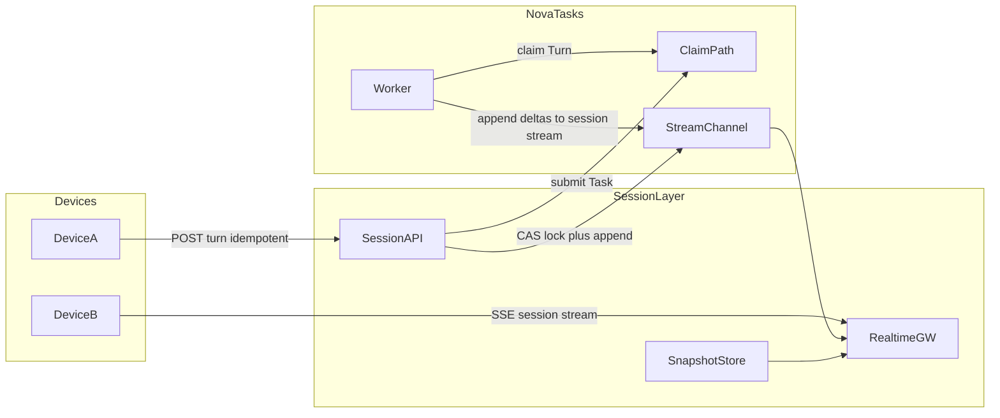
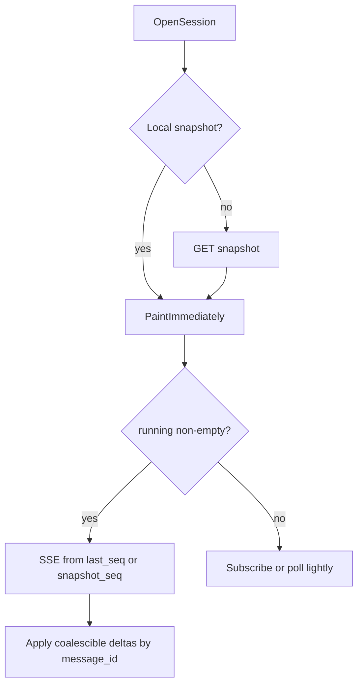

# 草稿：对话层（Session / Conversation）

> ## ⛔ 草稿，不可作为实现依据
>
> 本文落实架构决策 **D18**，供迭代 3「观测与协作」改写时与 [`observation.md`](./observation.md) **一并并入**正式设计。未完成与事件模型、存储端口的对齐前，**禁止按本文写生产代码**。
>
> | 本文内容 | 与基线关系 | 处置 |
> |---------|-----------|------|
> | Session 可回放日志 + per-session seq | **D18 已定** | 保留 |
> | Turn = Task；不按 Session 粘滞领取 | **D18 / D16** | 保留 |
> | 方案 A：全事件进 Session 流 | **D18 已定** | 保留；配套快照+可合并+写入聚合 |
> | 同 Session ≤5 订阅者、无分层扇出 | **D18 已定** | 保留 |
> | 不可并行 Turn（`max_in_flight=1`） | **D18 当前策略** | 字段预留 `running[]` / `message_id` |
> | TextDelta 聚合窗口 | **本期不定** | 配置项，设计时留旋钮 |
> | StreamChannel 第一适配器：**Redis Streams** | **D18 / D14** | 绿场默认；JetStream 留作跨区副本阶段选项 |
> | 跨区：一期回源、二期 Mirror（实测触发） | **D18** | 保留；与 D8 领取单域分开 |
> | 热→冷卸载；非「可丢弃」 | **D18 / INV-14** | 保留 |
> | 与 observation「任务 = Room」 | **冲突** | 改写时删除；改为 1 Session : N Turn |
>
> 相关决策：[`decisions.md` D18](../../architecture/decisions.md) · 不变量：[`invariants.md`](../../architecture/invariants.md) §3 · 观测素材：[`observation.md`](./observation.md) · 流适配器对比：[`stream-channel-adapters.md`](./stream-channel-adapters.md)

---

## 0. 讨论结论汇总（2026-08-25）

| # | 议题 | 结论 |
|---|------|------|
| 1 | 日志还是广播 | **日志**（必须可重放） |
| 2 | 序号按谁编 | **按 Session**，不按 Task |
| 3 | 谁负责扇出 | **同一 Session** 同时订阅 **≤ 5**（非「全产品人少」）→ Realtime 实例内 1:N，**不做**分层扇出 |
| 4 | Session 日志进什么 | **方案 A**：用户消息、锁、轮次、Agent token、image/video 进度与产物等同流 |
| 5 | 日志会不会碎 | 会（主要来自 TextDelta）；用 **写入聚合（窗口暂不定）+ 快照开屏 + INV-16 可合并** 压住 |
| 6 | 能否并行多个 Turn | **当前不能**；将来放开只改锁策略/UI/快照，**不改** Session 日志主轴 |
| 7 | 保留 | **有效 Session 始终可订**；热层可卸载到冷存储；热 miss → 明确错误 → 快照/冷层（INV-14） |
| 8 | 跨区 | **一期**：Realtime 就近接入 + **读回源**；**二期**（实测不够时）：Mirror/本地副本 |
| 9 | 第一热层适配器 | 绿场默认 **Redis Streams**；JetStream 为副本阶段更顺的替换选项 |
| 10 | Redis vs JS 性能 | 两者均可适配；JS 风险在 **大河长距离 filter 追平**；快照+短增量消解 |
| 11 | Session 用量形态 | 多数短会话用完即弃；少数连续热写；偶发回访旧会话（见 §0.1） |

---

## 0.1 Session 用量先验（规划用，须埋点校准）

公开 ChatBot/Agent 数据（ConvoCore、分享链接分析、LMSYS/WildChat 类语料等）一致表明：**中位对话很短**（约 1～2 用户回合 / 合计约 2～3 条消息量级），**长对话是少数但贡献大量事件**。几乎没有可靠公开比例描述「过几天打开同一 Session 再发 Turn」。

规划先验（**非需求硬指标**；上线后用埋点替换）：

| 类型 | 行为 | 粗估占新建 Session | 粗估占总 Turn/事件 |
|------|------|-------------------|-------------------|
| **A. 用完即弃** | 短聊后几乎不再打开 | **60%～80%**（65%+ 合理） | 约 25%～40% |
| **B. 连续同 Session** | 当日/数日同主题多轮 | **15%～30%** | 约 **40%～55%**（热层主力） |
| **C. 久后回访** | 打开旧线程查阅并可能再 Turn | Session 中 **5%～15%** 至少回访一次；占当日活跃 Turn 通常更低 | 冷读 + 偶发热写 |

架构含义：热层服务 **B**；**A** 尽快卸冷；**C** 依赖快照/冷层可读 + 偶发回源写——故「有效 Session 始终可订」与开屏快照不可省。容量按 **Turn 加权** 估，勿用「Session 数 × 天真均值」。

建议校准指标：`sessions_never_reopened_24h/7d`、`p50/p95 turns_per_session`、`reopen_after_7d_rate`、`active_sessions_with_inflight_turn`。

---

## 1. 三个身份

| 身份 | 是什么 | 不是什么 |
|------|--------|----------|
| **Session（Conversation）** | 用户可见消息线程：成员、标题、占用锁、渲染快照、可回放日志 | TCP/WS 连接；Worker 租约 |
| **Turn = Task** | 一次用户输入 + 一次生成；领取与容量的单位 | 整段对话的长期占用 |
| **Cursor** | 客户端本地 `(session_id, last_seq)` | 服务端连接级游标 |

---

## 2. 三条链路（不是五个微服务）

| 链路 | 性质 | 用途 |
|------|------|------|
| 权威写 | 低频、强一致 | 创建 Session、发送 Turn、锁 CAS |
| Session 可回放流 | 中高频、保序可回放 | 跨设备查阅、禁止态、流式渲染 |
| 渲染快照 | 覆盖写、带 `snapshot_seq` | 切换 Session 秒开；禁止全量 token 回放 |

用户收件箱（多 Session 的 busy/标题变更）可与 Session 流分通道，属观测改写时细化；**不是**最小正确性前提。

---

## 3. 能力映射

| 能力 | 机制 |
|------|------|
| 跨设备查阅 / 一端写一端看 | 任意设备 `GET snapshot` + `SSE from_seq`；流身份不绑设备 |
| 频繁切换秒开 | 服务端快照 + 客户端 LRU/IndexedDB；切走可拆直播订阅 |
| 一端发送两端禁止输入 | Session 级 CAS：`idle→busy` 否则 409；流上 `busy`/`idle` 为 UI 权威 |
| 流式传输渲染 | Session 流上 `TextDelta`（可合并）+ 信封事件（不可丢）；对外 SSE，上行 POST+幂等键 |

打开 Session：

---

## 4. 最小服务集（目标形态，非当期实现）

| 组件 | 职责 |
|------|------|
| nova-sessions | Session CRUD、Turn 提交、锁 CAS、快照读、SSE |
| nova-realtime | 无 sticky SSE；按 `session_id` 实例内订阅复用 |
| 任务权威存储（迭代 1 选型） | Turn=Task、容量、领取（D11 与输出分离） |
| StreamChannel 适配器 | Session 热日志；**Redis Streams**（一期）；冷层另存 |
| 快照存放 | 可与对话元数据同库（D13 精神：列表 read-your-writes）；**不进** StreamChannel 端口 |

客户端：内存 LRU + IndexedDB + 至多一条当前 Session SSE（**同一 Session** ≤5 人同订，无需分层扇出）。

跨区一期：外区 Realtime **回源**读权威区热流；二期才 Mirror（见 D18）。

---

## 5. 与 observation 草稿的接缝

| observation 可复用 | 对话层必须改掉 / 改写 |
|--------------------|------------------------|
| 快照 + 增量、`409 stream_gap`、订阅复用、SSE | 「任务 = Room」、流身份仅 `task_id` 作为 UX 游标 |
| attempt 分段、fence、可合并标记 | 开屏回放单位改为 Session；1 Session : N Turn |
| 三层热温冷思路 | **冷层是卸载不是丢弃**；热 miss → 快照/冷层 |
| §6 默认 Mirror | **改写为**：一期回源、二期 Mirror（D18）；勿因 D8 删除「一切跨区观测」 |

改写正式「观测与协作」时：以 **D18 + 本文** 定 Session UX 与跨区分期，以 observation 定 **attempt/fence** 等执行细节，合并为一份编号设计文档。

---

## 6. StreamChannel 端口影响（供后续决策/设计）

当前端口仅 `TaskId` + per-task seq（mem conformance）。D18 要求：

1. 键泛化为 `StreamId`（至少支持 `session`）
2. **对外 seq = per-stream 连续号**（Session 流从 1 递增），由通道分配
3. `read_from` 在热层无该 seq 时明确报错（INV-14），并导向快照/冷层
4. 不把 subscribe / 快照 / 冷归档塞进本端口
5. 第一生产热层适配器：**Redis Streams**；L0–L2 仍 mem；JetStream 留作跨区副本阶段选项
6. **性能**：Redis 读路径与全站总量解耦；JetStream 大河 + filter 的风险在长距离 catch-up——被「快照 + 短增量 + 热窗口」约束后可接受。成本上 Redis 偏内存、JetStream 偏磁盘

> **不得**为换产品而把客户端游标改成全局大河 seq，除非新开 ADR。

---

## 7. 遗留（明确不在本文拍板）

| 项 | 状态 |
|----|------|
| TextDelta 聚合窗口数值 | 暂不定 |
| 用户收件箱流是否独立 | 观测改写时定 |
| Session ACL / ticket | 归 security 草稿 / 迭代 5 |
| 冷层保留时长与归档格式 | 设计时定；原则是有效 Session 可恢复 |
| 跨区二期触发阈值（延迟/可用性） | 实测后定 |
| Session A/B/C 用量比例 | §0.1 先验；埋点后写入 parameters 或观测设计 |
| 并行 Turn 策略详情 | 仅预留字段；当前 `max_in_flight=1` |

---

## 8. 不做什么

- 不把 Session 当作领取对象
- 不用 presence / CRDT / 纯 PubSub 当禁止态或重放真相
- 不做 sticky Realtime
- 不插队实现：须在存储与事件模型之后，随迭代 3 落地
