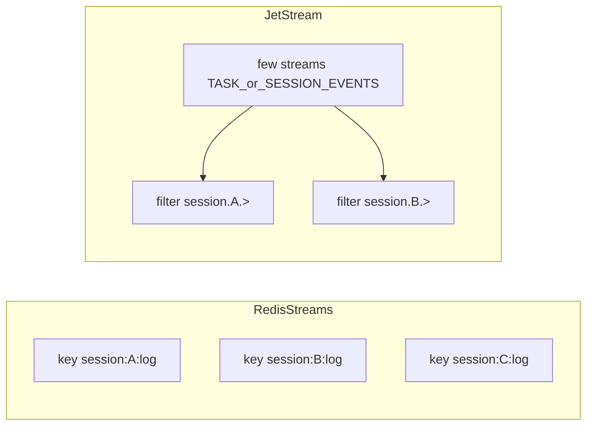

> **ARCHIVED（2026-09-01）**
>
> 本文的选型结论已提取进 [D21](../architecture/decisions.md#d21-可靠性分层三类存储的差异化投入) 正文
> （「届时选 Redis Streams 而非消息队列」一节）。此处仅作推导过程备查，**不被现行文档引用**。
>
> 注意：本文成文于 Session 语境，其中「per-session 流」应读作「per-response 事件缓冲」。

---

# StreamChannel 落地选型：Redis Streams vs NATS JetStream

> ## 性质
>
> **选型对比文档**（适配器层，D14）。对齐 [D18](../../architecture/decisions.md#d18-对话层在任务系统之上--session-日志与-turn-领取) / [D19](../../architecture/decisions.md#d19-产品范围为-session-流式-api单门面)，供后续生产热层适配器锁定时使用。
>
> - **不是**实现依据（无端口签名落地细节）；实现须另出编号设计文档。
> - **不**将 L0–L2 验证绑到任一产品（D17：本机继续 mem）。
> - Kafka / Redpanda 不在本文展开（事件速率逼近越界线再评估）。
>
> 相关：[`../01-session-stream.md`](../01-session-stream.md) · [`../../plans/current.md`](../../plans/current.md)  
> 端口契约：[`crates/core`](../../../crates/core/)（`nova-sessions-core`）  
> 系统量化：[`../../requirements/parameters.md`](../../requirements/parameters.md)  
> 正式不变式：热层缺序号须明确报错 → [INV-14](../../architecture/invariants.md)

---

## 0. 场景与契约（比较前提）

### 0.1 业务场景

Chat / Agent **Session 级可回放事件日志**（D18）：

| 项 | 结论 |
|----|------|
| 流身份 | 对外按 **Session**（非连接、非整段对话领取） |
| 序号 | **per-session 连续 seq**，通道内分配；禁止把引擎全局 seq 当 API 游标 |
| 内容 | 方案 A：用户消息、锁、轮次、token、进度与产物等同流 |
| 开屏 | **快照 + 短增量**；禁止无快照长回放 |
| 同订 | **同一 Session** 同时订阅 ≤ 5；扇出在 `nova-sessions` 订路径（D19） |

| 保留 | 热→冷卸载；有效 Session **始终可订**；热层缺序号时**明确报错**并改走快照/冷层，禁止静默补洞 |
| 跨区 | 一期 Realtime 就近 + **读回源**；二期 Mirror 仅实测触发 |
| 客户端 | **禁止**直连流引擎；只经 `nova-sessions`（SSE 等） |

### 0.2 端口必须满足（产品无关）

| 能力 | 说明 |
|------|------|
| `append` → 返回 `session_seq` | 可回放 WAL；与领取路径分离（D11） |
| `read_from(stream_id, from_seq, limit)` | 精确续订 |
| 热层无该 seq | **明确错误**，不得静默补洞（改走快照/冷层） |
| 不含 | 公网扇出、快照存储、鉴权（属 `nova-sessions` / 其它端口） |

两者对上述契约 **均可适配**；差别在同构度、成本、跨区副本与编码厚度。

---

## 1. 决策用量化输入

> 系统级以 [`parameters.md`](../../requirements/parameters.md) **现行 Session/流口径**为准（**规划推导，非实测**）。下表部分行保留任务系统时代标签作数量级参考；Chat 会话形态为行业公开数据 + 规划先验，**须埋点校准**后方可升格为硬锚点。  
> 用途：判断负荷是否逼近某产品舒适区；**不**替代 D18/D19「模型同构 → 一期 Redis」的主结论。

### 1.1 本系统：DAU 假设与导出负荷

| 项 | 取值 | 出处 |
|----|------|------|
| **DAU（A1）** | **10 万～50 万**（设计常取上沿 **50 万**） | parameters §2 |
| 人均日提交任务 | 3 | A2 |
| 任务类型占比（A6） | 图像 40% / 视频 40% / **Agent 20%** | §2 |
| 峰值提交 / 领取 | ~70/s 量级 | §4 |
| **聚合后输出事件速率** | **≈ 2.7 万条/s**（其中 Agent ≈ 17k） | §4.4 |
| 事件速率适用上界 | **< 50 万条/s**（约 13× 余量） | §7 |
| 日输出（文本/事件侧） | ~75 GB/天 | §4.4 |
| 热层成本锚点存量（7 天） | ~525 GB 量级 | §4.4 / §5.4 |
| 并发观测长连接 | ~3 万 | §4.3 |
| 单**任务**观测者均值 / P99 / 上界 | ~2.1 / 20 / 200 | §4.3 |
| **同 Session** 同时订阅（对话层） | **≤ 5**（严于任务分享 P99） | D18 |
| 稳态并发任务（约） | ~2.2 万 | §4.4 |

Agent 按 **聚合后约 10 条/s/任务** 计入（非每 token 一条）。聚合窗口本期不定；窗口收窄会抬升 2.7 万/s。

### 1.2 行业：Chat / LLM 会话深度（公开数据）

公开语料多能量「一条对话多少轮」，很少能量「过几天又打开同一 Session」：

| 来源 | 样本 | 深度（口径不一） | 启示 |
|------|------|------------------|------|
| ConvoCore Q1 2026（~28.5 万业务会话） | 生产业务聊 | 中位 **3** 条消息；≤3 ≈ **71%**；≥10 ≈ **12%** | 短会话占绝对多数 |
| ConvoCore Q1 2025（~31.9 万） | 同上 | ≤3 ≈ **83%**；≥10 ≈ **6%** | 同上 |
| dejan.ai（约百万级） | AI 助手 | 中位 **2 turns**；均值 **4.7** | 均值被长尾拉高 |
| Semrush（~5k 公开分享 ChatGPT） | 分享链接 | 中位 **3**；均值 **8**；≤3 ≈ **59%** | 分享样本偏长 |
| ShareChat 等 | 分享链接 | ChatGPT 均约 **5 turns** 量级 | 同上 |
| WebFX 公开分享 | 分享链接 | 均约 **1.7 messages**/会话 | 偏一问一答 |
| 个人导出分析（博客/GitHub） | 重度用户 | 均约 **7～11 msgs**/会话 | **不能**代表全体 |

**共识**：中位约 **1～2 个用户回合**；约 **5%～15%** 会话达到 10+ 消息，却贡献不成比例的事件与存储。

### 1.3 Session 用量先验（规划用）

| 类型 | 行为 | 粗估占新建 Session | 粗估占总 Turn/事件 | 对热层 |
|------|------|--------------------|--------------------|--------|
| **A. 用完即弃** | 短聊后几乎不再打开 | **60%～80%**（65%+ 合理） | ~25%～40% | 大量短 key，宜快卸冷 |
| **B. 连续同 Session** | 当日/数日同主题多轮 | **15%～30%** | **~40%～55%** | **热写主力** |
| **C. 久后回访** | 打开旧线程并可能再 Turn | **5%～15%** 的 Session 至少回访一次 | 占当日活跃 Turn 通常更低 | 冷读 + 偶发热写 |

客服型 → A 更高；编程/写作工作台 → B 更高。容量用 **Turn 加权**，勿用「Session 数 × 天真均值」。

### 1.4 粗算：负荷 vs 引擎舒适区

在 **DAU=50 万**、输出 **2.7 万条/s**、热成本锚点 **7 日 ~525 GB** 时：

| 指标 | 粗算 | 选型含义 |
|------|------|----------|
| 全站 append | ~2.7×10⁴/s | 相对 Redis 单节点常见 ~10⁵～5×10⁵ XADD/s、JetStream R3 落盘常引用 ~2.5×10⁵+ 量级，**约数倍～十余倍余量**（视耐久/批量而定） |
| 距 parameters 越界 | 2.7×10⁴ → 5×10⁵（~18×） | 未逼近前 **不以吞吐** 改投 JetStream/Kafka |
| 7 日文本侧全进热层 | ~525 GB | Redis **纯内存**扛满窗口昂贵 → **必须短热窗 + 冷层**（或 Flash）；JetStream 盘更贴「长热窗」 |
| 热窗缩到 **1 天** | ~75 GB 量级 | Redis 热成本显著下降 |
| 并发观测连接 | ~3 万 | 压力在 Gateway；引擎侧是活跃 Session × 复用订阅 |
| 同 Session ≤5 同读 | — | **无需**分层扇出 |
| 活跃热流数量级 | 并发任务 ~1.4 万量级 | Redis ≈ 同量级 stream key；盯大 key / 单节点热点 |

### 1.5 量化评估指标（校准与翻转告警）

**Session 形态（校准 §1.3）**

| 指标 | 用途 |
|------|------|
| `sessions_never_reopened_24h` / `_7d` | A 类占比 |
| `p50/p95/p99 turns_per_session`、`events_per_session` | 深度与长尾 |
| `reopen_after_7d_rate` | C 类 |
| `active_sessions_with_inflight_turn` | 热写 Session 数 |

**流通道**

| 指标 | 用途 | 翻转提示 |
|------|------|----------|
| `stream_append_rate`（全站/分区） | 对照 2.7×10⁴ 与 5×10⁵ | 持续偏高 → 先加聚合，再谈换引擎 |
| `stream_append_p99_ms` | 写延迟 | Redis 内存压 / JS 盘或 Raft 压 |
| `hot_layer_bytes`、`hot_session_count` | 热成本 | Redis 逼近内存预算 → 缩热窗或评估 JS |
| `stream_gap_total` | 热层缺序号报错次数 | 过高 → 热窗过短或归档滞后 |
| `catchup_events_per_subscribe` | 开屏后增量条数 | 过高 → 快照滞后（JS 大河更伤） |
| `gateway_hub_consumers` | 订阅复用 | 随观众线性涨 → 修 Gateway |
| `cross_region_subscribe_rtt_p99` | 回源 | 过高 → D18 二期 Mirror |

**对照用引擎量级（非 SLA）**

| 引擎 | 常见公开量级（条件差异大） |
|------|---------------------------|
| Redis Streams | 单节点约 **10⁵～5×10⁵** XADD/s；Cluster 靠多 key 摊全站 |
| JetStream | R3 落盘小消息异步发布约 **~2.5×10⁵**/s 量级常见引用 |
| 延迟 | 通常 Redis（内存）≲ JetStream ≲ 大规模 Kafka |

一期相对 2.7×10⁴/s：**两者吞吐均过剩**；决策看模型同构、热成本、跨区副本（§4～§6）。

---

## 2. 产品是什么

| | **Redis Streams** | **NATS + JetStream** |
|--|-------------------|----------------------|
| 形态 | Redis **内置数据类型**（≥5.0），同一 `redis-server` | NATS 上的 **持久消息流** 子系统 |
| 是否独立进程 | 否（或与其它 Redis 用途共存） | 是（`nats-server -js`） |
| 官方入口 | [Redis Streams](https://redis.io/docs/latest/develop/data-types/streams/) | [JetStream](https://docs.nats.io/nats-concepts/jetstream) |
| 开源 / 可自建 | 是 | 是 |

---

## 3. 数据模型对照

| 维度 | Redis Streams | JetStream |
|------|---------------|-----------|
| 自然切法 | **一 Session 一 Stream key**（多本账） | **少数大 Stream + subject filter**（大河）；一 Session 一 JS Stream 会炸元数据，一般不采用 |
| 引擎原生 ID | `毫秒时间-序号` | Stream 内 **全局** sequence |
| 对外 `session_seq` | 适配器写入字段（一次 `XADD` 即可） | **同样必须自建**；禁止把 JS seq 暴露给 SSE `Last-Event-ID` |
| 读本 Session | `XRANGE` / `XREAD` **只碰该 key** | 实时靠 interest；**长距离** filter 追平可能大量 skip |
| 同读 | 多连接读同 key，或 Gateway 内 fanout | **必须** Gateway 内 1 consumer 复用，勿用 workqueue 抢活 |
| Consumer Group | 有；适合 **抢活队列**，观测慎用 | 有；观测用 ordered + filter + 复用 |

**性能前提（与选谁无关）**：开屏 = 快照 + 短增量。有此前提后 JetStream filter「跳过税」通常可忽略；无快照长回放时大河模型会随全站流量恶化。

---

## 4. 分维对比

### 4.1 与 D18 / Chat Session 的贴合度

| | Redis Streams | JetStream |
|--|---------------|-----------|
| 创建地粘滞、一 Session 一账 | **同构** | 需适配层 |
| 大量短 Session（§1.3 A） | 多小 key，卸冷/删 key 自然 | 大河里短生命周期 subject，依赖保留与归档 |
| 少数长热 Session（§1.3 B） | 单 key 钉 Cluster 单节点；靠快照/聚合 | 大河顺序写友好；追平靠快照限距 |
| 久后回访（§1.3 C） | 冷层 + 偶发回源写 | 同；忌无快照长 filter |
| 方案 A 碎事件 | 都能扛；写入聚合可配 | 同 |

### 4.2 吞吐与延迟

| | 写吞吐（耐久 + 副本） | 尾读延迟 |
|--|----------------------|----------|
| 粗序 | 集群合计常 **Kafka ≥ JetStream ≥ Redis 单节点**；Redis **Cluster 多 Session key** 可抬高全站合计 | **Redis ≲ JetStream ≲ Kafka** |

对照 §1：**~2.7 万条/s** vs 越界 **~50 万条/s**——两者一期均过剩；**不以峰值吞吐为第一因子**。

### 4.3 成本与保留

| | Redis Streams | JetStream |
|--|---------------|-----------|
| 热数据 | 偏 **内存**（或 Flash） | 偏 **磁盘日志** |
| 长热窗（§1.4：7 日 ~525 GB 锚点） | 内存敏感 → **短热窗 + 冷层** | 更贴长热窗 |
| 热→冷 | trim/删前 **必须归档** | max_age 前 **必须归档** |
| 热层缺序号 | key 无 / 过新 → 明确错误 | start 不可用 → 明确错误 |

### 4.4 跨区

| | Redis Streams | JetStream |
|--|---------------|-----------|
| 一期回源 | 外区 Gateway → 权威区 Redis | 外区 Gateway → 权威区 NATS |
| 二期副本 | 复制须自证 | **Mirror** 成熟 |
| 触发 | `cross_region_subscribe_rtt_p99` 等（§1.5） | 同 |

### 4.5 运维与接入

| | Redis Streams | JetStream |
|--|---------------|-----------|
| 学习曲线 | 低（常已有 Redis） | 中（Consumer/Mirror 等） |
| HA | Sentinel / Cluster | JetStream R3 等 |
| 扩展 | Cluster 按 slot；**单 Stream 不跨节点拆** | 多 Stream；单 Raft 流有上限 |
| 绿场 | +Redis 输出面（落实 D11） | +NATS 消息面 |
| L0–L2 | mem（D17） | 同 |

### 4.6 安全与边界

- 浏览器 / App **禁止**直连；只经 Gateway（SSE、ticket、ACL、脱敏）。
- Worker 内网 `append` 或经 Ingress 校验 attempt/fence（CR-4）。

---

## 5. 优缺点摘要

### Redis Streams

| 优点 | 缺点 |
|------|------|
| Session 一本账同构；贴 §1.3 A | 长热窗内存贵（§1.4） |
| 读与全站解耦；编码薄；2.7×10⁴/s 下过剩 | 热层缺序号报错与日历淘汰要适配器补 |
| 同读简单；绿场易 | Mirror 弱；单 Session 不拆机 |

### NATS JetStream

| 优点 | 缺点 |
|------|------|
| 磁盘热、Mirror、时间保留 | 大河 ≠ 一本账；自建 session_seq |
| 长热窗成本友好 | 长 filter 追平有税（快照可消） |
| 二期跨区论证省力 | 运维更重；须 consumer 复用 |

---

## 6. 结论与翻转条件

### 6.1 一期

| 项 | 结论 |
|----|------|
| **第一生产热层** | **Redis Streams**（D18） |
| 理由 | 模型同构、工程薄、§1 负荷下吞吐过剩、D11；非 JS 不可用 |
| 热成本 | **短热窗 + 冷层**；勿按 525 GB 全进内存规划 |
| 游标 | `(session_id, session_seq)`；热层缺序号 → 明确报错 → 快照/冷 |

### 6.2 改投 / 并行 JetStream（任一）

1. 跨区回源指标不可接受，且必须 Mirror，Redis 复制代价过高  
2. `hot_layer_bytes` 使内存成本明显高于磁盘方案，又无法再缩热窗  
3. 已统一运维 NATS，边际成本更低  
4. `stream_append_rate` 长期逼近越界带，聚合 + Cluster 仍不足（少见）  

### 6.3 不作为一期否决 JetStream 的理由

- D8 单域、把「7 天」当成可丢、filter 一定慢、公开峰值 Redis 较低（相对本系统仍过剩）

---

## 7. 适配器实现要点

| # | 要点 | Redis | JetStream |
|---|------|-------|-----------|
| 1 | 对外 seq | 字段自增 / Lua | 字段自增；忽略 JS seq 对外 |
| 2 | key / subject | `session:{id}:log` | `session.{id}.>`；少 Stream |
| 3 | 热层缺序号报错 | key 无 / 过新 → 错误 | start 不可用 → 错误 |
| 4 | 热→冷 | 归档后 trim/删 | 归档后淘汰 |
| 5 | Gateway | XREAD / 短读 + fanout | 每实例每 Session 一 consumer + fanout |
| 6 | 验证 | mem conformance；产品 L3 | 同 |
| 7 | 埋点 | §1.5 | 同 |

---

## 8. 变更日志

| 日期 | 变更 |
|------|------|
| 2026-08-26 | 补 §1：DAU/负荷、Chat 行业深度、Session A/B/C、粗算与评估指标 |
| 2026-08-26 | 同步 A6（图像/视频/Agent = 40/40/20）与导出事件速率 ≈2.7 万条/s |
| 2026-08-26 | 正文以「热层缺序号须明确报错」表述，避免反复引用 INV-14 |
| 2026-08-26 | 初版：Redis Streams vs JetStream，对齐 D18 |
