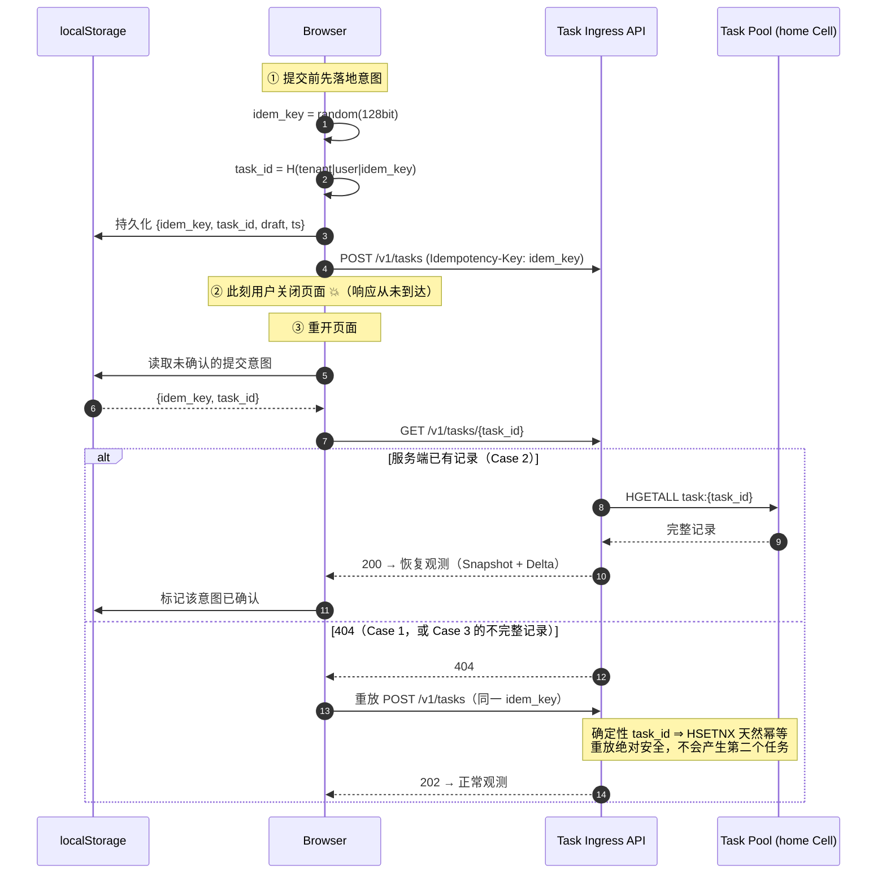
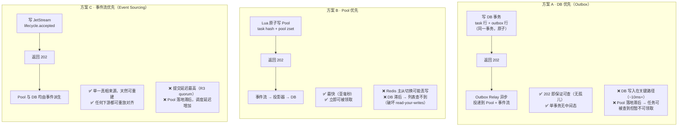
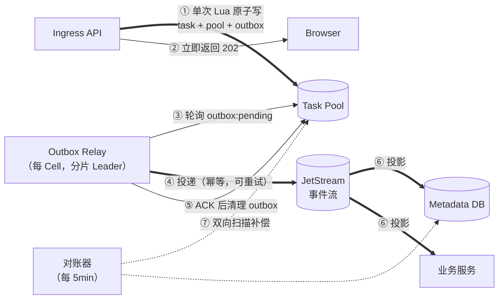
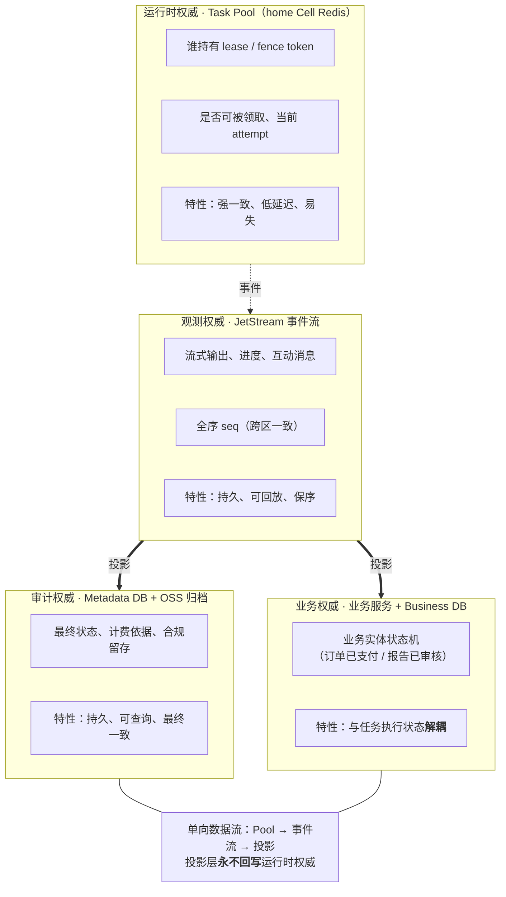
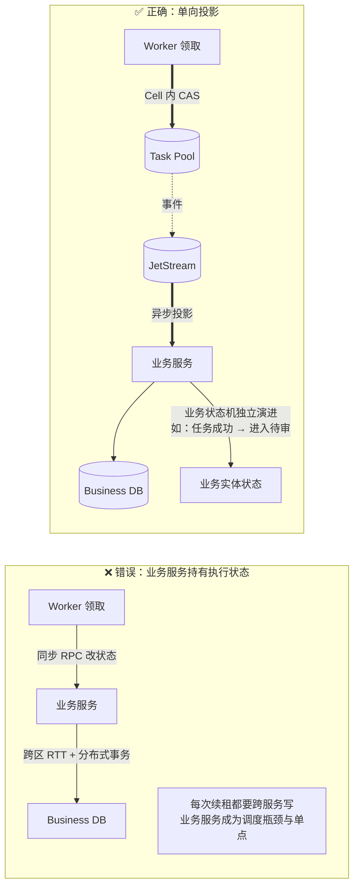
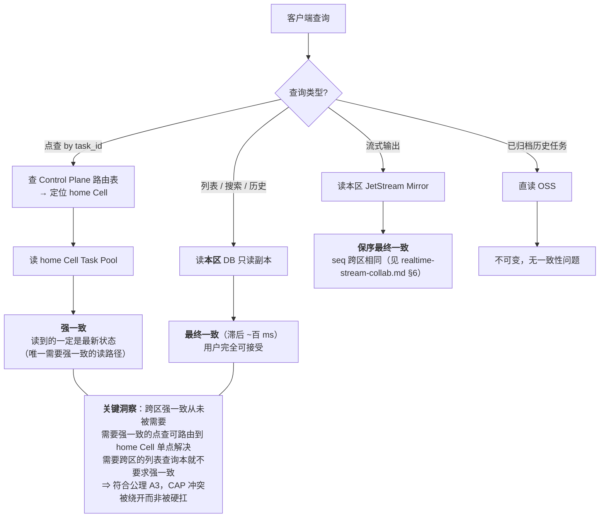
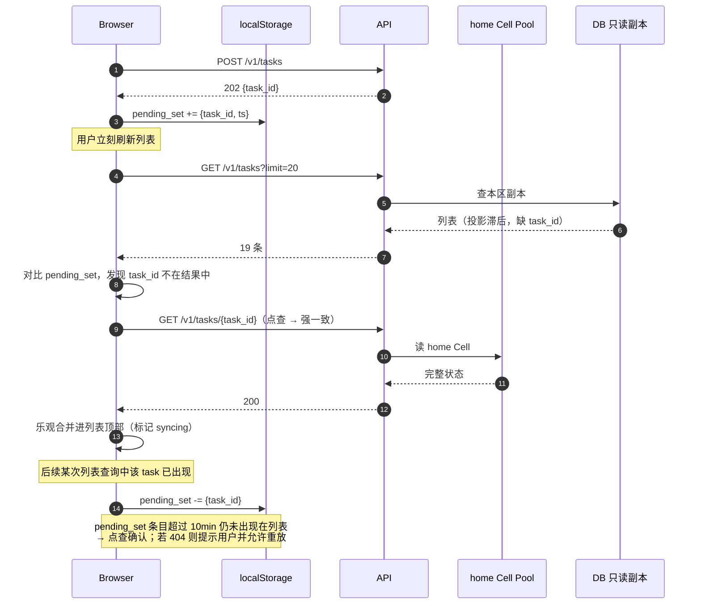
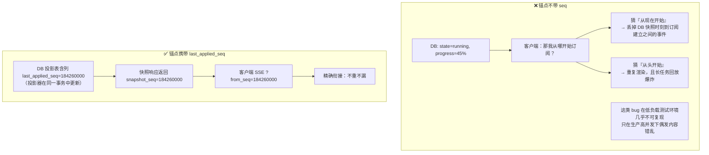
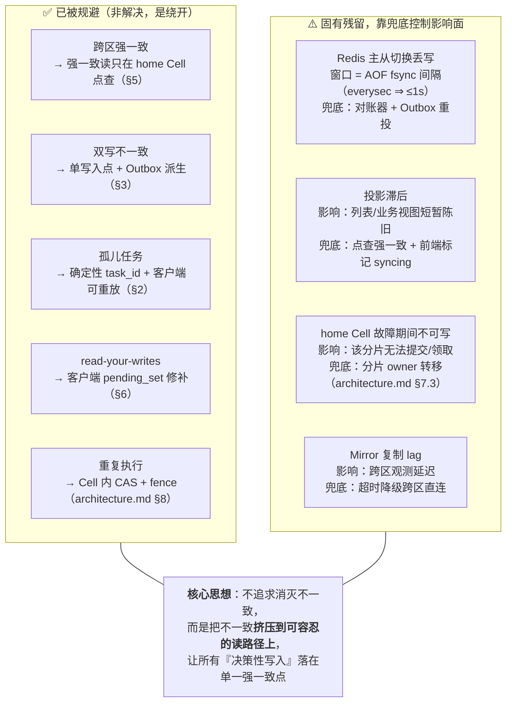

> ⚠️ **本文档已归档（2026-08），不作为设计依据。**
> 现行文档见 [`../README.md`](../README.md) · [`../requirements/spec.md`](../requirements/spec.md) · [`../architecture/invariants.md`](../architecture/invariants.md)。
> 保留目的：追溯早期架构探讨的决策由来。**文内链接可能已失效，属预期情况。**其中仍然有效的结论已提取至 `requirements/` 与 `architecture/`。

---

# 任务身份、状态权威与恢复

> 版本：v0.1
> 配套文档：[`core-design.md`](./core-design.md)（⭐ 最小可行子集）· [`architecture.md`](./architecture.md) · [`realtime-stream-collab.md`](./realtime-stream-collab.md)
> 本文回答 `architecture.md` §11.10（SoT 谁是权威）与 `realtime-stream-collab.md` §12 开放问题 6，并系统性解决「孤儿任务」与「双写不一致」。

---

## 0. 结论速览

| 问题 | 结论 |
|------|------|
| 业务服务/DB 统一管理任务状态可行吗？ | **部分可行**。DB 是「存储与查询」的答案，不是「找到那一条」的答案，也不是任务执行状态的权威 |
| 孤儿任务如何根治？ | **确定性 `task_id`**：客户端本地可计算，无需找回接口，重放天然幂等（§2） |
| 双写（Pool + DB）会不一致吗？ | 会。解法是**不双写**：单一写入点 + 事件派生（§3） |
| 还有跨区强一致问题吗？ | **没有**。强一致需求被限制在「单 Cell 内的点查与 CAS」，列表查询本就不需要强一致（§5 / §8） |
| 业务服务的正确定位？ | 业务实体状态机的**权威** + 任务视图的**投影器**，而非任务执行状态的权威（§4.2） |

---

## 1. 问题的本质：不确定的写入（Indeterminate Write）

用户点击提交后立刻关闭页面，客户端**永远无法知道**服务端是否收到。这不是工程 bug，是分布式系统的固有属性（两将军问题）。

```mermaid
%%{init: {"flowchart": {"curve": "basis"}}}%%
flowchart TB
    S["用户点击提交<br/>客户端发出请求"] --> C1{"请求是否到达服务端?"}

    C1 -->|"未到达<br/>网络断在半路"| CASE1["<b>Case 1</b><br/>服务端无记录"]
    C1 -->|到达| C2{"服务端写入是否完成?"}
    C2 -->|"完成，但响应丢失"| CASE2["<b>Case 2</b><br/>服务端有完整记录<br/>客户端不知道"]
    C2 -->|"写入中途崩溃<br/>部分成功"| CASE3["<b>Case 3</b><br/>服务端记录不完整"]

    CASE1 --> R1["客户端查不到 → 认为失败<br/>✅ 与事实一致，无需处理"]
    CASE2 --> R2["<b>最常见</b><br/>任务在跑，用户找不到 → 孤儿<br/>👉 你的『查业务库』方案能解决<br/>前提：知道查哪一条（§2）"]
    CASE3 --> R3["<b>最麻烦</b><br/>如 Pool 有 / DB 无，或 dedup 有 / task 无<br/>👉 你的方案<b>无法</b>解决<br/>需要单写入点 + 前滚补偿（§3）"]
```



> **你的想法覆盖了 Case 2（最常见的一种），但 Case 3 需要额外机制。** Case 3 的发生概率低，但它产生的是「状态不一致的僵尸记录」——比孤儿任务更难排查，因为它会在几天后以"任务列表里有但打开是 404"的形式暴露出来。

---

## 2. 确定性 task_id：从根上消除"找回"问题

### 2.1 为什么"查列表"不够

客户端重开页面时手上什么都没有，只能查「我的任务列表」，于是面对：

```
- 任务 #8823   2 分钟前   运行中   "分析 Q3 财报"
- 任务 #8817   3 分钟前   运行中   "分析 Q3 财报"   ← 哪个是刚才那次点击？
```

用户可能点了 3 次、可能昨天提交过相似任务。**列表无法回答"我刚才的那次点击对应哪一条"**——缺的是一个客户端持有的**因果锚点**。

### 2.2 方案

```
idem_key  = 128bit CSPRNG（客户端在发请求【之前】生成并持久化到 localStorage/IndexedDB）
task_id   = UUID_format( SHA256( tenant_id | 0x1F | user_id | 0x1F | idem_key )[0:16] )
```

于是客户端**本地就能算出 task_id**，不需要任何"找回接口"：



### 2.3 与「服务端生成 ID + dedup 映射」的对比

| 维度 | 服务端 ULID + `dedup:{idem_key}→task_id` | **确定性 task_id** |
|------|------------------------------------------|-------------------|
| 需要"找回"接口 | 需要（`GET /tasks?idempotency_key=`） | **不需要**，客户端本地算 |
| Redis Cluster slot | `dedup:{k}` 与 `task:{tid}` **跨 slot**，Lua 无法原子 | 全部以 `{task_id}` 为 hash tag，**同 slot 可原子** |
| 中间态 | 有：dedup 已写、task 未写 → 指向不存在的任务 | **无**：只有一次写入，`HSETNX` 即幂等 |
| 幂等窗口 | dedup key TTL（如 24h），过期后重复提交会创建新任务 | 等于 task 记录存活期，**更强** |
| task_id 可预测性 | 不可预测 | **可预测**（前提是 idem_key 泄露） |
| 额外存储 | 一个 dedup key/任务 | 无 |

**推荐确定性 task_id**，但必须满足三个前提（缺一不可）：

1. **`idem_key` 必须是 ≥128bit CSPRNG**。若使用自增序号或时间戳，`task_id` 将可枚举。
2. **每次提交必须新生成 `idem_key`**，禁止复用（复用会导致两次不同意图被合并成同一任务）。
3. **绝不以"不可猜"作为授权手段**。ID 可预测性无所谓，因为每次访问都强制走 ACL 校验（见 [`security-authz.md`](./security-authz.md)）。第 3 条是前两条的安全网。

> 关于哈希算法：这里需要的性质是**不可预测**（抗第二原像），而非抗碰撞——因为 `name` 中已包含 `user_id`，构造碰撞只能影响攻击者自己的任务。用 SHA256 截断而非标准 UUIDv5(SHA1)，是纵深防御而非必需。

---

## 3. 单一写入点 + 派生：消除双写不一致（Case 3）

### 3.1 双写为什么必然不一致

提交一个任务需要让多个存储感知：Task Pool（可被 Worker 领取）、Metadata DB（可被列表查询）、事件流（可被观测）。**只要在一次请求里写两处，就存在"写了一半"的窗口，且没有分布式事务可用**（Redis 与 MySQL 之间不存在事务）。

### 3.2 三种写入路径方案



| 维度 | A（DB 优先） | B（Pool 优先） | C（事件流优先） |
|------|-------------|---------------|----------------|
| 提交 P99 延迟 | 中 | **最低** | 最高 |
| 孤儿任务风险 | **无** | 低（配合 §2） | **无** |
| 任务丢失风险 | **无** | 有（Redis 丢写） | **无** |
| 可领取延迟 | 有（Relay 滞后） | **无** | 有 |
| 实现复杂度 | 中（Outbox Relay） | 低 | 高（全链路投影） |
| 重建能力 | 中 | 弱 | **最强** |

### 3.3 推荐：方案 B′ = Pool 原子写 + 内嵌 Outbox

结合"低延迟"与"不丢写"，落地形态是**在 Pool 的同一次 Lua 中写入 outbox**，因为确定性 task_id 保证了所有 key 同 slot：

```lua
-- 所有 key 共享 hash tag {task_id} ⇒ 同 slot ⇒ Lua 可原子
-- KEYS[1]=task:{tid}  KEYS[2]=pool:{cell}:{res}  KEYS[3]=outbox:{tid}
-- 幂等性由 HSETNX 天然提供，无需独立 dedup key

if redis.call('HSETNX', KEYS[1], 'state', 'pending') == 0 then
  return {0, redis.call('HGET', KEYS[1], 'state')}   -- 幂等命中，返回既有状态
end
redis.call('HSET', KEYS[1], 'payload', ARGV[1], 'req_capacity', ARGV[2],
                            'submit_ts', ARGV[3], 'attempt', 0)
redis.call('ZADD', KEYS[2], ARGV[4], ARGV[5])        -- 入待领取池，立即可被领取
redis.call('RPUSH', KEYS[3], ARGV[6])                -- outbox：待投递事件
redis.call('SADD', 'outbox:pending:{'..ARGV[7]..'}', ARGV[5])  -- 按 cell 分片的待投递索引
return {1, 'pending'}
```



**关键性质**：
- 提交路径**只有一次原子写**，不存在"写了一半"。Case 3 被消除。
- Outbox 保证事件**至少投递一次**（Relay 崩溃后重启继续，投递幂等）。
- Redis 丢写风险由 **AOF everysec + 对账器**（§9）兜底：DB 侧若发现 Pool 无记录但事件流有，反向重建。
- Pool 立即可领取 ⇒ 不牺牲调度延迟。

> 若业务对"绝不丢任务"要求高于"提交延迟"，切换到方案 A（DB Outbox）即可，架构其余部分不变——这两个方案在下游是同构的。

---

## 4. 状态权威矩阵（回答 `architecture.md` §11.10）

### 4.1 四类权威，各管一段



| 问题 | 问谁 | 不要问谁 |
|------|------|---------|
| 这个任务现在能被领取吗？ | Task Pool | DB（滞后，会导致重复派发） |
| 输出到第几个 seq 了？ | JetStream | DB |
| 上个月跑了多少任务、花了多少钱？ | Metadata DB | Pool（已淘汰） |
| 这份报告审核通过了吗？ | 业务服务 | Pool（任务成功 ≠ 业务通过） |
| 我的任务列表 | DB 只读副本 | Pool（无法按用户索引，且会成为热点） |

### 4.2 业务服务的正确定位（针对你的想法的修正）

你提出"业务管理服务统一管理任务状态"。**需要拆成两件事**：

| | 归属 | 理由 |
|---|------|------|
| 任务**执行**状态（pending / dispatched / running / succeeded） | **home Cell 权威**，业务服务只读投影 | 若业务服务成为权威，则每次领取/续租/回收都要跨服务同步写 → 破坏公理 A2（CAS 必须落在单一强一致点），且引入跨区 RTT |
| **业务**实体状态（草稿 / 待审 / 已发布 / 已作废） | **业务服务权威** | 这是真正的业务语义，与任务是否重试无关 |



**一个具体例子说明为什么必须解耦**：任务因 Worker 宕机重试了 3 次（执行状态反复 running↔pending），但业务上这始终是「同一份报告在生成中」——业务状态不应该抖动。反之，任务执行成功后业务可能判定内容不合格进入「已作废」——业务状态与执行状态在此分叉。

---

## 5. 查询路径分工：这是规避跨区强一致的关键



### 5.1 列表查询的分片问题

若分片键为 `hash(task_id)`，同一用户的任务会散落在所有 Cell → 「我的任务列表」需要 scatter-gather（延迟 = 最慢 Cell，且 Cell 增多时线性恶化）。

| 方案 | 说明 | 取舍 |
|------|------|------|
| Scatter-gather 查所有 Cell | 实时性最好 | 延迟受最慢 Cell 拖累；Cell 数增长后不可用 | 
| **全局 Metadata DB 投影 + 各区只读副本** | 列表查本区副本，单次查询 | 有复制滞后 → 用 §6 修补 | ✅ 推荐 |
| 按 `tenant`/`user` 分片 | 用户任务天然聚集在一个 Cell | 与放置策略驱动的跨区调度冲突（`architecture.md` §11.1 需一并定夺） | 视业务定 |

> 这直接关联 `architecture.md` §11.1 的分片粒度问题：**若采用全局 DB 投影，分片键就可以自由地服从放置策略优化，不受查询模式约束**。推荐此组合。

---

## 6. read-your-writes 修补（提交后立刻看列表）

用户提交后立刻刷新列表，DB 投影可能还没到 → 用户看不到刚提交的任务，会以为失败并重复提交。



**为什么放在客户端**：这是唯一不需要服务端付出一致性代价的位置。若要服务端保证 read-your-writes，就得让列表查询也走 home Cell（scatter-gather）或引入会话粘性 —— 两者都会污染架构。

---

## 7. 关键原则：重建锚点必须携带精确 seq

你说「从业务数据库 + 后续消息来完成重建」——**"后续"从哪里开始？**



**硬性约束**（凡是能作为重建起点的东西都必须遵守）：

| 组件 | 必须记录 | 更新时机 |
|------|---------|---------|
| Metadata DB 投影表 | `last_applied_seq` | 与业务字段**同一事务**内更新（否则重启后重复消费或跳过） |
| JetStream KV 快照 | `snapshot_seq` | 与快照内容同一次 KV `Update`（CAS by revision） |
| OSS 归档 | `first_seq` / `last_seq` | 归档清单文件中 |
| 业务服务投影 | `last_applied_seq` | 同上，且必须幂等（同 seq 重复投递不改变结果） |

> 这也让投影器天然可重建：清空投影表 → `last_applied_seq=0` → 从流头重放。**没有 seq 的投影是不可重建的投影。**

---

## 8. 正面回答：还剩哪些一致性问题



**残留项的共同特征**：全部落在「读」或「可用性」维度，**没有一项会导致任务重复执行或永久丢失**——后两者才是不可接受的。

---

## 9. 对账器：最后一道防线

任何"单写入点 + 异步派生"架构都必须有对账，否则一次 Relay 长时间故障就会留下永久不一致。

```mermaid
sequenceDiagram
    autonumber
    participant REC as 对账器（每 Cell，5min）
    participant POOL as Task Pool
    participant JS as JetStream
    participant DB as Metadata DB
    participant ALT as Alerting

    Note over REC: 方向 1：Pool 有、事件流无（Outbox 卡住）
    REC->>POOL: SMEMBERS outbox:pending（滞留 > 60s）
    POOL-->>REC: [T1, T7]
    REC->>JS: 强制重投（幂等）
    REC->>ALT: 指标 outbox_lag_seconds

    Note over REC: 方向 2：事件流有、Pool 无（Redis 丢写）
    REC->>JS: 扫描近 10min 的 accepted 事件
    REC->>POOL: EXISTS task:{tid}
    alt 不存在且未终态
        REC->>POOL: 依据事件重建 task + 重新入池
        REC->>ALT: 告警 pool_write_lost（应为 0，非 0 需排查）
    end

    Note over REC: 方向 3：DB 投影落后过多
    REC->>DB: SELECT MAX(last_applied_seq)
    REC->>JS: 当前 stream last_seq
    alt 差值 > 阈值
        REC->>ALT: 告警 projection_lag
    end

    Note over REC: 方向 4：僵尸任务（Pool 中长期无 lease 且不在池）
    REC->>POOL: 扫描 state=dispatched 但 lease 已不存在
    REC->>POOL: 重新入池或转 DLQ
```

| 指标 | 期望值 | 非期望时的含义 |
|------|--------|--------------|
| `outbox_lag_seconds` P99 | < 2s | Relay 故障或 JetStream 写入受阻 |
| `pool_write_lost_total` | **0** | Redis 持久化配置或主从切换有问题 |
| `projection_lag_seq` | < 1000 | 投影器消费能力不足 |
| `orphan_intent_total`（客户端上报） | 趋近 0 | 提交链路可靠性问题 |
| `zombie_task_total` | 0 | Reaper 或 lease 逻辑有 bug |

---

## 10. 落地清单

| 项 | 位置 | 优先级 |
|----|------|--------|
| 客户端提交前生成并持久化 `idem_key`（128bit CSPRNG） | 前端 SDK | **P0** |
| `task_id = UUID(SHA256(tenant\|user\|idem_key))`，前后端共用同一实现 | 共享库 | **P0** |
| Ingress 单次 Lua 原子写（task + pool + outbox），`HSETNX` 幂等 | Ingress + Pool | **P0** |
| 提交接口幂等命中时返回既有状态而非报错 | Ingress | **P0** |
| 点查路由到 home Cell（强一致）；列表走本区 DB 副本 | API 层 | **P0** |
| 所有投影记录 `last_applied_seq`，与业务字段同事务更新 | DB / KV / 业务服务 | **P0** |
| Outbox Relay（每 Cell 分片 Leader，投递幂等 + 重试） | Cell | P1 |
| 客户端 `pending_set` + 乐观合并（read-your-writes 修补） | 前端 SDK | P1 |
| 对账器四向扫描 + 五项指标告警 | Cell | P1 |
| 业务服务改为纯投影消费者（不回写执行状态） | 业务域 | P1 |
| 客户端 `orphan_intent` 上报（意图超 10min 未确认） | 前端 SDK | P2 |
| 投影表可重建演练（清空 + 全量重放） | 运维 | P2 |

---

## 11. 新增开放问题

1. **`idem_key` 的保留期与跨设备同步**：确定性 task_id 下，A 在手机提交、在电脑恢复，需要 `idem_key` 跨设备可得 → 是否需要服务端按 `user_id` 索引未确认意图（这会重新引入一张表）？
2. **确定性 ID 与租户迁移**：`tenant_id` 参与哈希，租户 ID 变更会导致历史 task_id 无法重算。是否改用不可变的内部 tenant UUID？
3. **Outbox 与 JetStream 的重复投递语义**：Relay 重投产生重复 `accepted` 事件，投影器需按 `task_id` 幂等——是否统一约定「所有事件按 `(task_id, seq)` 去重」？
4. **对账器发现 Pool 丢写时，能否安全重建**：若任务已被领取执行过（事件流中有 `dispatched`），重建后是否会二次执行？需与 fence token 语义联合定义。
5. **列表查询的分片策略**（与 `architecture.md` §11.1 联动）：确认「全局 DB 投影 + 各区只读副本」后，分片键是否可完全交由放置策略决定？
