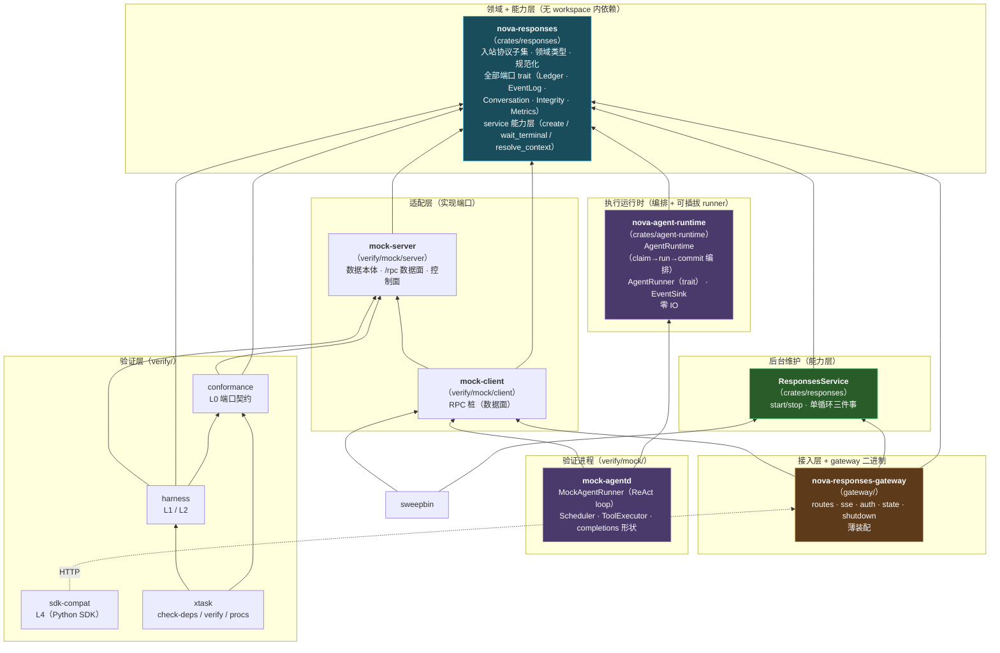
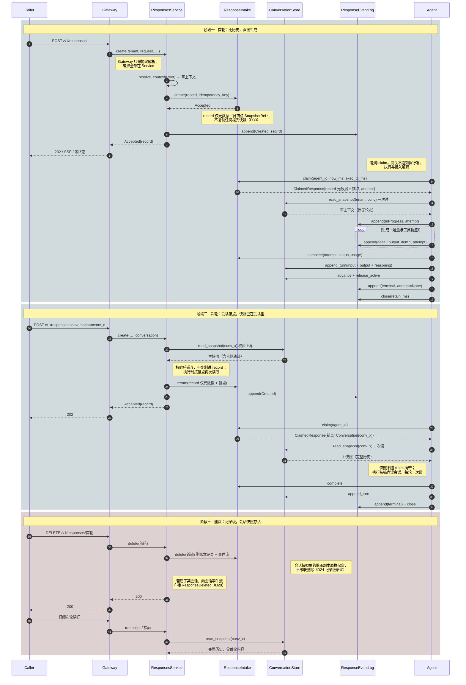
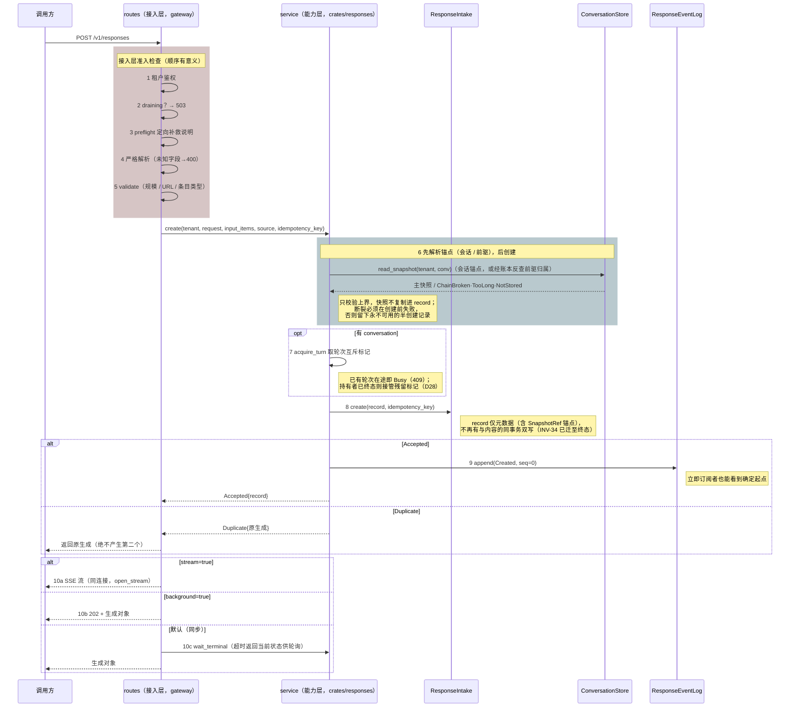
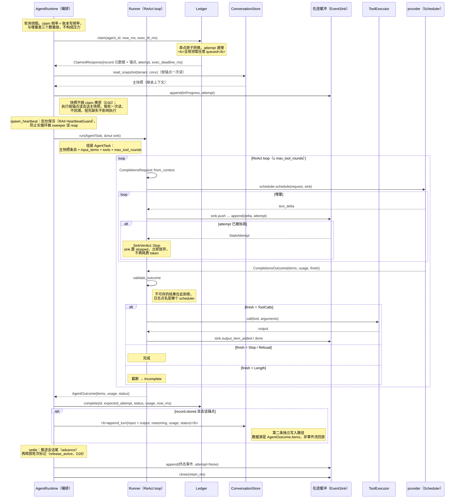
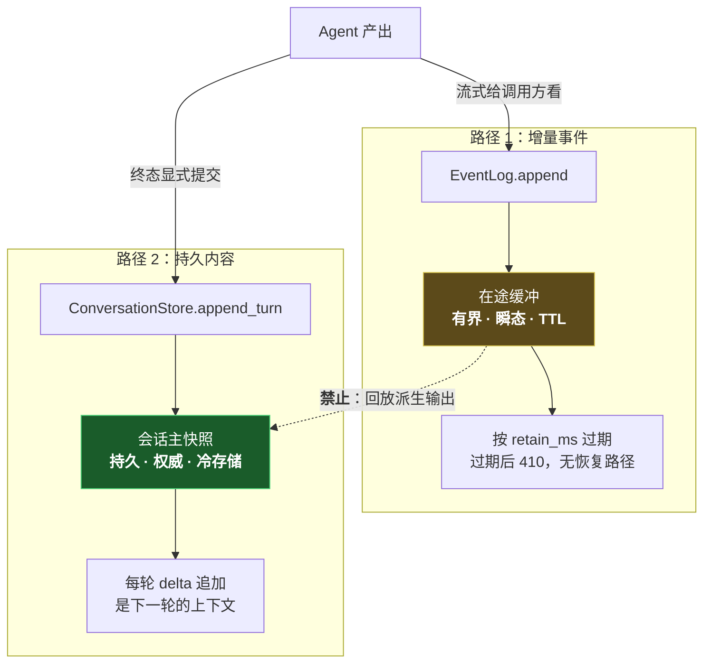
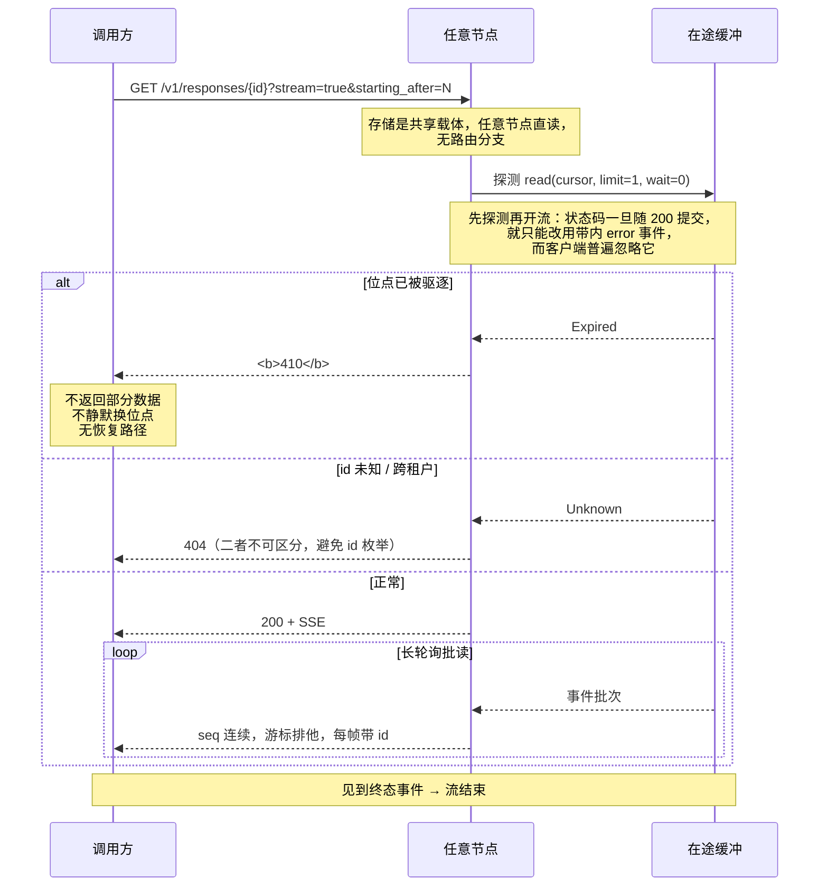
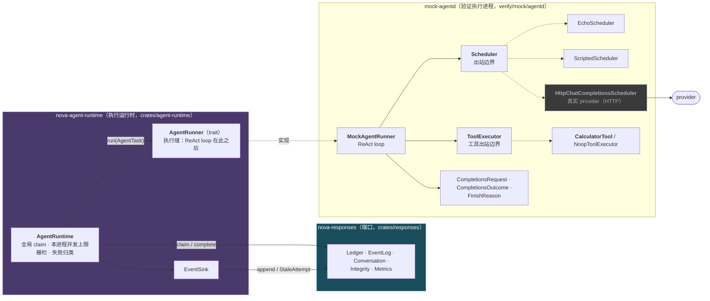
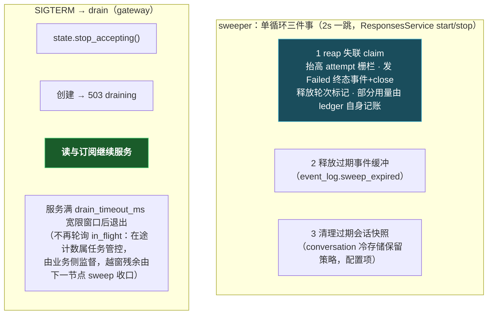

# 系统架构复验图

> **用途**：核对你与我对系统的理解是否一致。
>
> 每张图都标注了可核对的**符号位置**（模块、函数、类型名），而非行号——行号会随任何一次编辑失效，而失效的引用比没有引用更糟。**若图与代码不符，以代码为准并请指出**：这份文档的价值全在于它能被伪证。
>
> 核实时间：2026-09-09，基于当前工作区状态。架构基线为 **D25 + D28 + D30**（执行进程独立 + 在途缓冲共享化 + 能力层抽离 + claim 全局化 + 会话/轮次领域 + 存储分工重构）。
>
> **D30 已生效（2026-09-09）**：`ContextStore` 端口已移除，职责拆分到 `ConversationStore`（`read_snapshot` / `append_turn`）与 `ResponseEventLog`（回放重建检索）。`StoredResponse` 更名为 `ResponseRecord`（仅元数据，不再物化祖先快照）；会话持有持久物化主快照（O(n) 替代 D24 的 O(n²)）。本文档各图均已反映该分工；权威口径见 [`decisions.md`](../architecture/decisions.md) D30 与 [`07-storage-integration.md`](./07-storage-integration.md)。
>
> **本文档不记录决策推导**。为什么这样选、否决了什么，唯一权威是 [`decisions.md`](../architecture/decisions.md)；此处只描述「现在长什么样」。

---

## 0. 五个最容易产生理解偏差的地方

先单独列出，因为后面每张图都受其影响。

| # | 事实 | 常见误解 |
|---|---|---|
| 1 | **执行是独立进程 `mock-agentd`**（`verify/mock/agentd`），经 `ResponseClaimSource` 端口直连共享账本领活 | 以为执行在网关进程内，或以为执行经 HTTP 拉取 |
| 2 | **claim 是全局的**：任意执行进程可领取任意 queued 生成 | 以为领取限定「创建它的那个节点」 |
| 3 | **两条写路径彼此独立**：增量走事件缓冲（有界瞬态），终态条目走会话快照（持久） | 以为会话快照由事件流回放派生 |
| 4 | **没有节点间转发**：存储是共享载体，任意节点直读 | 以为仍有节点间转发 |
| 5 | **唯一运行时载体是 mock**：共享载体是 `mock-server`（进程内数据 + HTTP 数据面/控制面），执行与维护也是独立的 mock 进程 | 以为载体仍单进程内嵌执行 |

第 5 条最容易漏，它是理解 §1 与 §4 的前提。

---

## 1. 唯一载体，多进程拓扑

运行时只有一种形态：共享载体是 `mock-server`（进程内数据 + HTTP 数据面 + 控制面）。gateway 直接挂 `mock-client` 客户端桩，无编译期后端选择。

| | 运行时（唯一形态） |
|---|---|
| 账本 / 会话快照 | `mock-client` → `mock-server` |
| 在途事件缓冲 | `mock-client` → `mock-server` |
| 会话（conversation，D28/D30） | `mock-client` → `mock-server` |
| 执行位置 | **独立进程** `mock-agentd` |
| 维护（sweep） | **内嵌于 gateway**，每节点各跑一份（reap 幂等） |
| 时钟 | 注入式 `Arc<dyn Clock>`（生产挂 `SystemClock`，验证挂带 `advance`/`set` 的虚拟钟） |
| 用途 | 协议验证 · 本地开发 · L0–L2 · L4 |

**进程拓扑**：gateway（HTTP 接入 + 内嵌 sweep）+ `mock-agentd`（执行）+ `mock-server`（共享载体）。执行是独立进程，不内嵌于 gateway；维护（reap/过期清理）内嵌于 gateway，接受「peer 崩溃 → 该 peer 的 sweep 也停」的取舍（reap 幂等，幸存 peer 继续收口）。

**mock 载体如何跨进程**：数据本体留在 `mock-server` 进程，对外暴露 `POST /rpc` 数据面（另有 `/unavailable`、`/tamper`、`/advance_clock`、`/set_clock` 控制面，仅供测试注入故障）；`mock-client` 是实现了端口（`ResponseIntake` + `ResponseClaimSource` / `ResponseEventLog` / `ConversationStore`）的 RPC 桩，gateway / agentd / sweep 各自持有一份，连同一个 `mock-server`。

**核对点**：

- 载体装配：`verify/mock/server/src/main.rs`（数据面 `/rpc` + 控制面 `/unavailable` `/tamper` `/advance_clock` `/set_clock`）
- 客户端桩：`verify/mock/client/src/{ledger,event_log,conversation}.rs`（`MemClientWorld` 聚合三个适配器 + 每节点本地 read_only 存储降级 atomic）
- 执行：`verify/mock/agentd/src/main.rs`（`--scheduler echo|scripted|http`，`--max-concurrent`）
- sweep：`ResponsesService::start()` / `stop()`，由 gateway 在装配后启动、停机流程里停止
- 端口与领域：都在 `nova-responses` library（`crates/responses`）；HTTP 层在 `gateway` crate
- 夹具：`verify/config/node-{a,b,c}.toml` 供 gateway 用；`verify/xtask` 的 `procs up` 启动 mock-server + mock-agentd + 三个 gateway

---

## 2. Crate 分层与依赖方向

**核对点**：

- **端口在 `nova-responses`，实现在 `verify/mock/*`** —— `crates/responses/src/ports/mod.rs` 首行即此约定。`ConversationStore`、`ResponseEventLog`、`ContentIntegrity`、`ResponseIntake` + `ResponseClaimSource`、`MetricsSink` 端口并列（`ContextStore` 已由 D30 移除），**没有** `Scheduler` / `ToolExecutor` / `Clock`
- `nova-responses` 无 workspace 内依赖（`crates/responses/Cargo.toml`），这是 `check-deps` 的不变量（`FORBIDDEN_IN_CORE`：不得依赖 mock-server / gateway / harness / conformance）
- **时钟不是端口**：各组件持注入的 `now: Arc<dyn Fn() -> u64>`，测试注入假钟，生产用墙钟
- **`nova-agent-runtime` 不依赖 HTTP / DB / 任何具体 scheduler**：`check-deps` 拒绝向它注入 `reqwest`/`hyper`/`axum`（已实测门禁有效）。因此 claim → run → commit 全路径可在无 socket、无模型的单测里跑完
- **gateway 不依赖 `nova-agent-runtime`**（仅 dev-dependencies 供测试注入 runner）：执行统一走独立进程 `mock-agentd`，gateway 只做接入与投递
- **`Scheduler` / `ToolExecutor` 不是端口**：两者随 ReAct loop 下沉到 `mock-agentd`（`verify/mock/agentd/src/scheduler/mod.rs` 与 `tool.rs`，注释明写自 core 迁出），因为只有 mock runner 用到它们，不属存储/领域契约。原独立的 completions/tool 适配 crate 已合并进 `verify/mock/agentd`

### 2.1 入站与出站协议分属两个 crate，这是有意的

| 模块 | 方向 | 所有者 | 违约含义 | 位置 |
|---|---|---|---|---|
| `protocol/` | **入站** | 我们（已发布子集） | 返回 400 | `crates/responses` |
| `completions/` | **出站** | provider | 我们的请求格式错误 | `verify/mock/agentd` |

出站 completions 形状（`CompletionsRequest` / `CompletionsOutcome` / `CompletionsMessage` 及 `items_to_messages` 翻译）不属存储/领域契约——只有 mock runner 发送 provider 请求——故随 `Scheduler` / `ToolExecutor` 一起放在 `mock-agentd`，而非 `nova-responses`。混淆二者会双向出错：要么因为某 provider 支持而开始接受一个字段，要么因为我们的子集不含而拒绝发送一个字段。

---

## 3. 协议表面

全部端点，来自 `gateway/src/routes/mod.rs` 的 `router()`：

| 方法 | 路径 | 说明 |
|---|---|---|
| `GET` | `/health` | 存活 + `accepting` 状态 |
| `POST` | `/v1/responses` | 创建（三种投递模式） |
| `GET` | `/v1/responses/{id}` | 检索当前状态对象；`?stream=true` 转 SSE 订阅 |
| `DELETE` | `/v1/responses/{id}` | 记录级删除 |
| `POST` | `/v1/responses/{id}/cancel` | 取消在途生成 |
| `GET` | `/v1/conversations` | 列出会话（D28） |
| `POST` | `/v1/conversations` | 创建会话（D28） |
| `GET` | `/v1/conversations/{id}` | 检索会话（D28） |
| `POST` | `/v1/conversations/{id}` | 更新 metadata（上游用 POST 到同路径，D28） |
| `DELETE` | `/v1/conversations/{id}` | 删除会话（不级联删响应，D28） |
| `GET` | `/v1/conversations/{id}/events` | 会话事件流 SSE（D28） |
| `POST` | `/v1/conversations/{id}/events` | 追加业务事件（D28） |
| `GET` | `/v1/conversations/{id}/transcript` | 全量历史（D28） |
| `POST` | `/v1/tenants/{tenant}/purge` | 租户清除 |

**没有** `/v1/agent/*`（执行不是协议，走端口；`routes/mod.rs` 模块注释明记 D23/D25 已移除 claim/heartbeat/append/complete）、**没有** `/v1/sessions/*`。前者由 `check-deps` 的 `check_execution_claims_globally_through_the_port` 守门。

`/v1/conversations` 是 D28 引入、D30 扩展的会话容器：CRUD 对齐上游，`/events`、`/transcript` 是自托管子资源（上游无对应协议）。会话是**长期内容的系统真相源（D30）**——持有持久物化主快照（每轮 delta 追加），链尾指针 + 轮次锁 + 事件流仍在其上；response 的检索则由事件流在 TTL 内回放重建。

`GET /v1/responses/{id}` 未完成时返回 `status: in_progress` 的**部分对象而非失败**——这是 `background=true` 轮询机制的语义基石（详见 [`06-protocol-subset.md`](./06-protocol-subset.md) §7）。

---

## 4. 无节点间转发

存储是共享载体（`mock-server`），任意节点直读，因此**不存在**节点间转发：没有 `routing.rs`、`peers` 对等表、节点间内部 token，也没有端口上的 `is_shared()` 能力位。

核对点：`gateway/src/routes/responses.rs` 的 retrieve / stream / cancel / delete 委托给 `service` 层（`state.service`），不直接操作端口；`gateway/src/config.rs` 无 `peers` / `internal_token_env` 字段。

因为没有转发，也就不存在任何「由请求字段推导转发地址」的路径（无 SSRF 攻击面）。

---

## 5. 端到端总览：多轮对话的生命周期

前几节各管一段；这一张把它们串起来，展示一个多轮对话从创建、执行、续接到删除的完整流转，以及**快照（D24）如何固化、读取、如何被记录级删除**。

### 5.1 参与者与职责

最易混淆的是三个「存东西」的组件——它们存的东西不同、生命周期不同。用一张工单作类比：

| 参与者 | 类比 | 存什么 | 回答的问题 | 生命周期 |
|---|---|---|---|---|
| **ResponseIntake / ResponseClaimSource**（原聚合 `ResponseLedger` 已拆分） | 工单的状态栏（发起侧）与派工窗口（领取侧） | 状态、attempt、幂等键、用量、锚点元数据 | 这个 response **处于什么状态、归谁**？ | 持久 |
| **ResponseEventLog** | 现场的实时直播流 | 正在产生的增量事件 + response 对象（TTL 内） | 订阅者**此刻看到了哪些增量**？response 对象**短期如何重建**？ | 瞬态（TTL，终态后按 `retain_ms` 释放） |
| **ConversationStore** | 对话的长期档案 | 物化主快照（每轮 delta）+ 链尾指针 + 轮次锁 + 会话事件流 | 这段对话的**完整历史**、**归到哪个会话、当前轮到谁**？ | 持久（D30，冷存储） |
| **Agent** | 干活的工人 | 不拥有数据，只驱动流转 | **谁把活干完**？ | 独立进程（`mock-agentd`） |
| **Gateway** | 前台 | — | 请求该不该进 | — |
| **Scheduler** | 外包渠道 | — | 怎么触达模型（含排队限流） | — |
| **ToolExecutor** | 工具间 | — | 模型要调的工具怎么落地 | — |

一句话记住三者：**Intake/ClaimSource 管「状态」，EventLog 管「正在发生的增量 + 短期对象」，ConversationStore 管「长期历史与会话归属」**；Agent 是协调它们的「工人」，自己不留数据。

**一个 response 就是一个 agent 的完整执行**：Agent 内部跑 ReAct 循环——模型要工具就调 `ToolExecutor`，把结果喂回模型再继续，直到模型给出最终答案。工具调用与结果既在终态时追加进会话快照（下一轮模型能看到完整轨迹），也作为 `output_item.*` 事件流式推送给订阅者。

### 5.2 三阶段时序

**这张图要传达的四件事**：

1. **Gateway 不做编排**：所有对端口的多步编排（`resolve_context → create → append(Created)`、`read_snapshot` 校验）都经 Responses Service（`crates/responses/src/service`）发起，Gateway（`gateway/src/routes`）只做协议解析、准入与 HTTP 状态映射——所以图中 Caller 与三个存储端口之间永远隔着 GW → Service 两跳
2. **两条写路径从不交汇**：增量走 `ResponseEventLog`（瞬态），终态条目走 `ConversationStore::append_turn`（持久）。`Agent` 是唯一同时触碰两者的组件，但它把「流式给订阅者看」和「终态提交会话快照」作为两次独立写入（§8）。
3. **快照住在会话里，创建时校验、执行时读取**：阶段二里 `resolve_context` 在 `create` 时读会话快照做上界校验（fail-fast），但不把快照复制进 record——执行端 claim 到锚点后按 `(conversation)` 再读一次会话快照重建上下文（D30，每轮一次读）。
4. **删除是记录级的，会话快照存活**：删除首轮只删账本记录与事件流，会话快照里的继承副本原样保留，transcript 仍可还原完整历史，而非像旧链式方案那样整链断裂。

---

## 6. 创建时序（三种投递模式）

**核对点**（`gateway/src/routes/responses.rs::create` 与 `crates/responses/src/service/responses.rs::ResponsesService::create`）：

- **分层边界**：协议解析、鉴权、路由、HTTP 状态映射在 `gateway/src/routes`；`resolve_context（读会话快照校验）→ acquire_turn（会话锁）→ ledger.create → event_log.append(Created)` 这条业务主线在 `crates/responses/src/service`，其中**不出现** axum 类型。故 responses 业务逻辑可用纯异步测试覆盖，无需启动 HTTP 服务
- **`resolve_context` 在 `ledger.create` 之前**是刻意的：链断裂若发生在创建之后，会留下一条永不可用的半创建记录
- **创建不再有 `context.put`**（D30）：`ContextStore` 已移除，`record` 只写进账本（元数据），终态时才把本轮条目追加进会话快照（`ConversationStore::append_turn`）。INV-34 的原子性边界从「创建时 ledger+context 同事务」迁到「终态时 ledger.complete + append_turn 同事务」
- **会话锁在 service 层取**（D28）：无论走标准 `/v1/responses` 还是任何门面，`TurnStarted` 都不会漏发；`conversation` 与 `previous_response_id` 都是指定锚点的方式，最终都收敛到 `resolve_context`（`SnapshotRef`）
- 幂等重放返回**原生成**，不产生第二个（`CreateResult::Duplicate { existing }`）
- `Created` 事件 `seq=0`，是「0 基连续」的起点
- 三模式共用**同一条内部事件流**；同步模式只是服务端替调用方等这条流的终态（`wait_terminal`：read_after 循环至终态或超时，从事件流回放重建对象）
- 网关创建后即返回，**不通知执行端**：`mock-agentd` 轮询领取，与创建节点无关

---

## 7. 执行时序（独立执行 + attempt 栅栏）

**核对点**（编排：`crates/agent-runtime/src/runtime.rs`；栅栏：`crates/agent-runtime/src/sink.rs`；ReAct loop：`verify/mock/agentd/src/mock_runner.rs`）：

- **`claim` 无节点参数**：任意执行进程领取任意 queued 生成（端口签名 `claim(agent_id, now_ms, exec_ttl_ms)`）。`check-deps` 会拒绝 `claim` 重新带上 `NodeTag`
- 上下文由**会话主快照**提供：`ClaimedResponse` 只带元数据 + 锚点（`SnapshotRef`），Agent 按锚点 `read_snapshot` 一次读会话快照重建上下文；runner 无租户上下文，不得自行解析历史
- **编排与 ReAct loop 分离**：`AgentRuntime` 只知道「何时领活、如何组装任务、结果放哪」，`AgentRunner` 才知道「怎么执行」（mock provider 与真实 SDK 同在此缝之后）。ReAct loop 在 `MockAgentRunner::run` 内，不在 orchestrator
- 栅栏：`EventSink::push` 的 `append` 携带 attempt，被取代的持有者写入返回 `EventLogError::StaleAttempt` → `SinkVerdict::Stop`（`EventSink` 置 `stopped`，此后每次调用都返回 Stop；runner 返回后编排层据此归入 `Executed::Superseded`）
- **终态事件 `attempt: None`**：栅栏已由 ledger 转换校验过，此处再校验会拒掉宣告转换的那条事件，流将永不终止（实现上仅 `InProgress` 走 `lifecycle_with_attempt`，终态走 `AppendEvent::lifecycle`）
- `Executed` 的四个取值（`Idle`/`Completed`/`Superseded`/`Failed`）刻意区分，测试可断言走过哪条路径而非只看最终状态。特别地 **`Superseded` 不是失败**：活已归属新 attempt，报失败会终结一个正在被服务的响应
- 并发上限约束**本进程**（`mock-agentd` 的 `--max-concurrent`，默认 8）；provider 侧限流属 scheduler

### 7.1 为何 attempt 栅栏不可删除

全局 claim 是单点原子转换，并发双领在结构上不可能。但栅栏仍不可删：执行任务卡死超过执行上界会被 sweeper 回收（抬高 attempt）；若该任务此后苏醒并追加，其 attempt 已过期，必须被拒（FR-6 / CR-7 / INV-6）。

> 「claim 已原子，故可去掉 attempt」是错误推论：**卡死任务的苏醒写入与回收是并发的，与领取无关**。

---

## 8. 两条写路径（最关键的一张）

**核对点**：

- 两条路径由 Agent **分别写入**，无派生关系：`runtime.rs` 的 `complete` 中 `ledger.complete` → `conversation.append_turn` → settle（advance + release_active）→ `event_log.append(终态)` + `close` 是一串彼此独立的写
- 若会话快照由事件流回放派生，则持久历史将依赖一个随时可被驱逐的有界缓存（INV-48）
- 已由 L0 `output-provenance` 验证：**销毁事件流后，会话快照必须依然完整**（`verify/conformance` 的 `assert_output_provenance`）

**实际后果**：共享缓冲下网关被 SIGKILL 不再丢失在途流（缓冲在 `mock-server` 共享载体，执行在别的进程）。但增量始终是瞬态的——终态后按 `retain_ms` 释放；response 对象在 TTL 内由事件流回放重建，TTL 后只能读会话快照里的持久历史。这是分层的代价与收益的交换点。

---

## 9. 订阅与续订

**核对点**（`gateway/src/sse.rs`；per-response 流由 `gateway/src/routes/responses.rs` 的 retrieve 处理器内 `?stream=true` 分支转入 `open_stream`）：

- **先探测后开流**（`open_stream` 的首个 `source.read(cursor, 1, 0)`）：未知 id / 过期位点得到真正的 HTTP 状态码，而不是 200 之后的带内错误
- `starting_after` 是**排他**游标：`starting_after=0` 跳过 seq 0。`resolve_cursor` 让 `Last-Event-ID` 优先于查询串——它反映客户端**实际收到**了什么
- 410 是硬失败（`map_event_log_error` 把 `Expired` 映射为 `GONE`，`Unknown` → 404，`StaleAttempt` → 409，`ReadOnly`/`CapacityExceeded` → 503）：不返回部分数据、不换位点、无恢复路径
- 流中途出错时状态码已发出，只能带内报告；但仍显式——不编造部分数据，且流在此结束
- 调用方唯一需持久化的连接级状态是游标 `(response_id, sequence_number)` → 换连接、换设备、换节点都能续订（FR-11 / FR-32）
- **同一套 `SseSource` 骨架服务两种流**（D28）：per-response 事件流（`ResponseSource`，见终态即结束）与会话事件流（`ConversationSource`，永不自终，`is_terminal` 恒 false）共用先探测后开流、游标纪律、keep-alive 与带内错误上报——不同的只是「读什么、事件名、能否自终」

---

## 10. Agent 与出站调度的职责边界

### 10.1 为何编排、执行、出站调度三者不能合并

| 若合并方向 | 后果 |
|---|---|
| ReAct loop 并入 `AgentRuntime` | mock provider 与真实 agent SDK 无法共享同一编排，换执行实现就要重写领取、栅栏、失败归类 |
| provider 关切放进 runner/编排 | 限流成为**集群形状的属性**，换 provider 就要重新调部署 |
| `Scheduler` / `ToolExecutor` 提升回端口 | 只有 mock runner 用到的出站形状污染存储/领域契约 |

职责切分：

- **`AgentRuntime` 决定**：何时领活、本进程并发上限、失败是否终结响应
- **`AgentRunner` 决定**：怎么把任务执行完（ReAct loop 的具体形态，mock provider 与真实 SDK 同在此缝之后）
- **`Scheduler` 决定**：一切与触达模型有关的事，**包括排队与限流**

### 10.2 命名为 Scheduler 的实际后果

`Scheduler` 比 `Executor` 更宽——允许实现内部做排队、限流、批处理、连接池复用、跨 provider 重试。出站边界确实需要这些。

由此产生的规矩：**provider 侧并发策略属于 runner 之后**。`SchedulerError` 有 11 个变体，其中 `is_retryable` 把「换一个新 attempt 可能成功」的（`Unavailable`、`Refused`、`Sink`）与「换也没用」的（`Superseded`、`DeadlineExceeded`、`Rejected`、`QuotaExhausted`、`EmptyOutcome`、`UnusableOutput`、`InvalidOutput`、`Other`）分开。`Superseded` 是栅栏已动的信号，runner 据此返回 `AgentError::Superseded`，编排层归入 `Executed::Superseded` 而非失败。

---

## 11. 后台维护与优雅停机

**核对点**（`crates/responses/src/service/sweep.rs`、`gateway/src/shutdown.rs`、`gateway/src/state.rs`、`gateway/src/main.rs`）：

- 三件事合并为**一个**循环（`const TICK = 2s`，`SWEEP_BATCH = 500`）：三个独立循环意味着三个定时器和三次忘记其一的机会
- 部分用量在回收时由 ledger 自身记账，故两步之间崩溃不会丢失（INV-51）
- reap 是**失联执行的唯一收口**（INV-45）。执行进程独立后没有「启动时扫自己的孤儿」这一步可依赖——崩掉的 worker 不会再启动，只能由 sweep 进程抬 fence 并置失败（同时发 Failed 终态事件并 close 流）；回收也是终态迁移，故同时释放会话轮次标记（D28）
- drain 期间**读与订阅继续服务**（`accepting` 原子位）——这是滚动发布不中断在途流的原因
- **网关 drain 不影响执行**：`mock-agentd` 是独立进程，故障域已分离；sweep 内嵌于 gateway，reap 幂等——一个 peer 崩溃时幸存 peer 的下一轮 reap 仍会收口其残余在途

---

## 12. 验证分层与架构的对应

| 层 | 驱动方式 | 后端 | 覆盖什么 | 入口 |
|---|---|---|---|---|
| **L0** | 直调端口，契约用例 | mock | 端口语义：事件日志、账本、取消、会话快照、完整性、`global-claim`、输出溯源、持久化顺序、并发、协议子集、会话（conversation）… | `verify/conformance` |
| **L1** | YAML 场景直驱端口 + Trace/Oracle | mock | 领域行为，**刻意绕过 HTTP**，故失败可定位到领域层 | `verify/scenarios/l1` |
| **L2** | 真实多进程 + HTTP | mock（共享载体 `mock-server` + 独立 `mock-agentd` + gateway 内嵌 sweep） | 协议契约、幂等、优雅停机、跨节点订阅、会话快照、会话 | `verify/scenarios/l2` |
| **L4** | 官方 Python SDK 驱动 conversation 端点 | mock（经 gateway HTTP） | 上游 SDK 兼容（D27） | `verify/sdk-compat/run.py` |

- 验证层级为 **L0 / L1 / L2 / L4 四档**（`verify/xtask` 的 `verify --level`，无 L3）
- L0–L2 **不得需要数据库**（D17）；L4 无 python3/openai 时是**跳过而非失败**，且 `check-deps` 强制 `sdk-compat` 保持纯 Python（无 Cargo.toml，依赖仅限 openai）
- gateway 另有 HTTP 契约测试（`gateway/tests/http_contract.rs`），在进程内以注入的 runner 驱动 `AgentRuntime` 走完 claim → run → complete（这是 gateway 的 dev-dependencies 含 `nova-agent-runtime` 的唯一原因）

### 12.1 check-deps 守的是哪些结构性事实

`just check-deps`（`verify/xtask`）把几条无法用单测表达的结构约束变成门禁：

| 门禁 | 若失效会怎样 |
|---|---|
| `nova-responses` 无 workspace 内依赖（`FORBIDDEN_IN_CORE`） | 领域层被适配器/接入层污染，分层失去意义 |
| `nova-agent-runtime` 无 `reqwest`/`hyper`/`axum` | 工作循环不再能脱离 socket 测试 |
| service 与 gateway 边界（`check_service_and_gateway_boundaries`） | 服务层被具体适配器/执行实现耦合，装配点不再单一 |
| 无 `/v1/agent/*` 路由（`check_execution_claims_globally_through_the_port`） | 执行退回 HTTP 拉取协议，多一跳、多一处鉴权、多一处栅栏校验 |
| `claim` 不带 `NodeTag`（同上门禁） | 队列中的生成被搁死在没有执行端的节点上 |
| sdk-compat 纯 Python（`check_sdk_compat_is_python_only`） | SDK 兼容验证被 Rust 实现污染，失去「官方 SDK 驱动」的意义 |
| 覆盖基线追踪不变量（`check_coverage_baseline_tracks_invariants`） | invariants.md 新增 INV 而无验证覆盖，基线形同虚设 |
| 协议子集可发布（`check_protocol_spec_is_publishable`） | 已发布子集与实现漂移 |

> 门禁自身也需要能被伪证：`claim` 不得带 `NodeTag` 这条检查匹配的是精确的签名片段 `node: &NodeTag`（见 `check_execution_claims_globally_through_the_port`），而非宽泛的 `node_tag` 字样——后者会被解释该谓词的注释满足。**能被自身文档满足的门禁什么也没检查。**

---

## 13. 仍待确认的判断

| # | 判断 | 现状 |
|---|---|---|
| 1 | **`ResponseClaimSource` 缺少读取部分用量的方法** | `partial_usage_count` 只在 mock 具体类型上，不在 trait 内（trait 只有写方法 `record_partial_usage`），故只持有端口的计费方取不到已记账金额。CR-11 目前由 L1 经 Trace 覆盖，而非端口契约。若计费确需经端口取数，这是一处真实缺口 |

真实 provider（`HttpChatCompletionsScheduler`，`verify/mock/agentd/src/scheduler/http.rs`）的实现约定：

| 决策 | 约定 |
|---|---|
| `base_url` / `api_key` 来源 | **仅环境变量**（SEC-4：密钥不入配置文件与日志） |
| SSE 增量解析 | 在适配器内；Agent 只见 `text_delta` |
| 超时与重试 | 在**适配器内**（§10.2：并发策略属端口之后） |
| 限流 | 同上。`SchedulerError::Refused` 表示「未发出即拒」 |

---

## 附：权威来源对应表

| 本文档章节 | 权威来源 |
|---|---|
| 1 部署形态 | `gateway/src/main.rs` · `verify/mock/agentd/src/main.rs` · `verify/mock/server/src/main.rs` · `verify/mock/client/src/lib.rs` |
| 2 Crate 分层 | 各 `Cargo.toml` 的 `[dependencies]` |
| 3 协议表面 | `gateway/src/routes/mod.rs` · [`06-protocol-subset.md`](./06-protocol-subset.md) |
| 4 无转发 | `gateway/src/routes/responses.rs`（retrieve / stream / cancel / delete 委托 `state.service`）· `gateway/src/config.rs` |
| 5 端到端总览 | 本文档 §6/§7/§9 的综合 · `decisions.md` D30 |
| 6 创建时序 | [`01-responses-api.md`](./01-responses-api.md) · `gateway/src/routes/responses.rs` · `crates/responses/src/service/responses.rs` |
| 7 执行时序 | `crates/agent-runtime/src/runtime.rs` · `crates/agent-runtime/src/sink.rs` · `verify/mock/agentd/src/mock_runner.rs` |
| 8 两条写路径 | [`invariants.md`](../architecture/invariants.md) INV-48 · [`03-context-chain.md`](./03-context-chain.md) |
| 9 订阅续订 | `gateway/src/sse.rs` |
| 10 职责边界 | `crates/agent-runtime/src/runner.rs` · `verify/mock/agentd/src/scheduler/mod.rs` · `verify/mock/agentd/src/tool.rs` · `decisions.md` D25 · D28 |
| 11 维护与停机 | [`05-reliability.md`](./05-reliability.md) · `crates/responses/src/service/sweep.rs` · `gateway/src/main.rs` · `gateway/src/shutdown.rs` |
| 12 验证分层 | [`02-verification.md`](./02-verification.md) · `verify/xtask/src/main.rs` |
| 决策推导（本文档不重复） | [`decisions.md`](../architecture/decisions.md) |
| 需求编号 | [`spec.md`](../requirements/spec.md) |

### 已知文档不一致

`docs/design/01-session-stream.md` 描述的是已被取代的 Session / Turn 方案（在 `design/README.md` 中标注为「历史」），不描述当前系统。

`design/README.md` 的「正式设计」表只列了 01-session-stream（历史）与 02-verification，而 `01-responses-api.md`、`03-context-chain.md`、`04-content-integrity.md`、`05-reliability.md`、`06-protocol-subset.md` 均未列入——**索引不全，待补**。
