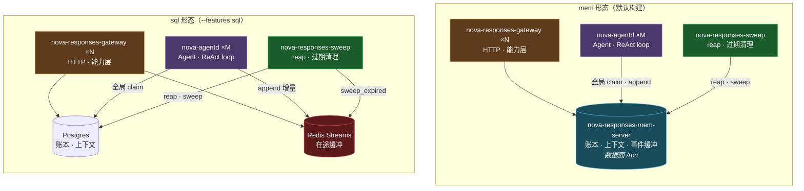
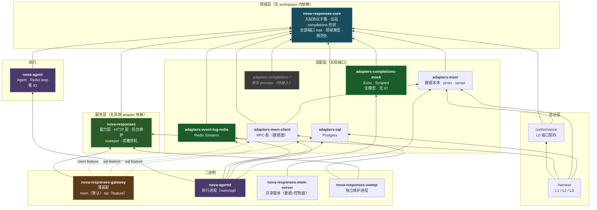
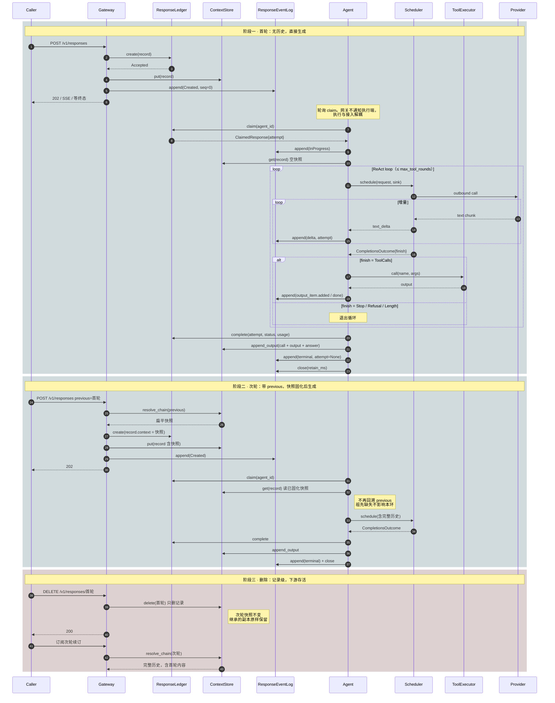
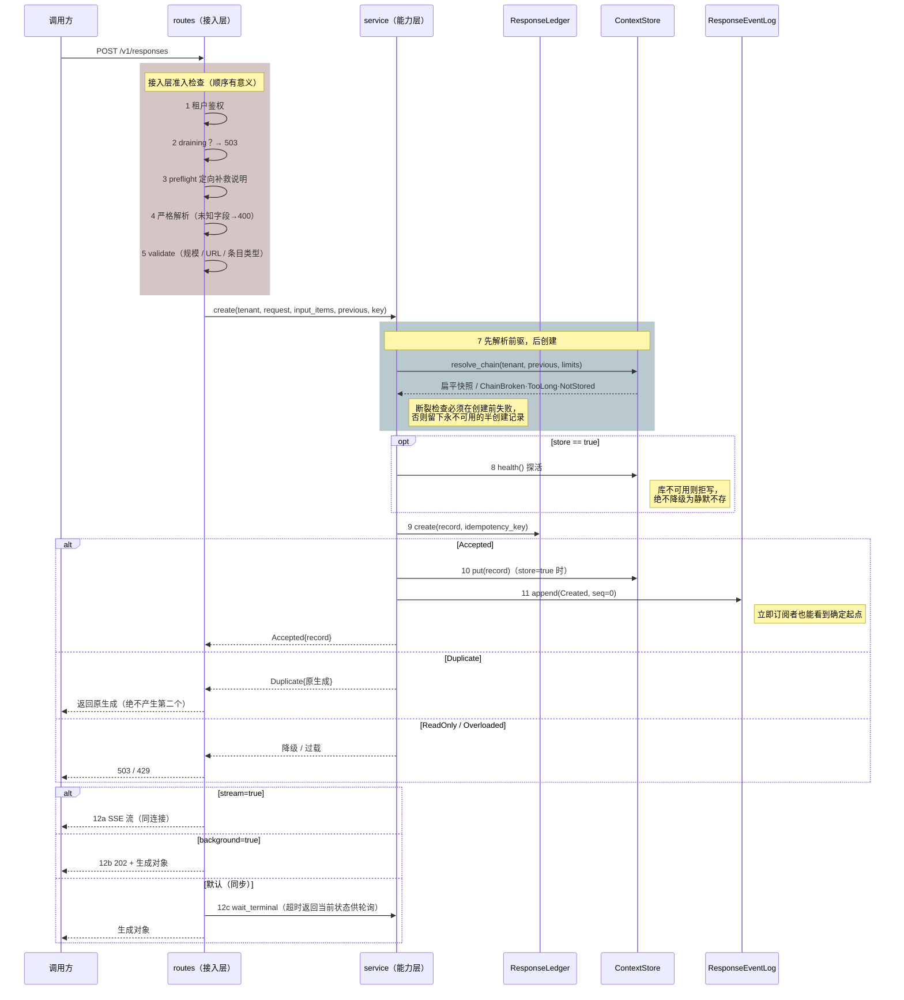
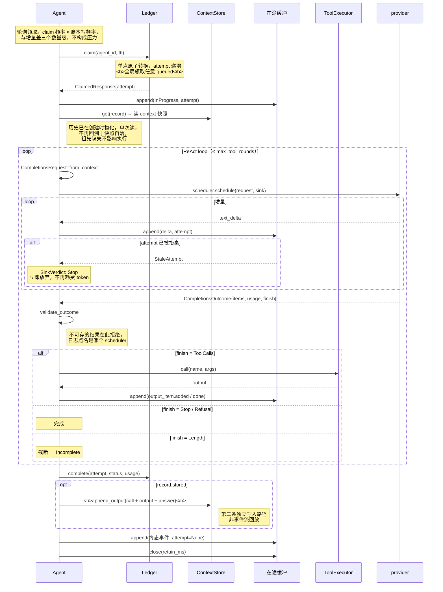
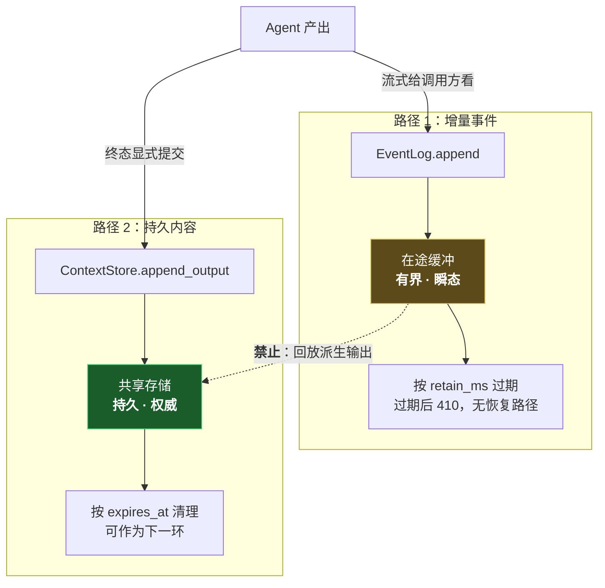
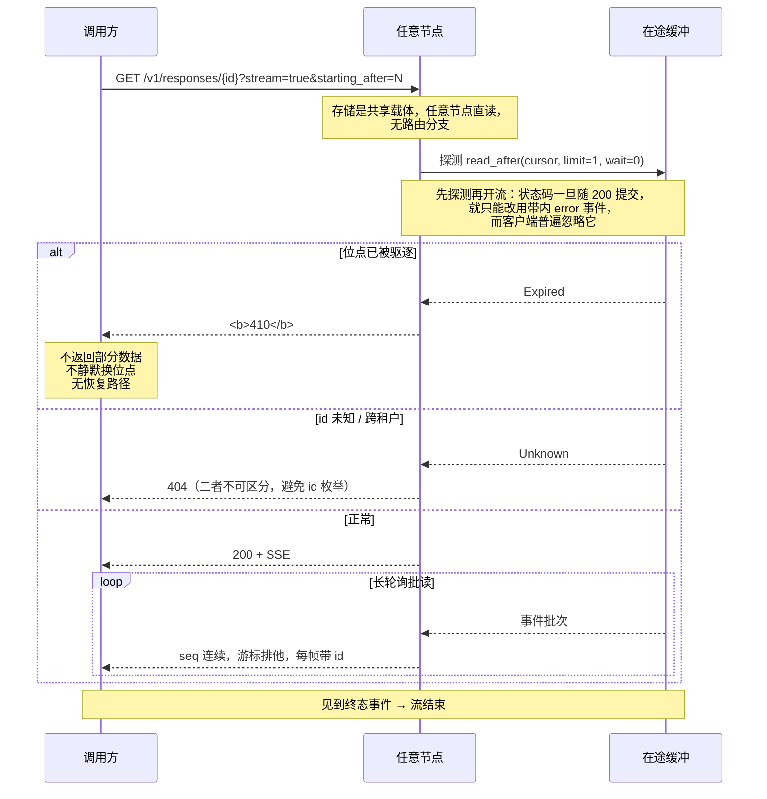
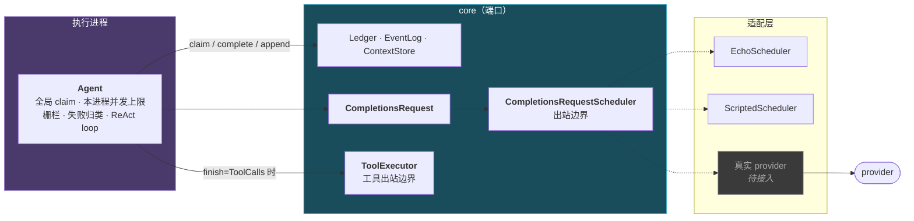
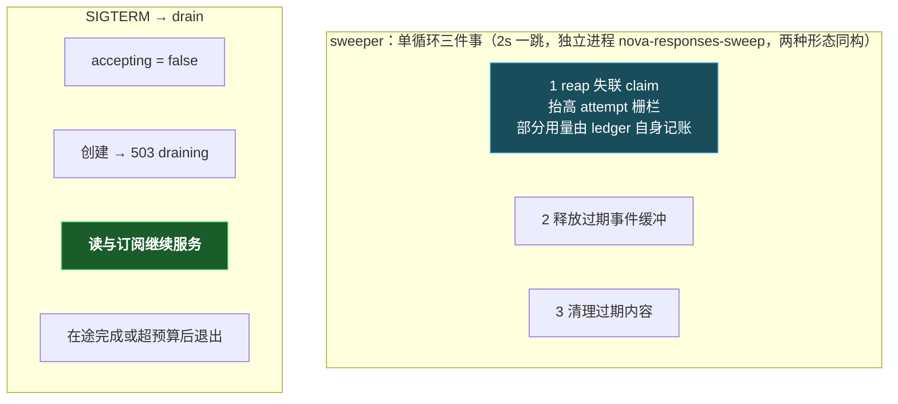

# 系统架构复验图

> **用途**：核对你与我对系统的理解是否一致。
>
> 每张图都标注了可核对的**符号位置**（模块、函数、类型名），而非行号——行号会随任何一次编辑失效，而失效的引用比没有引用更糟。**若图与代码不符，以代码为准并请指出**：这份文档的价值全在于它能被伪证。
>
> 核实时间：2026-09-03，基于当前工作区状态。架构基线为 **D25**（执行进程独立 + 在途缓冲共享化 + 能力层抽离 + claim 全局化）。
>
> **本文档不记录决策推导**。为什么这样选、否决了什么，唯一权威是 [`decisions.md`](../architecture/decisions.md)；此处只描述「现在长什么样」。

---

## 0. 五个最容易产生理解偏差的地方

先单独列出，因为后面每张图都受其影响。

| # | 事实 | 常见误解 |
|---|---|---|
| 1 | **执行是独立进程 `nova-agentd`**，经 `ResponseLedger` 端口直连共享账本领活 | 以为执行在网关进程内，或以为有 `/v1/agent/*` 拉取端点 |
| 2 | **claim 是全局的**：任意执行进程可领取任意 queued 生成 | 以为领取限定「创建它的那个节点」 |
| 3 | **两条写路径彼此独立**：增量走事件缓冲（有界瞬态），输出条目走上下文库（持久） | 以为输出条目由事件流回放派生 |
| 4 | **没有节点间转发**：存储是共享载体，任意节点直读，`peers` / 转发子系统已整体移除 | 以为仍有节点间转发或链亲和路由 |
| 5 | **mem 与 sql 只是载体不同，进程拓扑一致**：两者都分离执行（独立 `nova-agentd`），mem 的载体是 `nova-responses-mem-server`，sql 的载体是 Postgres+Redis | 以为 mem 仍单进程内嵌执行 |

第 5 条最容易漏，它是理解 §1 与 §4 的前提。

---

## 1. 两种载体，同一进程拓扑

同一个 gateway 二进制有两种**编译形态**，由 Cargo feature 静态选择（不是运行时 config）：

- **`feature = "mem"`（默认）**：共享载体是 `nova-responses-mem-server`（进程内数据 + HTTP 数据面）。gateway 只挂 `adapters-mem-client` 客户端桩。协议兼容验证（OpenAI SDK 接入）、本地开发、L2 都不需要数据库（D17）。
- **`feature = "sql"`**：真实载体（Postgres + Redis）。用 `--no-default-features --features sql` 构建，release 二进制静态排除 mem 客户端。

| | **mem 形态**（默认） | **sql 形态**（`--features sql`） |
|---|---|---|
| 账本 / 上下文库 | `adapters-mem-client` → `mem-server` | `adapters-sql`，Postgres |
| 在途事件缓冲 | `adapters-mem-client` → `mem-server` | `adapters-event-log-redis`，Redis Streams |
| 执行位置 | **独立进程** `nova-agentd`（mem 变体） | **独立进程** `nova-agentd`（sql 变体） |
| 维护（sweep） | **独立进程** `nova-responses-sweep` | **独立进程** `nova-responses-sweep` |
| 时钟 | `SystemClock`（真实墙钟） | `SystemClock`（真实墙钟） |
| 用途 | 协议验证 · 本地开发 · L0–L2 | 生产 |

**两种形态的进程拓扑完全同构**：gateway（HTTP 接入）+ `nova-agentd`（执行）+ 独立 sweep（reap/过期清理）+ 独立载体。唯一区别是载体——mem 形态用 `nova-responses-mem-server`（HTTP 数据面 + 控制面），sql 形态用 Postgres + Redis。mem 不再是「单进程内嵌执行」，`gateway/src/execution.rs` 已删除。

**两种形态的进程拓扑一致**：gateway（HTTP 接入）+ `nova-agentd`（执行）+ 独立载体 + 独立 sweep。唯一区别是载体——mem 形态用 `nova-responses-mem-server`（HTTP 数据面 + 控制面），sql 形态用 Postgres + Redis。mem 不再是「单进程内嵌执行」，`gateway/src/execution.rs` 已删除。

**后端选择是编译期行为**：`main.rs` 里 `mount()` 按 `#[cfg(feature)]` 静态分派，`mem` 与 `sql` 互斥（`compile_error!` 拒绝两者同启）。没有 `store_backend` 运行时配置——上线时「接错后端」在编译期就被排除：mem 构建不带 sql/redis 代码，生产构建不带 mem 客户端代码。所有后端依赖都是 `optional`，由 `check-deps` 强制。

**mem 载体如何跨进程**：`adapters-mem` 拆成两半——数据本体（`MemWorld`）留在 `nova-responses-mem-server` 进程，对外经 `proto`/`server` 模块暴露 `POST /rpc` 数据面；`adapters-mem-client` 是实现了同样端口（`ResponseLedger`/`ResponseEventLog`/`ContextStore`）的 RPC 桩，gateway/agentd/sweep 各自持有一份，连同一个 `mem-server`。这与「gateway/agentd 都是 Postgres/Redis 的 client」完全同构——唯一的差异是 client 连的是 mem-server 而非真库。

**核对点**：

- feature 定义：`crates/gateway/Cargo.toml` 的 `[features]`（`default = ["mem"]`，`sql` 与 `mem` 互斥）
- 后端分派：`crates/gateway/src/main.rs` 的 `mount()`，`#[cfg(feature)]` 二选一
- 载体数据面：`crates/adapters/mem/src/proto.rs`（`Request`/`Response`）与 `server.rs`（`dispatch`）；HTTP 装配在 `crates/mem-server/src/main.rs`
- 客户端桩：`crates/adapters/mem-client/src/{ledger,event_log,context}.rs`
- 执行：`crates/agentd/src/main.rs`（`mount_sql` / `mount_mem` 二选一）
- 独立 sweep：`crates/sweep/src/main.rs`，复用 `nova-responses::sweeper::SweepDeps`
- 能力层 / HTTP 层：都在 `nova-responses` library，两种形态复用
- 夹具：`testing/config/node-{a,b,c}.toml` 供 mem gateway 用；`xtask` 的 `procs up` 启动 mem-server + agentd + sweep + 三个 gateway

---

## 2. Crate 分层与依赖方向

**核对点**：

- **端口在 `core`，实现在 `adapters/*`** —— `core/src/ports/mod.rs` 首行即此约定。`CompletionsRequestScheduler` 与 `ToolExecutor` 都遵循它，与 `ResponseLedger` 并列
- `core` 无 workspace 内依赖（`crates/core/Cargo.toml`），这是 `check-deps` 的不变量
- **`nova-agent` 不依赖 HTTP / DB / 任何具体 scheduler**：`check-deps` 拒绝向它注入 `reqwest`/`hyper`/`axum`/`sqlx`（已实测门禁有效）。因此 claim → ReAct → submit 全路径可在无 socket、无模型的单测里跑完
- **`gateway → nova-agent` 是虚线**：仅 mem 形态用到，生产执行是 `nova-agentd`
- `adapters-completions-mock` 不得依赖 `reqwest`/`sqlx`/`nova-agent`（同门禁），否则一个测试可能悄悄发出真实调用

### 2.1 core 同时承载两个方向的协议，这是有意的

| 模块 | 方向 | 所有者 | 违约含义 |
|---|---|---|---|
| `protocol/` | **入站** | 我们（已发布子集） | 返回 400 |
| `completions/` | **出站** | provider | 我们的请求格式错误 |

混淆二者会双向出错：要么因为某 provider 支持而开始接受一个字段，要么因为我们的子集不含而拒绝发送一个字段。

---

## 3. 协议表面

全部端点，来自 `nova-responses/src/routes/mod.rs` 的 `router()`：

| 方法 | 路径 | 说明 |
|---|---|---|
| `GET` | `/health` | 存活 + `accepting` 状态 |
| `POST` | `/v1/responses` | 创建（三种投递模式） |
| `GET` | `/v1/responses/{id}` | 检索当前状态对象；`?stream=true` 转 SSE 订阅 |
| `DELETE` | `/v1/responses/{id}` | 记录级删除 |
| `POST` | `/v1/responses/{id}/cancel` | 取消在途生成 |
| `POST` | `/v1/admin/read_only` | 降级只读 |
| `POST` | `/v1/admin/pending_limit` | 过载阈值 |
| `POST` | `/v1/tenants/{tenant}/purge` | 租户清除 |

**没有** `/v1/agent/*`（执行不是协议，走端口）、**没有** `/v1/sessions/*`（D20 移除）。前者由 `check-deps` 的 `check_execution_claims_globally_through_the_port` 守门。

`GET /v1/responses/{id}` 未完成时返回 `status: in_progress` 的**部分对象而非失败**——这是 `background=true` 轮询机制的语义基石（详见 [`06-protocol-subset.md`](./06-protocol-subset.md) §7）。

---

## 4. 无节点间转发

存储是共享载体（Postgres + Redis），任意节点直读，因此**不存在**节点间转发。历史上为 mem 多节点而生的 `routing.rs`（`route_inflight` / `route_content` / `route_chain_affinity` / `proxy_*`）、`peers` 对等表、节点间内部 token，连同端口上的 `is_shared()` 能力位，已随共享缓冲化（D25）整体移除。

核对点：`nova-responses/src/routes/responses.rs` 中的 retrieve / stream / cancel / delete 直接读 `state.context` / `state.event_log`，不再经过任何路由分支；`nova-responses/src/config.rs` 无 `peers` / `internal_token_env` 字段。

这一删除同时消除了一个攻击面：不再有任何「由请求字段推导转发地址」的路径（原 SEC-5 的 SSRF 向量随转发子系统一起消失）。

---

## 5. 端到端总览：多轮对话的生命周期

前几节各管一段；这一张把它们串起来，展示一个多轮对话从创建、执行、续接到删除的完整流转，以及**快照（D24）如何固化、读取、如何被记录级删除**。

### 5.1 参与者与职责

最易混淆的是三个「存东西」的组件——它们存的东西不同、生命周期不同。用一张工单作类比：

| 参与者 | 类比 | 存什么 | 回答的问题 | 生命周期 |
|---|---|---|---|---|
| **ResponseLedger** | 工单的状态栏 | 状态、attempt、幂等键、用量 | 这个 response **处于什么状态、归谁**？ | 持久 |
| **ContextStore** | 工单的正文与附件 | input/output 条目 + 物化快照 | 这段对话的**历史是什么**？ | 持久（保留期可配） |
| **ResponseEventLog** | 现场的实时直播流 | 正在产生的增量事件 | 订阅者**此刻看到了哪些增量**？ | 瞬态（终态后按 `retain_ms` 释放） |
| **Agent** | 干活的工人 | 不拥有数据，只驱动流转 | **谁把活干完**？ | 独立进程（`nova-agentd`，两种形态皆然） |
| **Gateway** | 前台 | — | 请求该不该进 | — |
| **Scheduler** | 外包渠道 | — | 怎么触达模型（含排队限流） | — |
| **ToolExecutor** | 工具间 | — | 模型要调的工具怎么落地 | — |

一句话记住三者：**Ledger 管「状态」，ContextStore 管「历史」，EventLog 管「正在发生的增量」**；Agent 是协调三者的「工人」，自己不留数据。

**一个 response 就是一个 agent 的完整执行**：Agent 内部跑 ReAct 循环——模型要工具就调 `ToolExecutor`，把结果喂回模型再继续，直到模型给出最终答案。工具调用与结果既进快照（下一轮模型能看到完整轨迹），也作为 `output_item.*` 事件流式推送给订阅者。

### 5.2 三阶段时序

**这张图要传达的三件事**：

1. **两条写路径从不交汇**：增量走 `ResponseEventLog`（瞬态），输出条目走 `ContextStore`（持久）。`Agent` 是唯一同时触碰两者的组件，但它把「流式给订阅者看」和「终态提交存储」作为两次独立写入（§8）。
2. **快照在创建时固化、执行时读取**：阶段二里 `previous` 的历史在 `create` 那一刻被解析成扁平快照，随后执行只是单次读取——这就是「祖先缺失不影响本环」的由来（D24）。
3. **删除是记录级的，下游存活**：删除首轮只删那条记录，次轮快照里的扁平副本原样保留，次轮仍可解析完整历史，而非像旧链式方案那样整链断裂。

---

## 6. 创建时序（三种投递模式）

**核对点**（`routes/responses.rs::create` 与 `service/responses.rs::ResponsesService::create`）：

- **分层边界**：协议解析、鉴权、路由、HTTP 状态映射在 `routes`；`resolve_chain → create → put → append(Created)` 这条业务主线在 `service`，其中**不出现** axum 类型。故 responses 业务逻辑可用纯异步测试覆盖，无需启动 HTTP 服务
- **步骤 7 在 9 之前**是刻意的：链断裂若发生在创建之后，会留下一条永不可用的半创建记录
- 幂等重放返回**原生成**，不产生第二个（`CreateResult::Duplicate`）
- `Created` 事件 `seq=0`，是「0 基连续」的起点
- 三模式共用**同一条内部事件流**；同步模式只是服务端替调用方等这条流的终态
- 网关创建后即返回，**不通知执行端**：`nova-agentd` 轮询领取，与创建节点无关

---

## 7. 执行时序（独立执行 + attempt 栅栏）

**核对点**（`crates/agent/src/engine.rs`）：

- **`claim` 无节点参数**：任意执行进程领取任意 queued 生成。`check-deps` 会拒绝 `claim` 重新带上 `NodeTag`，也会拒绝 sql claim 语句重新出现 `node_tag` 谓词
- 上下文由**创建时固化**的快照提供：Agent 单次读取；scheduler 无租户上下文，不得自行解析历史
- 栅栏：`append` 携带 attempt，被取代的持有者写入返回 `StaleAttempt` → `SinkVerdict::Stop`（见 `LedgerSink`）
- **终态事件 `attempt: None`**：栅栏已由 ledger 转换校验过，此处再校验会拒掉宣告转换的那条事件，流将永不终止
- `Executed` 的四个取值（`Idle`/`Completed`/`Superseded`/`Failed`）刻意区分，测试可断言走过哪条路径而非只看最终状态。特别地 **`Superseded` 不是失败**：活已归属新 attempt，报失败会终结一个正在被服务的响应
- 并发上限约束**本进程**（`agentd` 的 `--max-concurrent`，两种形态同构）；provider 侧限流属 scheduler

### 7.1 为何 attempt 栅栏不可删除

全局 claim 是单点原子转换，并发双领在结构上不可能。但栅栏仍不可删：执行任务卡死超过执行上界会被 sweeper 回收（抬高 attempt）；若该任务此后苏醒并追加，其 attempt 已过期，必须被拒（FR-6 / CR-7 / INV-6）。

> 「claim 已原子，故可去掉 attempt」是错误推论：**卡死任务的苏醒写入与回收是并发的，与领取无关**。

---

## 8. 两条写路径（最关键的一张）

**核对点**：

- 两条路径由 Agent **分别写入**，无派生关系：`engine.rs` 的 `complete` 中 `ledger.complete` / `context.append_output` / `event_log.append` 是三次独立写
- 若输出条目由事件流回放派生，则持久历史将依赖一个随时可被驱逐的有界缓存（INV-48）
- 已由 L0 `output-provenance` 验证：**销毁事件流后，已存输出必须依然完整**（`conformance` 的 `assert_output_provenance`）

**实际后果**：共享缓冲下网关被 SIGKILL 不再丢失在途流（缓冲在 Redis，执行在别的进程）。但增量始终是瞬态的——终态后按 `retain_ms` 释放，之后只能读持久历史。这是分层的代价与收益的交换点。

---

## 9. 订阅与续订

**核对点**（`nova-responses/src/sse.rs`）：

- **先探测后开流**（`open_stream` 的首个 `read_after`）：未知 id / 过期位点得到真正的 HTTP 状态码，而不是 200 之后的带内错误
- `starting_after` 是**排他**游标：`starting_after=0` 跳过 seq 0。`resolve_cursor` 让 `Last-Event-ID` 优先于查询串——它反映客户端**实际收到**了什么
- 410 是硬失败（`map_event_log_error` 把 `Expired` 映射为 `GONE`）：不返回部分数据、不换位点、无恢复路径
- 流中途出错时状态码已发出，只能带内报告；但仍显式——不编造部分数据，且流在此结束
- 调用方唯一需持久化的连接级状态是游标 `(response_id, sequence_number)` → 换连接、换设备、换节点都能续订（FR-11 / FR-32）

---

## 10. Agent 与出站调度的职责边界

### 10.1 为何 Agent 与 scheduler 不能合并

| 若合并方向 | 后果 |
|---|---|
| 领活循环并入 scheduler 端口 | 每个 provider 适配器都要重新实现领取、栅栏、失败归类 |
| provider 关切放进 Agent | 限流成为**集群形状的属性**，换 provider 就要重新调部署 |

职责切分：

- **Agent 决定**：何时领活、本进程并发上限、失败是否终结响应
- **scheduler 决定**：一切与触达模型有关的事，**包括排队与限流**

### 10.2 命名为 Scheduler 的实际后果

`CompletionsRequestScheduler` 比 `Executor` 更宽——允许实现内部做排队、限流、批处理、连接池复用、跨 provider 重试。出站边界确实需要这些。

由此产生的规矩：**provider 侧并发策略属于端口之后**。`SchedulerError` 因此区分 `Refused`（队列已满，**未发出**，重试不额外花钱）与 `Unavailable`（已发出并耗费）。

---

## 11. 后台维护与优雅停机

**核对点**（`nova-responses/src/sweeper.rs`、`nova-responses/src/shutdown.rs`、`crates/sweep/src/main.rs`）：

- 三件事合并为**一个**循环：三个独立循环意味着三个定时器和三次忘记其一的机会
- 部分用量在回收时由 ledger 自身记账，故两步之间崩溃不会丢失（INV-51）
- reap 是**失联执行的唯一收口**（INV-45）。执行进程独立后没有「启动时扫自己的孤儿」这一步可依赖——崩掉的 worker 不会再启动，只能由 sweep 进程抬 fence 并置失败
- drain 期间**读与订阅继续服务**（`AppState::accepting`）——这是滚动发布不中断在途流的原因
- **网关 drain 不影响执行**：`nova-agentd` 是独立进程，故障域已分离；sweep 也是独立进程（`nova-responses-sweep`，mem/sql 双 feature），两种形态同构

---

## 12. 验证分层与架构的对应

| 层 | 驱动方式 | 后端 | 覆盖什么 | 入口 |
|---|---|---|---|---|
| **L0** | 直调端口，14 项契约用例 | mem（+ L3 复用于 sql） | 端口语义：事件日志、账本、取消、上下文链、完整性、`global-claim`、输出溯源、持久化顺序、并发、协议子集… | `testing/conformance` |
| **L1** | YAML 场景直驱端口 + Trace/Oracle | mem | 领域行为，**刻意绕过 HTTP**，故失败可定位到领域层 | `testing/scenarios/l1` |
| **L2** | 真实多进程 + HTTP | mem（共享载体 `mem-server` + 独立 agentd + 独立 sweep） | 协议契约、幂等、只读、过载、跨节点订阅、上下文链 | `testing/scenarios/l2` |
| **L3** | 复用 L0 契约 + sql 专属场景 | **真实 Postgres** | 只有真库能证的性质（真实 SQL 语义） | `testing/harness/src/l3.rs` |

- L0–L2 **不得需要数据库**（D17）；L3 无库时是**跳过而非失败**
- gateway 另有 HTTP 契约测试（`crates/nova-responses/tests/http_contract.rs`），在进程内驱动 Agent 走完 claim → ReAct → complete
- `adapters-event-log-redis` 的 Redis 集成测试标记 `#[ignore]`，需 `redis-server`：`cargo test -p adapters-event-log-redis --test redis_integration -- --ignored`

### 12.1 check-deps 守的是哪些结构性事实

`just check-deps`（`xtask`）把几条无法用单测表达的结构约束变成门禁：

| 门禁 | 若失效会怎样 |
|---|---|
| `core` 无 workspace 内依赖 | 领域层被适配器污染，分层失去意义 |
| `nova-agent` 无 `reqwest`/`hyper`/`axum`/`sqlx` | 工作循环不再能脱离 socket 测试 |
| `adapters-completions-mock` 无 HTTP/DB/`nova-agent` | 某个测试可能悄悄发出真实调用 |
| 无 `/v1/agent/*` 路由 | 执行退回 HTTP 拉取协议，多一跳、多一处鉴权、多一处栅栏校验 |
| `claim` 不带 `NodeTag`、sql claim 无 `node_tag` 谓词 | 队列中的生成被搁死在没有执行端的节点上 |
| 协议子集文档与代码一致 | 已发布子集与实现漂移 |

> 门禁自身也需要能被伪证：`node_tag` 谓词那条检查的首版搜索整个文件，结果被**解释该谓词的注释**满足了——删掉谓词本身仍能过关。现在它只在 claim 语句范围内匹配。**能被自身文档满足的门禁什么也没检查。**

---

## 13. 仍待确认的判断

| # | 判断 | 现状 |
|---|---|---|
| 1 | **真实 provider 适配器尚未实现**（按「具体实现后置」） | 接入时新增 `adapters/completions-<provider>` 实现端口即可，Agent 工作循环与类型转换均不动 |
| 2 | **`ResponseLedger` 缺少读取部分用量的方法** | `partial_usage_count` 只在 mem 具体类型上，不在 trait 内，故只持有端口的计费方取不到已记账金额。CR-11 目前由 L1 经 Trace 覆盖，而非端口契约。若计费确需经端口取数，这是一处真实缺口 |
| 3 | ~~mem 形态的内嵌执行是否应长期保留~~ | **已解决**：mem 形态改为共享载体（`mem-server`）+ 客户端桩，执行统一走独立 `nova-agentd`，内嵌分支已删除 |
| 4 | ~~FR-32 / FR-34 仍 deferred~~ | **已解决**：FR-32 由 `z-fr32-no-stickiness-http`（SIGKILL 一实例后换实例续订）、FR-34 由 `z-fr34-graceful-drain-http`（优雅停机拒绝新建、读继续、在途不丢）覆盖。L0–L2 已 100% 覆盖 baseline |

接入真实 provider 时需要定的：

| 决策 | 建议 |
|---|---|
| `base_url` / `api_key` 来源 | **仅环境变量**（SEC-4 已要求密钥不入配置文件与日志） |
| SSE 增量解析 | 放适配器内；Agent 只见 `text_delta` |
| 超时与重试 | 放**适配器内**（§10.2：并发策略属端口之后） |
| 限流 | 同上。`SchedulerError::Refused` 已为「未发出即拒」预留 |

---

## 附：权威来源对应表

| 本文档章节 | 权威来源 |
|---|---|
| 1 部署形态 | `crates/gateway/src/main.rs`（`mount`）· `crates/agentd/src/main.rs` · `crates/mem-server/src/main.rs` · `crates/adapters/mem/src/proto.rs` · `crates/adapters/mem-client/src/lib.rs` |
| 2 Crate 分层 | 各 `Cargo.toml` 的 `[dependencies]` |
| 3 协议表面 | `nova-responses/src/routes/mod.rs` · [`06-protocol-subset.md`](./06-protocol-subset.md) |
| 4 无转发 | `nova-responses/src/routes/responses.rs`（retrieve / stream / cancel / delete 直读端口） |
| 5 端到端总览 | 本文档 §6/§7/§9 的综合 · `decisions.md` D24 |
| 6 创建时序 | [`01-responses-api.md`](./01-responses-api.md) · `nova-responses/src/routes/responses.rs` · `nova-responses/src/service/responses.rs` |
| 7 执行时序 | `crates/agent/src/engine.rs` · `crates/agent/src/lib.rs` 模块注释 |
| 8 两条写路径 | [`invariants.md`](../architecture/invariants.md) INV-48 · [`03-context-chain.md`](./03-context-chain.md) |
| 9 订阅续订 | `nova-responses/src/sse.rs` |
| 10 职责边界 | `core/src/ports/completions.rs` · `decisions.md` D25 |
| 11 维护与停机 | [`05-reliability.md`](./05-reliability.md) · `nova-responses/src/sweeper.rs` · `crates/sweep/src/main.rs` |
| 12 验证分层 | [`02-verification.md`](./02-verification.md) · `xtask/src/main.rs` |
| 决策推导（本文档不重复） | [`decisions.md`](../architecture/decisions.md) |
| 需求编号 | [`spec.md`](../requirements/spec.md) |

### 已知文档不一致

`docs/design/01-session-stream.md` 整篇描述 **Session / Turn / 快照开屏 / 热层冷层 / 跨区镜像**——这套概念已由 D20 移除，对应的 `/v1/sessions/*` 端点与 `trim_hot` 也已删除。该文档已在 `design/README.md` 中标注为「历史」，保留而非删除，是因为它记录了被取代的方案，对理解 D20 为何这样收口有价值；但它**不描述当前系统**。

`design/README.md` 的「正式设计」表只列了 01-session-stream（历史）与 02-verification，而 `01-responses-api.md`、`03-context-chain.md`、`04-content-integrity.md`、`05-reliability.md`、`06-protocol-subset.md` 均未列入——**索引不全，待补**。
