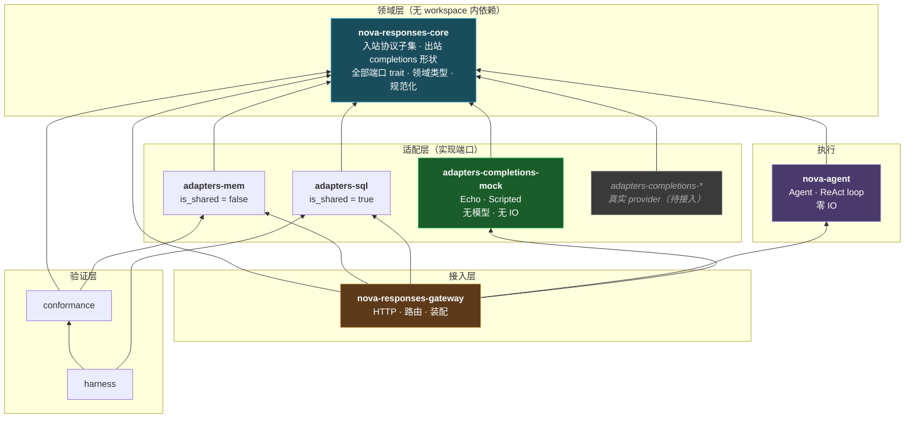
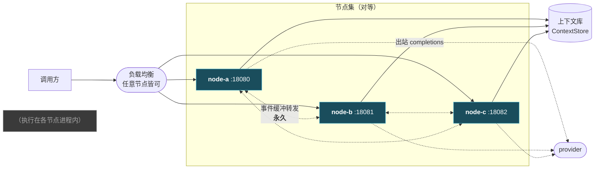
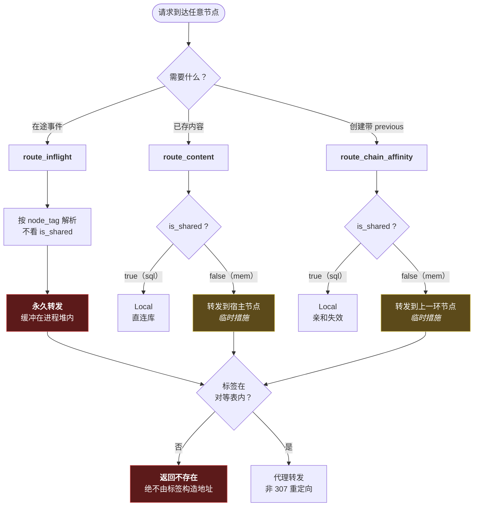
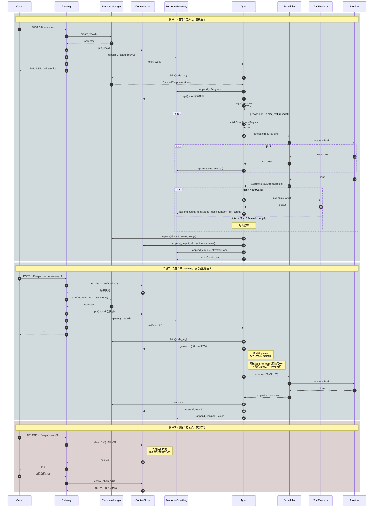
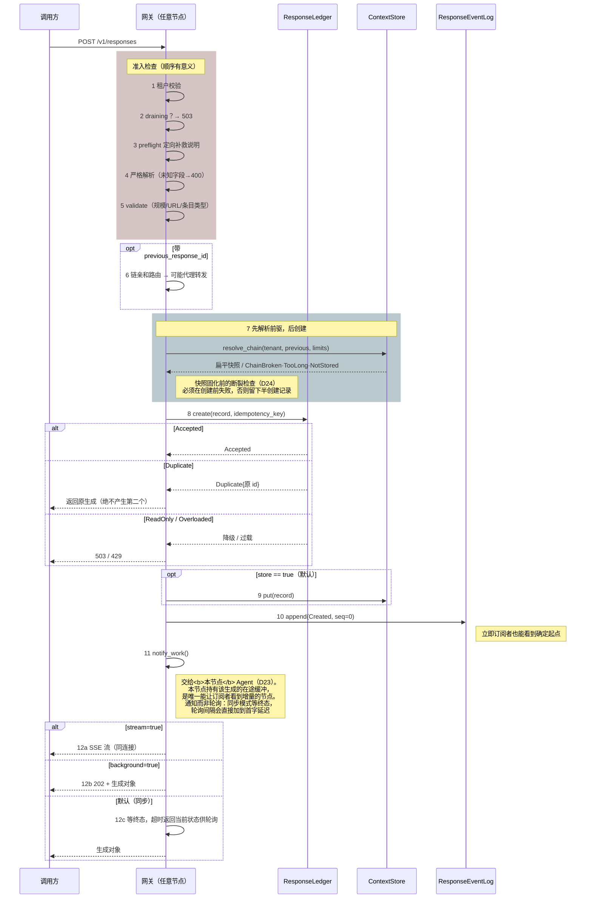
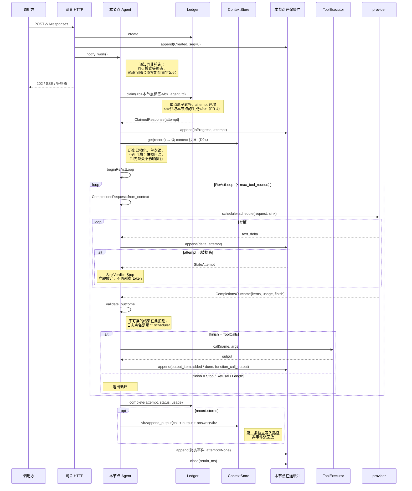
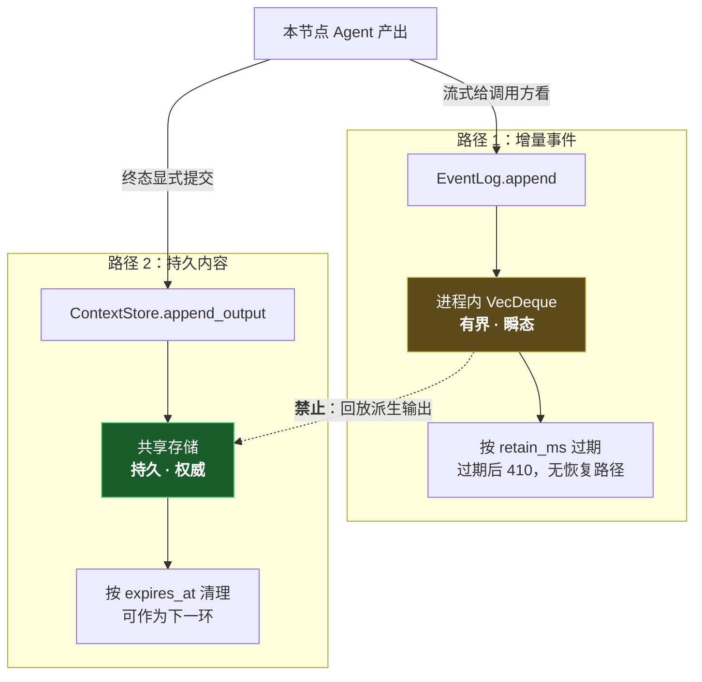
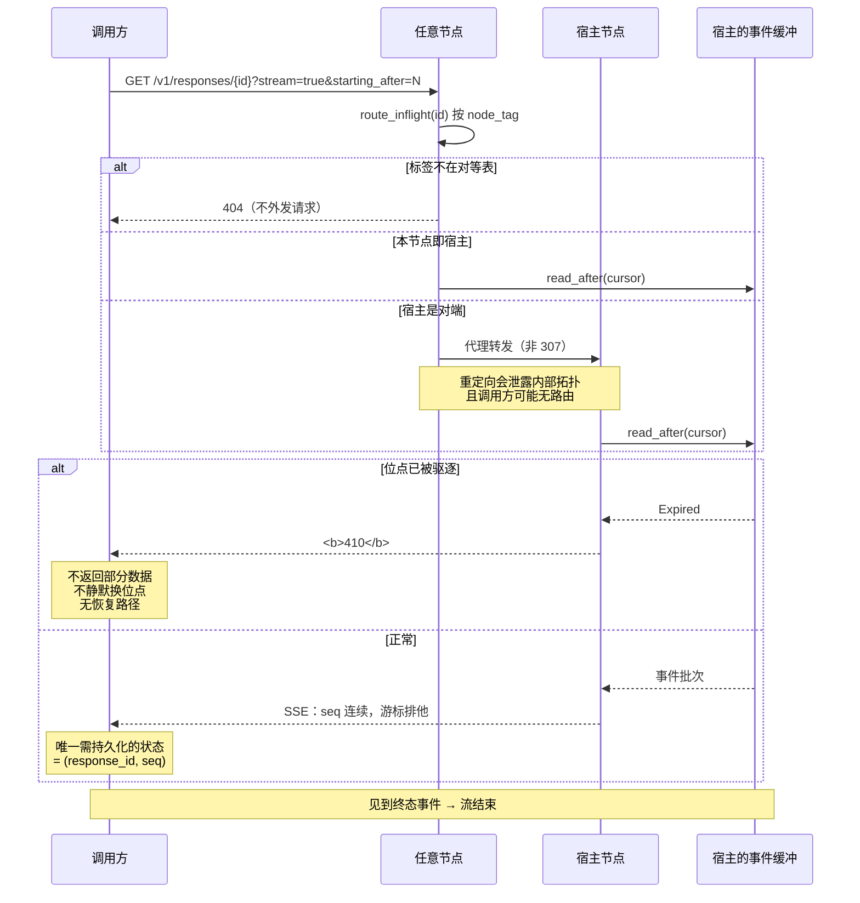
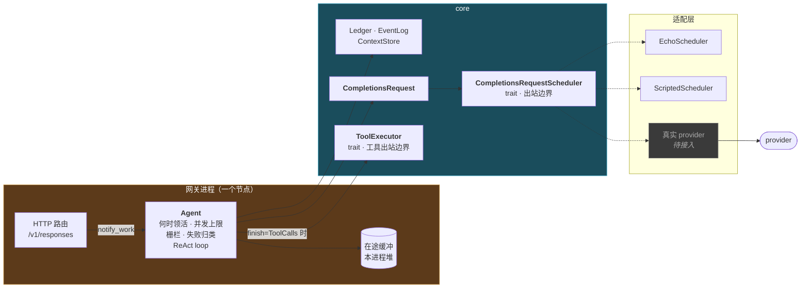
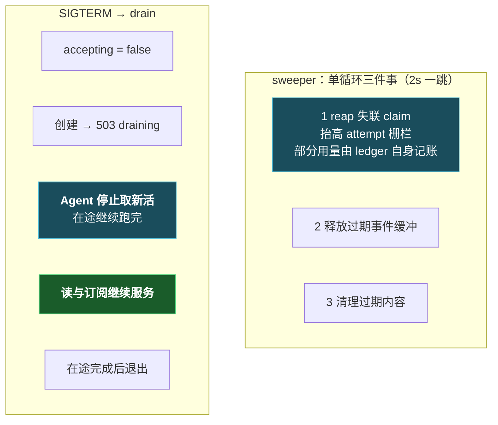

# 系统架构复验图

> **用途**：核对你与我对系统的理解是否一致。
>
> 每张图都标注了可核对的代码位置。**若图与代码不符，以代码为准并请指出**——这份文档的价值全在于它能被伪证。
>
> 核实时间：2026-09-02。基于当前工作区（未提交）状态绘制。

---

## 0. 三个最容易产生理解偏差的地方

先把它们单独列出，因为后面每张图都受其影响。

| # | 事实 | 常见误解 |
|---|---|---|
| 1 | **执行在宿主节点进程内。** 无独立执行端进程，无 `/v1/agent/*` 端点（D23） | 以为仍是外部执行端拉取 |
| 2 | **两条写路径彼此独立。** 事件流有界瞬态，内容持久 | 以为输出条目由事件流回放派生 |
| 3 | **三条转发路径中只有一条是永久的** | 把链亲和当成永久设计 |
| 4 | **领取限定本节点作用域**（§9）——生成者与在途缓冲持有者恒等 | 以为任意节点可领取任意生成 |

---

## 1. Crate 分层与依赖方向



**核对点**：

- **端口在 `core`，实现在 `adapters/*`** —— `crates/core/src/ports/mod.rs` 首行即此约定。`CompletionsRequestScheduler` 现遵循它，与 `ResponseLedger` 等并列
- `core` 无 workspace 内依赖（`crates/core/Cargo.toml`）
- **`gateway` 现依赖 `nova-agent`**：执行在网关进程内（D23）。它也依赖一个 scheduler 适配器，由配置选择
- **`nova-agent` 不依赖任何具体 scheduler**：它只认端口，故换 provider 不触碰工作循环
- 以上由 `check-deps` 强制：向 `nova-agent` 注入 `reqwest` 会被拒绝（已实测验证门禁有效）

### 1.1 core 同时承载两个方向的协议，这是有意的

| 模块 | 方向 | 所有者 | 违约含义 |
|---|---|---|---|
| `protocol/` | **入站** | 我们（已发布子集） | 返回 400 |
| `completions/` | **出站** | provider | 我们的请求格式错误 |

混淆二者会双向出错：要么因为某 provider 支持而开始接受一个字段，要么因为我们的子集不含而拒绝发送一个字段。

## 2. 节点拓扑：对等无主从



**核对点**：

- 任意节点均可创建（FR-1），无权威节点
- **在途事件缓冲是某个进程堆里的 `VecDeque`**，无共享端点可连 —— 故节点间转发是永久架构，不是过渡方案（`crates/gateway/src/routing.rs:34-42`）
- **每个节点执行自己创建的生成**（D23）。领取限定本节点作用域，故生成者与在途缓冲持有者恒等

---

## 3. 三条路由决策 —— 只有一条是永久的

这是最需要复验的一处。



**核对点**（`crates/gateway/src/routing.rs`）：

| 函数 | 行 | 看 `is_shared` 吗 | 性质 |
|---|---|---|---|
| `route_inflight` | 40-42 | **不看** | 永久 |
| `route_content` | 49-54 | 看 | 临时 |
| `route_chain_affinity` | 62-67 | 看 | 临时 |

**为何必须区分**：若把三者都描述为「一次定向跳转」，链亲和这个「非共享存储的权宜之计」就会固化成设计元素——长对话会把全部流量钉在单个节点上（`routing.rs:8-11` 的注释即此意）。

**换 sql 后端时，退化是自动的**：`route_content` 与 `route_chain_affinity` 因 `is_shared() == true` 直接返回 `Local`，无需改这份代码。

**SEC-5**：标签不在对等表内 → 返回不存在，且**不外发请求**。标签是攻击者可控输入，由它推导地址等于把每个 id 变成 SSRF 载体。

---

## 4. 端到端总览：多轮对话的生命周期

前三节的图各管一段；这一张把它们串起来，展示一个多轮对话从创建、执行、续接到删除的完整流转，以及**快照（D24）在其中如何固化、读取、如何被记录级删除**。

### 4.1 参与者与职责

图里最易混淆的是三个「存东西」的组件——它们存的东西不同、生命周期不同。用一张工单作类比：

| Participant | 类比 | 存什么 | 回答的问题 | 生命周期 |
|---|---|---|---|---|
| **ResponseLedger** | 工单的状态栏 | 状态（queued/in_progress/completed/failed）、attempt、幂等键、用量 | 这个 response 现在**处于什么状态、归谁**？ | 持久 |
| **ContextStore** | 工单的正文与附件 | input/output 条目 + 物化快照 | 这段对话的**历史是什么**？ | 持久（保留期可配） |
| **ResponseEventLog** | 现场的实时直播流 | 正在产生的增量事件（delta、终态） | 订阅者**此刻看到了哪些增量**？ | 瞬态（进程内、终态后释放） |
| **Agent** | 干活的工人 | 不拥有数据，只驱动流转 | **谁把活干完**？ | 进程内任务 |
| **Gateway** | 前台 | — | 请求该不该进、该不该转发 | — |
| **CompletionsRequestScheduler** | 外包渠道 | — | 怎么触达模型 | — |
| **ToolExecutor** | 工具间 | — | 模型要调的工具怎么落地 | — |
| **Provider** | 模型服务 | — | — | — |
| **Caller** | 调用方 | — | — | — |

一句话记住三者：**ResponseLedger 管「状态」，ContextStore 管「历史」，ResponseEventLog 管「正在发生的增量」**；Agent 是协调这三者的「工人」，自己不留数据。

**一个 response 就是一个 agent 的完整执行**：Agent 内部跑 ReAct 循环——模型要工具就调 `ToolExecutor`，把结果喂回模型再继续，直到模型给出最终答案。工具调用与结果既进快照（下一轮模型能看到完整轨迹），也作为 `output_item.*` 事件流式推送给订阅者。



**这张图要传达的三件事**：

1. **两条写路径从不交汇**：增量走 `ResponseEventLog`（瞬态），输出条目走 `ContextStore`（持久）。`Agent` 是唯一同时触碰两者的组件，但它把「流式给订阅者看」和「终态提交存储」作为两次独立写入。
2. **快照在创建时固化、执行时读取**：阶段二里，`previous` 的历史在 `create` 那一刻被解析成扁平快照，随后执行只是单次读取——这就是「祖先缺失不影响本环」的由来（D24）。
3. **删除是记录级的，下游存活**：阶段三里删除首轮只删那条记录，次轮快照里的扁平副本原样保留，次轮仍可解析（完整历史），而非像旧链式方案那样整链断裂。

---

## 5. 创建时序（三种投递模式）



**核对点**（`crates/gateway/src/routes/responses.rs:53-264`）：

- **步骤 7 在 8 之前**是刻意的：链断裂若发生在创建之后，会留下一条永不可用的半创建记录
- 幂等重放返回**原生成**，不产生第二个（`responses.rs:206-213`）
- `Created` 事件 `seq=0`，是「0 基连续」的起点（`responses.rs:238-247`）
- 三模式共用**同一条内部事件流**
- **执行由创建它的节点承担**，不是任意节点（§6、§9）

---

## 6. 执行时序（内部执行 + 栅栏）



**核对点**（`crates/agent/src/engine.rs`、`crates/gateway/src/execution.rs`）：

- **`claim` 携带本节点标签**。这是 D23 的核心：只有本节点持有该生成的在途缓冲
- 上下文由**创建时固化**的快照提供（D24）：Agent 单次读取，scheduler 无租户上下文，不得自行解析
- 栅栏保留：`append` 携带 attempt，被取代的持有者写入返回 `StaleAttempt` → `SinkVerdict::Stop`
- **终态事件 `attempt: None`**：栅栏已由 ledger 校验，再校验会拒掉宣告转换的那条事件，流将永不终止
- 并发上限由 `max_concurrent_executions` 约束**本进程**；provider 侧限流属 scheduler

### 5.1 保留 attempt 栅栏的理由

内部执行让并发双领在结构上难以发生，但栅栏**不可删除**：执行任务卡死超过执行上界会被清扫器回收；若该任务此后苏醒并追加，其 attempt 已过期，必须被拒（FR-6 / CR-7 / INV-6）。

> 「内部执行后不会双领，故可去掉 attempt」是错误推论：卡死任务的苏醒写入与回收是**并发**的，与领取无关。

## 7. 两条写路径（最关键的一张）



**核对点**：

- 两条路径由 Agent **分别写入**，无派生关系
- 若输出条目由事件流回放派生，则持久历史将依赖一个随时可被驱逐的有界缓存
- 已由 L0 `output-provenance` 用例验证：**销毁事件流后，已存输出必须依然完整**（`testing/conformance/src/lib.rs` 的 `assert_output_provenance`）

**这条约束的实际后果**：节点被 SIGKILL 时，在途事件缓冲随进程消失，对端明确失败（502）而非编造部分数据；但已完成的历史完好无损。这是分层的代价与收益的交换点。

---

## 8. 订阅与续订



**核对点**（`crates/gateway/src/sse.rs`、`routes/responses.rs:355-420`）：

- `starting_after` 是**排他**游标：`starting_after=0` 跳过 seq 0
- 410 是硬失败（`sse.rs:37`）：不返回部分数据、不换位点、无恢复路径
- 调用方唯一需持久化的连接级状态是游标 → 换连接、换设备、换节点都能续订（FR-11/FR-32）

---

## 9. Agent 与出站调度：两个相反的方向



### 8.1 为何 Agent 与 scheduler 不能合并

| 若合并方向 | 后果 |
|---|---|
| 领活循环并入 scheduler 端口 | 每个 provider 适配器都要重新实现领取、栅栏、失败归类 |
| provider 关切放进 Agent | 限流成为**集群形状的属性**，换 provider 就要重新调部署 |

职责切分：

- **Agent 决定**：何时领活、本进程并发上限、失败是否终结响应
- **scheduler 决定**：一切与触达模型有关的事，**包括排队与限流**

### 8.2 命名为 Scheduler 的实际后果

`CompletionsRequestScheduler` 比 `Executor` 更宽——允许实现内部做排队、限流、批处理、连接池复用、跨 provider 重试。出站边界确实需要这些。

由此产生的规矩：**provider 侧并发策略属于端口之后**。`SchedulerError` 因此区分 `Refused`（队列已满，**未发出**，重试不额外花钱）与 `Unavailable`（已发出并耗费）。

### 8.3 命名与结构变更对照

| 原 | 现 | 理由 |
|---|---|---|
| `ChatTask` | `CompletionsRequest`（在 `core::completions`） | 实际发出的是 completions 请求；「chat」是更上层语义，由响应与上下文链承载 |
| `ChatExecutor` | `CompletionsRequestScheduler`（在 `core::ports`） | 见 8.2；且按约定端口归 `core`、实现归 `adapters/*` |
| `AgentGateway` + `ExecutionWorker` | `Agent`（`crates/agent`） | 拉取协议取消（D23），控制面 trait 一并消失；Agent 内嵌 ReAct loop |
| `mock-agent`（二进制） | **删除** | 其唯一职责是拉取协议客户端 |
| `testing/sim` | **删除** | D20 前的 Home/Edge 模拟器，已失效 |

## 10. 后台维护与优雅停机



**核对点**：

- 三件事合并为一个循环（`crates/gateway/src/sweeper.rs:1-5`）：三个独立循环意味着三个定时器和三次忘记其一的机会
- 部分用量在回收时由 ledger 自身记账（`sweeper.rs:43-45`），故两步之间崩溃不会丢失（INV-51）
- drain 期间**读与订阅继续服务**（`state.rs` 的 `accepting` 注释）——这是滚动发布不中断在途流的原因
- 同一个标志也让 **Agent 停止领取新活**（`execution.rs:76-79`）：在途生成跑完，新的不再开始。这是内部执行后新增的一处耦合——若 Agent 不看该标志，drain 期间它仍会不断取活，节点永远等不到退出

---

## 11. 需要你确认的判断

### 已解决（按时间倒序）

**补上 Agent 层：一个 response 就是一个 agent 的 ReAct 执行。** 原先 `ExecutionEngine` 只做单次 completions 调用，拿到 outcome 即 complete，完全忽略 `FinishReason::ToolCalls`——模型请求工具时竟被当作最终答案提交。现改名为 `Agent` 并内嵌 ReAct 循环，新增 `ToolExecutor` 端口承载工具调用：

```
crates/core/src/ports/tool.rs   ← ToolExecutor trait · ToolError · NoopToolExecutor
crates/agent/src/engine.rs      ← Agent：claim → ReAct loop → complete
```

- 工具调用与结果（`FunctionCall`/`FunctionCallOutput`）一并物化进快照（D24），下一轮模型可见完整轨迹
- `max_tool_rounds` 把永不终止的工具循环截断为 Incomplete
- 工具执行失败（`ToolError`）→ 响应 Failed

**D23 · 执行改为内部执行。** 拉取协议依赖一个从未写明的前提——**领取方即宿主节点**。内存后端各持自有账本，该前提免费成立；账本变共享（D21）后前提失效且无任何机制表达：连着 node-a 的执行端可领走 node-b 的生成，增量落入 node-a 缓冲，而订阅者按 id 内的 node_tag 被送往 node-b，只看到 `Created` 随后静默，**任何路径都不报错**。

改动：

```
删除  /v1/agent/{claim,heartbeat,append,complete}
删除  testing/mock-agent（唯一职责是拉取客户端）
删除  testing/sim（D20 前 Home/Edge 模拟器，已失效）
新增  ResponseLedger::claim 携带 NodeTag；sql 加 node_tag = $3 谓词
新增  Agent（crates/agent），由网关进程内驱动
新增  L0 用例 claim-locality（已变异验证会失败）
新增  check-deps 门禁：拉取端点不得回归、claim 必须节点作用域
```

`spec.md` FR-4/5 已同步改写。

**端口与实现的归属已纠正。** 原先 `ChatExecutor` 及其实现全在 `crates/agent`，违背 `ports/mod.rs` 明文的「实现位于 `crates/adapters/*`」。现为：

```
crates/core/src/ports/completions.rs       ← 端口 trait
crates/core/src/completions/               ← 出站类型 + 翻译
crates/adapters/completions-mock/          ← Echo · Scripted · Hang
crates/agent/src/engine.rs                 ← Agent（ReAct loop）
```

**命名已按意见调整**，见 §9.3。

### 仍待确认

**④ 真实 provider 适配器尚未实现**（按「具体实现后置」）。接入时新增一个 `adapters/completions-<provider>` crate 实现端口即可，工作循环与转换均不动。需要你定的：

| 决策 | 我的建议 |
|---|---|
| base_url / api_key 来源 | **仅环境变量**（SEC-4 已要求密钥不入配置文件与日志） |
| SSE 增量解析 | 放适配器内；worker 只见 `text_delta` |
| 超时与重试 | 放**适配器内**（§9.2：并发策略属端口之后） |
| 限流 | 同上。`SchedulerError::Refused` 已为「未发出即拒」预留 |

**⑤ `ResponseLedger` 缺少读取部分用量的方法。** `partial_usage_count` 只在 mem 具体类型上，不在 trait 内，故只持有端口的计费方取不到已记账金额。CR-11 目前由 L1 经 trace 覆盖，而非端口契约。若计费确需经端口取数，这是一处真实缺口。

**⑥ FR-31 是唯一延后需求**，需真实数据库验证「共享存储后不再转发」。

## 附：与文档的对应关系

| 本文档章节 | 权威来源 |
|---|---|
| 1 Crate 分层 | 各 `Cargo.toml` 的 `[dependencies]` |
| 2 节点拓扑 | `docs/architecture/arc.md` |
| 3 三条路由 | `crates/gateway/src/routing.rs:1-15`（模块注释即设计依据） |
| 4 端到端总览 | 本文档 §5/§6/§8 的综合 · `decisions.md` D24 |
| 5 创建时序 | `docs/design/01-responses-api.md` · `routes/responses.rs:53-264` |
| 6 执行时序 | `crates/agent/src/engine.rs` · `crates/gateway/src/execution.rs` |
| 7 两条写路径 | `docs/architecture/invariants.md` INV-48 · `docs/design/03-context-chain.md` |
| 8 订阅续订 | `crates/gateway/src/sse.rs` |
| 9 执行与调度 | `crates/agent/src/lib.rs` 模块注释 · `decisions.md` D23 |
| 10 维护与停机 | `docs/design/05-reliability.md` · `sweeper.rs` |
| 协议子集 | `docs/design/06-protocol-subset.md` |

### 一处文档不一致（复验发现）

`docs/design/01-session-stream.md` 整篇描述 **Session / Turn / 快照开屏 / 热层冷层 / 跨区镜像**——这套概念已在本次重构中移除（D20），对应的 `/v1/sessions/*` 端点与 `trim_hot` 也已删除。但 `docs/design/README.md` 仍将其列为现行设计。

该文档已标注为历史状态。保留而非删除，是因为它记录了被取代的方案，对理解 D20 为何这样收口有价值；但它**不描述当前系统**。
