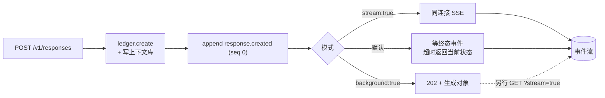

# 设计 01 · Responses API

> 依据：[`../requirements/spec.md`](../requirements/spec.md) v3 · D20 / D21 / D22
> 状态：**实现依据**

---

## 1. 端点

| 方法 | 路径 | 用途 | 支撑 |
|---|---|---|---|
| `POST` | `/v1/responses` | 创建生成（三种响应模式） | FR-2 |
| `GET` | `/v1/responses/{id}` | 查询完整生成对象 | FR-8 |
| `GET` | `/v1/responses/{id}?stream=true[&starting_after=N]` | 订阅 / 精确续订 | FR-9, FR-10 |
| `POST` | `/v1/responses/{id}/cancel` | 取消在途生成 | FR-7 |
| `DELETE` | `/v1/responses/{id}` | 删除已存内容 | FR-21 |
| `POST` | `/v1/tenants/{tenant}/purge` | 租户级批量清除（需管理凭据） | FR-21 |
| `GET` | `/health` | 探活（含上下文库状态与 accepting 标志） | OR-3 |
| `POST` | `/v1/admin/{read_only,pending_limit}` | 运行时降级与过载阈值 | INV-32, FR-33 |
**已删除**：

- 全部 `/v1/sessions/*` 与 `/v1/admin/trim_hot` —— 随会话资源与冷层一并移除（D20）。
- `/v1/agent/{claim,heartbeat,append,complete}` —— 外部执行端拉取协议。D25 起生成由**独立执行进程 `nova-agentd-mock`** 经 `ResponseLedger` 端口直连共享账本领活（claim 全局），该 HTTP 协议不再存在。执行侧的 FR-4~6 仍有效，由执行工作循环满足，而非任何 HTTP 端点。

---

## 2. 三种响应模式共用一条内部事件流

这是本设计的关键简化：**没有三套逻辑**。



| 模式 | 触发 | 返回 | 超时行为 |
|---|---|---|---|
| 后台 | `background: true` | `202` + 生成对象 | — |
| 同连接流式 | `stream: true` | `200` SSE | 连接保持至终态 |
| 同步等待 | 二者皆缺省 | `200` + 终态对象 | **返回当前状态对象供轮询，不报错** |

同步超时不算失败：生成仍在进行，调用方转为轮询即可。把它当错误会让调用方误以为需要重试，从而重复计费。

`stream` 与 `background` 同时为真 → `400`。二者都在描述投递方式，组合无定义语义，猜测其中之一是错误的容忍。

---

## 3. 事件契约

事件名与游标字段对齐上游：

| 事件 | 时机 | 可合并 |
|---|---|---|
| `response.created` | 创建成功（**必为 seq 0**） | 否 |
| `response.in_progress` | 被执行端领取 | 否 |
| `response.output_text.delta` | 增量输出 | **是**（INV-16） |
| `response.completed` | 正常终态 | 否 |
| `response.failed` | 失败 / 取消 / 回收 | 否 |
| `response.incomplete` | 达到输出上限 | 否 |

SSE 帧：

```
event: response.output_text.delta
id: 3
data: {"sequence_number":3,"type":"response.output_text.delta","item_id":"msg_1","output_index":0,"content_index":0,"delta":"llo"}
```

`id:` 承载 `sequence_number`，因此浏览器 `Last-Event-ID` 天然可用于续订——调用方无需自行记账（INV-12）。`response_id` 与 `attempt` 是内部字段（owner 与栅栏），**不上 SSE 线**——前者在 SSE URL 里，后者是并发控制。

### 3.1 服务端信封事件不带 attempt

终态事件由服务端在 `ledger.complete` **之后**写入，此时账本已转终态。若这些事件仍过 attempt 栅栏校验，会被自己的栅栏拒绝，**流将永不终止**、同步模式必然超时。

故约定：**执行端写入必须带 `attempt`（INV-6 生效面），服务端自己发出的信封事件不带**。回收与取消同理。

> 这是实现期发现的真实缺陷，已由 L2 场景 `terminal_event_uses_the_protocol_name` 与网关契约测试固定。

---

## 4. `starting_after` 语义

序号 **0 基、单次生成内连续**（INV-11）。由此：

| 请求 | 含义 |
|---|---|
| 省略 `starting_after` | 从头（含 seq 0） |
| `starting_after=0` | **跳过** seq 0，从 seq 1 开始 |
| `starting_after=N` | 从 `N+1` 开始 |

0 是合法序号，所以「从头」不能用 `starting_after=0` 表达，端口层用 `Option<u64>`。这不是风格选择：若用哨兵值，就无法区分「从头」与「跳过第一条」。

**连续性是删掉整套缺口恢复机制的前提**。序号连续且生命周期有界，则不连续只可能来自驱逐，而驱逐必须显式报错。

---

## 5. 无节点间转发

存储是共享载体（Postgres + Redis），任意节点直读，因此**不存在**节点间转发。历史上为 mem 多节点而生的 `route_inflight` / `route_content` / `route_chain_affinity` / `proxy_*`、`peers` 注册表、节点间内部 token，以及端口上的 `is_shared()` 能力位，已随共享缓冲化（D25）整体移除（见 [`00-architecture-review.md`](./00-architecture-review.md) §4）。

---

## 6. 状态码表

| 码 | 场景 | 备注 |
|---|---|---|
| `200` | 查询 / 同步完成 / 流式 / 取消 / 删除 | |
| `202` | 后台创建 | |
| `400` | 未知字段、子集外类型、内联二进制、内网链接、参数越界、**链断裂/未存储/超限** | 链错误是请求字段错误，不是路由缺失 |
| `401` | 缺失或无效凭据 | |
| `404` | 标识未知、格式非法、**跨租户** | 三者不可区分，防标识枚举（SEC-2） |
| `409` | attempt 已被取代、已达终态仍取消 | |
| `410` | 续订位点已驱逐或超保留窗口 | **无恢复路径**（INV-40） |
| `429` | 过载 | 可重试 |
| `503` | 只读降级、优雅停机中、**上下文库不可用** | 拒写而非静默不存（INV-46） |

### 6.1 为何链错误是 400 而非 404

`previous_response_id` 是**请求体字段**，不是被寻址的资源。字段值无效属于请求错误。这也使两个后端行为一致：起点缺失、跨租户、已删除统一为 `400 chain_broken`；**链中间环**跨租户才是 `cross_tenant`。

区别对待起点与中间环是有意的：起点由调用方直接提供，故与「不存在」同形以防探测；中间环是数据内部关系，精确报错有助排障。

### 6.2 为何一律 400 而非 422

axum 的 `Json<T>` 提取器对反序列化失败返回 `422`。为守住「一律 400」契约，请求体先以 `Json<Value>` 接收再手动解析。

> 不再有 `/v1/agent/complete` 端点。链闭合性（INV-47）现由执行进程在提交前校验（`nova_agent` 的 `validate_outcome`），仍是同一道闸——只是从「网关拒绝外来写入」变为「执行引擎拒绝不可存的结果」。

---

## 7. 保留窗口（两段）

| 阶段 | 行为 | 默认 |
|---|---|---|
| 未达终态 | **不驱逐** | — |
| 终态后 | 保留供订阅者读完尾部 | 60s |
| 超保留窗口 | 环清空，任何位点 → `410` | — |
| 超墓碑窗口（保留 × 10） | 条目移除，标识 → `404` | — |

两段式的用意：短期内明确告知「曾存在但已过期」（`410`），长期后退化为「不存在」（`404`）。两者都是显式错误，无静默。

### 7.1 环满时驱逐而非拒绝

单次生成事件数超过环容量时，**驱逐最旧并抬高驱逐水位**，而非拒绝追加。

理由：拒绝追加会把「订阅缓冲不足」升级为「生成失败」，代价过大。驱逐则生成继续、终态输出完整写入上下文库（两者是独立写入路径），只有落后的订阅者收到 `410`。

节点级日志总数上限是另一回事——那里**拒绝新建**，用于保护内存。

---

## 8. 优雅停机

```
SIGTERM → accepting=false（创建 503；查询与订阅继续）
        → 轮询在途归零，或 drain_timeout_ms 超时
        → 退出
```

超时后剩余在途由 **sweep 进程的心跳收口**置失败（INV-45），故仍是显式失败而非挂起。这是有意的取舍：单个超长生成不得无限阻塞发布。

> 夹具配置将 `drain_timeout_ms` 设为 3s。生产默认 10 分钟。曾因夹具沿用生产默认值，导致挂起的在途生成把端口占住整个预算，下一次运行报出令人困惑的 `503`——teardown 因此改用 `SIGKILL`。
