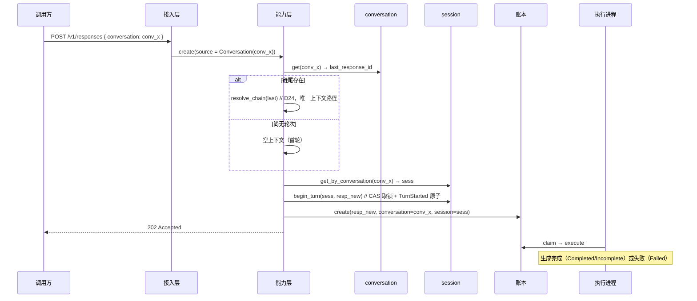
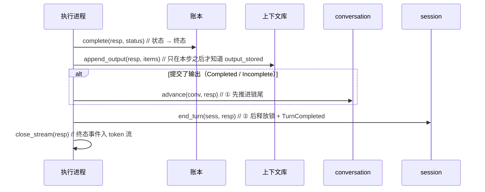
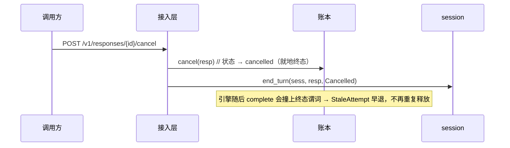
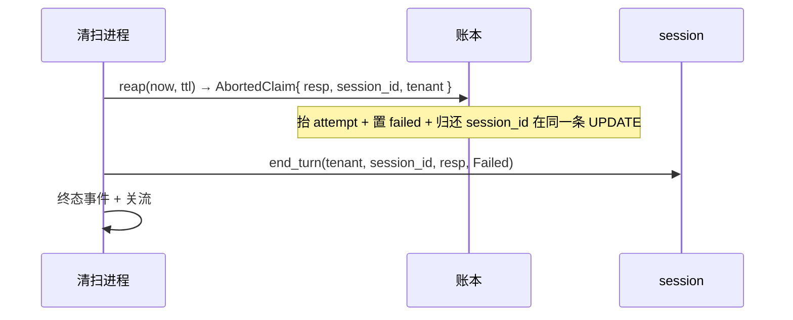
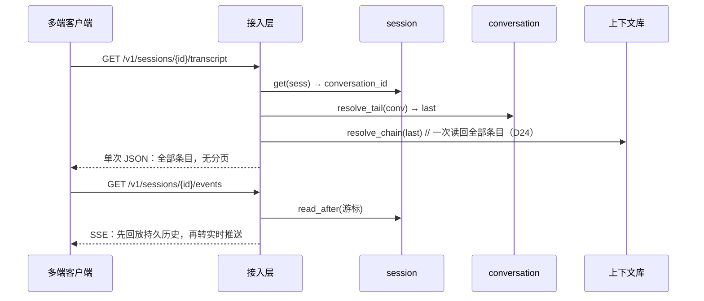

# 会话容器与会话层（D26 / D27）

> 依据：[D26](../architecture/decisions.md#d26-自研会话层状态如何广播) · [D27](../architecture/decisions.md#d27-会话容器退化为链尾指针) · [D24](../architecture/decisions.md#d24-上下文物化每个生成保存完整上下文快照)
> 面向：接入本服务的调用方与后续维护者

---

## 0. 一句话

**conversation（兼容层）只存「指向响应链尾的指针」；session（自研层）只广播「状态如何变化」。**
对话内容的唯一真相源仍是响应链的物化快照（D24），两个新资源都不持有条目。

---

## 1. 两个资源，各一件事

| | conversation（D27） | session（D26） |
|---|---|---|
| 谁定义 | 官方协议 | 自研 `/v1/sessions` |
| 存什么 | `{ id, tenant, last_response_id, metadata }` | 锁状态 + 持久信封事件流 |
| 回答的问题 | 「上下文**从哪来**」 | 「状态**怎么广播**」 |
| 内容真相源 | **不是**（只是指针） | **不是**（只放引用） |
| 条目数量级 | 0（一个指针） | 每轮 2~3 个信封 + 业务事件 |
| 驱逐策略 | 无 | 触顶**拒绝**追加（不驱逐） |

两者不重叠、不互相转发。一个官方 SDK 只谈 conversation；一个多端应用在 conversation 之上再挂一个 session 拿广播。

---

## 2. 领域形状

### conversation

```rust
struct Conversation {
    id: ConversationId,                 // conv_{uuid}
    tenant_id: TenantId,
    last_response_id: Option<ResponseId>, // 链尾指针，None = 尚无轮次
    metadata: BTreeMap<String, String>,
    created_at_ms: u64,
}
```

### session

```rust
struct Session {
    id: SessionId,                        // sess_{uuid}
    tenant_id: TenantId,
    conversation_id: ConversationId,      // 绑定互斥：一个容器至多一个会话
    lock_state: LockState,                // Idle | Busy { response_id }
    created_at_ms: u64,
}

enum SessionEventKind {
    SessionCreated,                       // 恒为 seq 0
    TurnStarted   { response_id },
    TurnCompleted { response_id, status },
    ResponseDeleted { response_id },
    Business      { kind, payload },      // 不进入模型上下文
}
```

---

## 3. 关键时序

> 约定：`GW` = 接入层，`SVC` = 能力层，`CVS` = conversation 端口，`SES` = session 端口，`LED` = 账本，`AG` = 独立执行进程。

### 3.1 经 conversation 发起生成（主时序）



### 3.2 引擎终态 settle：**先推进指针，再释放锁**



**顺序不可颠倒**：若先放锁，一个看到 `turn_completed` 就发起下一轮的客户端，可能在链尾尚未推进时读到旧上下文，本轮静默丢失。

**只推进已提交输出的轮次**：失败/取消/回收的轮次没有输出条目，把链尾指过去会让下一轮读到「停在半截的问题」。

### 3.3 取消：终态唯一写入方就地释放



### 3.4 回收（reap）：账本把关联随终态一并交出



回收是**被回收响应的唯一释放路径**：持有者已死、栅栏已抬高，其自身的终态路径会被账本以 stale 拒绝。故 `AbortedClaim` 必须携带 `session_id`（与终态同事务读出），而非事后回查。

### 3.5 残留锁接管：锁可能比持有者活得久


判据是「持有者是否已终态」而非超时：超时要么误杀长轮次，要么把卡死留给用户。账本知道确切答案，直接问它。条件释放保证不会误解锁一个刚被合法新轮次持有的锁。

### 3.6 页面恢复：历史 + 状态两条通道



两条通道各司其职：transcript 给**内容**，events 给**状态与业务事件**。二者都不需要额外的渲染快照，因此也就不存在会过期的快照。

---

## 4. 端点契约

### conversation（官方兼容，D27）

| 端点 | 说明 |
|---|---|
| `POST /v1/conversations` | 建容器，`metadata` 整体替换语义 |
| `GET /v1/conversations/{id}` | 读取（含 metadata 与创建时间） |
| `POST /v1/conversations/{id}` | 更新 metadata（官方用 POST 而非 PATCH） |
| `DELETE /v1/conversations/{id}` | 删容器；**不级联**删响应记录 |

**不实现 `items` 子资源**：容器不持有条目，故无 `GET/POST/DELETE .../items`。读历史走 session 的 transcript（一次取全，不强制分页）。

### session（自研，D26）

| 端点 | 说明 |
|---|---|
| `POST /v1/sessions` | 建会话；`conversation` 缺省时新建容器，否则绑定既有 |
| `GET /v1/sessions/{id}` | 状态：`status`（idle/busy）+ `active_response_id` |
| `DELETE /v1/sessions/{id}` | 删会话与事件流；**不删关联容器** |
| `GET /v1/sessions/{id}/events` | SSE 订阅：回放 + 实时 |
| `POST /v1/sessions/{id}/events` | 业务事件，与轮次事件同序号空间严格保序 |
| `GET /v1/sessions/{id}/transcript` | 单次取回完整对话历史 |

**没有自研的「发起轮次」端点**：轮次一律经标准 `POST /v1/responses { conversation }`，服务端据容器找到所属会话并取锁。一个 `POST /v1/sessions/{id}/turns` 会是同一件事的第二种写法，两种写法必然分叉。

---

## 5. 并发与锁语义

| 性质 | 结论 | 支撑 |
|---|---|---|
| 绑定 | 一个容器至多一个会话（`ConversationTaken` → 409） | 两把锁守同一条链 = 没有锁 |
| 取锁 | 原子：CAS 取锁 + `TurnStarted` 同一步落地 | `CR-14 / INV-58` |
| 并发轮次 | 拒绝（`Busy` → 409），并告知持有者 | `FR-44` |
| 释放 | 每条终态路径都必须释放；`end_turn` 幂等 | `CR-15 / INV-58` |
| 推进链尾 | **后写胜出**，无 CAS；只推进已提交输出的轮次 | `INV-55` |
| 残留锁 | 「持有者已终态」即接管，条件释放 | §3.5 |
| 序号 | per-session 0 基连续，业务事件同空间 | `CR-16 / INV-57` |
| 触顶 | 拒绝追加，不驱逐 | `INV-59` |

**为何推进链尾不设 CAS**：`advance` 若做 compare-and-set，失败方需要返回一个冲突码——而官方协议里没有这个码，裸用 conversation（不挂 session）的官方 SDK 会收到一个它不认识的 409。接受后写胜出，与「官方也未保证并发轮次顺序」一致。

---

## 6. 与既有决策的关系

| 决策 | 关系 |
|---|---|
| D20 ④ 不持久化完整事件历史 | **不变**。session 流的不是那个「完整事件历史」——它是低频信封（每轮 2~3 条），与 token 流相差三个数量级 |
| D24 物化快照 | **零改动**。conversation 退化为指针后，上下文装配仍是唯一入口 `resolve_chain` |
| D25 执行独立 | 终态释放与推进落在独立执行进程 `settle`，账本在 reap 时把关联随终态交出 |
| D22 封闭子集 | `conversation` 从拒绝清单移入子集；`items` 子资源仍不在子集内 |

---

## 7. 验证落点

| 层 | 用例 / 场景 | 覆盖 |
|---|---|---|
| L0 | `conversation`、`session`、`session-concurrency` | FR-40/42/43/44、CR-14/15/16、INV-54~59、SEC-2 |
| L2 | `conversation-session-transcript-http` | FR-41、FR-45 |
| L4 | `testing/sdk-compat` | 官方 SDK 无改接入（自跳过） |
