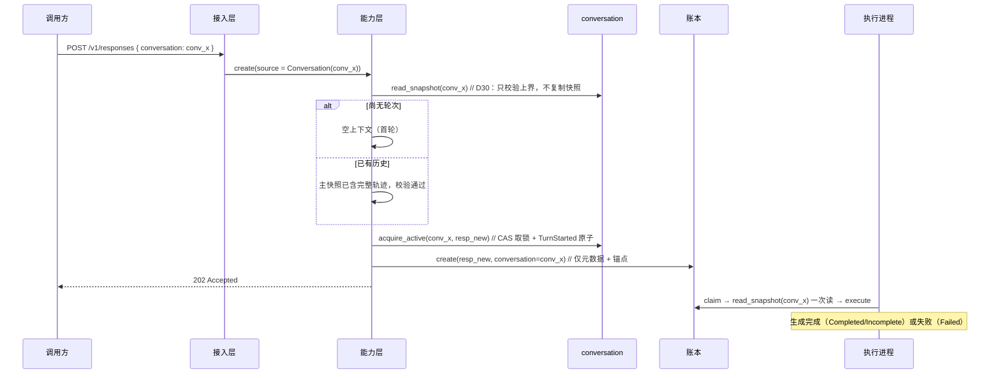
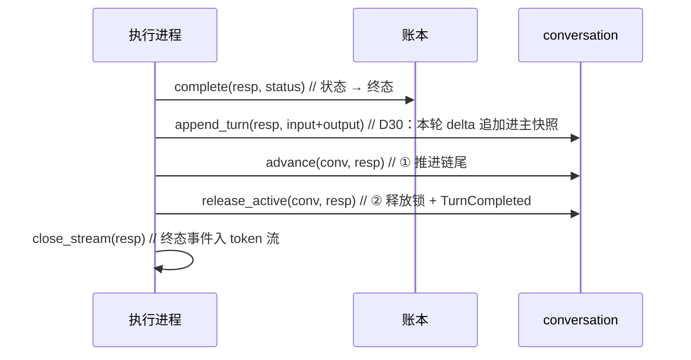
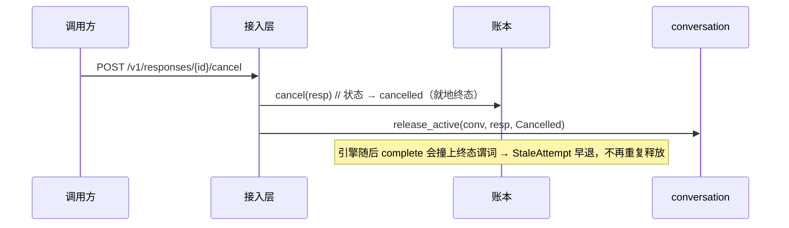
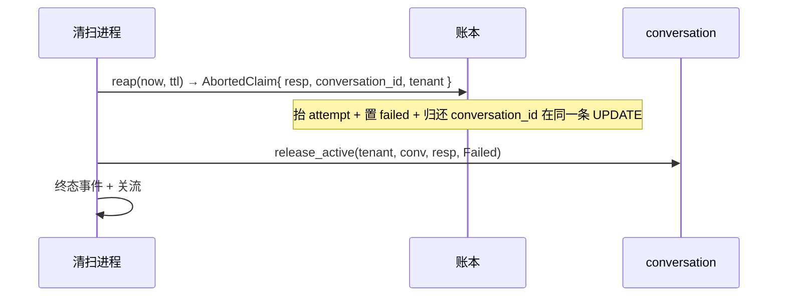
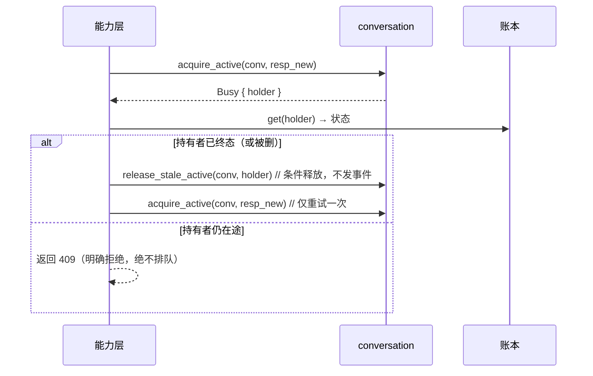
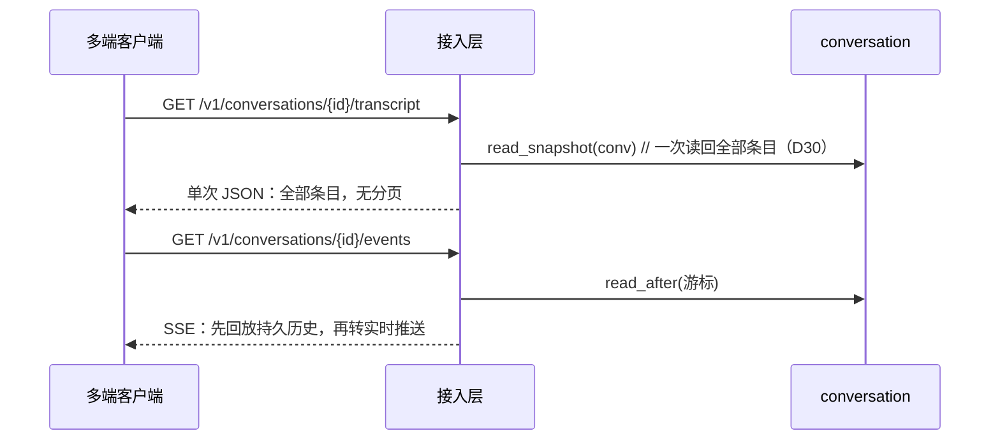

# 会话容器（D28 / D30）

> 依据：[D26](../architecture/decisions.md#d26-自研会话层状态如何广播) · [D27](../architecture/decisions.md#d27-会话容器退化为链尾指针) · [D28](../architecture/decisions.md#d28-会话能力下沉数据层conversation-吸收-session) · [D30](../architecture/decisions.md#d30-存储分工重构responses-走事件流conversation-存持久快照)
> 面向：接入本服务的调用方与后续维护者

---

## 0. 一句话

**conversation 是唯一的一等公民会话资源**：D28 把自研 session 合并进它（链尾指针 + 轮次锁 + 事件流），D30 又让它持有**持久物化主快照**——对话内容的唯一真相源从「响应链的物化快照」移到了「会话主快照」。

---

## 1. 一个资源，四件事

| 能力 | 回答的问题 | 出处 |
|---|---|---|
| 链尾指针 `last_response_id` | 「下一轮从**哪**续」 | D27/D28 |
| 轮次互斥 `active_response_id` | 「当前**轮到谁**」 | D28（吸收 D26 session 锁） |
| 事件流（turn/business/response_deleted） | 「状态**怎么广播**」 | D28（吸收 D26 信封流） |
| 持久物化主快照 | 「完整历史**是什么**」 | D30（吸收原 ContextStore 快照职责） |

**已不存在 `Session` / `SessionId` / `SessionStore` / `SessionsService`**（D28 移除）：官方 SDK 只谈 conversation；多端同步的能力（锁 + 事件流）下沉到 conversation 数据层。

---

## 2. 领域形状

```rust
struct Conversation {
    id: ConversationId,                     // conv_{uuid}
    tenant_id: TenantId,
    last_response_id: Option<ResponseId>,   // 链尾指针，None = 尚无轮次
    active_response_id: Option<ResponseId>, // 在途互斥标记（D28 下沉）
    metadata: BTreeMap<String, String>,
    created_at_ms: u64,
    // D30：主快照不在此结构内，而由 ConversationStore 以
    // read_snapshot / append_turn 管理（避免与锁/事件流共享写事务形状）
}

enum ConversationEventKind {
    TurnStarted    { response_id },          // 与 acquire_active 原子
    TurnCompleted  { response_id, status },  // 与 release_active 原子
    ResponseDeleted { response_id },
    Business       { kind, payload },        // 不进入模型上下文
}
```

---

## 3. 关键时序

> 约定：`GW` = 接入层，`SVC` = 能力层，`CVS` = conversation 端口，`LED` = 账本，`EV` = 事件流，`AG` = 独立执行进程。

### 3.1 经 conversation 发起生成（主时序）



### 3.2 引擎终态 settle：**先提交快照，再推进指针，最后释放锁**



**顺序不可颠倒**：先 `append_turn`（持久内容落地），再 `advance`（下一轮可见的上下文就绪），最后 `release_active`（放行下一轮）。若先放锁，一个看到 `turn_completed` 就发起下一轮的客户端，可能在主快照尚未追加本轮时读到旧上下文。

**`complete` 与 `append_turn` 同事务**（INV-34 迁移到终态）：账本状态与持久内容永不分歧。

**只推进已提交输出的轮次**：失败/取消/回收的轮次没有输出条目，把链尾指过去会让下一轮读到「停在半截的问题」。

### 3.3 取消：终态唯一写入方就地释放



### 3.4 回收（reap）：账本把关联随终态一并交出



回收是**被回收响应的唯一释放路径**：持有者已死、栅栏已抬高，其自身的终态路径会被账本以 stale 拒绝。故 `AbortedClaim` 必须携带 `conversation_id`（与终态同事务读出），而非事后回查。

### 3.5 残留锁接管：锁可能比持有者活得久



判据是「持有者是否已终态」而非超时：超时要么误杀长轮次，要么把卡死留给用户。账本知道确切答案，直接问它。条件释放保证不会误解锁一个刚被合法新轮次持有的锁。

### 3.6 页面恢复：历史一条通道



两条通道各司其职：transcript 给**内容**（读主快照），events 给**状态与业务事件**。

---

## 4. 端点契约

| 端点 | 说明 |
|---|---|
| `POST /v1/conversations` | 建容器，`metadata` 整体替换语义 |
| `GET /v1/conversations` | 列表（自研扩展） |
| `GET /v1/conversations/{id}` | 读取（官方对象纯净：不暴露 `last`/`active`） |
| `POST /v1/conversations/{id}` | 更新 metadata（官方用 POST 而非 PATCH） |
| `DELETE /v1/conversations/{id}` | 删容器；**不级联**删响应记录（D24 记录级语义） |
| `GET /v1/conversations/{id}/transcript` | 单次取回完整对话历史（读主快照） |
| `GET /v1/conversations/{id}/events` | SSE 订阅：回放 + 实时 |
| `POST /v1/conversations/{id}/events` | 业务事件，与轮次事件同序号空间严格保序 |

**不实现官方 `items` 子资源**（`GET/POST/DELETE /conversations/{id}/items`）：主快照是服务端维护的物化状态，不暴露条目级增删。读历史走 transcript（一次取全，不强制分页）。**没有自研的「发起轮次」端点**：轮次一律经标准 `POST /v1/responses { conversation }`。

---

## 5. 并发与锁语义

| 性质 | 结论 | 支撑 |
|---|---|---|
| 取锁 | 原子：CAS 取锁 + `TurnStarted` 同一步落地 | `CR-14 / INV-58` |
| 并发轮次 | 拒绝（`Busy` → 409），并告知持有者 | `FR-44` |
| 释放 | 每条终态路径都必须释放；`release_active` 幂等 | `CR-15 / INV-58` |
| 推进链尾 | **后写胜出**，无 CAS；只推进已提交输出的轮次 | `INV-55` |
| 残留锁 | 「持有者已终态」即接管，条件释放 | §3.5 |
| 序号 | per-conversation 0 基连续，业务事件同空间 | `CR-16 / INV-57` |
| 触顶 | 拒绝追加，不驱逐 | `INV-59` |

**为何推进链尾不设 CAS**：`advance` 若做 compare-and-set，失败方需要返回一个冲突码——而官方协议里没有这个码，裸用 conversation 的官方 SDK 会收到一个它不认识的 409。接受后写胜出，与「官方也未保证并发轮次顺序」一致。

---

## 6. 与既有决策的关系

| 决策 | 关系 |
|---|---|
| D20 ④ 不持久化完整事件历史 | **不变**。conversation 事件流是低频信封（每轮 2~3 条），与 token 流相差三个数量级；主快照是内容，不是事件 |
| D24 物化快照 | **条款推翻（D30）**：快照从「每 response 一份」改为「会话一份 + 每轮 delta」 |
| D28 吸收 session | **保留并扩展**：conversation 单实体 + 锁 + 事件流不变，D30 再加主快照 |
| D25 执行独立 | 终态释放与推进落在独立执行进程 `settle`，账本在 reap 时把关联随终态交出 |
| D22 封闭子集 | `conversation` 从拒绝清单移入子集；`items` 子资源仍不在子集内 |

---

## 7. 验证落点

| 层 | 用例 / 场景 | 覆盖 |
|---|---|---|
| L0 | `conversation`、`conversation-snapshot`、`conversation-concurrency` | FR-40/42/43/44、CR-14/15/16、INV-54~59、SEC-2 |
| L2 | `conversation-transcript-http` | FR-41、FR-45 |
| L4 | `verify/sdk-compat` | 官方 SDK 无改接入（自跳过） |
