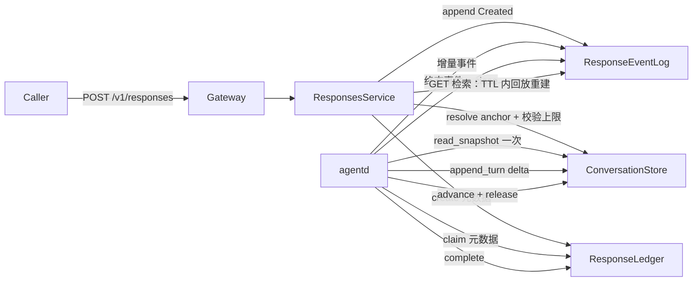

# 存储接入要求（Storage Integration Contract）

> **面向谁**：要在自己的存储后端（SQL、Redis Streams、TDMQ、NATS JetStream、对象存储……）上跑起本服务的外部接入方。
>
> **交付物不是选型**：领域层只提供正交端口 trait（`crates/responses/src/ports/`），选型由接入方自决。接入方实现各 trait 并注入领域模型实例（`ResponsesService` / `AgentRuntime` / sweep），整个服务即可运行。本文把「每个端口负责什么数据、必须满足什么语义」写成可核对的契约。
>
> 参考实现：`verify/mock/{server,client}`（进程内 `MemWorld` 与 RPC 桩），L0–L2 验证层全部跑在它上面——它既是给接入方看的样板，也是端口契约的可执行规范。

---

## 1. 端口总览

| 端口 | 负责什么数据 | 生命周期 | 权威性 |
|---|---|---|---|
| **`ResponseLedger`** | 一次生成的**元数据**：状态、attempt 栅栏、幂等键、用量、租户、输入条目、模型/工具声明 | 短期（TTL） | 单次生成的生命周期真相 |
| **`ResponseEventLog`** | 一次生成的**增量事件流**（token 级 delta、条目信封、生命周期事件） | 瞬态（终态后按 `retain_ms` 释放） | 订阅/流式与「TTL 内检索重建」的载体 |
| **`ConversationStore`** | 一段对话的**持久物化主快照**（每轮 input+output）+ 链尾指针 + 轮次锁 + 会话事件流 | 持久 | 对话内容的长期权威来源 |
| **`ContentIntegrity`** | 内容签名/校验（HMAC） | — | 存储层篡改检测 |
| **`MetricsSink`** | 指标计数 | — | 可观测性 |

**已移除**：`ContextStore`（D30）——它的职责已拆分：快照读写并入 `ConversationStore`，response 对象检索重建并入 `ResponseEventLog`（回放流）。

---

## 2. `ResponseLedger`：元数据账本

**存什么**：`ResponseRecord`（`response_id` / `tenant_id` / `previous_response_id` / `conversation_id` / `input_items` / `tools` / `tool_choice` / `model` / `instructions` / `store` / 状态 / 用量 / 时间戳 / attempt / 幂等键 / owner）。

**不存什么**：**祖先快照**（D30 起物化历史不再落到每个 response 上）、`output_items`（终态输出进会话快照）。

### 必须满足的语义

1. **幂等无 TTL 窗口**（INV-2）：`create` 的 `idempotency_key` 命中即返回 `Duplicate`（原生成），绝不产生第二条；门禁**没有**过期窗口。
2. **claim 全局原子**（INV-1 / D25）：`claim` 是单点条件更新（检查 + 迁移到 claimed 一步完成），`attempt` 单调递增；**任意**执行进程可领取任意 queued 生成，`claim` 签名**不得**带 `NodeTag`。
3. **attempt 栅栏**（INV-6）：`complete` / `cancel` / 追加路径都必须校验 attempt；过期 attempt 的写入返回 `StaleAttempt`。栅栏不可删——卡死任务的苏醒写入与 reap 是并发的。
4. **reap 收口失联**（INV-45）：`reap` 抬高 attempt 栅栏并置失败，同时释放会话轮次标记；部分用量由账本自身记账（INV-51）。
5. **record-level delete**（D30）：`delete` 只删账本记录；`delete_by_tenant` 只清本租户。会话快照副本**不动**。
6. **运行时控制**：`set_read_only` / `set_pending_limit` 是进程本地状态（不跨载体）。

---

## 3. `ResponseEventLog`：在途增量 + TTL 检索载体

**存什么**：0 基连续序号的增量事件（`AppendEvent`），含生命周期信封（`response.created` / `in_progress` / `completed` / `failed` / `incomplete`，携带完整 response 对象）。

**关键契约（D30）**：

1. **短期 TTL 保留**（INV-40）：终态后保留至 `retain_ms`，之后 `read_after` 返回 `Expired`（410），**无冷层兜底、无恢复路径**。这是 D30 下「responses 由事件流承载」的代价。
2. **检索重建**：`GET /v1/responses/{id}` 在 TTL 内由回放该流重建对象（最新一条生命周期信封的 `response` 载荷即当前对象，含终态 output）；TTL 后 404。
3. **序号 0 基连续**（INV-11）：`starting_after` 排他；位点被驱逐必须显式 `Expired`。
4. **append 携带 attempt**：被取代的持有者追加返回 `StaleAttempt`（栅栏）。
5. **`remove`**：记录级删除时立即丢弃该流的缓冲。

**接入方选型提示**：本端口适合有保留期的消息流（Redis Streams / TDMQ / NATS JetStream / Kafka 带 compaction），保留期对齐 responses TTL（上游 30 天）。它**不是**长期对话存储。

---

## 4. `ConversationStore`：持久对话快照

**存什么**：物化主快照（每轮 input+output 累积）+ 链尾指针 + 轮次互斥标记 + 会话事件流（`turn_started` / `turn_completed` / `response_deleted` / `business`）。

**新增快照方法（D30）**：

- `read_snapshot(tenant, id) -> ResolvedContext`：一次读回完整历史（agent 装配 LLM 上下文、`transcript` 渲染共用）。
- `append_turn(tenant, id, response_id, input_items, output_items, reasoning, usage, status, now_ms) -> u64`：终态把本轮 input+output 追加进快照，返回轮次索引。

### 必须满足的语义

1. **`append_turn` 的数据源是编排层 `AgentOutcome.items` 直接提交，绝不回放事件流**（INV-48）——这是本契约最硬的一条。若接入方在内部从事件流回放派生快照，持久历史就依赖可驱逐的有界缓存。
2. **原子性边界（INV-34）**：终态时 `ResponseLedger::complete` 与 `append_turn` 必须**同存储同事务**（参考 D21 ① 的共享存储 + 单事务模式）。mock 以 `MemWorld` 内单一锁保证。
3. **轮次互斥**（INV-58）：`acquire_active` / `release_active` 与事件原子配对；任一终态路径（含 reap）都必须释放标记。
4. **快照单调增长**：不提供条目级删除；接入方需配置冷存储保留策略。
5. **`advance` 后写胜出**（INV-55）：不设 CAS，只有提交了输出的轮次才推进链尾。

**接入方选型提示**：本端口适合长生命周期、大容量、低写频率的持久存储（关系库 / 对象存储 + 索引）。它**是**长期对话记录。

---

## 5. 数据流（D30）

---

## 6. 关键边界语义（接入方须实现一致）

| 场景 | 语义 |
|---|---|
| `store=false` | 创建后不保留可链接记录；终态**不** `append_turn`（快照不写）；不可作为 `previous_response_id` 锚点（`NotStored`） |
| `cancel` | 账本终态化 + 记账部分用量；发终态事件 + 关流；释放轮次标记；**不**推进链尾、**不**写快照 |
| `delete`（记录级） | 删账本记录 + 事件流；会话快照继承副本**原样保留**（D24 语义）；广播 `ResponseDeleted` |
| 裸链（`previous_response_id` 无会话） | 沿账本反查归属会话读快照；无会话归属时从事件流重建其 input+output（TTL 内）；更深裸链 `ChainBroken` |
| 链上限 | 创建时解析锚点并校验深度/字节上界，**超限报错而非截断**（INV-41） |

---

## 7. 注入点（接入方装配）

- **gateway**：`ResponsesService::new(ledger, event_log, conversations, now, metrics, cfg)` + `ConversationsService::new(conversation, now, metrics)`，装配进 `AppState`。
- **agentd**：`AgentRuntimeDeps { ledger, event_log, runner, now, conversations }`。
- **sweep**：`SweepDeps { ledger, event_log, conversations, now, metrics, heartbeat_ttl_ms, retain_after_terminal_ms }`。

所有端口以 `Arc<dyn Trait>` 注入，领域层不感知具体后端。

---

## 8. 参考实现与验证

- 参考实现：`verify/mock/server`（`MemWorld`：`MemResponseLedger` / `MemResponseEventLog` / `MemConversationStore`），`verify/mock/client`（RPC 桩）。
- L0 端口契约：`verify/conformance`（`run_suite` 对任意后端跑同一套断言，含 `output-provenance`「销毁事件流后会话快照完整」）。
- L1 场景（`verify/harness` + `verify/scenarios/l1`）与 L2（`verify/scenarios/l2`）跑在 mock 上。

> **已知后续**：L1 YAML 场景中依赖旧「链」语义（`resolve_chain` / `ExpectStored` / 内容过期清扫 / 读路径完整性校验）的用例，需随 D30 语义重设计（harness 驱动已适配编译，`CreateConversation` / `read_snapshot` 步骤已就位，YAML 待更新）。
