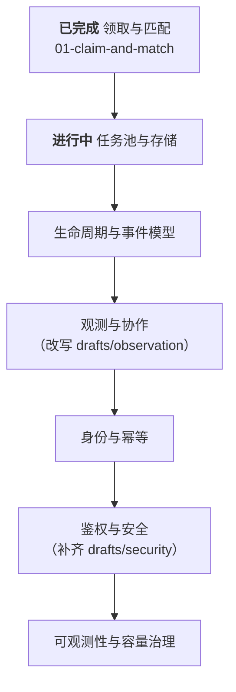

# 设计文档

> 依据：[`../requirements/spec.md`](../requirements/spec.md) · [`../requirements/parameters.md`](../requirements/parameters.md)
> 约束：[`../architecture/decisions.md`](../architecture/decisions.md) · [`../architecture/invariants.md`](../architecture/invariants.md)

---

## 1. 命名与状态规则

| 规则 | 说明 |
|------|------|
| **编号按完成顺序分配** | 文档完成时取下一个序号。因此 `design/` 下的编号**永远连续**，不存在空号 |
| **只有编号文档是实现依据** | 已对齐需求基线与全部生效决策 |
| **`drafts/` 内为素材，不可实现** | 未对齐基线，编号未定。改写完成后取下一序号移出 |
| **规划顺序不体现在文件名上** | 规划见 §3 路线图。未开始的步骤**不预留文件与编号** |

> 未开始的步骤不预留文件与编号——预留会使目录出现空号，且未对齐基线的草稿会被误认为正式设计。

---

## 2. 现有文档

### 2.1 正式设计（实现依据）

| # | 文档 | 覆盖需求 | 核心产出 |
|---|------|---------|---------|
| **01** | [`01-claim-and-match.md`](./01-claim-and-match.md) | FR-2 全部子项、CR-1、CR-3、CR-7、CR-8、FR-16~FR-20 | 匹配器契约与不变量、无锁三段领取、防饥饿预留排水、执行权与失效回收 |

### 2.2 草稿（素材，禁止直接实现）

| 文档 | 状态 | 主要问题 |
|------|------|---------|
| [`drafts/observation.md`](./drafts/observation.md) | ⛔ **与决策冲突** | 含多区域 Mirror、Cell 分片、快慢双通道——与 **D8 单域**冲突 |
| [`drafts/security.md`](./drafts/security.md) | ⚠️ **有重大缺口** | 内容基本有效，但**缺少匹配器 DSL 沙箱**这一最高风险攻击面 |

> **两者的风险不同**：`observation.md` 若被直接实现，会做出一套与基线相反的多区域架构；`security.md` 若被直接实现，会**漏掉代码执行入口的防护**。各文档头部列有详细的冲突表与可复用清单。

---

## 3. 路线图

| 顺序 | 步骤 | 状态 | 必须产出的决策 |
|------|------|------|--------------|
| 1 | 领取与匹配 | ✅ 完成 → `01` | 见 §2.1 |
| 2 | **任务池与存储** | ▶ **下一步** | 存储选型、表结构与索引、容量账本落地、幂等提交、背压阈值、粗过滤查询计划验证 |
| 3 | 生命周期与事件模型 | ⬜ | 任务状态机、事件类型约定、全序号分配点、领取与输出路径的分离边界 |
| 4 | 观测与协作 | ⬜ 改写草稿 | 快照+增量协议、观测游标、SSE 协议、互动消息 |
| 5 | 身份与幂等 | ⬜ | 确定性任务标识、提交闸门、孤儿任务恢复、列表查询视图 |
| 6 | 鉴权与安全 | ⬜ 补齐草稿 | 令牌体系、订阅鉴权、**DSL 沙箱**、出口脱敏、限流 |
| 7 | 可观测性与容量治理 | ⬜ | 不变量监控指标、越界告警、锚点校准流程、故障演练清单 |

**为什么是这个顺序**：步骤 2 的存储形态决定步骤 3 事件模型的落点；步骤 3 确定的路径分离边界（D11）决定步骤 4 的通道选择；步骤 4/5 与领取层耦合最弱，可最后细化。

---

## 4. 下一步（步骤 2）开展清单

| # | 议题 | 已有输入 |
|---|------|---------|
| 1 | 存储选型 | `parameters.md` §4（规模）· `01` §2.1（无锁三段式） |
| 2 | 表结构：任务、设备、预留 | `01` §2.3（领取 CAS）· §4.3（回收） |
| 3 | 容量账本落地 | **D10 已定**（服务端核算）· CR-3 / CR-10 |
| 4 | 索引设计与粗过滤查询计划验证 | `01` §1.2（两层匹配）· INV-17 |
| 5 | 幂等提交机制 | INV-2（不得依赖 TTL 窗口） |
| 6 | 背压：待领取阈值与拒绝语义 | `parameters.md` §4.2（阈值 1 万）· FR-21 / INV-29 |
| 7 | 巡检任务：预留、超时、不可调度、重试超限 | `01` §3.2 · §4.3 |
| 8 | 与输出路径的边界 | **D11 已定**（强制分离） |
| 9 | 查询与领取的同库共存形态（同表加索引 vs 冷热分表） | **D13 已定**（不引入独立视图）· 须满足 FR-22 |
| 10 | **查询路径的超时与并发限制**（防止慢查询挤占领取资源） | **FR-24** —— D13 引入的派生风险 |

> **无阻塞项，可直接开展。**

---

## 5. 文档规范

| 要求 | 说明 |
|------|------|
| 头部标注依据 | 列出本文满足的 FR/CR 编号与相关 INV 小节 |
| 每项设计标注需求来源 | 便于反查覆盖度与验收 |
| 违反不变量须显式说明 | 若确需违反某条 INV，必须在 `decisions.md` 新增决策记录并说明代价 |
| 遗留问题单列一节 | 不在文中散落 TODO |
| 草稿改写后必须逐条核对冲突表 | 头部冲突表全部处置完毕，方可移出 `drafts/` |
