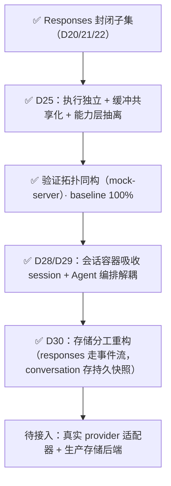

# 设计文档

> 依据：[`../requirements/`](../requirements/) · [`../architecture/`](../architecture/)

---

## 规则

| 规则 | 说明 |
|------|------|
| 编号按完成顺序 | `design/` 下编号连续 |
| 仅编号文档可实现 | 对齐需求与生效 ADR |
| `drafts/` 不可直接实现 | 改写后取下一序号移出 |

---

## 正式设计

| # | 文档 | 产出 |
|---|------|------|
| **00** | [`00-architecture-review.md`](./00-architecture-review.md) | 逐组件核对的架构复验图（配图可伪证） |
| **01** | [`01-responses-api.md`](./01-responses-api.md) | Responses API：端点、三种响应模式、事件契约、状态码 |
| **02** | [`02-verification.md`](./02-verification.md) | Trace + Oracle；验证分层（L0–L3） |
| **03** | [`03-context-chain.md`](./03-context-chain.md) | 上下文链与会话快照（D30）：锚点解析、上限、删除 |
| **04** | [`04-content-integrity.md`](./04-content-integrity.md) | 内容完整性：HMAC 防篡改 |
| **05** | [`05-reliability.md`](./05-reliability.md) | 可靠性：存储分层、故障语义、优雅停机、reap |
| **06** | [`06-protocol-subset.md`](./06-protocol-subset.md) | 对外可发布的协议子集规范 |
| **07** | [`07-conversations-and-sessions.md`](./07-conversations-and-sessions.md) | 会话容器（D28/D30）：链尾指针 + 轮次锁 + 事件流 + 持久主快照 |
| — | [`07-storage-integration.md`](./07-storage-integration.md) | 存储接入要求：各端口职责、TTL、原子性、非回放派生、参考实现指引 |
| — | [`01-session-stream.md`](./01-session-stream.md) | **历史**：Session/Turn/快照/热冷层/镜像，D20 已移除，不描述当前系统 |

## 草稿

| 文档 | 状态 |
|------|------|
| [`drafts/stream-channel-adapters.md`](./drafts/stream-channel-adapters.md) | 选型对比（已落地：接入方生产缓冲；`mock-server` + `mock-client` 验证载体） |
| [`drafts/security.md`](./drafts/security.md) | 鉴权素材（后续） |

已并入 01 的 conversation / observation 草稿见 [`../archive/`](../archive/)。

---

## 路线图

