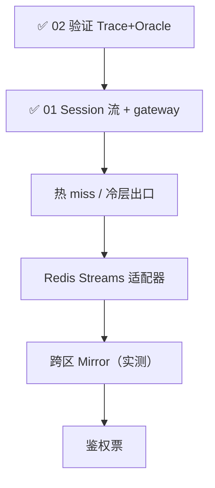

# 设计文档

> 依据：[`../requirements/`](../requirements/) · [`../architecture/`](../architecture/)

---

## 规则

| 规则 | 说明 |
|------|------|
| 编号按完成顺序 | `design/` 下编号连续 |
| 仅编号文档可实现 | 对齐需求与生效 ADR |
| `drafts/` 不可直接实现 | 改写后取下一序号移出 |

---

## 正式设计

| # | 文档 | 产出 |
|---|------|------|
| — | [`01-session-stream.md`](./01-session-stream.md) | **历史**：Session/Turn/快照/热冷层/镜像，D20 已移除，不描述当前系统 |
| **02** | [`02-verification.md`](./02-verification.md) | Trace + Oracle；验证先行 |

## 草稿

| 文档 | 状态 |
|------|------|
| [`drafts/stream-channel-adapters.md`](./drafts/stream-channel-adapters.md) | 选型对比（一期 mem；生产默认 Redis Streams） |
| [`drafts/security.md`](./drafts/security.md) | 鉴权素材（后续）；已去掉匹配器沙箱前提 |

已并入 01 的 conversation / observation 草稿见 [`../archive/`](../archive/)。

---

## 路线图

