# 草稿：观测与协作层

> ## ⛔ 草稿，不可作为实现依据
>
> 本文写于需求基线确立**之前**，部分内容与已生效决策**直接冲突**。改写完成后将作为正式设计文档移出本目录（编号按完成顺序分配）。
>
> | 本文内容 | 冲突的决策 | 处置 |
> |---------|-----------|------|
> | §6 多区域 Mirror、就近读、跨区降级 | **D8 单域起步** | 删除 |
> | 全文「Cell」「home Cell」 | D4 + D8（无分片） | 改写为单一权威 |
> | §2.1 / §10.2 快慢双通道 | 本期仅保留权威通道（200ms 聚合） | 简化 |
> | §8.3 / §8.4 跨区时序 | D8 | 简化为单域 |
>
> **可复用部分**（改写时保留）：§1 原语与公理 · §3 事件流模型与 attempt 分段 · §4 快照+增量协议 · §5.1 订阅复用 · §7 对外协议与 SSE
>
> 相关需求：FR-9~FR-15、CR-4~CR-6 · 相关不变量：[`invariants.md`](../../architecture/invariants.md) §3
> 配套草稿：[`security.md`](./security.md)

---

## 0. 需求 → 机制映射（先看这张表）

| # | 需求 | 核心机制 | 章节 |
|---|------|---------|------|
| R1 | 多区域 Web 发起任务请求 | 无状态 Ingress + 全局路由表决定 home Cell | §2 |
| R2 | 分布式设备领用，任务不重复处理 | ZSET+Lua CAS 领取 + 租约 + **fence token** + attempt 分段 | §4.3 |
| R3 | A 在 a 区发起，B 在 b 区观测并互动 | **任务 = Room**：输出与互动写入同一条全序事件流，跨区 Mirror 只读订阅 | §3 / §6 / §8.1 §8.4 |
| R4 | 处理设备水平扩容 | Worker pull 模型 + Autoscaler（已有）；本文补充**输出写入侧的扩展性与流量放大控制** | §10 |
| R5 | 长耗时任务，多区域用户均可正确观测持续流式输出 | **Snapshot + Delta** 回放协议 + 三层存储（JetStream 热温 / KV 快照 / OSS 冷） | §4 / §5 |
| R6 | 同一用户切页面 / 关闭 / 重开仍可正常发起与观测 | **客户端状态收敛为 `(task_id, last_seq)`**，服务端不保存会话；Last-Event-ID 续订 | §1 / §7 / §8.2 |

---

## 1. 四个原语 + 补充公理

原文档的公理 A1–A7 管「任务状态」。本文再立一组管「观测与协作」。

### 1.1 原语

| 原语 | 定义 | 生命周期 | 一致性 |
|------|------|---------|--------|
| **Task** | 有唯一 owner Cell、有租约的工作单元 | 提交 → 终态 | 强一致（单 Cell CAS） |
| **Stream** | 任务的 append-only 事件流，**单调全序 seq**，可回放 | 与 Task 同生，终态后进入保留窗口 | Cell 内强一致，跨区保序最终一致 |
| **Room** | 任务的协作空间：有 ACL 的成员集合 + 双向消息 | 与 Task 同生 | 与 Stream 共享全序 |
| **Cursor** | 客户端游标 `(task_id, last_seq)` | 任意时刻可丢弃 | **无需一致性——可从服务端完全重建** |

### 1.2 公理

| # | 公理 | 推论 |
|---|------|------|
| **B1** | **任务的输出是"可回放的流"，不是"响应"** | 观测与请求解耦；谁都能看、能重看、能从任意位置看 |
| **B2** | **Stream 身份 = `task_id`，与用户/会话/连接无关** | 这一条同时解决 R3 和 R6：多用户、多设备、多次重连本质是同一件事 |
| **B3** | **客户端唯一需要持久化的状态是 `last_seq`** | 服务端 Realtime Gateway 保持**无 sticky 语义**：任意实例可服务任意订阅 |
| **B4** | **输出与互动进入同一条全序流** | 跨区域用户看到的因果顺序一致（A 的追加指令一定排在其触发的输出之前） |
| **B5** | **全序号由 home Cell 单点分配** | 符合 A2/A3：不追求跨区一致，只在单 Cell 内串行化 |
| **B6** | **长流必须有快照，禁止全量回放** | 否则 2 小时任务重开页面要回放 10 万条 chunk |
| **B7** | **写入流的权限来自 lease + fence token** | 被回收的僵尸 Worker 无法污染流；重试用新 attempt 分段而非续写 |
| **B8** | **实时性可降级，正确性不可降级** | 快通道（NATS Core）丢了就走慢通道（JetStream 回放）补齐 |

---

## 2. 实时层全景架构

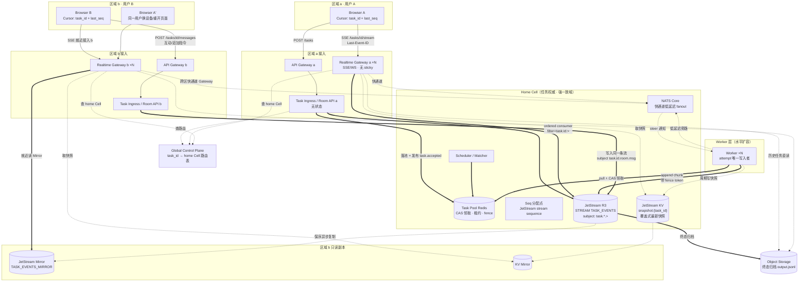

**图例**：`==>` 强一致关键路径 / `-.->` 可丢失通知或异步复制。

### 2.1 三条不同性质的链路

| 链路 | 路径 | 延迟 | 可靠性 | 作用 |
|------|------|------|--------|------|
| **快通道** | Worker → NATS Core → RG → 客户端 | 个位数 ms（同区）| 可丢 | 追求"打字机"手感 |
| **慢通道（权威）** | Worker → JetStream → RG → 客户端 | 数十 ms | 持久、可回放 | 正确性来源、回放、跨区 |
| **冷通道** | JetStream → OSS 归档 | 秒~分 | 持久 | 历史任务打开页面 |

> 客户端**按 `seq` 去重合并**两条通道，快通道只是"提前到货"。这是 B8 的落地：快通道整体宕机时，用户只是从"逐字流"退化为"每 200ms 批量刷新"，功能不受影响。

---

## 3. 统一事件流模型（R3/R4 的核心）

### 3.1 一个 Task 一条逻辑流，多种 subject

```
task.{task_id}.lifecycle    # accepted / dispatched / running / succeeded / failed / cancelled
task.{task_id}.attempt      # attempt 开始/终止（重试分段边界）
task.{task_id}.chunk        # Worker 流式输出（聚合后的 chunk）
task.{task_id}.progress     # 结构化进度：百分比、阶段、指标
task.{task_id}.artifact     # 产物引用（OSS key，不放正文）
task.{task_id}.room.msg     # 人类互动：评论、@、结构化反馈
task.{task_id}.room.steer   # 运行中追加指令（会影响执行）
task.{task_id}.room.member  # 成员加入/退出（持久，供审计）
```

**不入持久流**（NATS Core only，best-effort）：
```
presence.{task_id}.online   # 在线状态
presence.{task_id}.typing   # 正在输入
presence.{task_id}.cursor   # 光标/选区位置
```

### 3.2 全序号从哪来

**结论：直接用 JetStream 的 stream sequence，不自建分配器。**

- 每个 Cell 一条 Stream `TASK_EVENTS`，subject 为 `task.>`，R3 副本。
- Stream 内 sequence 单调递增且全序 → 天然满足 B4/B5（Cell 内单点串行）。
- per-task 视图 = `filter_subject = task.{id}.>` 的 ordered consumer。
- 客户端 `Last-Event-ID` 直接携带 `{stream_domain}:{stream_seq}`。

对比自建 seq 的取舍：

| 方案 | 优点 | 缺点 | 取舍 |
|------|------|------|------|
| **JetStream stream seq** | 零额外组件、天然全序、resume 语义原生（`opt_start_seq`） | seq 跨 task 不连续（客户端不能用"缺号"判丢包） | ✅ 采用；客户端不需要连续性，只需要单调 |
| Redis `INCR seq:{task_id}` | per-task 连续，可判缺号 | 高频 chunk 每条一次 RTT（可用 `INCRBY` 批量预留缓解）；多了一个强依赖 | ❌ 不采用 |
| Worker 本地自增 | 零成本 | 与互动消息无法全序；重试后号段冲突 | ❌ 仅在 attempt 内部作为辅助序号 |

> 若确实需要"客户端可检测丢事件"，在 payload 里附带 attempt 内单调的 `chunk_no`（Worker 本地自增，零成本），与 stream seq 并存：`stream_seq` 负责全序与 resume，`chunk_no` 负责完整性校验。

### 3.3 attempt 分段：重试时不污染流（B7）

任务被回收重派时，**不能续写同一段输出**——否则前端会看到两次执行的内容交织。

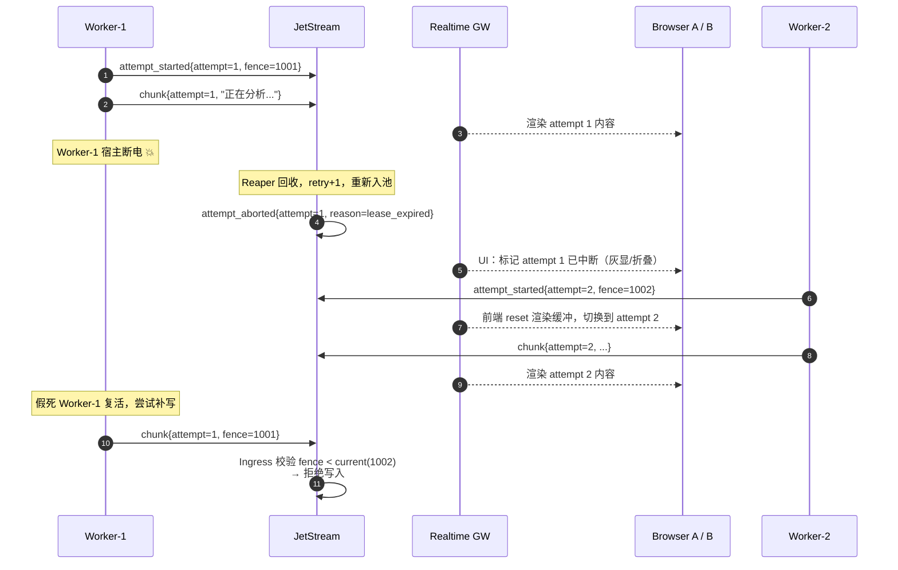

**实现要点**：
- Worker 不直接 publish 到 JetStream，而是经过一层极薄的 **Stream Ingress**（或 JetStream 的 `Nats-Expected-Last-Subject-Sequence` + Cell 内 fence 校验），校验 `fence_token == 当前 lease 的 fence` 才接受。
- 若追求极致吞吐允许 Worker 直连 JetStream：则把 fence 放进 payload，**由 Realtime Gateway 和归档器在读侧过滤**（写入不拦，读取忽略过期 attempt）。这是可接受的降级：脏数据只占存储，不影响正确性。
- 前端契约：收到 `attempt_started{n}` 且 `n > current_attempt` → **清空渲染缓冲**，历史 attempt 折叠为"重试记录"。

---

## 4. Snapshot + Delta 回放协议（R5/R6 的核心）

### 4.1 为什么必须有快照（B6）

一个跑 2 小时、输出 8 万条 chunk 的任务：
- 纯回放：新连接要读 8 万条消息，首屏几秒~几十秒，且 N 个观众 × 8 万条 = 带宽灾难。
- 有快照：读 1 个 KV 对象（当前累积文本/结构化状态）+ 回放最近几十条增量 → 首屏恒定在百毫秒级。

### 4.2 三层存储

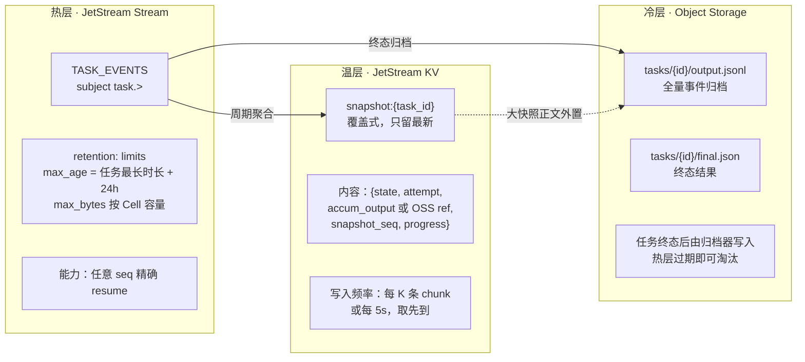

### 4.3 客户端接入决策树

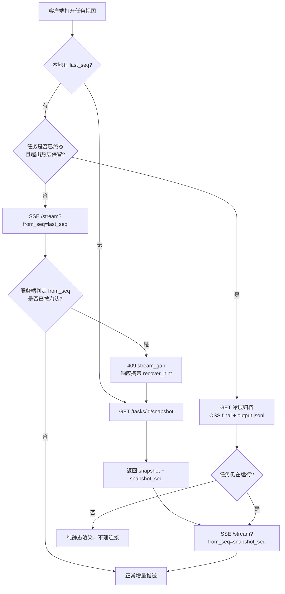

> `409 stream_gap` 是关键设计：**服务端永远不撒谎地"补一半"**，宁可让客户端重新取快照。乱序/缺口静默容忍是最难排查的一类 bug。

### 4.4 快照的写入者与幂等

| 项 | 设计 |
|----|------|
| 写入者 | Worker（它持有 lease，天然是 attempt 唯一写入者）；Worker 失联时由归档器兜底 |
| 并发控制 | KV `Update` 带 `revision`（CAS）；`snapshot_seq` 必须单调递增，回退的写入直接丢弃 |
| 内容大小 | KV value 上限内（建议 ≤ 256KB）；超出则正文写 OSS，KV 只存 `{oss_key, etag, snapshot_seq}` |
| 崩溃安全 | 快照落后不影响正确性——只影响首屏需要多回放一些 delta |

---

## 5. Realtime Gateway 设计

### 5.1 三个设计决策

**决策 1：不做连接粘性（no sticky），做订阅广播。**

原文档 §11.8 问的"客户端重连到别的实例怎么继续收到事件"——正解是**取消这个问题**：不维护"连接注册表 + 路由"，而是让任意 RG 实例都能为任意 `task_id` 建立订阅（因为流是可寻址、可回放的共享资源）。

| 方案 | 复杂度 | 故障半径 | 结论 |
|------|--------|---------|------|
| 连接注册表 + 定向路由 | 高（注册表本身需强一致，且是新的单点） | 注册表挂 → 全站推送不可用 | ❌ |
| **共享可回放流 + 任意实例订阅** | 低 | RG 实例挂 → 该实例上的客户端重连到别的实例，凭 `last_seq` 无缝续 | ✅ |

**决策 2：per-task 订阅复用（fan-in 1 : fan-out N）。**

一个 RG 实例上有 500 个客户端在看同一个热门任务 → 只建 **1 个** JetStream consumer，实例内 fan-out。否则 500 个 consumer 会打爆 JetStream 元数据。

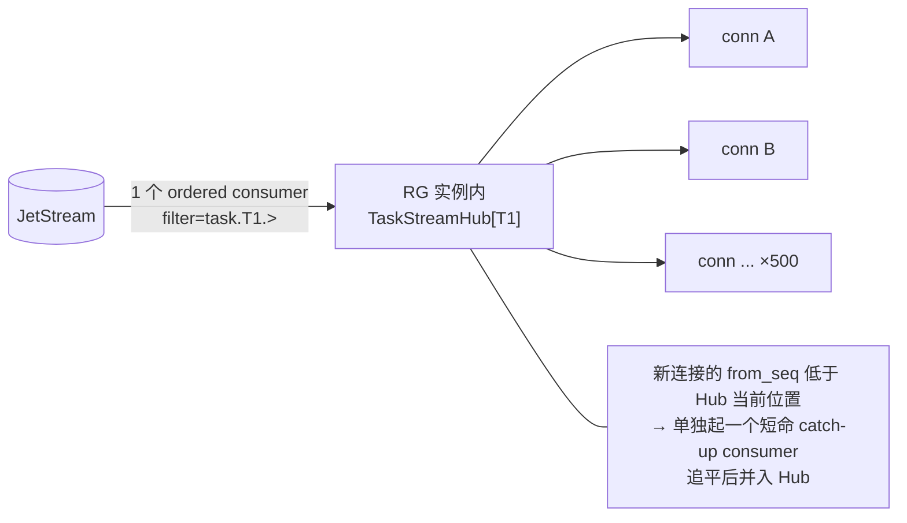

Hub 生命周期：最后一个订阅者断开 + 静默 30s → 销毁 consumer（避免僵尸 consumer 堆积）。

**决策 3：慢客户端不阻塞流。**

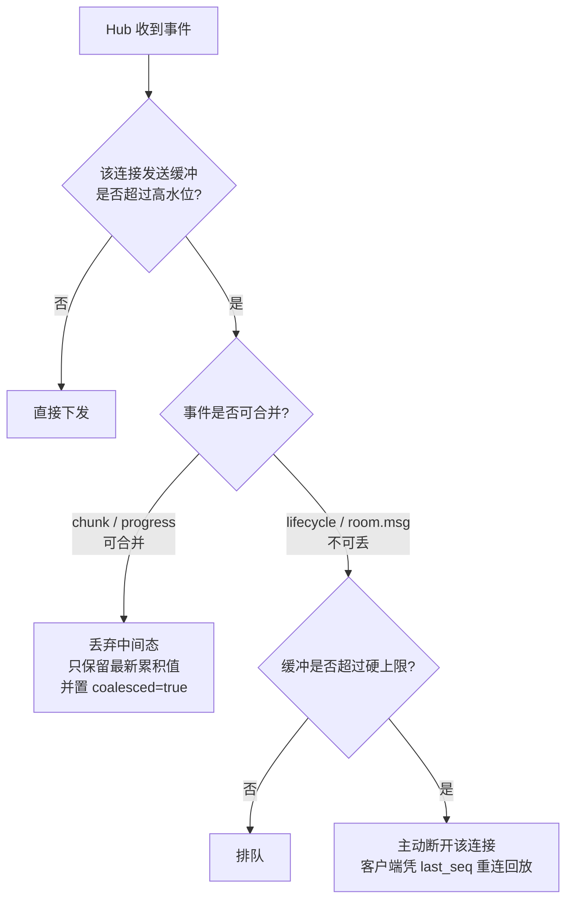

> 关键取舍：**`chunk` 可以合并丢弃中间态**（前端要的是最终文本，不是每一帧），但 `lifecycle` 和 `room.msg` 绝不能丢。事件 schema 里显式标注 `coalescible: bool`。

### 5.2 订阅鉴权（每次订阅都校验，不只在建连时）

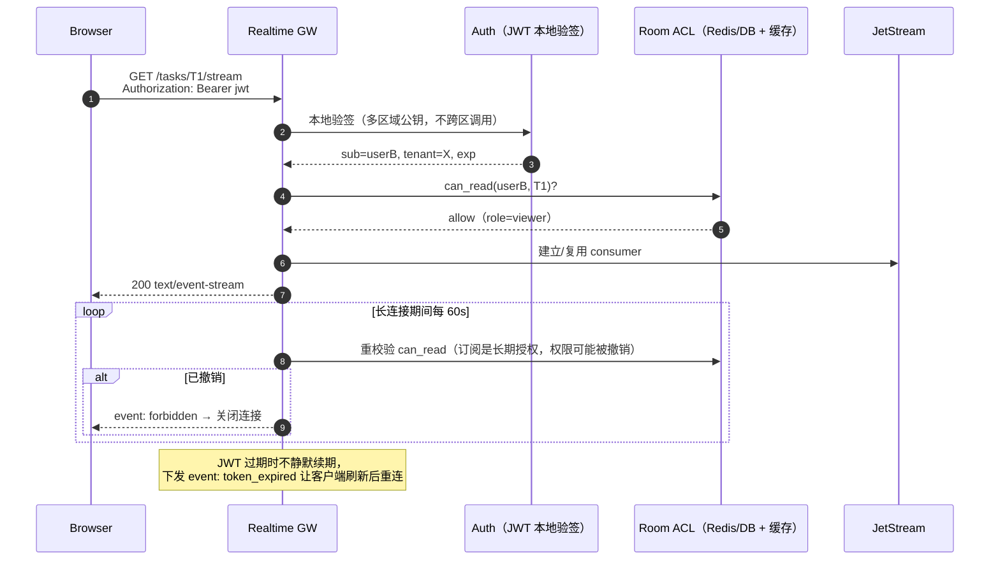

**安全要点（必须实现，不可省）**：
1. `task_id` 是不可枚举的（ULID/UUIDv7），但**绝不能以"不可猜"作为授权手段**——每次订阅必须查 ACL。
2. `can_read` 与 `can_write` 分离：B 可能只有观测权，无追加指令权。
3. 事件下发前做**字段级脱敏**：Worker 输出可能含内部路径、凭据、其他租户信息 → 出口统一过滤。
4. 所有互动文本在渲染侧转义（XSS）；Markdown 渲染必须走白名单 sanitizer，禁止 `dangerouslySetInnerHTML` 直出。
5. 上行 `room.msg` / `room.steer` 做长度上限 + 频率限流（按 user × task），防刷爆流存储。
6. 跨区订阅走服务间 mTLS，NATS 账户按 tenant 隔离，subject 权限最小化（RG 只被授予 `task.>` 的 **订阅** 权，无发布权）。

---

## 6. 多区域订阅：两种方案与推荐

B 用户在 b 区，任务的 home Cell 在 a 区。b 区的 RG 怎么拿到事件？

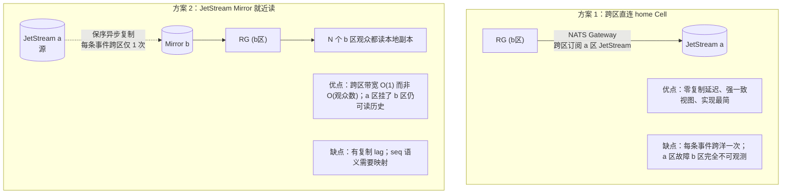

| 维度 | 方案 1 直连 | 方案 2 Mirror | 推荐 |
|------|------------|--------------|------|
| 跨区带宽 | O(事件数 × 跨区观众数) | O(事件数) | 方案 2 |
| 延迟 | 1×RTT | 1×RTT + 复制 lag | 方案 1 略优 |
| a 区故障时 b 区 | 完全不可观测 | 可读到 lag 之前的内容 | 方案 2 |
| seq 一致性 | 天然一致 | Mirror 保留源 seq（NATS Mirror 特性）→ 也一致 | 平手 |
| 运维复杂度 | 低 | 中（每区一套 Mirror） | 方案 1 |

**推荐：默认方案 2（Mirror），单区观众数少的冷任务用方案 1 兜底。**
落地规则：
- b 区 RG 优先读本区 Mirror；若 `from_seq > mirror 已复制到的 seq` 且等待超过 300ms → **临时降级为跨区直连**，追平后回落本地。
- Mirror 保留源 stream sequence，因此客户端的 `last_seq` 在任意区域都可用，**换区域重连不需要重置游标**（这直接支撑 R6 中"换设备/换网络"的场景）。
- 快通道（NATS Core）跨区通过 Gateway 转发，但**只转发有本区订阅者的 subject**（NATS Gateway 的兴趣传播天然如此），不会全量跨洋。

---

## 7. 对外协议

### 7.1 端点

| 方法 | 路径 | 说明 |
|------|------|------|
| `POST` | `/v1/tasks` | 提交任务。请求头必带 `Idempotency-Key`（客户端生成，≥128bit CSPRNG）。**`task_id` 由客户端本地确定性计算**；重复提交返回既有状态 |
| `GET` | `/v1/tasks/{id}` | 点查。路由到 home Cell，**强一致**（唯一需要强一致的读路径）。无权限返回 404 |
| `GET` | `/v1/tasks/{id}/snapshot` | 返回 `{state, attempt, snapshot_seq, output_ref 或 inline, progress, members}` |
| `POST` | `/v1/tasks/{id}/subscribe` | 换取一次性 Subscription Ticket（TTL 60s），见 [`security.md` §2](./security.md) |
| `GET` | `/v1/tasks/{id}/stream` | **SSE**。`?ticket=` 鉴权；`from_seq` query 或 `Last-Event-ID` 头指定起点 |
| `POST` | `/v1/tasks/{id}/messages` | 互动消息（评论/反馈），写入流 |
| `POST` | `/v1/tasks/{id}/steer` | 运行中追加指令，需 `can_write` |
| `DELETE` | `/v1/tasks/{id}` | 取消 |
| `WS` | `/v1/tasks/{id}/ws` | 可选：高互动场景合并上下行 + presence |

### 7.2 SSE 事件格式

```
id: JS-a:184257391
event: chunk
data: {"task_id":"T1","attempt":2,"chunk_no":417,"seq":184257391,"delta":"...文本增量...","coalesced":false}

id: JS-a:184257392
event: room.msg
data: {"task_id":"T1","seq":184257392,"from":"userB","body":"这一步参数是不是错了？","ts":1755650000}

id: JS-a:184257393
event: lifecycle
data: {"task_id":"T1","seq":184257393,"state":"succeeded","artifacts":[{"oss_key":"tasks/T1/final.json"}]}
```

- `id` = `{stream_domain}:{stream_seq}`，浏览器 `EventSource` 断线自动带 `Last-Event-ID` 重连 → **R6 的"切页面/网络抖动"省掉了游标管理**。
  ⚠️ 修正：原生重连仍需 SDK 封装「换新 ticket + jitter 退避」，因为一次性 ticket 已被消费。详见 [`security.md` §2.2](./security.md)。
- 心跳：每 15s 发 `: keepalive` 注释行，穿透中间代理的空闲超时。
- 服务端主动收口：`event: token_expired` / `event: forbidden` / `event: stream_gap`，客户端按语义处理，**不要靠猜测断线原因**。

### 7.3 SSE vs WebSocket

| 维度 | SSE | WebSocket | 结论 |
|------|-----|-----------|------|
| 断线重连 + 游标续订 | **浏览器原生（Last-Event-ID）** | 需自己实现 | SSE 胜 |
| 上行 | 需另开 HTTP 请求 | 原生双向 | WS 胜 |
| 代理/防火墙穿透 | 普通 HTTP，最友好 | 需 Upgrade，偶有阻断 | SSE 胜 |
| presence / typing 高频小包 | 不适合 | 适合 | WS 胜 |
| 服务端资源 | 更轻 | 略重 | SSE 胜 |

**推荐：默认 SSE（下行）+ 普通 POST（上行）**；只有当协作交互密度高（typing、光标同步）时，为该视图额外启用 WS。理由：R5/R6 的核心痛点是"重连续订"，SSE 在这点上有原生优势，而上行消息频率远低于下行输出频率。

---

## 8. 关键时序图

### 8.1 A 在 a 区发起，A/B 双区同时观测流式输出

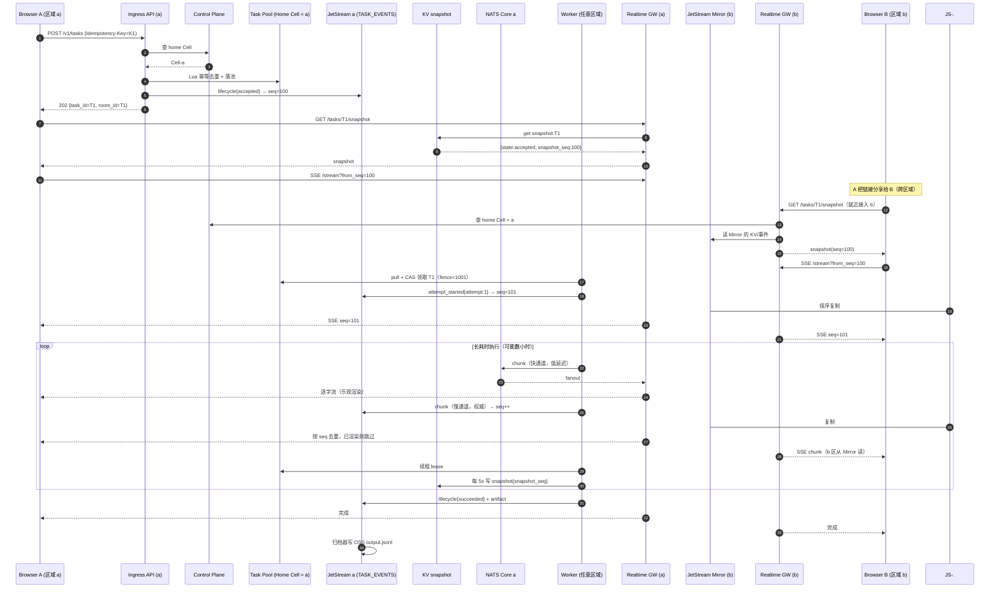

**要点**：B 从未与 a 区的 API 交互过写路径，全程只读；A 与 B 收到的是**同一条流的同一批 seq**，因此内容与顺序严格一致。

### 8.2 R6：A 切页面 / 关闭 / 重开 / 换设备

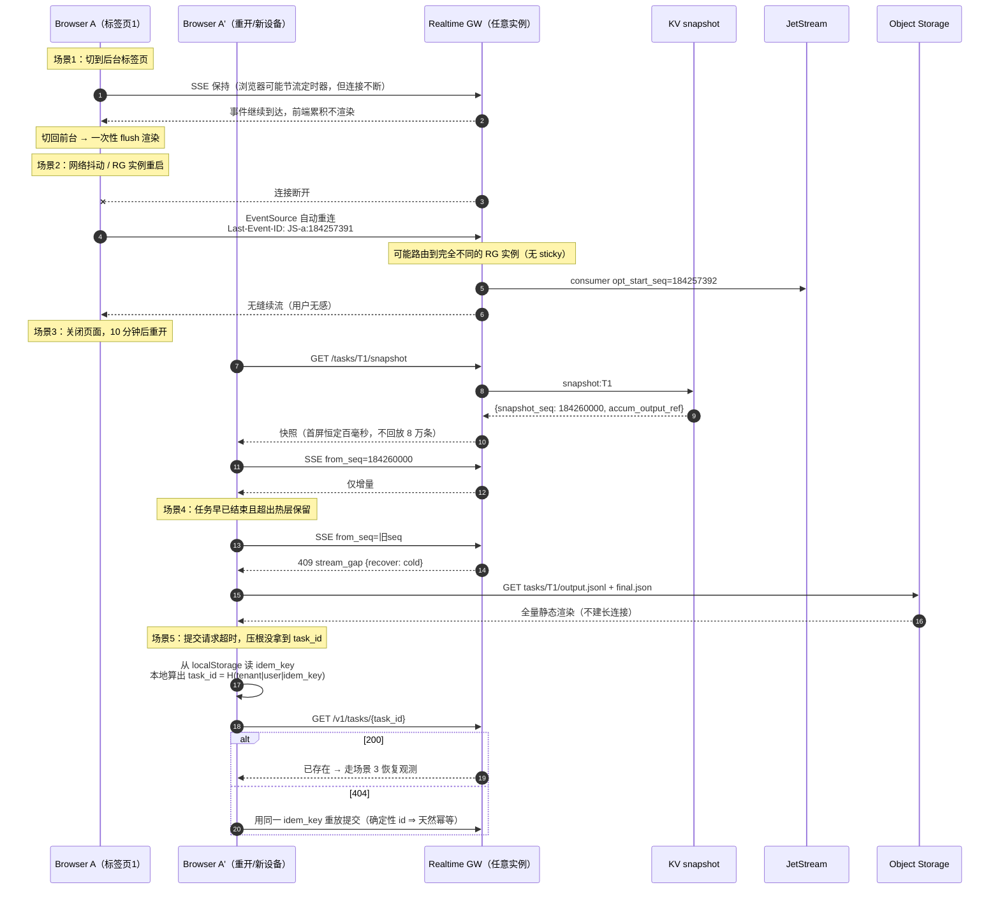

> 场景 5 的完整推导（含 Case 1/2/3 失败分析与双写规避）**不需要"按 idem_key 查询"的找回接口**——确定性 `task_id` 让客户端本地即可算出，且重放绝对安全。

> 场景 5 常被遗漏：**用户点了"提交"，响应还没回来就关了页面**。让客户端在发请求**之前**就生成并本地持久化 `Idempotency-Key`，就能事后找回任务，而不是产生一个"孤儿任务"。

### 8.3 A/B 跨区互动的因果一致（R3）

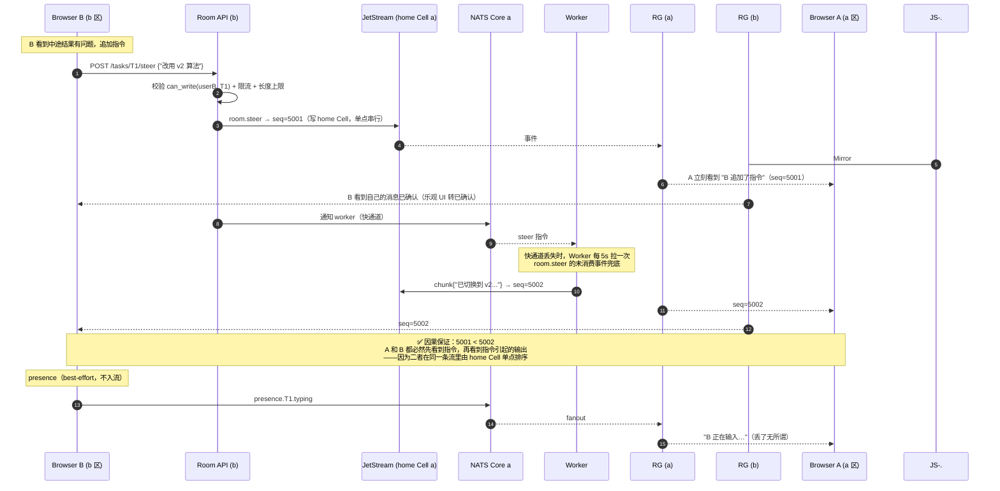

**这是 B4 公理的价值**：如果把"任务输出"和"人类互动"放在两条独立的流里，A 和 B 可能看到相反的顺序（A 先看到输出再看到指令，B 反之），协作场景下会引起严重误解。合流后，全序由单点分配，跨区只是延迟不同、顺序永远一致。

### 8.4 故障与降级

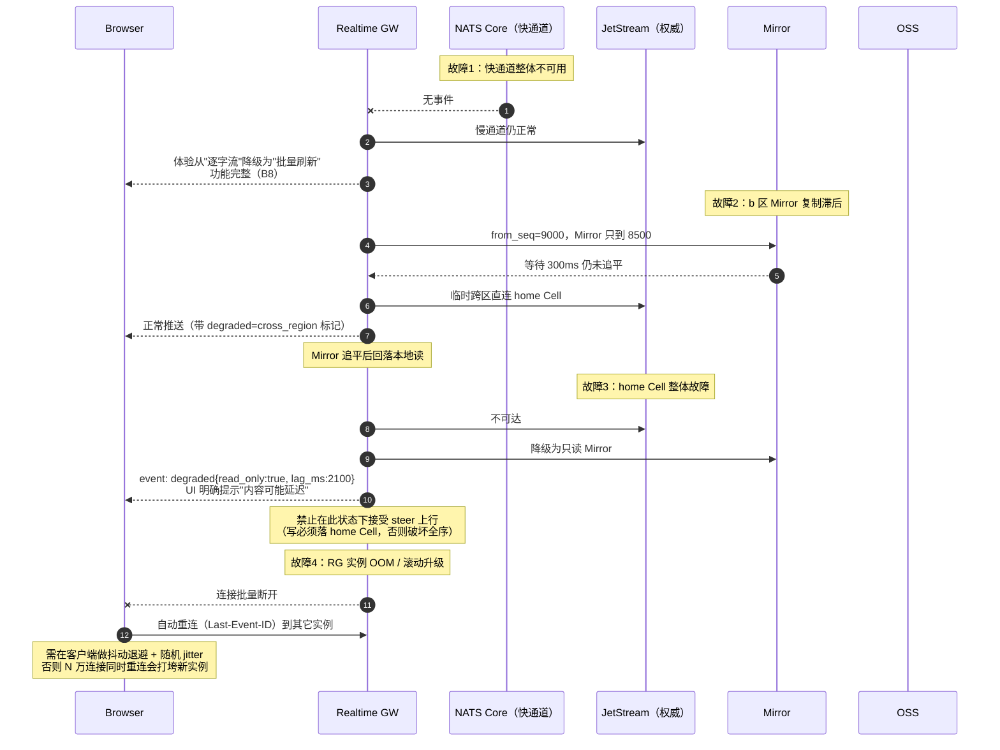

**降级必须对用户可见**：`degraded` 事件里带 `reason` 与 `lag_ms`，前端显式提示。静默降级会让用户基于陈旧数据做决策。

---

## 9. 幂等与去重的三个层次（R2 的完整答复）

| 层次 | 位置 | 键 | 防什么 |
|------|------|----|-------|
| **提交幂等** | Ingress API | 客户端生成的 `Idempotency-Key` → Redis `SET NX EX 24h` | 用户重复点击、网络重试、页面刷新重提 |
| **执行唯一** | Task Pool | Lua CAS 领取 + `lease:{tid}` + 单调 `fence_token` | 两个 Worker 同时执行；僵尸 Worker 复活覆写 |
| **渲染幂等** | 客户端 | `seq` 单调过滤 + `(attempt, chunk_no)` 去重 | 快慢双通道重复到货、at-least-once 重投、重连重叠区间 |


> **三层缺一不可**。只有执行唯一没有提交幂等 → 产生 3 个不同 task_id 的重复任务；只有前两层没有渲染幂等 → 用户看到重复文本（快慢双通道必然重复）。

---

## 10. 容量模型与流量放大（R4）

### 10.1 放大系数

设：任务并发数 `T`，每任务平均观众数 `V`，每任务输出速率 `R` events/s。

| 环节 | 流量 | 控制手段 |
|------|------|---------|
| Worker → JetStream | `T × R` | **chunk 聚合**：每 50–100ms 或 N 字节 flush 一次，把 token 级降到 10–20 events/s |
| JetStream 存储 | `T × R × 事件大小 × 保留时长` | 大产物走 OSS，流里只放引用；`max_age` 收紧；终态后归档即淘汰 |
| JetStream → RG | `T × R × RG实例数`（因订阅复用，与观众数无关） | per-task consumer 复用（§5.1 决策 2） |
| RG → 客户端 | `T × R × V` | 慢客户端合并（coalesce）；前端可选"低频模式" |
| 跨区 | `T × R × 有订阅的区域数` | Mirror（§6）：与跨区观众数无关 |

**关键结论**：通过"订阅复用 + Mirror"，把两处 `× 观众数` 消掉，系统对**热门任务被大量围观**这一场景天然免疫。唯一线性于观众数的是最末端 RG → 客户端，而 RG 是无状态可水平扩容的。

### 10.2 chunk 聚合的取舍

| 聚合窗口 | 手感 | 事件量 | 建议 |
|---------|------|--------|------|
| 不聚合（每 token） | 最佳 | 极高，JetStream 成本不可接受 | ❌ |
| 50ms | 人眼几乎无差 | 20 events/s | ✅ 快通道用 |
| 200ms | 略有顿挫 | 5 events/s | ✅ 慢通道（持久化）用 |
| 1s+ | 明显卡顿 | 1 events/s | 仅用于非交互型批处理任务 |

**推荐组合**：快通道 50ms（不持久，成本仅网络）+ 慢通道 200ms（持久，成本可控）。客户端以快通道渲染、以慢通道校正。

### 10.3 Worker 扩容与流式输出的关系

Worker 水平扩容本身由 pull 模型保证（无中心分发瓶颈）。本文补充两点约束：
1. Worker 只与**本区** NATS/JetStream 交互（就近写入），事件靠 Mirror 传播 → Worker 扩到全球任意区域都不增加跨区 RTT。
2. Worker 数量增长不影响 RG：RG 的负载只与"观众连接数 × 事件速率"相关，两者解耦。

---

## 11. 失败模式矩阵

| 故障 | 影响 | 自动恢复 | 用户可见性 |
|------|------|---------|-----------|
| NATS Core 不可用 | 逐字流退化为批量刷新 | 是（慢通道兜底） | 无感或轻微 |
| JetStream 失去 quorum | 只读，新事件写入失败 → Worker 本地缓冲 + 重试 | 部分（Worker 缓冲有上限） | `degraded` 提示 |
| Mirror 滞后 | b 区延迟升高 | 是（超时降级跨区直连） | `degraded{lag_ms}` |
| home Cell 整体故障 | 该分片任务不可写；观测降级为只读 Mirror | 分片 owner 转移 | 明确提示只读 |
| RG 实例故障 / 升级 | 该实例连接断开 | 是（客户端 Last-Event-ID 重连，需 jitter 退避） | 短暂闪断 |
| KV 快照缺失/滞后 | 首屏变慢（需回放更多 delta） | 是（归档器兜底重建） | 首屏延迟 |
| 热层已淘汰客户端请求的 seq | 无法增量续 | 是（`409 stream_gap` → 重取快照或读冷层） | 一次刷新 |
| Worker 宕机 | attempt 中断，重派 | 是（Reaper 回收 + 新 attempt） | UI 显示"已重试" |
| ACL 撤销 | 订阅被主动关闭 | N/A | `event: forbidden` |

---

## 12. 遗留开放问题

以下问题在本文改写为正式设计时定夺：

1. **快照编解码**：文本类可累积字符串，**结构化/二进制输出（逐步生成的图像、表格）的快照如何定义**？是否需要按输出类型区分编码器。
2. **历史 attempt 的呈现**：折叠、并列对比、还是隐藏？影响互动消息与 attempt 的关联建模。
3. **互动消息的编辑与撤回**：append-only 流中撤回只能是墓碑事件，前端需处理「已渲染内容被撤回」。
4. **`steer` 的语义边界**：执行中途修改参数，是续跑还是开启新 attempt？（当前范围界定不做抢占与检查点，倾向开启新 attempt）
5. **幂等键的保留期与跨设备找回**：跨设备恢复需服务端按用户索引未确认的提交意图。

> 已解决并移出本清单的问题：大房间只读广播（当前规模下单任务观测者 P99 仅 20，无需分层扇出）。
