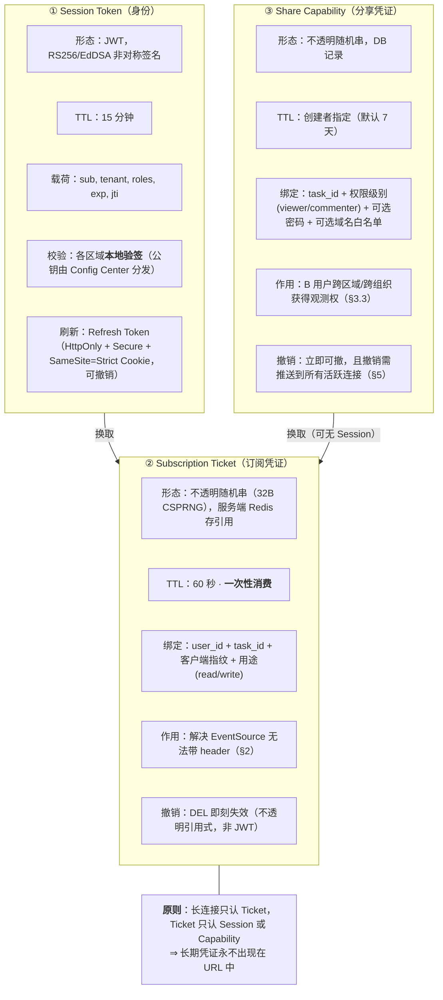
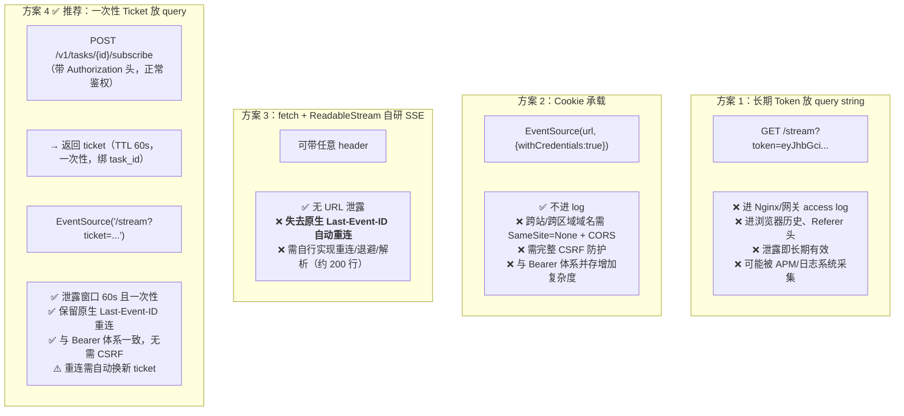
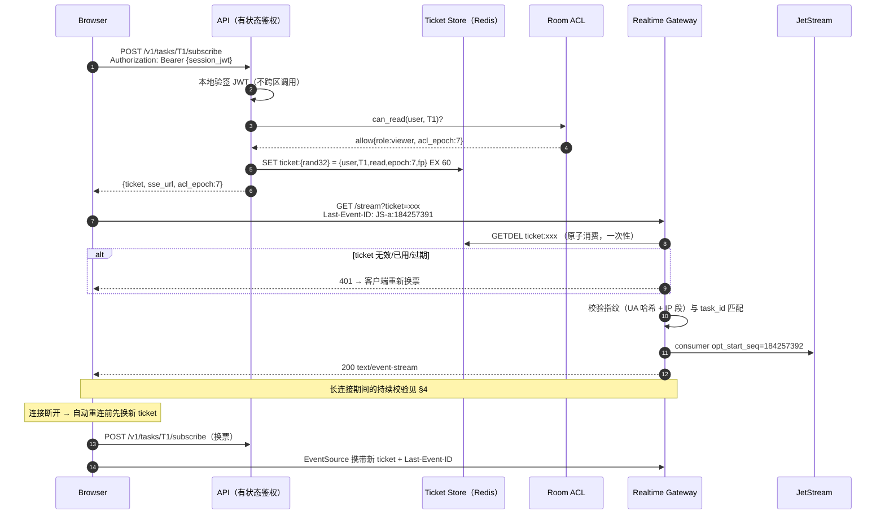
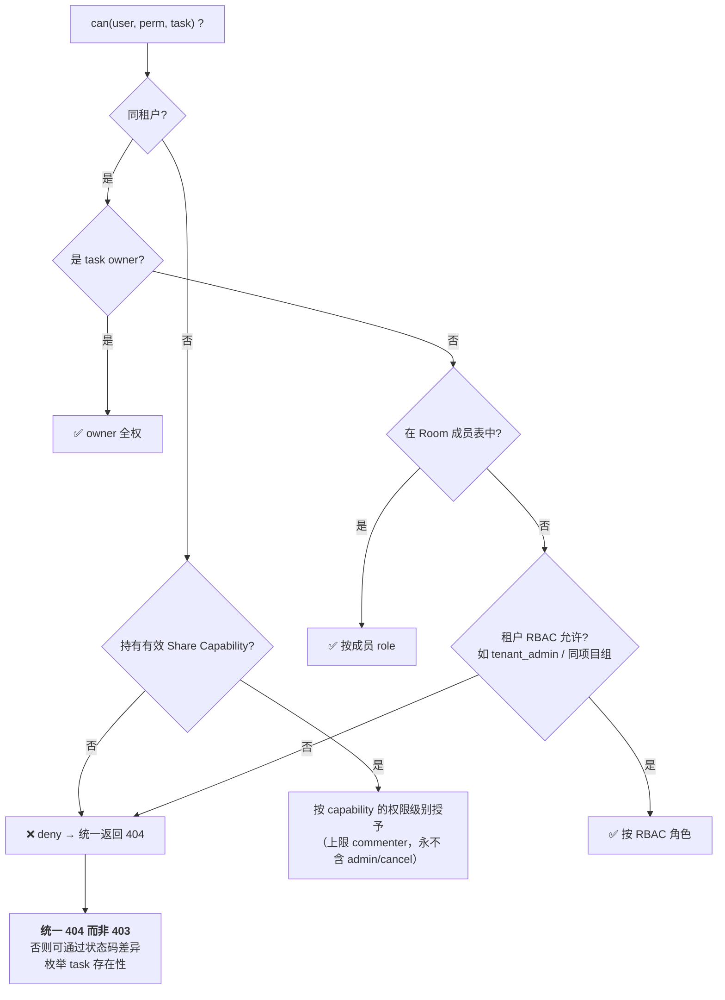
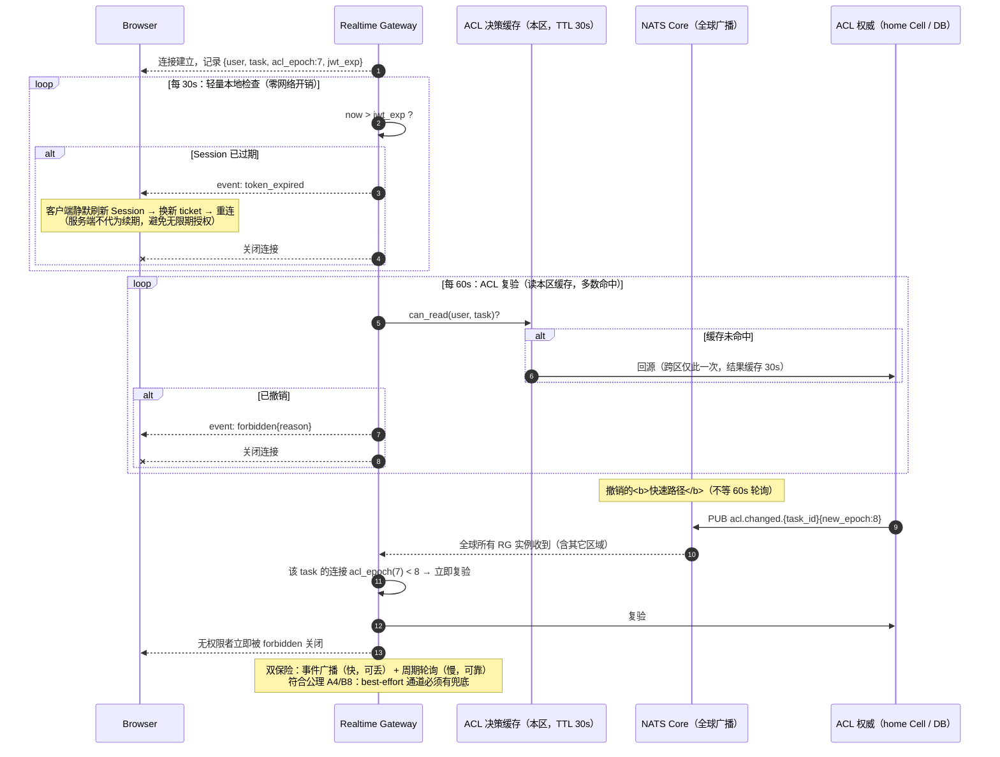
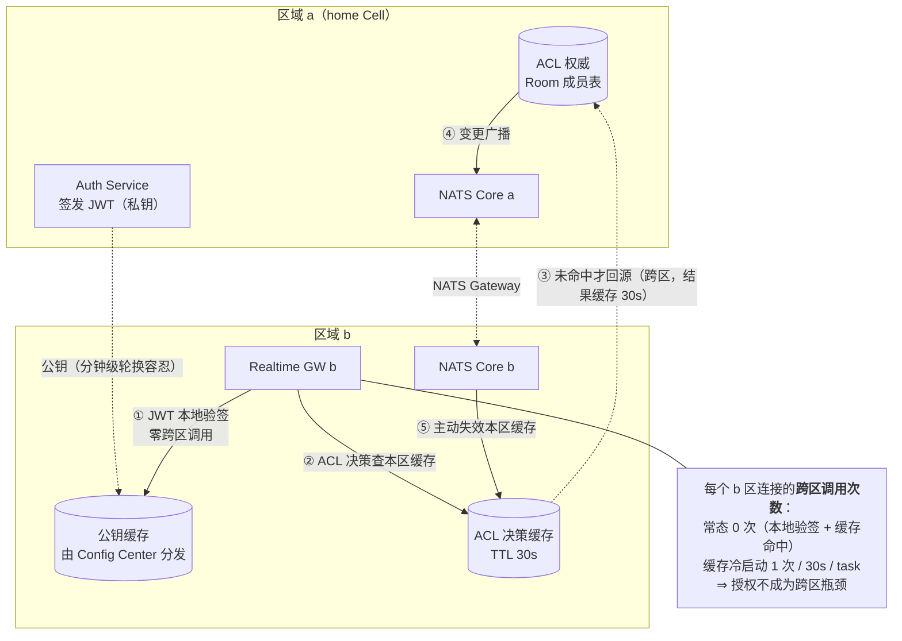
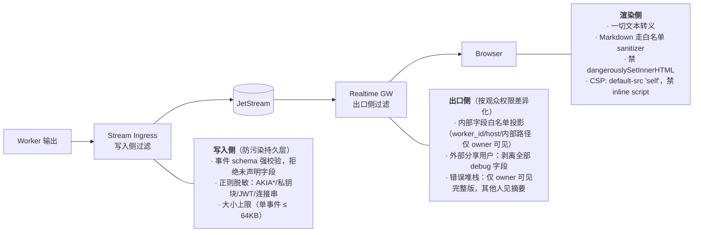
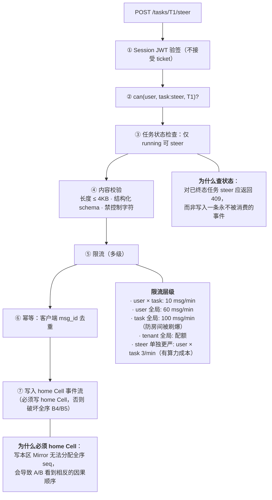
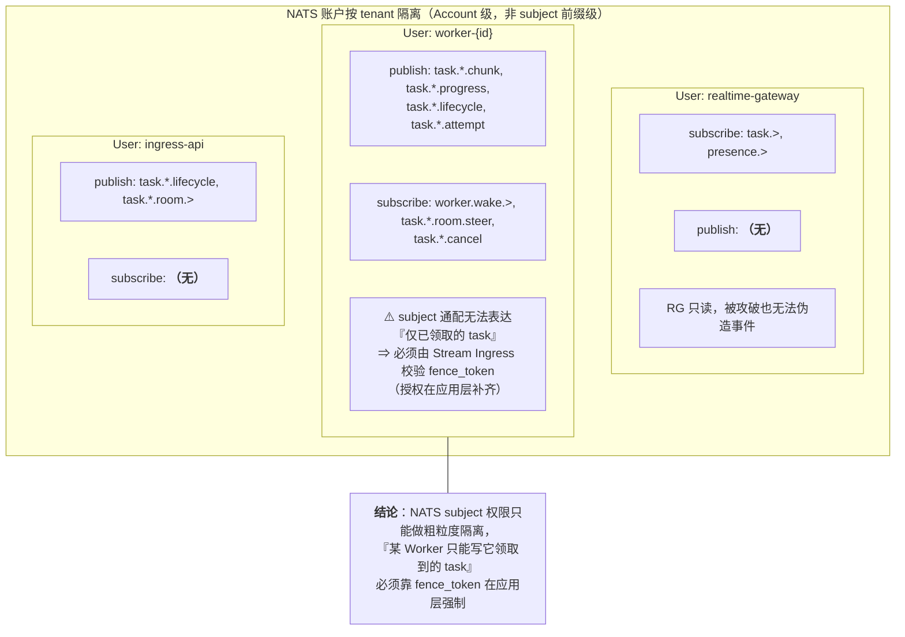

# 草稿：鉴权与授权

> ## ⚠️ 草稿，需补充后方可作为实现依据
>
> 产品范围已收口为 **Responses 协议子集的生成服务**（[D20](../../architecture/decisions.md#d20-交付边界收口存储与订阅分离) / [D22](../../architecture/decisions.md#d22-协议封闭子集与严格拒绝)）。
> 本文保留长连接鉴权素材；**一期已实现的部分见下表**，其余补齐后移出本目录。
>
> ### 一期已实现（不在本文草稿范围内）
>
> | 项 | 实现位置 | 支撑 |
> |---|---|---|
> | Bearer → 租户解析 | `nova-responses/src/auth.rs` | SEC-1 |
> | **越权返回「不存在」而非「禁止访问」** | 同上 + `nova-responses/src/error.rs` | SEC-2 |
> | **快照固化时校验租户**（创建时校验 previous，物化后快照自洽） | `ContextStore`（创建路径） | SEC-3 |
> | **密钥仅从环境变量读取**；启用校验但缺失时启动即失败 | `core/src/integrity_hmac.rs` | SEC-4 |
> | **无节点间转发**（转发子系统随共享缓冲化整体删除；不再存在由标识推导转发地址的路径） | —（结构上无 SSRF 向量） | SEC-5 |
> | **引用链接内网拦截**（仅 https + 私有段拒绝） | `core/src/protocol/url_guard.rs` | SEC-6 |
> | **请求体限长限深** | `core/src/protocol/limits.rs` | SEC-7 |
> | **数据访问一律参数绑定** | `adapters/sql/src/context.rs` | SEC-8 |
> | 日志脱敏（不记原文 / 密钥 / 连接串） | 全局 | SEC-9 |
> | **内部租户头需内部令牌方可采信** | `nova-responses/src/auth.rs` | SEC-5 |
>
> ### 仍为草稿的缺口
>
> | 缺口 | 说明 | 处置 |
> |---|---|---|
> | 授权对象用语 | 正文多处仍写 `task_id` / `session_id` | 升格时改为 **`response_id`** |
> | `EventSource` 无法带 Authorization 头 | 正文 §2 的一次性 ticket 方案仍有效且**尚未实现** | 升格时实现 |
> | 长连接期间的权限撤销 | 正文 §4；当前订阅生命周期为单次生成（分钟级），风险显著低于原小时级会话 | 按新生命周期重估 |
> | 出口脱敏 | 正文 §6 | 与调用方约定后实现 |
> | 多密钥并存 / 轮换 | 当前单密钥；`alg` 标记已具备识别基础 | 条件触发 |
> | ~~匹配器 DSL 沙箱~~ | D1 已废止，无 DSL 执行入口 | **不再适用** |
> | ~~跨区域授权~~ | 节点已对等，无权威区/边缘区 | **不再适用** |
>
> 相关需求：SEC-1~SEC-10 · 不变量：[`invariants.md`](../../architecture/invariants.md)
> 正式契约：[`../01-responses-api.md`](../01-responses-api.md) · [`../06-protocol-subset.md`](../06-protocol-subset.md)
>
> 本文仍有价值的核心：**长连接期间的权限撤销**、**`EventSource` 无法携带 Authorization 头**。

------------|------|------|
> | ~~匹配器 DSL 沙箱~~ | D1 已废止；无 DSL 执行入口 | **不再适用** |
> | 授权对象用语 | 正文多处仍写 `task_id` | 升格时改为 **`session_id`**（及 Turn 写路径） |
> | 「Realtime Gateway」 | 部署措辞 | 升格时改为 **`nova-sessions` 订路径** |
> | §5 跨区域授权 | 按 2~3 区域简化即可 | 简化 |
>
> **可复用部分**：§1 三层令牌 · §2 `EventSource` 鉴权（一次性 ticket）· §3 授权模型 · §4 长连接持续校验 · §6 出口脱敏 · §7 上行限流 · §8 攻击面清单（去掉匹配器项）
>
> 相关需求：SEC-1~SEC-6 · 相关不变量：[`invariants.md`](../../architecture/invariants.md)  
> 正式流设计：[`../01-session-stream.md`](../01-session-stream.md)
>
> 本文覆盖三个通常被忽略的问题：**长连接期间的权限撤销**、**`EventSource` 无法携带 Authorization 头**、**跨区域授权不跨洋**。

---

## 0. 为什么流式场景的鉴权不能照搬 REST

| REST 请求 | 流式订阅 |
|-----------|---------|
| 生命周期毫秒级，建连即校验足够 | 生命周期**小时级**，建连时的授权在断开前可能早已失效 |
| 每次请求都带 `Authorization` 头 | 浏览器 `EventSource` **不支持自定义请求头** |
| 授权对象是"接口" | 授权对象是"某个具体 task 的事件流"，且需区分读/写 |
| 权限撤销下次请求即生效 | 撤销后连接**仍然活着**，需要主动推送并关闭 |
| 响应内容由该接口固定 | 内容是 Worker 产生的**任意输出**，可能含敏感数据 |

> 这五条差异中，任意一条被忽略都会产生真实的越权漏洞。第 2 条最容易导致工程上"为了能跑"而把 token 塞进 URL query。

---

## 1. 三层令牌模型



**为什么 Ticket 必须是不透明引用式而非 JWT**：JWT 无状态不可撤销。Ticket 会出现在 URL（进 access log、Referer、浏览器历史），必须能被立即失效且一次性消费——这两点 JWT 都做不到。

---

## 2. 核心技术坑：`EventSource` 不能携带 Authorization 头

这是 W3C 规范的限制（`EventSource` 构造函数只接受 URL 与 `withCredentials`），不是浏览器 bug。四种解法：



### 2.1 推荐方案的完整时序



### 2.2 修正上一篇文档的说法

`observation.md` §7.2 称「浏览器原生 `Last-Event-ID` 零代码成本解决重连」——**需要补充**：原生重连能力保留，但**重连时携带的是已被消费的旧 ticket**，会被拒。因此 SDK 必须封装：

```
监听 EventSource.onerror
  → 关闭旧连接（避免原生退避与自研退避打架）
  → 换新 ticket（带 jitter 退避：min(2^n × 200ms, 30s) × random(0.5,1.5)）
  → 用新 ticket + 本地保存的 last_seq 重建连接
```

即：**原生 `Last-Event-ID` 仍然省掉了"游标管理"，但没省掉"重连编排"。** 客户端仍需自行保存 `last_seq` 作为 ticket 换发失败时的兜底。

### 2.3 Ticket 的防滥用约束

| 约束 | 值 | 防什么 |
|------|-----|-------|
| TTL | 60s | 泄露窗口 |
| 消费次数 | 1（`GETDEL` 原子） | 重放、多端共用 |
| 绑定 `task_id` | 强制 | 用 T1 的票订阅 T2（**横向越权**） |
| 绑定用途 read/write | 强制 | 只读用户用观测票发送 steer（**纵向越权**） |
| 绑定客户端指纹 | UA 哈希 + IP /24（IPv6 /48） | 票被中间人窃取后异地使用；放宽到网段以容忍移动网络切换 |
| 签发频率限流 | 每 user 10/min、每 user×task 30/min | 刷票枚举、放大攻击 |
| 记录 `acl_epoch` | 强制 | 使用旧 epoch 的票在 ACL 变更后被拒（§5） |

---

## 3. 授权模型

### 3.1 权限维度

```mermaid
%%{init: {"flowchart": {"curve": "basis"}}}%%
flowchart LR
    subgraph PERM["权限位（正交，可组合）"]
        P1["task:read<br/>读快照、订阅事件流"]
        P2["task:comment<br/>发 room.msg"]
        P3["task:steer<br/>发 room.steer（<b>影响执行</b>）"]
        P4["task:cancel<br/>取消任务（<b>影响计费</b>）"]
        P5["task:admin<br/>管理成员、撤销分享"]
    end
    subgraph ROLE["角色（权限位的预设组合）"]
        R1["owner = read+comment+steer+cancel+admin"]
        R2["collaborator = read+comment+steer"]
        R3["commenter = read+comment"]
        R4["viewer = read"]
    end
    PERM --> ROLE
    NOTE["<b>关键分离</b>：read ≠ write<br/>B 用户默认 viewer，<br/>steer/cancel 需显式授予（会影响成本与结果）"]
    ROLE --- NOTE
```



> 满足需求 R3「B 可以查看并互动」的最小授权是 `commenter`，而非 `collaborator`。**是否给 B `steer` 权限是产品决策而非技术默认**——因为 steer 会改变执行路径并产生真实算力成本。

### 3.2 授权决策的输入



### 3.3 跨区域观测的授权来源（需求 R3 的落地）

B 用户如何获得权限？三条路径，安全性递减：

| 路径 | 流程 | 适用 | 风险控制 |
|------|------|------|---------|
| **显式邀请** | A 调 `POST /tasks/T1/members` 添加 B → 写 Room 成员表 | 同租户协作 | 最安全，推荐默认 |
| **组织 RBAC** | B 因属于同项目组自动可见 | 团队内透明协作 | 需项目/租户边界清晰 |
| **分享链接** | A 生成 Capability → 带 token 的 URL 发给 B | 跨组织、外部评审 | 见下方约束 |

**分享链接的强制约束**（缺一不可）：

1. **可撤销**：不透明引用式，DB 记录状态；撤销需推送到活跃连接（§5）。
2. **默认过期**：默认 7 天，最长 30 天；UI 显式展示过期时间。
3. **权限上限**：分享凭证**永不**授予 `cancel` 与 `admin`（避免外部人员产生计费影响或篡改成员）。
4. **可审计**：记录每次使用的 IP / UA / 时间，owner 可在界面查看"谁看过"。
5. **不索引**：响应头 `X-Robots-Tag: noindex`，防搜索引擎收录分享页。
6. **敏感任务禁分享**：任务级 `shareable=false` 标记，由租户策略控制。

---

## 4. 长连接期间的持续校验

**建连时校验一次是不够的**——SSE 连接可能存活数小时，期间 token 会过期、权限会被撤销、分享会被收回。



**撤销生效时间界限（写入 SLO）**：

| 路径 | 生效时间 | 可靠性 |
|------|---------|--------|
| NATS 广播命中 | < 1s | best-effort |
| 缓存 TTL 到期 | ≤ 30s | 可靠 |
| 周期轮询 | ≤ 60s | 可靠 |
| **对外承诺** | **≤ 60s** | 保证 |

> 若业务要求"撤销即时生效"（如合规场景），必须改为**每条事件下发前校验**（缓存命中，本地开销），代价是 CPU 上升与实现复杂度提高。默认不采用，因为 60s 窗口内的额外泄露是"已授权用户多看 60s"，风险可接受。

---

## 5. 跨区域授权：不跨洋



**三个设计要点**：

1. **JWT 用非对称签名**（RS256/EdDSA），公钥分发到各区。若用 HS256 对称密钥，密钥需分发到所有区域的所有服务 → 任一服务被攻破即可伪造任意身份。
2. **ACL 决策缓存写入 `acl_epoch`**，广播失效时按 epoch 比较而非无条件清空——避免广播风暴导致缓存击穿到 home Cell。
3. **缓存只缓存 allow，deny 不缓存或极短缓存**（5s）。理由：新授权应快速生效（用户被邀请后应立刻能看），而撤销由 epoch 广播处理。

---

## 6. 出口数据脱敏（最容易被忽略的一环）

事件流内容由 **Worker 产生**，Worker 运行的是业务代码/模型推理，其输出可能包含：内部文件路径、环境变量、错误堆栈中的连接串、其它租户的缓存残留、上游 API 的原始响应。

**这些内容会被直接推送给包括外部分享用户在内的所有观测者。**



**为什么必须双侧过滤**：写入侧防止敏感数据进入持久层（进了就存在保留期内的泄露风险与合规问题）；出口侧因为**同一份事件面向不同权限的观众**，脱敏程度必须按观众差异化——这在写入侧无法完成。

---

## 7. 上行写入的授权与限流

上行（`room.msg` / `room.steer` / `cancel`）比订阅更危险：**它写入持久流、消耗算力、影响其它用户看到的内容**。



**降级状态下必须拒绝写入**：当 RG 处于「只读 Mirror 降级」（`observation.md` §8.4 故障 3）时，上行必须返回 `503`，**不可**尝试写入本区副本——否则破坏全序，造成跨区用户看到矛盾的事件顺序。

---

## 8. 攻击面清单与对策

| # | 攻击 | 后果 | 对策 |
|---|------|------|------|
| 1 | 枚举 `task_id` 探测存在性 | 信息泄露（尤其确定性 ID 下） | 无权一律 **404**（不用 403）；响应时间恒定化；per-IP 限流 |
| 2 | 用 T1 的 ticket 订阅 T2 | 横向越权读 | Ticket 强绑 `task_id`，RG 校验路径与票内一致 |
| 3 | viewer 用观测票发 steer | 纵向越权写 | Ticket 绑用途；上行**只接受 Session JWT**，不接受 ticket |
| 4 | Ticket 从 access log / Referer 泄露 | 60s 窗口内被冒用 | 一次性 `GETDEL` + 指纹绑定 + 日志脱敏 `ticket=` 参数 |
| 5 | 撤销后连接仍活着 | 持续越权观测 | §4 双保险，≤60s 生效 |
| 6 | 分享链接被二次转发 | 不可控扩散 | 可撤销 + 默认过期 + 使用审计 + 可选访问密码 |
| 7 | 单用户开万级 SSE 连接 | RG 资源耗尽（DoS） | per-user 连接数上限（如 20）；per-IP 上限；超限拒绝并返回 `429` |
| 8 | 刷 `room.msg` 撑爆流存储 | 成本攻击 + 挤占保留窗口 | §7 多级限流 + 事件大小上限 + tenant 配额 |
| 9 | Worker 输出含其它租户数据 | 跨租户泄露 | §6 双侧脱敏 + Worker 沙箱租户隔离 + NATS 账户按 tenant 隔离 |
| 10 | 恶意 Worker 伪造他人任务事件 | 篡改输出 | 事件写入校验 `fence_token` 与当前 lease 一致；NATS subject 权限最小化（Worker 仅可发布 `task.{已领取id}.*`） |
| 11 | 输出内容含恶意 Markdown/HTML | XSS 打到所有观众 | 渲染侧白名单 sanitizer + CSP + 禁 inline |
| 12 | 万级连接同时重连 | 惊群打垮新实例 | 客户端指数退避 + **随机 jitter**；服务端 `429` + `Retry-After` |
| 13 | 伪造 JWT | 完全冒充 | 非对称签名；拒绝 `alg:none`；**校验 `alg` 白名单**（防算法混淆攻击） |
| 14 | Refresh Token 窃取 | 长期冒充 | HttpOnly+Secure+SameSite=Strict；**轮换检测**（旧 token 复用即吊销整个会话族） |
| 15 | 跨区服务间调用被伪造 | 内部越权 | 服务间 mTLS；NATS 账户隔离；RG 仅被授予 `task.>` **订阅**权，无发布权 |

---

## 9. NATS 权限最小化（常被整体放开的一环）



> 这解释了 `observation.md` §3.3 为什么需要 Stream Ingress 或读侧 attempt 过滤：**消息中间件的 ACL 无法表达"动态归属"这类授权语义**，必须在应用层补齐。

---

## 10. 落地清单

| 项 | 位置 | 优先级 |
|----|------|--------|
| JWT 非对称签名 + `alg` 白名单 + 各区本地验签 | Auth / 全服务 | **P0** |
| 一次性 Subscription Ticket（`GETDEL` 消费，绑 task+用途+指纹） | API + RG | **P0** |
| 无权限统一返回 404（禁 403 泄露存在性） | 全 API | **P0** |
| 上行只接受 Session JWT，拒绝 ticket | API | **P0** |
| 渲染侧 Markdown 白名单 sanitizer + CSP | 前端 | **P0** |
| RG 的 NATS 权限设为「只订阅、无发布」 | 配置 | **P0** |
| 日志脱敏 `ticket=` / `token=` query 参数 | 网关 / RG | **P0** |
| 长连接周期 ACL 复验（60s）+ JWT 过期主动关闭 | RG | P1 |
| `acl.changed` 广播 + `acl_epoch` 比较失效 | ACL + NATS + RG | P1 |
| 出口侧按权限差异化脱敏（内部字段白名单投影） | RG | P1 |
| Share Capability：可撤销 + 默认 7 天 + 权限上限 commenter | API + DB | P1 |
| 多级限流（user×task / user / task / tenant，steer 单独更严） | API | P1 |
| per-user / per-IP SSE 连接数上限 | RG | P1 |
| 客户端重连指数退避 + 随机 jitter | 前端 SDK | P1 |
| Refresh Token 轮换 + 复用检测吊销会话族 | Auth | P1 |
| 写入侧事件 schema 强校验 + 敏感串正则脱敏 | Stream Ingress | P1 |
| 分享链接使用审计（IP/UA/时间，owner 可见） | API + DB | P2 |
| 服务间 mTLS + NATS 账户按 tenant 隔离 | 基础设施 | P2 |
| 越权尝试的告警与限流联动（同 IP 多次 404） | 安全监控 | P2 |

---

## 11. 新增开放问题

1. **匿名分享是否允许**：B 无账号仅凭链接观测时，如何做限流与审计（无 `user_id` 可绑）？建议为匿名访问签发临时 `anon_id` 并绑定 IP 段。
2. **Ticket 换发的额外 RTT**：每次重连多一次 POST。高频抖动网络下是否需要「批量预签发 3 张票」？（削弱一次性语义，需权衡）
3. **合规场景的即时撤销**：60s 窗口对某些行业不可接受，是否为特定租户开启"每事件校验"模式？
4. **Worker 输出的租户内脱敏**：同租户不同项目的数据隔离，是否需要 task 级 `data_classification` 标签驱动出口过滤策略？
5. **审计日志的留存与查询**：谁在何时看了哪个任务的哪些 seq 区间——这份日志量级可能远超事件流本身，是否需要抽样？
6. **`steer` 的二次确认**：外部 commenter 的 steer 是否需要 owner 批准后才下发给 Worker（引入审批态）？
