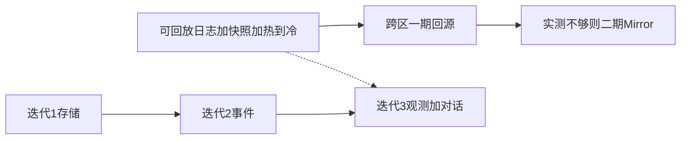

# 计划：对话层与 StreamChannel（D18 之后）

> 状态：决策已写入 ADR；**实现不插队**。本文件是执行视图补充，与 [`README.md`](./README.md) 迭代表一致。

---

## 1. 已锁定（勿再争论，除非 SUPERSEDED）

| 项 | 出处 |
|----|------|
| Session UX + Turn=Task + Session 全量日志（方案 A）+ 快照开屏 + 锁 CAS | [D18](../architecture/decisions.md) |
| 游标 `(session_id, last_seq)`；禁止连接粘性 | INV-12 澄清 |
| 当前不可并行 Turn；字段预留并行 | D18 |
| 聚合窗口暂不定；**同一 Session** 同时订阅 ≤5 | D18 |
| **有效 Session 始终可订**；热→冷卸载；热 miss → 快照/冷层（非丢弃） | D18 / INV-14 |
| 跨区一期：**Realtime 就近 + 读回源**；二期 Mirror 仅实测触发 | D18 |
| 绿场第一热层适配器：**Redis Streams**；JetStream 留作副本阶段选项 | D18 / D14 |
| Redis/JS 均可适配；JS 风险在大河长距离 filter；快照消解 | D18 |
| Session 用量 A/B/C 先验 + 校准埋点（见 conversation 草稿 §0.1） | 规划用，非硬需求 |

素材：[`../design/drafts/conversation.md`](../design/drafts/conversation.md) · 选型对比：[`../design/drafts/stream-channel-adapters.md`](../design/drafts/stream-channel-adapters.md)

---

## 2. 不做什么（现在）

- 不实现 nova-realtime / Session API
- 不把 NATS/Redis 变成 L0–L2 前置（D17）
- 不插队改领取核心；迭代顺序仍是 **存储 → 生命周期/事件 → 观测（含对话）**
- **不**第一期上 Mirror；**不**把「7 天」写成业务可丢弃
- **不**把公开 ChatBot 统计写成 `parameters.md` 硬锚点（先埋点）

---

## 3. 后续工作包

### P0 — 已完成（文档）

- [x] `decisions.md` D18（含跨区分期、热→冷、Redis 默认、性能/成本补强）
- [x] `invariants.md` §3 / INV-14 澄清
- [x] `drafts/conversation.md`（用量先验 §0.1）+ observation 冲突表
- [x] 本计划与索引联动

### P1 — 迭代 1～2 顺带预留（不展开实现）

| 项 | 说明 |
|----|------|
| 事件模型提及 `session_id` / `message_id` | 生命周期设计（`design/03`）时预留字段 |
| `StreamChannel` 键类型 | 可先保持 TaskId mem；正式观测前改为 `StreamId` 并改 conformance |

### P2 — 迭代 3（展开级时做）

| # | 交付 | 验收要点 |
|---|------|----------|
| 1 | 正式设计：合并 observation + conversation | 无「Task=Room」；跨区按 D18 分期；热→冷非丢弃 |
| 2 | 端口：`StreamId`、INV-14、per-session seq | conformance 绿；mem 适配 |
| 3 | 第一生产热层适配器 **Redis Streams** | L3/deploy 可选；L0–L2 不依赖；catch-up 有上界 |
| 4 | 快照协议 + 冷层读出口（可先最小实现） | 热 miss → 明确错误 → 快照/冷 |
| 5 | SSE 游标；跨区一期回源 | FR-10/14；外区 RG 读权威区 |
| 6 | 锁 CAS + busy 事件 | 双端禁止态；`max_in_flight=1` |
| 7 | Session 用量埋点 | `never_reopened_*`、`turns_per_session` 分位、`reopen_after_7d`、`active_inflight` |

### P3 — 显式推迟

| 项 | 触发 |
|----|------|
| TextDelta 聚合窗口数值 | 压测或 parameters 校准 |
| 并行 Turn | 产品要求 `max_in_flight>1` |
| 跨区二期 Mirror / JetStream 替换 | 实测跨区延迟或源区故障不可接受 |
| 将 A/B/C 比例写入 parameters | 埋点样本足够 |
| Kafka | 事件速率逼近越界线 |
| 用户收件箱独立流 | 多 Session 列表实时性不够时 |

---

## 4. 推进顺序（与 D18 对齐）

---

## 5. 变更日志

| 日期 | 变更 |
|------|------|
| 2026-08-25 | 补：Redis/JS 性能成本要点；Session A/B/C 用量先验与埋点 |
| 2026-08-25 | 写回：跨区回源分期、热→冷非丢弃、绿场 Redis Streams 默认；修正 observation 冲突表 |
| 2026-08-25 | 初版：对齐讨论结论与 D18 |
