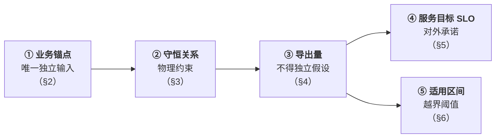
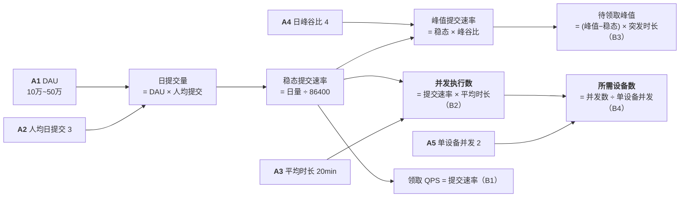
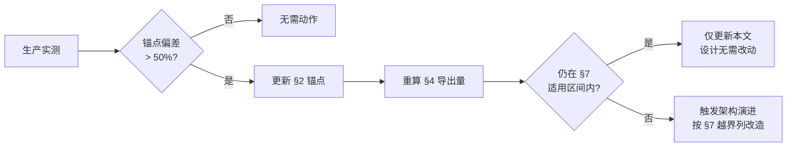

# 量化参数与容量模型

> 版本：v1.0
> 配套：[`spec.md`](./spec.md)（需求规格）
> **本文与 `spec.md` 分离的原因**：需求相对稳定，而参数需随实测持续校准。二者变更节奏不同，混写会导致文档快速腐化。

---

## 1. 参数体系

| 层 | 性质 | 校准方式 |
|----|------|---------|
| ① 业务锚点 | 独立估计，可观测 | **上线后以实测校准，仅需校准这一层** |
| ② 守恒关系 | 物理定律，不可变更 | 无需校准 |
| ③ 导出量 | 由 ①②计算得出 | 锚点变更后自动重算 |
| ④ SLO | 业务承诺，部分由 ③ 约束 | 按业务需要调整 |
| ⑤ 适用区间 | 取导出量的 5~14 倍 | 锚点变更后重新评估 |

> ⚠️ **本文数值为规划推导值，非实测。** 使用方式：不依赖数值精确，而是确保设计的适用区间（§6）覆盖推导值数倍，并配合越界告警（OR-6）与过载拒绝（FR-21）。

---

## 2. 业务锚点（唯一的独立输入）

| # | 锚点 | 取值 | 置信度 | 说明 |
|---|------|-----|--------|------|
| **A1** | **日活用户数（DAU）** | **10 万 ~ 50 万** | **中高** | 唯一直接来自业务预估的参数 |
| **A2** | 人均日提交任务数 | **3** | 中 | 工具类产品典型值，**优先校准项** |
| **A3** | 平均任务执行时长 | **20 分钟** （P50 10min / P99 2h / 上界 4h） | **低** | 由任务性质决定，**优先校准项** |
| **A4** | 日峰谷比（峰值 ÷ 均值） | **4** | 中 | 单一时区约 4~6；多时区分散后更低 |
| **A5** | 单设备并发任务数 | **2** | 中 | 由容量模型决定（设备容量 8 ÷ 任务均需 4） |

> **除以上五项，本文全部数值均为导出量。**

---

## 3. 守恒关系（必须通过的自洽性检查）

规模参数之间存在硬性守恒关系。任意一组参数在填写后必须通过下列检查，否则该组合在物理上不成立。

| # | 守恒关系 | 含义 |
|---|---------|------|
| **B1** | 稳态下：**提交速率 = 领取速率 = 完成速率** | 否则待领取量无界增长或系统空转 |
| **B2** | **并发执行数 = 领取速率 × 平均执行时长** | 排队论恒等式（Little's Law），无例外 |
| **B3** | 待领取峰值 ≥ ∫(提交速率 − 领取速率)dt（突发窗口内） | 决定待领取上限与背压触发点 |
| **B4** | 并发执行数 ≤ Σ(设备容量) ÷ 平均任务容量需求 | 容量不可超卖（CR-3） |

### 3.1 推导链

| 原则 | 说明 |
|------|------|
| **DAU 是最可靠的锚点** | 可观测的业务事实，上线后可直接校准 |
| **设备数是导出量，不是锚点** | 设备投入应由负载决定。以设备数为锚点会掩盖「配置是否合理」这一问题 |
| **导出量不得独立假设** | 提交速率、并发数、设备数在稳态下已被锚点唯一确定 |
| **冲突时修正锚点** | 若导出值与直觉不符，应回头检查锚点，而非强行改导出量 |

### 3.2 交叉验证

| 路径 | 起点 | 推出的稳态提交速率 |
|------|------|-----------------|
| 业务侧 | DAU 50 万 × 人均 3 ÷ 86400 | **17.4/s** |
| 资源侧 | 设备 1 万 × 并发 2 ÷ 1200s | **16.7/s** |

> 两条独立路径结果相差 4%，互相印证量级正确。

---

## 4. 导出量（设计基准）

按 DAU 两档分别推导，**设计以 50 万档为准**：

| 参数 | 推导式 | DAU 10 万 | **DAU 50 万（设计基准）** |
|------|--------|----------|------------------------|
| 日提交任务量 | A1 × A2 | 30 万/天 | **150 万/天** |
| 稳态提交速率 | 日量 ÷ 86400 | 3.5/s | **17.4/s** |
| **峰值提交速率** | 稳态 × A4 | 14/s | **70/s** |
| 稳态领取 QPS | = 提交速率（B1） | 3.5/s | **17.4/s** |
| 峰值领取 QPS | = 峰值提交（B1） | 14/s | **70/s** |
| **稳态并发执行任务数** | 提交速率 × A3（B2） | 4200 | **≈ 2.1 万** |
| 峰值并发执行任务数 | 峰值提交 × A3 | 1.7 万 | **8.4 万**（见 §4.1） |
| **所需设备数（稳态）** | 并发数 ÷ A5（B4） | 2100 台 | **≈ 1.05 万台** |
| 所需设备数（峰值全承载） | 峰值并发 ÷ A5 | 8400 台 | **4.2 万台** |
| 待领取峰值（背压阈值） | 见 §4.2 | 3000 | **1 万** |
| 并发观测长连接数 | 见 §4.3 | 约 6000 | **约 3 万** |
| 输出事件速率 | 见 §4.4 | 2 万条/s | **约 10 万条/s** |
| 日输出总量 | 见 §4.4 | 15 GB/天 | **约 75 GB/天** |

### 4.1 设备容量策略：不按峰值满配

峰值需 4.2 万台但稳态仅需 1.05 万台，**按峰值固定配置将导致约 75% 时间闲置**。

| 层级 | 配置 | 峰值行为 |
|------|------|---------|
| **基线容量** | 1.05 万台（覆盖稳态） | — |
| **弹性上限** | 按预算设定（如 2 万台） | 超出部分排队等待 |
| **超出弹性上限** | — | 等待时长上升，达到待领取阈值后触发 FR-21 拒绝 |

> **这是「长耗时任务系统」与「在线请求系统」的关键差异**：任务可以排队，峰值不必即时满足。峰值只需保证等待时长在 SLO 内，而非立即执行。这使设备投入可按稳态而非峰值规划，成本降低约 4 倍。

### 4.2 突发与背压推导（B3）

以 DAU 50 万档（稳态 17.4/s，峰值 70/s）：

| 项 | 计算 | 结果 |
|----|------|------|
| 峰值期积压速率 | 70 − 17.4 | 52.6/s |
| 若容忍 3 分钟满峰值 | 52.6 × 180 | 约 9500 |
| **待领取阈值取整** | — | **1 万**（触发 FR-21） |
| 满积压消化时长 | 10000 ÷ 17.4 | **约 10 分钟** |
| 峰值期额外等待 | 积压 ÷ 领取速率 | 最长约 10 分钟 |

> **饥饿容忍上界 T 的下限来源**：T 必须大于「积压消化 10min + 平均任务时长 20min」= **30 分钟**（见 §5 SLO）。

### 4.3 观测层规模推导

观测长连接数不由任务数决定，而由**同时在线且正在盯看任务的用户数**决定：

| 项 | 推导 | DAU 50 万 |
|----|------|----------|
| 同时在线用户 | DAU × 在线率（取 5%） | 2.5 万 |
| 其中正在观测任务的比例 | 取 80%（工具类用户多在等结果） | 2 万 |
| 每用户平均观测任务数 | 取 1.5 | — |
| **并发观测长连接数** | 2 万 × 1.5 | **约 3 万** |
| 单任务平均观测者数 | 3 万 ÷ 2.1 万并发任务 | **约 1.4** |
| 单任务观测者数 P99 | 分享场景 | **20** |
| 单任务观测者数上界 | 热门分享 | **200** |

> **推论**：单任务平均观测者仅 1.4 人，P99 为 20 人。**SR-2 在本期规模下压力很小**，无需分层扇出。但仍需保留订阅复用的基本设计，以应对偶发热门分享（200 人）。

### 4.4 输出数据量推导 ⚠️

| 项 | 推导 | DAU 50 万 |
|----|------|----------|
| 单任务输出总量 | 20 分钟任务产出约 50KB 文本 | 50KB |
| 日输出总量 | 150 万 × 50KB | **约 75 GB/天** |
| 7 天保留存量 | 75 × 7 | **约 525 GB** |
| **任务记录总量**（30 天保留） | 150 万/天 × 30 | **约 4350 万条** |
| **输出事件速率**（聚合后） | 2.1 万并发 × 5 条/s | **约 10 万条/s** |

> ⚠️ **这是全部导出量中唯一超出直觉的数字**。并发 2.1 万个任务各自以 200ms 频率输出，事件速率达 10 万条/s，**比提交速率（17/s）高约 4 个数量级**。
>
> **设计含义（硬性）**：领取路径与输出路径的吞吐要求相差 4 个数量级，**二者必须分离设计**——领取路径为低频强一致（适合事务型存储），输出路径为高频可批量（适合流式通道）。这是架构分层的依据，而非设计偏好。
>
> 若成为瓶颈：提高聚合窗口（200ms → 500ms）可降至 4 万条/s，代价是流式手感下降。

---

## 5. 服务目标（SLO）

### 5.1 延迟

| 参数 | 用途 | 取值 |
|------|------|------|
| 提交延迟 P99 | X6 仲裁依据 | **< 300ms**（不含任务执行） |
| 点查延迟 P99 | FR-3 | **< 200ms** |
| 首屏（快照）延迟 P99 | FR-10 验收依据 | **< 500ms**，且不随任务已运行时长增长 |
| **列表查询延迟 P99** | FR-4 | **< 500ms**（含分页与筛选） |
| **列表查询超时上限** | FR-24：防止慢查询挤占领取路径资源 | **2 秒**（超时即中断并返回错误） |
| **查询并发上限** | FR-24 | 按存储连接池容量的固定比例分配，不与领取路径共享配额 |
| **列表可见时限** | FR-4 / FR-23 验收阈值：提交成功后多久内必须出现在列表 | **≤ 3 秒**（本期同库同步，实际应为立即可见；该值为回归防护阈值） |

### 5.2 调度与等待

| 参数 | 用途 | 取值 |
|------|------|------|
| 等待时长 P95（高优先级） | FR-2.2 验收阈值 | **< 1 分钟** |
| 等待时长 P95（普通） | FR-2.2 验收阈值 | **< 5 分钟** |
| 等待时长 P99（峰值期，全体） | 含积压消化（§4.2） | **< 15 分钟** |
| **饥饿容忍上界 T** | FR-2.4 验收阈值 | **30 分钟**（下限推导见 §4.2） |
| **稳态有需求装箱率目标** | FR-2.5 验收阈值、X2 仲裁依据 | **≥ 70%** |

### 5.3 故障恢复

| 参数 | 用途 | 取值 |
|------|------|------|
| **失联判定时限** | 多久未收到存活信号即判定失联（X9） | **90 秒**（心跳 30s，容忍 3 次丢失） |
| **回收时限** | 从设备失联到任务被接管，FR-18 验收阈值 | **≤ 3 分钟** |
| **任务执行时长上界** | FR-20 验收依据 | **4 小时**（默认，可按类型覆盖） |
| 系统可用性目标 | 决定冗余与容灾范围 | **99.9%**（月不可用 ≤ 43 分钟） |

### 5.4 保留期与容量

| 参数 | 用途 | 取值 |
|------|------|------|
| 输出保留期 | X7 仲裁依据 | **7 天**（约 525 GB 存量） |
| 结果与产物保留期 | FR-7 | **30 天** |
| 区域数量 | X5 / X8 | **2~3 个**，区域间 RTT **< 200ms** |

### 5.5 安全限额

| 参数 | 用途 | 取值 |
|------|------|------|
| 权限撤销生效时限 | SEC-2 对外承诺值 | **≤ 60 秒** |
| 单用户提交限流 | SEC-5 | **10/分钟**，突发 20 |
| 单用户并发观测连接上限 | SEC-5 | **20** |
| 单任务并发观测者数 P99 / 上界 | SR-2 / X8 验收依据 | **20 / 200** |

---

## 6. 任务特征参数

| 参数 | 用途 | 取值 |
|------|------|------|
| 容量维度与形态 | 决定匹配规则的表达需求 | **不预先锁定**（FR-2.6） |
| 任务时长 P50 / P99 / 上界 | 执行时长上界与故障恢复（X9） | **10min / 2h / 4h** |
| 单设备并发任务数 | 容量核算、回收影响面 | **2**（锚点 A5） |
| 单设备容量 / 任务平均需求 | **决定装箱率天花板** | **8 / 4** |
| 优先级档位数 | 决定优先级表达方式 | **3 档**（高/中/低），不使用连续值 |
| 单任务输出总量 | 存储成本（X7） | **P50 50KB / P99 2MB / 上界 10MB** |
| 单任务输出事件速率 | 流式通道吞吐 | **5 条/s**（200ms 聚合） |
| 产物大小分布 | 是否需要独立产物通道 | **P99 < 10MB**；超过 64KB 走独立通道 |

> **装箱率天花板的注意事项**：装箱率上限由「设备容量 ÷ 任务需求」的整除关系决定。若设备容量 8 而任务需求为 3，则每台必然剩余 2 单位永久碎片（8 = 3+3+2），天花板降至 **75%**——**这不是软件可解决的问题**，只能调整设备规格或任务切分粒度。

---

## 7. 架构适用区间与越界阈值 ⭐

由于市场规模不可预估，**本节替代「精确参数」成为设计依据**：记录每个维度的适用上限，以及越界后需要改变的设计。

| 维度 | 设计基准 （DAU 50 万） | 适用区间 | 余量 | 越界后须改变 |
|------|------------------|---------|------|------------|
| **DAU** | 50 万 | **< 300 万** | 6× | 以下各维度同步越界 |
| 待领取任务数 | 1 万 | **< 10 万** | 10× | 领取判定无法逐条求值，匹配条件必须可被索引 |
| 峰值领取 QPS | 70/s | **< 1000/s** | 14× | 单一唯一性判定点成为瓶颈，需按维度分片 |
| 峰值提交速率 | 70/s | **< 1000/s** | 14× | 提交路径需异步化与批量化 |
| 并发执行任务数 | 2.1 万 | **< 20 万** | 10× | 在途状态需分片存储 |
| 执行设备数 | 1.05 万 | **< 10 万** | 10× | 存活探测需分层聚合 |
| 并发观测连接数 | 3 万 | **< 30 万** | 10× | 接入层需分层，或改用轮询降级 |
| 单任务观测者数 | 20（P99） | **< 1000** | 50× | 需分层扇出 |
| **输出事件速率** | 10 万条/s | **< 50 万条/s** | **5×** | 需提高聚合窗口或分片流通道 |
| 输出存量（7 天） | 525 GB | **< 5 TB** | 10× | 需分级存储（热/冷分离） |
| 平均任务时长 | 20 分钟 | **> 10 秒** | — | **< 1 秒时流式观测层失去价值**，应简化为同步返回 |

**适用区间取设计基准的 5~14 倍**，可覆盖 DAU 增长至约 300 万。越界阈值不是「系统会崩溃」，而是「该维度的设计前提失效，需重新设计该部分」。

> **最先触及上限的维度是「输出事件速率」（仅 5× 余量）**，因它随并发任务数线性增长且基数已高。**这是容量规划中最需优先监控的指标。**

| 原则 | 说明 |
|------|------|
| **越界必须可提前观测** | 每维度须有指标与告警（OR-3、OR-6），在接近越界前告警 |
| **越界必须优雅降级** | 超出承载时拒绝新提交并明确告知（FR-21），而非静默积压 |
| **不为越界预先设计** | 不在本期实现分片、分层，仅保证越界时改动范围可控（OR-4） |

---

## 8. 校准流程

| 优先校准项 | 原因 |
|-----------|------|
| **A3 平均任务执行时长** | 置信度最低，且直接决定并发数与设备数 |
| **A2 人均日提交数** | 可能偏差 2~3 倍 |
| A4 日峰谷比 | 影响背压阈值与弹性策略 |

> **只需校准 5 个锚点，导出量自动重算。** 这是参数体系分层的核心价值。
