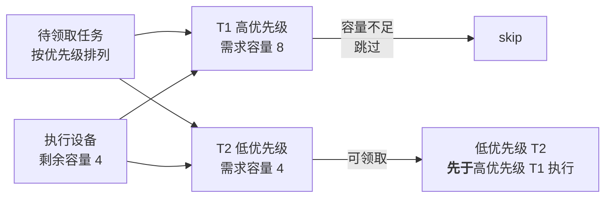
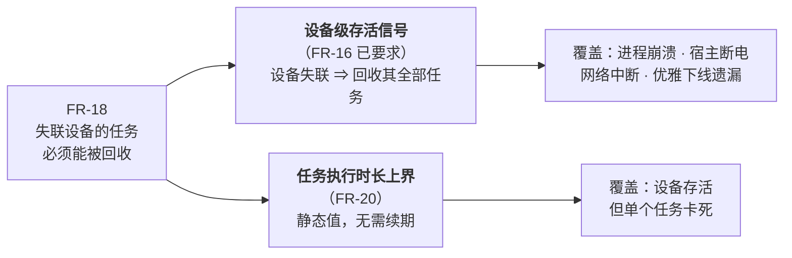

# nova-nats 需求规格

> 版本：v1.1
> 状态：**基线**（参数已推导完成，见 [`parameters.md`](./parameters.md)；任务类型画像见 [`task-profiles.md`](./task-profiles.md)）
> 范围：分布式任务系统的任务提交、容量感知调度、执行、以及多用户跨区域的流式观测与协作。

---

## 1. 系统目标

构建一个任务系统，使**多区域用户**可提交长耗时任务，由**分布式异构执行设备**按其**资源容量**领取并执行，且任务的**流式输出**可被多个跨区域用户同时、正确、可续订地观测与互动。

### 1.1 角色

| 角色 | 描述 | 主要关注 |
|------|------|---------|
| **提交者** | 发起任务的最终用户 | 提交成功、观测进度、中途关闭页面后可恢复 |
| **观测者** | 查看他人任务的用户，可能位于不同区域 | 看到与提交者一致的内容与顺序、可互动 |
| **执行设备**（Worker） | 分散部署的异构算力节点，容量各异，随时上下线 | 领到自己能执行的任务、不与他人冲突 |
| **运维** | 系统运营方 | 扩缩容、故障处置、容量规划、策略调整 |

### 1.2 术语

| 术语 | 定义 |
|------|------|
| **任务**（Task） | 一次可独立执行的工作单元，有唯一标识、有资源需求、有生命周期 |
| **容量**（Capacity） | 执行设备提供、任务消耗的资源量。可能是标量、向量或附带离散标签 |
| **剩余容量** | 执行设备总容量减去其正在执行任务所占用的容量 |
| **可领取**（Eligible） | 某任务与某执行设备之间成立的关系：该设备的剩余容量与属性满足该任务的全部要求 |
| **领取**（Claim） | 执行设备取得某任务独占执行权的动作 |
| **执行权**（Ownership） | 领取成功后，执行设备对该任务持有的独占执行资格。可被系统收回 |
| **存活信号** | 执行设备周期性向系统证明自身可用的信号 |
| **失联** | 系统在约定时限内未收到某执行设备的存活信号 |
| **尝试序号**（Attempt） | 任务被领取的次数，每次领取递增。用于区分同一任务的不同执行轮次 |
| **流式输出** | 任务执行过程中持续产生的增量输出 |
| **观测游标** | 观测者已接收到的输出位置，用于断线后精确续订 |
| **装箱率**（Packing Ratio） | 某时刻，所有在线执行设备上**正在执行**的任务其容量需求之和 ÷ 这些设备的**总容量**。衡量容量被有效利用的程度 |
| **有需求装箱率** | **仅在「待领取队列非空」的时间窗口内**统计的装箱率。这是 FR-2.5 的验收指标（理由见 §3.3） |
| **容量碎片** | 单台设备的剩余容量不足以容纳任何一个待领取任务，从而无法被利用的那部分容量 |
| **独立查询视图** | 为满足查询需求而维护的、与领取路径所用数据结构**相分离**的**派生**数据集合。三个必要属性：① 派生（非权威，可从权威数据重建）② 分离（与领取路径的数据结构物理或逻辑分开）③ 面向查询优化。**在同一数据结构上增加索引不构成独立查询视图**——索引随主数据同步更新，不引入滞后 |
| **任务类型**（TaskKind） | 任务的业务类别标签（如 AIGC 图像 / AIGC 视频 / Agent 请求）。仅为 `TaskSpec` 数据与 per-type 执行上界覆盖；**不得**成为提交、领取、生命周期等核心流程的分支条件（见 `decisions.md` D16、[`task-profiles.md`](./task-profiles.md)） |

### 1.3 需求书写约定

1. 需求描述**可观察的外部行为**与**必须成立的性质**，不指定实现方式。
2. 每条需求配**可测的验收标准**。
3. 分为四类：**功能需求 FR** / **正确性需求 CR** / **质量需求 SR·OR·SEC** / **约束 CON**。
4. 需求间冲突显式记录于 §6，冲突的取舍由 [`parameters.md`](./parameters.md) 的量化参数仲裁。

---

## 2. 功能需求（FR）

### 2.1 任务提交与查询

| ID | 需求 | 验收标准 |
|----|------|---------|
| **FR-1** | 多区域接入点均可提交任务 | 任意区域提交，成功率与延迟无显著差异（P99 延迟差 < 200ms） |
| **FR-2** | **容量感知的任务领取** | 详见 §3 |
| **FR-3** | 任务生命周期状态可查询 | 任意时刻可查到任务当前状态及其时间戳 |
| **FR-4** | 任务列表查询（按提交者 / 状态 / 时间筛选） | 支持分页与组合筛选；**提交成功后该任务在「列表可见时限」（`parameters.md` §5.1）内可在提交者列表中被找到**，且在此之前不得使提交者误判为失败（见 §2.5） |
| **FR-24** | **查询不得影响任务领取的可用性** | 构造慢查询与高并发查询场景，领取延迟 P99 不超出 SLO；查询有超时上限与并发限制 |
| **FR-5** | 任务可取消 | 未开始执行的任务立即取消；执行中的任务在约定时限内停止并释放容量 |
| **FR-6** | 失败自动重试，超限进入死信 | 重试次数可配置；死信任务可查询并可人工重放 |
| **FR-7** | 任务结果与产物可获取 | 结果在保留期内可读；超过内联阈值的产物有独立获取通道 |
| **FR-8** | 不可能被调度的任务应尽早失败并说明原因 | 资源需求超出所有执行设备能力的任务，在观察窗口内被判定失败，而非无限等待 |

### 2.2 流式观测与协作

| ID | 需求 | 验收标准 |
|----|------|---------|
| **FR-9** | 长耗时任务的流式输出可被持续观测 | 任务运行中任意时刻接入，可获得完整历史输出 + 后续增量 |
| **FR-10** | 观测者可在任务执行中途接入 | 中途接入的首屏时间不随任务已运行时长增长 |
| **FR-11** | 多用户跨区域共享观测同一任务 | 不同区域的观测者看到的内容与顺序一致 |
| **FR-12** | 观测者可与提交者互动（消息、反馈） | 互动内容对该任务的所有成员可见 |
| **FR-13** | 授权用户可在任务执行中追加指令 | 追加的指令能被执行设备接收并影响后续执行 |
| **FR-14** | 观测连接中断后可精确续订 | 切换页面、关闭重开、更换设备或网络后，观测内容无重复无遗漏 |
| **FR-15** | 提交后立即失去响应的任务可被找回 | 提交请求超时或页面关闭后重新打开，仍能定位到该任务并恢复观测 |

### 2.3 执行设备管理

| ID | 需求 | 验收标准 |
|----|------|---------|
| **FR-16** | 执行设备可注册、上报容量、周期发送存活信号 | 设备失联可被系统在约定时限内识别 |
| **FR-17** | 执行设备可优雅下线 | 下线时其在途任务被安全交还，不丢失、不重复领取 |
| **FR-18** | **失联设备的任务可被回收重派** | 强制终止设备进程后，其任务在「回收时限」（`parameters.md` §5）内被其它设备接管 |
| **FR-19** | 匹配策略可在不停机的前提下调整 | 变更后新的领取行为按新策略生效；变更可回滚 |
| **FR-20** | **任务执行有时长上界，超出即判定异常** | 执行时长超过该任务类型的上界后，任务被终止并按 FR-6 处理 |

### 2.5 查询一致性要求

FR-4 涉及一项容易被忽略的约束：**若查询数据与权威数据异步同步，则存在滞后窗口**，提交者在窗口内刷新列表将看不到刚提交的任务，可能误判为提交失败并重复提交。

| ID | 需求 | 验收标准 |
|----|------|---------|
| **FR-22** | **提交者对自己刚提交的任务必须立即可见**（read-your-writes） | 提交成功后立即查询列表，该任务必须出现或被明确标记为「同步中」；不得表现为「不存在」 |
| **FR-23** | 查询结果的滞后必须有上界且可观测 | 滞后超过「列表可见时限」时有指标与告警。**本期查询与权威数据同库同步，滞后应恒为零**，该指标用于回归防护（一旦非零即为异常） |

> **FR-22 不要求查询数据本身强一致**，只要求「提交者视角下不出现自己刚提交的任务凭空消失」。这为异步查询视图保留了空间——可由「点查权威数据」或「客户端本地合并未确认提交」等方式满足。

### 2.4 过载保护

| ID | 需求 | 验收标准 |
|----|------|---------|
| **FR-21** | **超出承载能力时拒绝新提交并明确告知** | 待领取量或在途量达到阈值时，新提交收到明确的拒绝响应（含可重试提示），已接受的任务不受影响 |

---

## 3. 容量感知领取（FR-2 细化）⭐

本节是本系统的复杂度核心，拆为 6 条可独立验收的需求。

| ID | 需求 | 验收标准 |
|----|------|---------|
| **FR-2.1** | **容量感知**：仅当执行设备的剩余容量与属性满足任务要求时，该设备才能领取该任务 | 构造「设备剩余 4、任务需求 8」的场景，该任务不被该设备领走 |
| **FR-2.2** | **优先级偏序**：在同时可领取的任务中，高优先级任务优先被领取 | 需求相同的高/低优先级任务，高优先级先被领取 |
| **FR-2.3** | **无队头阻塞**：排在前面但当前不可领取的任务，不得阻塞其后可领取的任务 | 队首需求 8、次位需求 4，设备剩余 4 时必须领到次位任务 |
| **FR-2.4** | **无饥饿**：任何任务的等待时长有上界 | 持续小任务负载下混入一个大容量任务，该任务在约定时限 T 内被执行 |
| **FR-2.5** | **匹配效率**：不因匹配策略导致容量大量闲置 | **在待领取队列持续非空的压力场景下**，稳态**有需求装箱率** ≥ `parameters.md` §5 的目标值（详见 §3.3） |
| **FR-2.6** | **容量模型可扩展**：容量的维度与匹配规则不被系统预先锁定 | 由标量容量切换为「多维容量 + 离散标签」时，无需修改任务提交、领取、生命周期等核心流程 |

### 3.1 FR-2.2 只能是偏序，不能是严格全序

FR-2.3（允许跳过）在语义上即意味着放弃严格优先级：

**因此 FR-2.2 的验收标准限定为「需求相同的任务之间」比较。** 跨容量需求的任务之间不保证优先级顺序。

### 3.2 饥饿有两种，必须分别满足

FR-2.4 涉及两类性质不同的饥饿，验收需分别覆盖：

| 类型 | 成因 | 验收场景 |
|------|------|---------|
| **排序型饥饿** | 任务本身可领取，但始终排在其它任务之后 | 持续高优先级任务流下，低优先级任务在 T 内被执行 |
| **容量型饥饿** | 任务的资源需求始终得不到满足（如需求 8，而所有设备剩余恒为 4） | 持续小任务流下，大容量任务在 T 内被执行 |

> 两类饥饿的成因不同，仅覆盖其中一类的方案不满足 FR-2.4。**容量型饥饿在低负载环境难以复现**，需构造专门的压力场景验收。

### 3.3 FR-2.5 的度量口径

容量闲置有三种成因，**只有后两种应计入 FR-2.5 的考核**：

| 成因 | 示例 | 是否计入 FR-2.5 |
|------|------|---------------|
| **① 无需求** | 待领取队列为空，设备空转 | ❌ **不计入**。无任务可领时闲置是正常的，与匹配策略无关 |
| **② 容量碎片** | 设备剩余 4，但所有待领取任务需求均为 8 | ✅ 计入。这是 FR-2.3 允许跳过所固有的代价 |
| **③ 主动预留** | 为满足 FR-2.4，暂留容量给长期等待的大任务 | ✅ 计入。这是防饥饿的成本，需被量化以支撑 X2 的仲裁 |

**因此度量口径必须限定为「有需求装箱率」**——仅统计待领取队列非空的时间窗口。否则系统在空闲时段的低装箱率会污染指标，使 FR-2.5 无法判定。

#### FR-2.4 与 FR-2.5 的冲突是本质的

以「1 台容量 8 的设备 + 一个需求 8 的任务 + 持续的需求 4 任务流」为例：

| 策略 | 有需求装箱率 | FR-2.4 无饥饿 |
|------|------------|--------------|
| 始终优先领取可立即执行的小任务 | **100%** | ❌ 大任务永不执行 |
| 为大任务暂留容量（等在途小任务结束） | **< 100%**（暂留期间部分容量空置） | ✅ 大任务得以执行 |

> 二者不可同时取满。**`parameters.md` §5 的装箱率目标值实质上是在回答：为保证饥饿上界，可接受多大比例的容量闲置。** 该数值是 X2 的唯一仲裁依据。

---

## 4. 正确性需求（CR）—— 不可妥协

| ID | 性质 | 验收标准 | 违反后果 |
|----|------|---------|---------|
| **CR-1** | **不双领**：同一任务在同一时刻只被一个执行设备持有执行权 | 20 设备并发抢 1000 任务，无双领 | 重复执行、容量浪费 |
| **CR-2** | **提交幂等**：同一提交意图重复到达只产生一个任务 | 同一幂等键重放 100 次（含间隔 10 分钟后重放）→ 仅 1 个任务 | 用户被重复计费 |
| **CR-3** | **容量不超卖**：任何时刻执行设备承载的任务需求之和不超过其总容量 | 高并发领取下，无设备超载 | 执行失败、性能雪崩 |
| **CR-4** | **输出不交织**：被回收的执行设备其后续输出不得与新一轮执行的输出混合 | 强制终止设备后重派，观测端内容无交织 | 用户看到错乱内容 |
| **CR-5** | **观测无重无漏**：观测端最终内容与全程不断连的对照组一致 | 随机断连 200 次，逐字节比对通过 | 内容错乱且难以排查 |
| **CR-6** | **因果顺序一致**：互动消息与其引发的输出，在所有观测者处顺序相同 | 不同区域观测者的事件序列逐条一致 | 协作产生严重误解 |
| **CR-7** | **任务不丢失**：已向提交者返回成功的任务最终必达终态 | 注入组件故障，无任务永久停滞于非终态 | 用户任务凭空消失 |
| **CR-8** | **执行权失效后隔离**：执行权被收回后，原持有者不得再影响该任务的状态与输出 | 假死设备恢复后的写入被拒绝或被忽略 | 覆盖新执行者的结果、输出交织 |
| **CR-9** | **权限正确**：无权者不可读、不可写，且无法探测任务是否存在 | 无权访问的响应与不存在无法区分；读权与写权独立 | 越权访问与信息泄露 |
| **CR-10** | **容量账目可信**：容量的核算不依赖执行设备的自我申报 | 伪造容量申报的设备无法领取超出其实际能力的任务 | 容量约束形同虚设 |
| **CR-11** | **过载不导致数据损坏**：拒绝提交（FR-21）时，系统不得进入不一致状态 | 以 10 倍设计容量持续压测，无双领、无超卖、无任务丢失 | 过载时的连带故障最难恢复 |

### 4.1 CR-1 的边界：领取唯一 ≠ 执行唯一

| 保证 | 是否可提供 |
|------|-----------|
| 同一任务不被两个设备同时**领取** | ✅ CR-1 |
| 同一任务不被两个设备同时**执行** | ❌ **不可保证**。执行权被收回而原设备实际仍在运行时（如网络分区），会出现短暂并行 |

因此附加一条对业务侧的约束：

| ID | 约束 | 说明 |
|----|------|------|
| **CON-1** | **任务执行必须幂等** | 这是对**业务逻辑**的硬性要求，不是本系统能提供的保证。具有不可幂等外部副作用（扣款、发送通知、写外部系统）的任务，必须自带业务级幂等键 |

---

## 5. 质量需求

### 5.1 规模与伸缩（SR）

| ID | 需求 | 验收标准 |
|----|------|---------|
| **SR-1** | 执行设备可水平扩容，无中心分发瓶颈 | 设备数 2→20，吞吐近线性增长 |
| **SR-2** | 观测者数量不放大后端压力 | 单任务 1000 观测者时，后端订阅资源消耗与观测者数量无关 |
| **SR-3** | 领取路径可随待领取规模增长而伸缩 | 待领取任务数增长 10 倍，领取延迟增长可控 |
| **SR-4** | 支持小时级长耗时任务 | 长任务全程不被误判为超时 |
| **SR-5** | 跨区域观测的带宽消耗不随该区域观测者数量线性增长 | 单区域观测者从 1 增至 100，跨区带宽增长可控 |

### 5.2 运维与演进（OR）

| ID | 需求 | 验收标准 |
|----|------|---------|
| **OR-1** | 组件故障可自动恢复 | 执行设备、接入层、存储的单点故障均有恢复路径且可演练 |
| **OR-2** | 降级状态对用户可见 | 处于降级时明确告知，不静默呈现陈旧数据 |
| **OR-3** | 关键不变量有监控与告警 | 双领、超卖、任务丢失、饥饿、不可调度等均有指标与告警 |
| **OR-4** | 策略与核心解耦 | 匹配策略、优先级策略、重试策略可替换，无需改动保证 CR 系列的核心机制 |
| **OR-5** | 策略变更可审计可回滚 | 每次变更有版本记录；可一键回滚至上一版本 |
| **OR-6** | **规模逼近适用区间上限时提前告警** | `parameters.md` §7 每个维度均有指标；达到适用区间的 70% 时触发告警，为架构演进留出准备期 |

### 5.3 安全（SEC）

| ID | 需求 | 验收标准 |
|----|------|---------|
| **SEC-1** | 身份认证，多区域可本地校验 | 常态下鉴权无跨区域调用 |
| **SEC-2** | 读权与写权分离；长连接期间权限可被撤销 | 撤销在对外承诺的时限内生效并中断连接 |
| **SEC-3** | 任务输出出口按观测者权限脱敏 | 内部字段与敏感信息不外泄给低权限观测者 |
| **SEC-4** | 多租户隔离 | 任一租户无法访问或推断其它租户的任务与数据 |
| **SEC-5** | 防滥用 | 限流、连接数上限、消息大小上限齐备，单用户无法耗尽系统资源 |
| **SEC-6** | 可扩展的策略逻辑必须在受限环境求值 | 策略逻辑无法访问文件、网络、进程；执行时间与资源有硬上限；不可用于构造注入 |

> **SEC-6 由 FR-2.6 与 OR-4 引入**：一旦允许匹配规则动态扩展，该规则即成为受控代码执行入口，必须作为独立的安全需求对待。

---

## 6. 需求冲突矩阵 ⭐

冲突是设计取舍的来源。**每条冲突必须显式定夺，不能同时全取。**

| # | 冲突双方 | 张力 | 仲裁依据 |
|---|---------|------|---------|
| **X1** | FR-2.2 优先级 × FR-2.3 无队头阻塞 | 允许跳过即放弃严格优先级 | **已定**：优先级降为偏序（§3.1） |
| **X2** | FR-2.4 无饥饿 × FR-2.5 匹配效率 | 让大任务能执行需暂留容量，而提高装箱率要求填满容量。二者不可同时取满（§3.3） | **已定**：装箱率 ≥ 70%、饥饿上界 T = 30 分钟（`parameters.md` §5.2） |
| **X3** | FR-2.1 容量匹配 × 领取吞吐 | 逐个判定「是否可领取」的成本随规模上升 | **已定**：待领取峰值 1 万、峰值领取 70/s，逐条判定成本可接受（`parameters.md` §4） |
| **X4** | FR-2.6 容量模型可扩展 × 领取吞吐 | 越灵活的匹配规则越难被预先优化 | **已定**：同 X3。此结论以待领取规模不超出适用区间为前提（`parameters.md` §7） |
| **X5** | CR-1 领取唯一性 × FR-1 多区域低延迟 | 唯一性判定需集中，跨区域访问引入往返延迟 | **已定**：领取不跨区域（§7 S3），本冲突不再存在 |
| **X6** | CR-7 任务不丢失 × 提交延迟 | 更强的持久化保证意味着更慢的提交 | **已定**：提交延迟 P99 < 300ms 前提下保证持久化（`parameters.md` §5.1） |
| **X7** | FR-9 长耗时流式输出 × 存储成本 | 高频输出的事件量与保留期直接决定成本 | **已定**：200ms 聚合、保留 7 天（`parameters.md` §5.4 §6） |
| **X8** | CR-6 因果顺序一致 × SR-5 跨区带宽 | 统一排序要求事件汇聚，而就近读要求分散 | **已定**：单任务观测者 P99 仅 20，带宽压力小，优先保证顺序一致（`parameters.md` §4.3） |
| **X9** | SR-4 长耗时任务 × FR-18 及时回收 | 失联判定过于激进会误判仍在正常执行的设备；过于宽松则故障恢复慢 | **已定**：失联判定 90 秒、回收时限 ≤ 3 分钟（`parameters.md` §5.3） |
| **X10** | CR-1 不双领 × CON-1 执行幂等 | 二者不可兼得（§4.1） | **已定**：执行幂等转为业务侧约束 |
| **X11** | FR-4 列表查询 × FR-2 领取所需的组织方式 | 待领取集合（约 1 万条）与任务历史（约 4350 万条）相差约 4000 倍，两者所需的数据组织方式不同 | **已定**：不引入独立查询视图，同库同步维护；代价是不支持全文检索与聚合报表，且慢查询须以超时与限流兜底（`decisions.md` D13） |
| **X12** | FR-2.6 策略可扩展 × SEC-6 安全 | 越强的表达能力意味着越大的攻击面 | **已定**：能力受限 + 强制沙箱 + 来源管控 |
| **X13** | FR-19 不停机调整策略 × FR-2.1 匹配语义一致性 | 策略切换期间新旧规则并存；收紧型变更在窗口期内失效 | **已定**：单次领取内版本快照（禁止混用），副本间允许短暂并存；收紧型变更须双版本校验或暂停切换（`decisions.md` D12） |
| **X14** | FR-18 及时发现异常 × 实现简洁性 | 判定粒度越细（到单个任务）越能发现卡死，但机制越复杂 | **已定**：首版按设备粒度判定 + 任务时长上界兜底（§7 S9） |
| **X15** | FR-21 过载拒绝 × 用户体验 | 拒绝提交损害体验，但无界积压会导致等待时长失控并最终故障 | **已定**：待领取阈值 1 万（约容忍 3 分钟满峰值突发）（`parameters.md` §4.2） |
| **X16** | 规模不确定 × 架构确定性 | 无法预估规模，但架构必须基于某个规模假设 | **已定**：以适用区间替代精确值，配合越界告警与优雅降级（`parameters.md` §7） |

---

## 7. 本期范围界定

| # | 议题 | 本期 | 说明 |
|---|------|------|------|
| **S1** | 容量模型 | **不预先锁定** | 匹配规则可扩展（FR-2.6），代价是引入 SEC-6 |
| **S2** | 匹配最优性 | **不要求全局最优** | 接受「满足即领取」，不追求最优装箱。此放宽是 FR-2.5 目标值设定的前提 |
| **S3** | 跨区域领取 | **不做** | 任务与执行设备按区域绑定，X5 因此无需仲裁 |
| **S4** | 抢占执行中的任务 | **不做** | 高优先级任务不中断已在执行的任务 |
| **S5** | 延迟 / 定时任务 | **不做** | 任务提交后即进入待领取状态 |
| **S6** | 多区域容灾切换 | **不做** | 单一区域承担任务的权威状态 |
| **S7** | 独立查询视图（定义见 §1.2） | **不做** | 查询与权威数据同库同步维护，FR-22 天然满足。不支持全文检索与多维聚合统计（`decisions.md` D13） |
| **S8** | 数据分析与计费管道 | **不做** | 不在本期范围 |
| **S9** | **任务级执行权时限与续期** | **不做** | 见 §7.1 |
| **S10** | 全文检索任务内容 | **不做** | S7 的推论 |
| **S11** | 多维聚合统计与数据报表 | **不做** | S7 的推论 |

> 范围界定为「不做」的项，其需求条目不进入本期验收，但**不得因此破坏已列入的需求**。例如 S4 不做抢占，不意味着可以放弃 FR-2.4 无饥饿。

### 7.1 关于 S9：为什么可以不做任务级时限与续期

FR-18（失联设备的任务可回收）**必须满足**，但它不要求「每个任务各自持有一个需要续期的时限凭证」。首版用两个更简单的机制组合达成同等效果：

| 维度 | 首版（设备级 + 时长上界） | 任务级时限 + 续期 |
|------|------------------------|------------------|
| 需维护的时限对象 | 每设备 1 个 | **每在途任务 1 个** |
| 是否需要续期逻辑 | **不需要** | 需要，且需防误判 |
| 长耗时任务风险 | 低（判定与任务时长无关） | **较高**（续期间隔配置错误、执行线程阻塞均会误判正常任务超时，与 SR-4 冲突） |
| 发现任务卡死的延迟 | 至任务时长上界 | 一个续期周期（更快） |
| 判定粒度 | 设备 | 任务 |

**首版取舍**：接受「任务卡死需等到时长上界才被发现」，换取无续期机制。

**后续扩展条件**（满足任一即引入任务级时限）：
- 任务卡死的发生频率使「等到时长上界」的资源浪费不可接受；
- 需要区分「设备整体健康」与「单任务健康」以支撑更细的调度决策；
- 单设备并发任务数很高，使设备级回收的影响面（一次回收全部任务）过大。

> **注意**：无论是否引入任务级时限，**尝试序号（Attempt）都必须存在**——它是 CR-8 与 CR-4 的唯一依据，用于识别并隔离失效持有者的写入。它同时承担 FR-6 的重试计数，无额外成本。

---

## 8. 验收总览

进入设计前，确认每条需求均有可执行的验收方式。**落地阶段以分层自动化验证命令为准**（见 [`../plans/`](../plans/)）：能在更低层判定的断言不得上推；验收标准 = `just verify l0|l1|l2` 全绿 + 覆盖矩阵策略（`just coverage`）。

| 类别 | 条目数 | 验收方式 |
|------|-------|---------|
| FR 功能 | 29（顶层 24 条，其中 FR-2 展开为 6 条子项） | 功能测试 + 场景测试（L1/L2） |
| CR 正确性 | 11 | **并发压力测试 + 故障注入测试**（不可仅靠功能测试；L0/L1/L2） |
| CON 约束 | 1 | 代码审查 + 业务侧规范 |
| SR 规模 | 5 | 压测（含伸缩性对比；高层） |
| OR 运维 | 6 | 故障演练 + 变更演练 |
| SEC 安全 | 6 | 渗透测试 + 越权测试 + 沙箱逃逸测试（L0 沙箱契约 + 高层） |

**重点提示**：以下三类在常规功能测试中**几乎不可复现**，必须设计专门场景：

| 类别 | 必须构造的场景 |
|------|--------------|
| CR-1 / CR-3 / CR-4 / CR-5 / CR-8 | 高并发 + 进程强杀 + 网络分区注入 |
| FR-2.4 容量型饥饿 | 持续小任务流 + 混入大容量任务，且容量长期紧张 |
| FR-21 / CR-11 过载行为 | **以 10 倍设计容量持续压测**，验证拒绝生效且无数据损坏 |

> 最后一项尤其重要：由于规模假设置信度低（`parameters.md` §4），系统实际遭遇超设计负载的概率不低。**过载路径必须与正常路径同等测试**。
